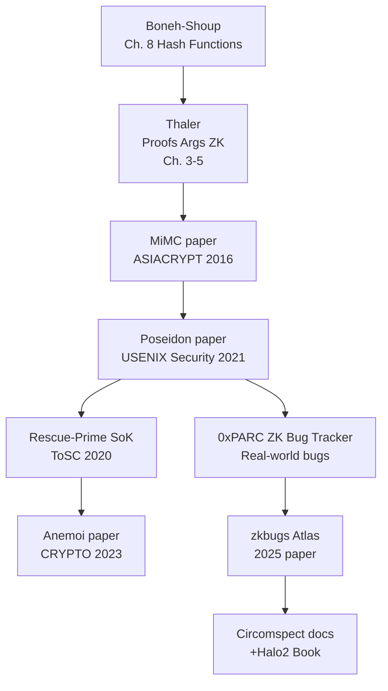

> Đây là danh sách tài liệu **nên đọc** — không phải danh sách trích dẫn. Mỗi mục được chọn vì nó giúp hiểu sâu hơn hoặc mở rộng kiến thức ra ngoài bài học, và đáng đọc từ đầu đến cuối (hoặc phần được chỉ định).

---

## Nền tảng Mật mã học

### Sách

**Dan Boneh & Victor Shoup — *A Graduate Course in Applied Cryptography***
Sách giáo khoa chuẩn, miễn phí, cập nhật liên tục. Đọc chương về hash functions (Chapter 8) và PRF/PRG (Chapter 4) trước khi đọc bất kỳ paper nào về ZK-friendly hashes. Ngôn ngữ chính xác, proof đầy đủ.
→ `toc.cryptobook.us`

**Alfred Menezes, Paul van Oorschot, Scott Vanstone — *Handbook of Applied Cryptography***
Cổ điển hơn, nhưng chương về hash functions và block ciphers vẫn rất có giá trị. Miễn phí online.
→ `cacr.uwaterloo.ca/hac`

---

## Zero-Knowledge Proofs

### Sách & Course

**Justin Thaler — *Proofs, Arguments, and Zero-Knowledge***
Cuốn sách ZK tốt nhất hiện tại. Chương 3–5 (interactive proofs), chương 6–8 (polynomial commitments), và chương 10 (SNARKs) là bắt buộc để hiểu tại sao circuit cost quan trọng. Đọc sau khi hoàn thành L02.
→ `people.cs.georgetown.edu/jthaler/ProofsArgsAndZK.html`

**ZKProof Community — *ZKProof Standardization Proceedings* (2018–2022)**
Nhiều bài viết ngắn về best practices, security definitions, và implementation considerations. Phần "Hash Functions in ZK" đặc biệt hữu ích.
→ `zkproof.org/papers`

**0xPARC — ZK Learning Resources**
Bộ tài liệu học ZK từ cơ bản đến nâng cao, bao gồm Circom tutorial và Halo2 tutorial. Thực hành nhiều hơn so với Thaler.
→ `learn.0xparc.org`

---

## ZK-Friendly Hash Functions — Papers Cốt lõi

### Đọc theo thứ tự

**1. Albrecht et al. — *MiMC: Efficient Encryption and Cryptographic Hashing with Minimal Multiplicative Complexity* (ASIACRYPT 2016)**
Paper gốc của MiMC. Đọc sections 1–3 (motivation, design) và section 5 (security analysis). Khoảng 30 trang, không quá khó.
→ `eprint.iacr.org/2016/492`

**2. Grassi et al. — *POSEIDON: A New Hash Function for Zero-Knowledge Proof Systems* (USENIX Security 2021)**
Paper quan trọng nhất trong chủ đề này. Đọc toàn bộ, nhưng đặc biệt kỹ sections 2 (design rationale), 4 (security), và 6 (implementation). Giải thích HADES strategy cực kỳ rõ ràng.
→ `eprint.iacr.org/2019/458`

**3. Aly et al. — *Starkad and Poseidon: New Hash Functions for Zero Knowledge Proof Systems* (2019)**
Phiên bản mở rộng của Poseidon, thêm phân tích cho STARKs. Đọc phần so sánh Poseidon vs Starkad.
→ `eprint.iacr.org/2019/458` (cùng archive)

**4. Aszalos et al. — *Rescue-Prime: A Standard Specification (SoK)* (ToSC 2020)**
Standardization document cho Rescue-Prime. Đọc sections 1–4 để hiểu tại sao inverse S-box tốt cho STARKs. Section 5 (security) đọc sau khi học L09–L10.
→ `eprint.iacr.org/2020/1143`

**5. Beierle et al. — *Anemoi: Exploiting the Link between Arithmetization-Orientation and CCZ-Equivalence* (CRYPTO 2023)**
Paper về Anemoi với Flystel construction. Đọc introduction và section 3 (Flystel design) — phần còn lại rất kỹ thuật, để sau.
→ `eprint.iacr.org/2022/840`

---

## Algebraic Cryptanalysis

**Alex Biryukov & Léo Perrin — *State of the Art in Lightweight Symmetric Cryptography* (2017)**
Overview tốt về các kỹ thuật cryptanalysis (differential, linear, algebraic) áp dụng cho lightweight ciphers — nhiều kỹ thuật tương tự áp dụng cho ZK hashes.
→ `eprint.iacr.org/2017/511`

**Bouillaguet et al. — *Algebraic Cryptanalysis of the PKC'2009 Algebraic Surface Scheme* (ASIACRYPT 2009)**
Ví dụ cụ thể về Gröbner basis attack. Đọc để hiểu intuition trước khi đọc các papers cryptanalysis chuyên sâu hơn.
→ `iacr.org` (search title)

**Lorenzo Grassi et al. — *Weak Keys for AES-like Ciphers* — Slide series**
Chưa phải paper nhưng slides từ các hội nghị giải thích invariant subspace attacks rất trực quan. Tìm trên Google Scholar: "Grassi invariant subspace".

---

## Circuit Security

**Trail of Bits — *Circomspect: A Security Analyzer for Circom* (blog post + README)**
Đọc README của Circomspect để hiểu toàn bộ bug classes mà tool detect. Blog post của ToB giải thích rationale. Quan trọng hơn đọc code — đọc issue tracker trên GitHub để xem real bugs được tìm thấy.
→ `github.com/trailofbits/circomspect`

**0xPARC — *ZK Bug Tracker***
Repository lưu trữ real-world ZK bugs đã được publicly disclosed. Đọc từng entry, chú ý phần "root cause" và "impact". Đây là tài liệu học tốt hơn bất kỳ tutorial nào vì là bugs thực tế.
→ `github.com/0xPARC/zk-bug-tracker`

**Chaliasos, Yu et al. — *zkbugs: An Atlas of Real-World ZK Bugs* (2025)**
Paper phân loại và phân tích hệ thống các ZK bugs đã biết. Đọc section 3 (taxonomy) và section 4 (case studies). Rất hữu ích cho audit methodology.
→ `github.com/zksecurity/zkbugs`

**Daira Emma Hopwood — *Zcash Protocol Specification***
Specification đầy đủ của Zcash protocol, bao gồm Pedersen hash, Jubjub curve, và Sapling circuit. Đọc phần về hash functions và Merkle tree để thấy cách production system handle domain separation và hash-to-field.
→ `zips.z.cash/protocol/protocol.pdf`

---

## Circom & Halo2

**iden3 — *Circom Documentation***
Đọc toàn bộ language reference, đặc biệt phần về signals, constraints, và component instantiation. Nhiều người học Circom bằng ví dụ mà bỏ qua docs — đừng làm vậy.
→ `docs.circom.io`

**Zcash/PSE — *The Halo2 Book***
Book chính thức cho Halo2. Đọc Chapters 1–3 (arithmetic circuits, chips, gadgets) nếu muốn audit Halo2 code. Chapter 4 (debugging) đặc biệt hữu ích cho việc dùng MockProver.
→ `zcash.github.io/halo2/user/simple-example.html`

**RareSkills — *ZK Book (online)***
Series bài viết rất thực tiễn về R1CS, PLONK, và Circom. Văn phong dễ đọc hơn Thaler nhưng ít formal hơn. Đọc như bridge giữa textbook và practice.
→ `rareskills.io/zk-book`

---

## SageMath

**SageMath Documentation — *Tutorial***
Nếu chưa dùng SageMath, đọc tutorial chính thức trong 2–3 giờ là đủ để làm các bài tập trong bộ này. Tập trung vào: rings/fields (`GF`, `ZZ`, `QQ`), polynomials, và linear algebra.
→ `doc.sagemath.org/html/en/tutorial`

**Sage for Undergraduates — Gregory Bard (free PDF)**
Cuốn sách nhẹ nhàng hơn cho người mới dùng SageMath, với nhiều ví dụ mật mã học.
→ `gregorybard.com/Sage_for_Undergraduates.pdf`

---

## Blogs Nên Theo Dõi

**Zellic Research Blog**
Chuyên về ZK security audits. Các posts thường phân tích chi tiết bugs thực tế trong production systems.
→ `zellic.io/blog`

**zkSecurity Blog**
Tương tự Zellic, nhiều bài về ZK circuit bugs và cryptographic design issues.
→ `zksecurity.xyz/blog`

**Ingonyama Research**
Deep-dives về ZK cryptography, thường cover các constructions mới như Poseidon2, Plonky3.
→ `ingonyama.com/ingopedia`

**IACR ePrint — New submissions (search "zk-friendly" hoặc "arithmetic hash")**
Đây không phải blog nhưng nên check hàng tháng. Filter theo năm 2022–2025 để thấy state-of-the-art.
→ `eprint.iacr.org`

---

## Thứ tự đọc gợi ý

Nếu bạn đọc xong 14 bài học và muốn đào sâu hơn, thứ tự đề xuất:

*Đọc từ trên xuống: mỗi tài liệu xây dựng trên tài liệu trước.*
