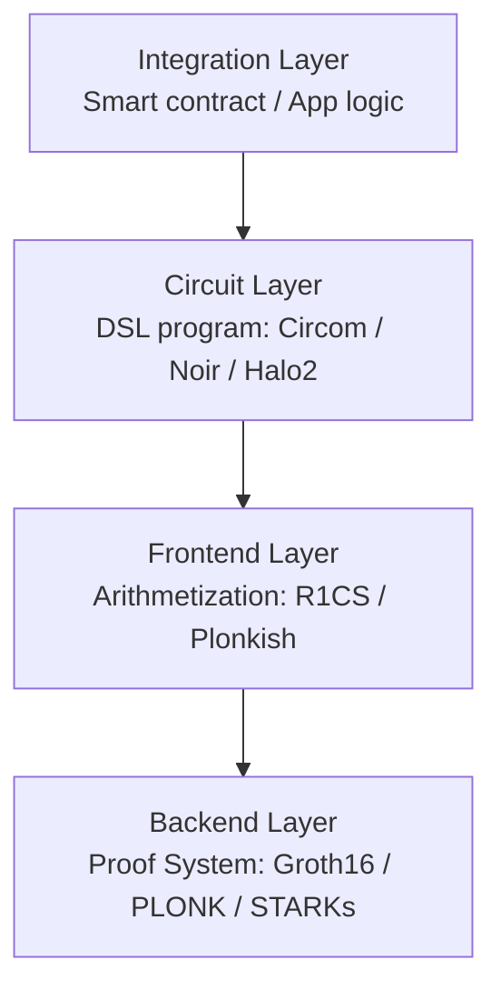
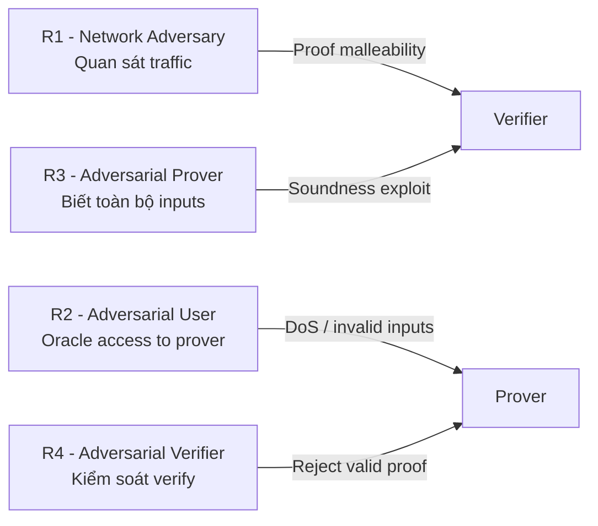
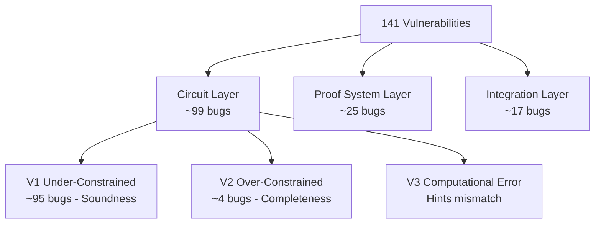

> **Prerequisites**: Circom cơ bản (signal, template, component), hiểu R1CS ở mức polynomial equations  
> **Objectives**:  
> - Nắm kiến trúc SNARK theo 4 lớp và vai trò của từng lớp
> - Phân biệt rõ **witness** (assignment) vs **constraint** — nền tảng của mọi ZK bug
> - Hiểu soundness vs completeness và tại sao vi phạm từng thuộc tính nguy hiểm khác nhau
> - Biết mô hình adversary từ SoK USENIX 2024 và ai tấn công gì
> - Có mental model để map bug về đúng lớp trong stack

---

## Motivation

Nhiều người học ZK theo hướng "chứng minh là math, math là đúng". Thực tế hoàn toàn khác: một SNARK system là một **hệ thống phần mềm phức tạp gồm nhiều lớp**, và mỗi lớp đều có bug riêng. Paper SoK USENIX 2024 phân tích 141 lỗ hổng thực tế qua 6 năm và kết luận:

> **96% bug tại circuit layer là under-constrained** — tức là vấn đề nằm ở cách developer viết constraint, không phải ở toán học ZK.

Trước khi đi vào taxonomy lỗ hổng, bài này xây dựng mental model về kiến trúc tổng thể và threat model, giúp bạn biết *tại sao* một lỗi xảy ra ở đâu trong stack.

---

## 1. SNARK Stack — 4 Lớp

Một ứng dụng SNARK thực tế không phải chỉ là một "proof". Nó gồm 4 lớp tương tác với nhau:



### Lớp 1 — Integration Layer (Tầng tích hợp)

Đây là tầng ứng dụng bên ngoài — smart contract trên Ethereum, backend server, hoặc bất kỳ hệ thống nào *sử dụng* proof. Lớp này chịu trách nhiệm:

- Gọi verifier contract với đúng public inputs
- Enforce các điều kiện ngoài circuit (ví dụ: nullifier đã dùng chưa?)
- Validate dữ liệu trước khi đưa vào prover

Lỗi ở lớp này không phải lỗi circuit, nhưng vẫn có thể làm hỏng toàn bộ hệ thống (xem Lesson 08).

### Lớp 2 — Circuit Layer (Tầng circuit)

Developer viết **circuit program** bằng DSL (Domain-Specific Language) như Circom, Noir, hoặc eDSL như Halo2 (Rust). Circuit program mô tả:

1. **Cách tính witness** từ inputs (witness generation)
2. **Các constraint** mà witness phải thỏa mãn (constraint system)

> [!warning] Điểm nguy hiểm nhất
> Đây là lớp có **95%+ bug** trong thực tế. Developer phải tự tay viết cả computation lẫn constraint — và hai thứ này rất dễ bị lệch nhau.

### Lớp 3 — Frontend Layer (Tầng biên dịch)

Frontend compiler biên dịch circuit program thành dạng **arithmetization** — biểu diễn toán học mà proof system có thể xử lý. Hai arithmetization phổ biến:

- **R1CS** (Rank-1 Constraint System): dùng bởi Circom → Groth16/PLONK
- **Plonkish**: dùng bởi Halo2, custom gates

### Lớp 4 — Backend Layer (Proof System)

Backend là thuật toán cryptographic tạo và verify proof. Ví dụ: Groth16, PLONK, STARKs, Halo2. Đây là phần "math" thuần túy — nhưng vẫn có bug (Lesson 07).

---

## 2. Witness vs Constraint — Phân biệt nền tảng

Đây là phân biệt quan trọng nhất bạn cần nắm, vì **toàn bộ V1 Under-Constrained bugs đến từ việc nhầm lẫn hai khái niệm này**.

> [!definition] Definition 1.1 — Witness (Assignment)
> **Witness** $\vec{w}$ là tập hợp *tất cả* các giá trị được gán cho signals trong circuit — bao gồm private inputs, public inputs, và intermediate signals.
>
> Witness được tính bởi **prover** (người biết secret) và không được tiết lộ cho verifier (trong phần private).

> [!definition] Definition 1.2 — Constraint
> **Constraint** là phương trình đại số mà witness phải thỏa mãn. Trong R1CS, mỗi constraint có dạng:
>
> $$(\vec{a} \cdot \vec{w}) \times (\vec{b} \cdot \vec{w}) + (\vec{c} \cdot \vec{w}) = 0$$
>
> Tập hợp tất cả constraints tạo thành **constraint system** $\mathcal{C}$.

**Ví dụ minh họa trong Circom:**

```circom
pragma circom 2.0.0;

template Example() {
    signal input x;
    signal input y;
    signal output out;

    // Dòng này vừa ASSIGN vừa tạo CONSTRAINT: out = x * y
    out <== x * y;
}
```

Operator `<==` làm hai việc đồng thời. Nhưng khi tách ra:

```circom
template ExampleSplit() {
    signal input x;
    signal input y;
    signal output out;

    out <-- x * y;    // CHỈ assignment — KHÔNG tạo constraint!
    // out === x * y; // Phải thêm dòng này mới có constraint
}
```

Nếu bỏ dòng `===`, circuit không có constraint nào ràng buộc `out`. Một prover độc hại có thể gán `out` bất kỳ giá trị nào và vẫn tạo được valid proof.

> [!definition] Definition 1.3 — Circom Operators
>
> | Operator | Assignment? | Constraint? | Khi nào dùng |
> |----------|-------------|-------------|--------------|
> | `<==` | ✅ | ✅ | Computation trực tiếp biểu diễn được dưới R1CS |
> | `<--` | ✅ | ❌ | Hint — computation khó constraint (chia, sqrt, v.v.) |
> | `===` | ❌ | ✅ | Thêm constraint thủ công sau hint |
> | `assert` | ❌ | ❌ | Chạy lúc witness generation, KHÔNG tạo R1CS constraint — adversary có thể bypass |

---

## 3. Soundness vs Completeness

Hai thuộc tính bảo mật cốt lõi của SNARK tương ứng với hai loại bug khác nhau:

> [!definition] Definition 1.4 — Soundness (Tính vững)
> **Soundness** đảm bảo: nếu verifier chấp nhận proof, thì prover thực sự biết một witness hợp lệ.
>
> Nói cách khác: **không thể forge proof cho statement sai**.
>
> $$\Pr[\text{Verify}(\pi, x) = 1 \text{ nhưng } x \notin L] \leq \text{negl}(\lambda)$$

> [!definition] Definition 1.5 — Completeness (Tính đầy đủ)
> **Completeness** đảm bảo: nếu prover biết witness hợp lệ, thì verifier luôn chấp nhận proof.
>
> $$\text{Nếu } (x, w) \in \mathcal{R} \Rightarrow \Pr[\text{Verify}(\text{Prove}(x, w), x) = 1] = 1$$

> [!danger] Soundness Bug — Nguy hiểm cấp cao
> Vi phạm soundness → prover độc hại có thể tạo proof hợp lệ cho statement **SAI**.
> Trong bối cảnh ZK-rollup: có thể **drain toàn bộ funds** từ bridge contract.
> Đây là loại bug nguy hiểm nhất — chiếm ~95/99 bug circuit trong SoK paper.

> [!warning] Completeness Bug — Nguy hiểm cấp trung
> Vi phạm completeness → honest prover không thể tạo proof, dù biết witness đúng.
> Hệ quả: **DoS**, circuit không thể dùng được. Nguy hiểm nhưng không mất tiền trực tiếp.

---

## 4. Mô hình Adversary (Threat Model)

SoK paper xác định 4 loại adversary dựa trên vị trí trong system:



> [!definition] Definition 1.6 — R1: Network Adversary
> Quan sát được public values: public witness $\vec{x}$, CRS (Common Reference String), proof $\pi$.
> **Mục tiêu**: Khai thác **proof malleability** — một số proof system (e.g. Schnorr không dùng Fiat-Shamir đúng cách) cho phép biến đổi proof hợp lệ thành proof khác vẫn valid.

> [!definition] Definition 1.7 — R2: Adversarial User
> Có *oracle access* đến prover — gửi được inputs tùy ý và quan sát output.
> **Mục tiêu**: DoS (làm prover crash/tốn tài nguyên), hoặc trigger lỗi ở edge cases.

> [!definition] Definition 1.8 — R3: Adversarial Prover
> Biết tất cả input values và verification key. Tự kiểm soát việc tạo proof.
> **Mục tiêu**: Exploit **soundness vulnerability** — tạo proof hợp lệ cho statement sai bằng cách cung cấp witness không hợp lệ mà circuit không constrain đủ.
>
> **Đây là adversary nguy hiểm nhất và là mục tiêu chính của V1 Under-Constrained bugs.**

> [!definition] Definition 1.9 — R4: Adversarial Verifier
> Kiểm soát quá trình verification.
> **Mục tiêu**: Reject valid proof từ honest prover (gây completeness failure).

---

## 5. Taxonomy Tổng quan — Cái gì bug ở đâu?

Dựa trên 141 vulnerabilities trong SoK paper, phân bố như sau:



> [!example] Example 1.10 — Tại sao circuit layer chiếm đa số?
> Viết circuit trong Circom giống như viết assembly: không có type system mạnh, không có automatic constraint generation, developer phải *manually* đảm bảo mọi computation đều được constrain đúng. Đây là mô hình lập trình hoàn toàn khác với programming thông thường.

### Bảng 7 Root Causes (sẽ học sâu ở Lesson 05–06)

| ID | Root Cause | Loại bug chính |
|----|-----------|----------------|
| R1 | Assigned but not Constrained | V1 |
| R2 | Missing Input Constraints | V1 |
| R3 | Unsafe Component Reuse | V1 |
| R4 | Unconstrained Component Outputs | V1 |
| R5 | Incorrect Custom Gates (Halo2) | V1 |
| R6 | Out-of-Circuit Computation | V1/V3 |
| R7 | Arithmetic Field Error (Alias/Overflow) | V1/V2 |

---

## 6. Circom Quick Reference — Nền tảng cho các bài sau

Vì hầu hết code examples sẽ dùng Circom, đây là recap nhanh các khái niệm cần nhớ:

```circom
pragma circom 2.0.0;

// Template = circuit blueprint
template Multiplier() {
    // signal: biến trong circuit
    signal input a;    // private input (mặc định)
    signal input b;    // private input
    signal output c;   // output

    // <== : assignment + constraint
    // Tạo constraint: c - a*b = 0
    c <== a * b;
}

// Component main khai báo public inputs
component main { public [a] } = Multiplier();
//                              ^^^^^^^^
//                              a là public, b là private
```

**Quy tắc quan trọng về R1CS:**

Constraints trong Circom phải là **quadratic** (bậc 2) hoặc thấp hơn:
- ✅ `c <== a * b` → quadratic OK
- ✅ `c <== a + b` → linear OK
- ❌ `c <== a * b * d` → cubic, KHÔNG hợp lệ trực tiếp

Khi cần tính toán phức tạp hơn bậc 2, developer phải dùng **hint** (`<--`) và tự thêm constraints để kiểm tra kết quả. Đây là điểm dễ bug nhất.

---

## Summary / Key Takeaways

- SNARK system gồm **4 lớp**: Integration → Circuit → Frontend → Backend. Mỗi lớp có bug riêng.
- Phân biệt **assignment** (tính giá trị) vs **constraint** (ràng buộc đại số) là kiến thức nền tảng nhất trong ZK security.
- `<==` làm cả hai, `<--` chỉ assign, `===` chỉ constrain, `assert` không làm gì trong R1CS.
- Vi phạm **soundness** → prover độc hại forge proof → drain funds. Nguy hiểm nhất.
- Vi phạm **completeness** → honest prover không prove được → DoS.
- **4 adversary types**: Network (R1), User (R2), Prover (R3), Verifier (R4). R3 nguy hiểm nhất.
- **96% bug SNARK** tập trung tại circuit layer, chủ yếu là V1 Under-Constrained.

---

## References

- Chaliasos et al. — *SoK: What Don't We Know? Understanding Security Vulnerabilities in SNARKs*, USENIX Security 2024. [arxiv.org/abs/2402.15293](https://arxiv.org/abs/2402.15293)
- Circom Documentation — [docs.circom.io](https://docs.circom.io)
- 0xPARC ZK Bug Tracker — [github.com/0xPARC/zk-bug-tracker](https://github.com/0xPARC/zk-bug-tracker)
- zksecurity/zkbugs — 110 reproducible PoC — [github.com/zksecurity/zkbugs](https://github.com/zksecurity/zkbugs)
