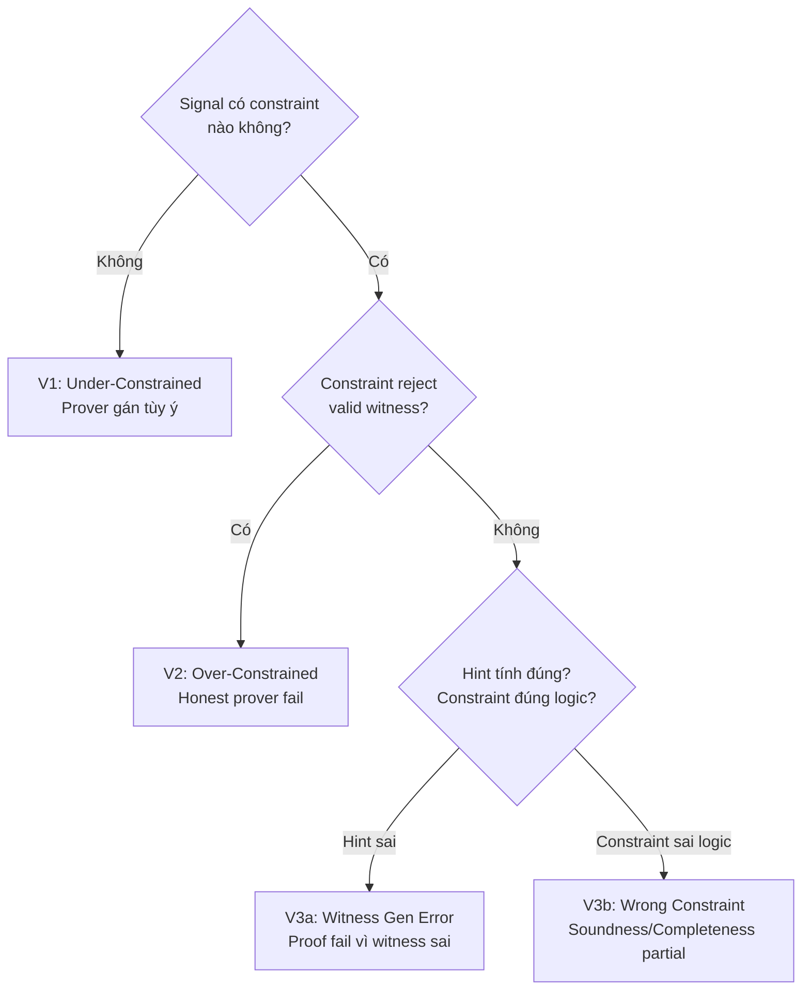

> **Prerequisites**: [[01-snark-stack-and-threat-model|01. SNARK Stack & Threat Model]], [[02-v1-under-constrained|02. V1: Under-Constrained]]  
> **Objectives**:  
> - Hiểu hint là gì và tại sao hints là cần thiết trong ZK
> - Phân biệt V3 với V1: cùng dùng `<--` nhưng lỗi khác nhau
> - Nhận biết các patterns lỗi trong witness generation
> - Biết khi nào V3 tạo ra soundness bug, khi nào tạo completeness bug

---

## Motivation

Trong Circom, operator `<--` được gọi là **hint** — cách duy nhất để express computations không thể biểu diễn trực tiếp dưới R1CS (ví dụ: phép chia, căn bậc hai, bit shift). Hints là *cần thiết*, nhưng chúng mang lại trách nhiệm: developer phải tự đảm bảo rằng hint tính đúng, và constraints phía sau check đúng kết quả.

V3 Computational/Hints Error xảy ra khi:
1. **Hint tính sai giá trị** (witness generation error)
2. **Constraint check sai điều kiện** (dù hint đúng)
3. **Hint và constraint không matching** — check điều kiện *khác* với điều kiện hint đảm bảo

---

## 1. Định nghĩa Chính thức

> [!definition] Definition 4.1 — V3 Computational / Hints Error
> V3 xảy ra khi có **sự không nhất quán giữa witness generation (hint) và constraint system** theo hai hướng:
>
> - **V3a — Hint sai**: Witness generator tính sai giá trị cho signal. Constraints đúng nhưng witness không thỏa mãn → honest prover fail.
> - **V3b — Constraint kiểm tra sai điều kiện**: Hint tính đúng giá trị cần thiết, nhưng constraint verify điều kiện *không đủ mạnh* để đảm bảo tính đúng đắn.

> [!note] Phân biệt V3 vs V1
> - **V1**: Constraints *thiếu hoàn toàn* → prover độc hại có thể assign arbitrary value
> - **V3**: Constraints *có* nhưng check *sai điều kiện*, hoặc witness generation *tính sai* giá trị hợp lệ

---

## 2. Tại sao Hints Là Cần Thiết?

R1CS chỉ cho phép constraints bậc 2 (quadratic): $(\vec{a} \cdot \vec{w})(\vec{b} \cdot \vec{w}) = \vec{c} \cdot \vec{w}$. Nhiều computations thực tế không thể express trực tiếp:

| Computation | Có thể R1CS trực tiếp? | Giải pháp |
|-------------|------------------------|-----------|
| $a \times b$ | ✅ | `out <== a * b` |
| $a + b$ | ✅ | `out <== a + b` |
| $a / b$ | ❌ | Hint `inv <-- 1/b`, constraint `b * inv === 1` |
| $\sqrt{n}$ | ❌ | Hint `root <-- sqrt(n)`, constraint `root * root === n` |
| `a >> n` (bit shift) | ❌ | Hint + bit decomposition |
| `a < b` (comparison) | ❌ | Hint + `LessThan` gadget |
| `a != 0` | ❌ | Hint + `IsZero` gadget |

**Pattern chuẩn khi dùng hint:**

```circom
// SAFE PATTERN: Hint + Verify
signal a;
signal b;
signal inv;
signal out;

// 1. Hint: tính giá trị (không phải constraint)
inv <-- b != 0 ? 1/b : 0;

// 2. Constraint: verify kết quả mong muốn
out <== a * inv;        // out = a/b
b * inv === 1;          // đảm bảo b != 0 và inv = 1/b

// Nếu bỏ constraint "b * inv === 1" → V1 (unconstrained)
// Nếu constraint sai logic → V3
```

---

## 3. V3a — Witness Generation Error (Hint Sai)

### Pattern 3a.1 — Off-by-One trong Hint

```circom
template BitDecompose(n) {
    signal input in;
    signal output bits[n];
    
    // HINT: decompose in thành bits
    for (var i = 0; i < n; i++) {
        // BUG: Dùng (in >> i) & 1 nhưng trong JavaScript witness gen
        // có thể có bug với big integers
        bits[i] <-- (in >> i) & 1;
    }
    
    // Constraint recompose:
    var sum = 0;
    for (var i = 0; i < n; i++) {
        sum += bits[i] * (2 ** i);
    }
    in === sum;
    
    // Nếu hint tính sai bits → sum ≠ in → constraint FAIL
    // → Honest prover không tạo được proof (completeness bug)
}
```

**Vấn đề thực tế:** JavaScript `>>` operator là 32-bit signed shift. Khi `in` > 2^31, `in >> i` overflow → hint tính sai → constraint fail cho valid inputs.

**Fix:**

```circom
// Trong witness generator (.js), dùng BigInt arithmetic:
bits[i] <-- (BigInt(in) >> BigInt(i)) & 1n;
```

---

### Pattern 3a.2 — Integer vs Field Arithmetic Mismatch

```circom
template Mod() {
    signal input a;
    signal input n;
    signal output r;
    signal output q;

    // HINT: tính q và r
    q <-- a \ n;  // integer division trong Circom
    r <-- a % n;  // integer modulo

    // Constraint: a = q*n + r
    a === q * n + r;

    // BUG TIỀM ẨN: Khi a hoặc n gần field prime p,
    // integer division trong witness gen và field arithmetic
    // trong constraint có thể cho kết quả khác nhau!
}
```

Trong trường hữu hạn $\mathbb{F}_p$: phép trừ có thể wrap around. Nhưng witness gen thường dùng integer arithmetic. Với inputs lớn, hai kết quả không matching.

---

### Pattern 3a.3 — Conditional Hint Logic Sai

```circom
template SafeDivide() {
    signal input a;
    signal input b;
    signal output result;
    signal inv;

    // HINT CÓ BUG:
    inv <-- b != 0 ? 1/b : 1;  // Khi b=0, trả về 1 thay vì 0
    result <-- a * inv;

    // Constraint:
    b * (b * inv - 1) === 0;   // nếu b!=0 thì b*inv=1
    // (constraint này đúng logic nhưng hint tính sai khi b=0)

    // Với b=0: inv=1, result=a
    // Constraint: 0 * (0*1 - 1) = 0 * (-1) = 0 ✓ (pass!)
    // Nhưng result = a (không phải undefined/0 như mong đợi)
    // → Behavior không như design intent
}
```

---

## 4. V3b — Constraint Logic Sai

### Pattern 4b.1 — Constraint Check Sai Điều Kiện

Hint tính đúng, nhưng constraint verify điều kiện *yếu hơn* cần thiết.

**Ví dụ — Square Root với Sign:**

```circom
template SquareRoot() {
    signal input n;      // n >= 0
    signal output root;  // "canonical" square root (positive)
    
    // Hint đúng: tính positive root
    root <-- sqrt(n);
    
    // CONSTRAINT SAI: chỉ check root^2 = n
    root * root === n;
    
    // BUG: Không đặc tả "root phải là positive root"!
    // Với n=4: root=2 và root=p-2 đều thỏa mãn constraint
    // Nếu caller cần canonical positive root, circuit không đảm bảo
    
    // FIX: cần thêm range constraint
    // component rb = Num2Bits(128);
    // rb.in <== root;  // đảm bảo root < 2^128 (positive in field sense)
}
```

---

### Pattern 4b.2 — assert() Nhầm với Constraint

Đây là V3 cực kỳ phổ biến trong code mới viết:

```circom
template DivisionCheck() {
    signal input a;
    signal input b;
    signal output q;

    // Developer nghĩ assert tạo constraint:
    assert(b != 0);  // KHÔNG TẠO CONSTRAINT!
                     // Chỉ là compile-time check, không có trong R1CS

    q <-- a / b;
    
    // Không có constraint nào verify b != 0 trong R1CS!
    // Prover độc hại có thể cung cấp b=0 và q tùy ý
}
```

**Rule quan trọng:** `assert` trong Circom chạy tại **witness generation time** (không phải compile-time trừ khi expression là constant). Nó KHÔNG tạo R1CS constraint — adversarial prover có thể tự build witness trực tiếp, bỏ qua hoàn toàn `assert`. Không bao giờ dùng `assert` để check runtime inputs; phải dùng `===`.

---

### Pattern 4b.3 — Lookup Table Constraint Không Đủ

Trong Halo2/Plonkish, lookup tables dùng để constrain giá trị thuộc một tập cụ thể. Nếu lookup constraint thiếu một chiều kiểm tra:

```rust
// Halo2 lookup
meta.lookup("byte range check", |meta| {
    let value = meta.query_advice(col_value, Rotation::cur());
    
    // LOOKUP: đảm bảo value thuộc range [0, 255]
    vec![(value, byte_table)]
    
    // BUG: Lookup chỉ check value trong table, không check
    // rằng value được dùng đúng cách ở chỗ khác
    // Cần kết hợp với equality constraint tại điểm dùng
});
```

---

## 5. V3 trong Proof System Layer

V3 không chỉ xảy ra ở circuit layer mà còn ở proof system (Lesson 07):

**Frozen Heart vulnerability** là một dạng V3 ở cấp proof system: trong Fiat-Shamir transform, challenge hash $c$ phải bao gồm commitment $R$. Nếu implement sai (thiếu $R$ trong hash input), prover có thể "chọn" $c$ tùy ý → forge proof. Đây là lỗi trong *witness generation logic của proof system*.

---

## 6. Tổng hợp V3 Patterns

| Pattern | Loại | Impact | Fix |
|---------|------|--------|-----|
| JS `>>` 32-bit overflow | V3a | Completeness (proof fail) | Dùng BigInt trong JS |
| Integer vs Field mismatch | V3a | Completeness hoặc Soundness | Align arithmetic domains |
| Conditional hint logic sai | V3a | Unexpected behavior | Verify hint với test cases |
| `root*root===n` thiếu sign constraint | V3b | Soundness (nondeterministic) | Thêm range/sign constraint |
| `assert()` thay vì `===` | V3b | Soundness | Dùng `===` cho runtime check |
| Lookup table thiếu chiều | V3b | Soundness | Thêm equality constraint |

---

## 7. Phân biệt V1 / V2 / V3 — Cheat Sheet



---

## Summary / Key Takeaways

- **Hints** (`<--`) là cần thiết vì R1CS không thể express mọi computation trực tiếp — nhưng hints không tạo constraints.
- **V3a**: Hint tính sai giá trị → witness không thỏa mãn constraints → honest prover fail (completeness bug).
- **V3b**: Constraint verify sai điều kiện → soundness partial hoặc nondeterministic circuit.
- `assert()` trong Circom KHÔNG tạo R1CS constraint — đây là nguồn gốc phổ biến của bug.
- JavaScript witness generation dùng 32-bit arithmetic cho `>>` → bug với inputs lớn.
- Pattern an toàn: Hint → Verify bằng constraint đủ mạnh → Test với edge cases.

---

## References

- Chaliasos et al. — *SoK USENIX 2024*, Section 5 (V3 taxonomy)
- ZKSecurity Blog — *Common Circom Pitfalls Part 1* — `<--` misuse section
- Circom Docs — Operators — [docs.circom.io/circom-language/basic-operators](https://docs.circom.io/circom-language/basic-operators/)
- Veridise — *ZK Vulnerabilities: Sharp rocks hidden in deep water* — [medium.com/veridise](https://medium.com/veridise/zk-vulnerabilities-sharp-rocks-hidden-in-deep-water-7cad8d4c2dfa)
