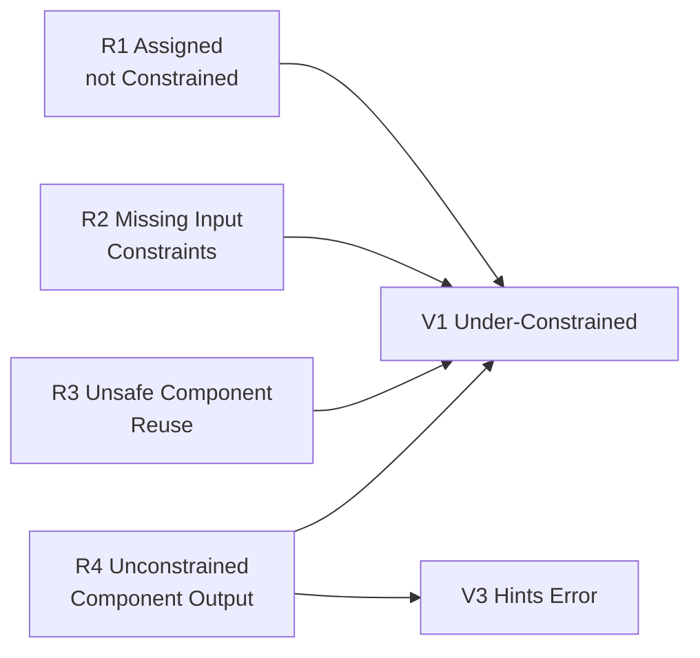

> **Prerequisites**: [[02-v1-under-constrained|02. V1: Under-Constrained]], [[04-v3-computational-hints-error|04. V3: Computational & Hints Error]]  
> **Objectives**:  
> - Hiểu 4 root causes đầu tiên (R1–R4) theo taxonomy SoK USENIX 2024
> - Phân biệt root cause (nguyên nhân gốc) với vulnerability type (biểu hiện)
> - Có khả năng áp dụng "root cause lens" khi đọc audit report
> - Viết được test cases target từng root cause

---

## Motivation

Nếu V1/V2/V3 mô tả *biểu hiện* của bug (what), thì R1–R7 mô tả *nguyên nhân gốc* (why). Một vulnerability có thể có nhiều root causes, và cùng một root cause có thể gây ra nhiều loại vulnerability.

SoK paper xác định **7 root causes** cho circuit-layer bugs. Bài này cover R1–R4 — bốn root causes phổ biến nhất, chiếm phần lớn trong số ~95 bugs V1.



---

## 1. R1 — Assigned but Not Constrained

> [!definition] Definition 5.1 — R1: Assigned but Not Constrained
> Developer gán giá trị cho signal bằng `<--` (hoặc tính toán trong witness gen) nhưng **không thêm constraint tương ứng để verify giá trị đó**.
>
> Kết quả: verifier không có rule nào kiểm tra signal này → prover tự do gán bất kỳ giá trị nào.

**Đây là root cause phổ biến nhất**, thường xảy ra với hai tình huống:

### Tình huống 1a — Hint không có verify constraint

```circom
template DivisionBad() {
    signal input a;
    signal input b;
    signal output q;   // quotient
    signal output r;   // remainder

    // HINT: tính q và r
    q <-- a \ b;  // integer division
    r <-- a % b;  // remainder

    // BUG R1: không có constraint nào!
    // Prover có thể gán q=0, r=0 và tạo proof cho bất kỳ a,b nào
}

template DivisionFixed() {
    signal input a;
    signal input b;
    signal output q;
    signal output r;

    q <-- a \ b;
    r <-- a % b;

    // FIX: constraint verify q*b + r = a
    a === q * b + r;
    // + constraint r < b (cần range proof)
    component lt = LessThan(64);
    lt.in[0] <== r;
    lt.in[1] <== b;
    lt.out === 1;
}
```

### Tình huống 1b — Intermediate signal không được constrain vào output

```circom
template HashPreimage() {
    signal input preimage;
    signal output hash;
    signal intermediate;  // kết quả trung gian

    intermediate <-- compute_hash(preimage);  // hint
    hash <-- finalize(intermediate);          // hint

    // BUG R1: hash không có constraint liên kết với preimage!
    // Prover có thể chọn hash tùy ý

    // FIX: cần circuit Poseidon/MiMC thực sự
    // component hasher = Poseidon(1);
    // hasher.inputs[0] <== preimage;
    // hash <== hasher.out;
}
```

### Detection checklist R1

- [ ] Mọi `<--` có `===` hoặc constraint tương ứng phía sau không?
- [ ] Output signal có được ràng buộc với input không?
- [ ] Intermediate signals có nằm trong constraint chain không?

---

## 2. R2 — Missing Input Constraints

> [!definition] Definition 5.2 — R2: Missing Input Constraints
> Developer không áp constraint lên **input signals** của circuit hoặc component — hoặc cố ý để caller circuit đảm nhận việc này, nhưng caller cũng bỏ qua.
>
> Thường xảy ra với: (i) lập trình viên quên, hoặc (ii) optimization — bỏ constraint để giảm circuit size với giả định caller sẽ enforce.

### Sub-case 2a — Quên check input type/range

```circom
template Bitify(n) {
    signal input in;
    signal output bits[n];

    for (var i = 0; i < n; i++) {
        bits[i] <-- (in >> i) & 1;

        // CHECK bit validity:
        bits[i] * (bits[i] - 1) === 0;  // bits[i] phải là 0 hoặc 1
    }

    // Recompose:
    var sum = 0;
    for (var i = 0; i < n; i++) {
        sum += bits[i] * (2 ** i);
    }
    in === sum;

    // BUG R2: Không check in < 2^n trước khi decompose!
    // Nếu in = 2^n + 5, sum = 5 (overflow), in !== sum
    // Nhưng nếu in chỉ đúng khi < 2^n thì caller PHẢI đảm bảo
    // => Nếu caller không enforce → bug
}
```

### Sub-case 2b — Delegation constraint bị rơi qua kẽ hở

**Scenario thực tế:**

```circom
// LibraryCircuit: assume caller sẽ constrain input
template LibraryMul() {
    signal input a;  // assume: caller ensures 0 <= a < 2^128
    signal input b;  // assume: caller ensures 0 <= b < 2^128
    signal output c;

    c <== a * b;
    // Library KHÔNG tự enforce range vì "optimization"
}

// Caller circuit — NHƯNG CALLER CŨNG QUÊN:
template CallerBad() {
    signal input x;
    signal input y;
    signal output result;

    component mul = LibraryMul();
    mul.a <== x;
    mul.b <== y;
    result <== mul.c;

    // BUG R2: Cả library lẫn caller đều không check range!
    // x, y có thể > 2^128, c có thể overflow
}

// Caller circuit — ĐÚNG:
template CallerGood() {
    signal input x;
    signal input y;
    signal output result;

    // ENFORCE range trước
    component rb_x = Num2Bits(128);
    component rb_y = Num2Bits(128);
    rb_x.in <== x;
    rb_y.in <== y;

    component mul = LibraryMul();
    mul.a <== x;
    mul.b <== y;
    result <== mul.c;
}
```

### Sub-case 2c — Public Input không được validate

```circom
// Ví dụ: zkEVM modulo gadget
// Public input n (modulus) không được check n != 0
template ModuloGadget() {
    signal input a;
    signal input n;  // PUBLIC: modulus
    signal output r;
    signal output q;

    q <-- a \ n;
    r <-- a % n;
    a === q * n + r;

    // BUG R2: n = 0 → division by zero trong hint
    // Constraint a = q*0 + r → a = r → không check gì thực sự
    // Prover có thể chọn q, r tùy ý khi n=0
}
```

---

## 3. R3 — Unsafe Component Reuse

> [!definition] Definition 5.3 — R3: Unsafe Component Reuse
> Developer sử dụng lại component (template) trong context không phù hợp — không đáp ứng **assumptions** mà component yêu cầu về inputs, hoặc không xử lý đúng các edge cases mà component không tự guard.

Đây là bug kiểu "API misuse" trong thế giới ZK — giống như gọi `malloc` mà không check return NULL.

### Ví dụ 1 — LessThan dùng với số bit sai

```circom
// circomlib LessThan(n): chỉ đúng khi inputs < 2^n
// Bug thực tế từ Dark Forest:

template RangeCheck() {
    signal input value;

    // INTENDED: check value < 2^64
    // BUG R3: LessThan(252) dùng với inputs có thể > 2^64
    component lt = LessThan(252);  // Cho phép inputs lên đến 2^252!
    lt.in[0] <== value;
    lt.in[1] <== 2**64;  // max

    // lt.out === 1 chỉ đảm bảo value < 2^64
    // nhưng KHÔNG đảm bảo value là 64-bit clean integer
    // Prover có thể gán value = 2^100 + delta vẫn pass nếu delta < 2^64
    lt.out === 1;
}

// FIX: Dùng đúng bit count
component lt = LessThan(64);
// VÀ đảm bảo inputs < 2^64 với Num2Bits trước
component n2b = Num2Bits(64);
n2b.in <== value;
```

### Ví dụ 2 — Dùng circuit hash với context sai

```circom
// Poseidon hash có domain separation — nếu dùng sai
// context (ví dụ: dùng cùng circuit hash cho commitment và nullifier)
// attacker có thể craft collision giữa hai domains.

// BUG R3:
template BadNullifier() {
    signal input secret;
    signal input nonce;
    signal output commitment;
    signal output nullifier;

    component h1 = Poseidon(2);
    h1.inputs[0] <== secret;
    h1.inputs[1] <== nonce;
    commitment <== h1.out;

    component h2 = Poseidon(2);
    h2.inputs[0] <== secret;
    h2.inputs[1] <== nonce;
    nullifier <== h2.out;

    // BUG: commitment === nullifier! (same inputs, same hash)
    // Attacker biết commitment có thể derive nullifier
}

// FIX: Dùng domain separation
component h1 = Poseidon(3);
h1.inputs[0] <== 0;  // domain tag cho commitment
h1.inputs[1] <== secret;
h1.inputs[2] <== nonce;

component h2 = Poseidon(3);
h2.inputs[0] <== 1;  // domain tag cho nullifier
h2.inputs[1] <== secret;
h2.inputs[2] <== nonce;
```

### Ví dụ 3 — Num2Bits dùng không đúng chiều

```circom
// circomlib Num2Bits(n) → decompose n thành n bits
// Alias bug: nếu input >= p (field prime), wrap-around

// Để range check x < 2^254:
component n2b = Num2Bits(254);  // Num2Bits, KHÔNG phải Num2Bits_strict
n2b.in <== x;
// BUG R3: Nếu x = p + 1 (> field prime), Circom field arithmetic
// sẽ reduce x mod p → Num2Bits(x mod p), không phải x
// Prover có thể pass với out-of-range x

// FIX: Dùng Num2Bits_strict hoặc explicit AliasCheck:
component alias = AliasCheck();
// connect alias để đảm bảo x < p
```

---

## 4. R4 — Unconstrained Component Output

> [!definition] Definition 5.4 — R4: Unconstrained Component Output
> Developer dùng component nhưng không kết nối output của component vào constraint nào trong circuit cha.
>
> **Key insight**: Trong Circom, instantiate một component và set inputs KHÔNG tự động tạo constraint. Outputs của component phải được *explicitly* sử dụng trong constraint của circuit cha.

Đây là root cause của vụ **circom-pairing $1M bug** — case study kinh điển.

### Ví dụ đơn giản — IsEqual unconstrained output

```circom
pragma circom 2.0.0;

template CheckEqual() {
    signal input x;
    signal input y;

    component eq = IsEqual();
    eq.in[0] <== x;
    eq.in[1] <== y;

    // BUG R4: eq.out KHÔNG BAO GIỜ ĐƯỢC DÙNG!
    // eq.out === 1 là điều developer muốn, nhưng KHÔNG VIẾT
    // Circuit này không enforce x === y dù tên là CheckEqual
}

template CheckEqualFixed() {
    signal input x;
    signal input y;

    component eq = IsEqual();
    eq.in[0] <== x;
    eq.in[1] <== y;

    eq.out === 1;  // FIX: explicit constraint trên output
}
```

### Ví dụ phức tạp — circom-pairing pattern

```circom
// Pattern từ CoreVerifyPubkeyG1 (simplified)
template VerifyKey(n, k) {
    signal input key[k];
    signal input bound[k];

    // Instantiate BigLessThan components
    component lt[k];
    for (var i = 0; i < k; i++) {
        lt[i] = BigLessThan(n, k);
        for (var j = 0; j < k; j++) {
            lt[i].a[j] <== key[j];
            lt[i].b[j] <== bound[j];
        }
        // BUG R4: lt[i].out không được check!
        // Ý định: lt[i].out === 1 (key[i] < bound)
        // Nhưng không có dòng này → key có thể out-of-range
    }
}

// FIX:
for (var i = 0; i < k; i++) {
    lt[i].out === 1;  // PHẢI thêm dòng này
}
```

### Tại sao R4 Phổ biến?

Mental model của developer thường là "tôi dùng component này để check condition" — nhưng trong Circom, việc *gọi* component không tạo constraint. Giống như gọi function `check(x)` trong ngôn ngữ thông thường nhưng không check return value.

**Rule nhớ đời:**
> Trong Circom, **component output phải được dùng trong ít nhất một constraint**, nếu không nó hoàn toàn vô nghĩa về mặt circuit.

---

## 5. Bảng Tổng hợp R1–R4

| Root Cause | Đặc điểm nhận biết | Bug type | Pattern fix |
|------------|-------------------|----------|-------------|
| R1 Assigned not Constrained | `<--` không có `===` sau | V1 Soundness | Thêm verify constraints |
| R2 Missing Input Constraints | Input không check range/type | V1 Soundness | Thêm range proof, explicit check |
| R3 Unsafe Component Reuse | Dùng component sai bit count, sai domain | V1 Soundness | Đọc docs component, verify assumptions |
| R4 Unconstrained Output | `component.out` không trong constraint | V1 Soundness | Thêm `component.out === expected` |

---

## 6. Audit Checklist R1–R4

Khi đọc Circom code, chạy qua checklist sau:

```text
R1 CHECK:
  □ Tìm tất cả dấu <-- trong file
  □ Với mỗi <--, tìm constraint === tương ứng phía sau
  □ Trace output signals về đến public output — có constraint chain không?

R2 CHECK:
  □ Với mỗi signal input, check xem có range constraint không
  □ Tìm component được dùng — đọc docs/code component để biết assumptions
  □ Nếu component assume input < 2^n, có Num2Bits(n) ở caller không?

R3 CHECK:
  □ Với mỗi LessThan(n), verify n đủ lớn cho tất cả possible inputs
  □ Hash functions có domain separation không?
  □ Bit decomposition có AliasCheck không?

R4 CHECK:
  □ Tìm tất cả component instantiations
  □ Với mỗi component, liệt kê outputs
  □ Verify từng output được dùng trong constraint của circuit cha
  □ Đặc biệt chú ý: comparator outputs (IsEqual, LessThan, etc.)
```

---

## Summary / Key Takeaways

- **R1 Assigned not Constrained**: Dùng `<--` mà không có `===` → signal tự do, prover gán tùy ý.
- **R2 Missing Input Constraints**: Không validate input range/type → adversarial input bypass logic.
- **R3 Unsafe Component Reuse**: Dùng component sai context (sai bit count, sai domain) → logic sai dù không có syntax error.
- **R4 Unconstrained Component Output**: Gọi component nhưng không check `output === expected` → component vô nghĩa.
- Tất cả 4 root causes đều dẫn đến **V1 Soundness bug** — prover gian lận được.
- Audit checklist theo từng root cause giúp review có hệ thống hơn.

---

## References

- Chaliasos et al. — *SoK USENIX 2024*, Section 5, Table 4 (Root Causes R1–R7)
- Veridise — *Circom-Pairing Million Dollar Bug* — R4 case study
- 0xPARC ZK Bug Tracker — Common Vulnerabilities #1, #3, #4
- ZKSecurity — *Circom Pitfalls Part 2* — Unconstrained outputs
- Trail of Bits — circomspect — R1 static analysis patterns
