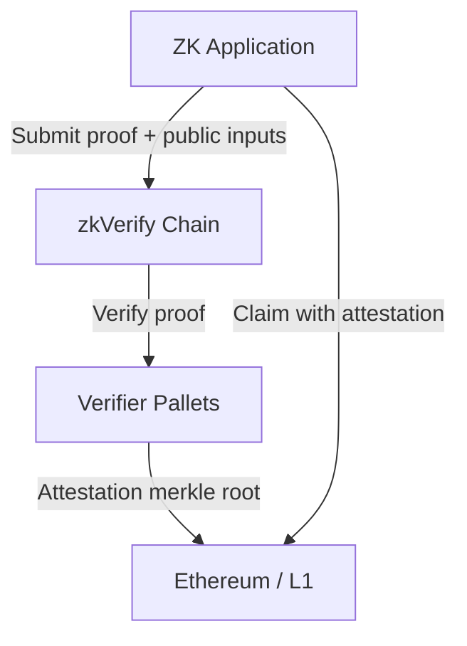

> **Prerequisites**: Tất cả Lesson 01–10  
> **Objectives**:  
> - Hiểu kiến trúc và mô hình bảo mật của zkVerify
> - Map taxonomy V1/V2/V3, R1–R7 vào attack surface của zkVerify
> - Có chiến lược hunting cụ thể và có thể bắt đầu ngay
> - Biết cách viết report đúng chuẩn Immunefi

---

## Motivation

Sau 10 bài học về taxonomy và theory, đây là bài cuối mapping tất cả vào **target thực tế**: zkVerify trên Immunefi với reward up to $50,000. zkVerify là "proof verification as a service" blockchain — attack surface của nó bao gồm cả circuit verification logic, consensus layer, và smart contracts.

---

## 1. zkVerify Architecture Overview

**zkVerify** là một blockchain chuyên dụng cho ZK proof verification. Thay vì verify proof trực tiếp trên Ethereum (tốn gas), ứng dụng submit proof lên zkVerify, nhận attestation, rồi dùng attestation trên Ethereum.



**Key components:**

```
zkVerify stack:
  ├── Substrate-based blockchain
  │   ├── Consensus layer (validators)
  │   ├── Runtime (pallets)
  │   │   ├── pallet-verifiers       ← Proof verification logic
  │   │   ├── pallet-settlement      ← Attestation + Ethereum bridge
  │   │   └── pallet-fflonk          ← Specific proof system
  │   └── RPC / API
  ├── Verifier implementations
  │   ├── Groth16 verifier
  │   ├── FFLONK verifier
  │   ├── PLONK verifier
  │   ├── Risc0 verifier
  │   └── UltraPlonk verifier
  └── Smart contracts (Ethereum)
      ├── Attestation verifier
      └── State management
```

---

## 2. Attack Surface Map

### Surface A — Verifier Implementations (Highest Value)

Đây là attack surface quan trọng nhất. Mỗi verifier phải:
1. Correctly verify proof math
2. Reject malformed proofs
3. Handle edge cases (infinity points, zero values, etc.)

**Potential bugs:**

```
A1. Missing subgroup check (→ Lesson 07: Gnark-style bug)
    - Proof elements không được check thuộc đúng subgroup
    - Attacker submit element ngoài subgroup → pairing equations pass với forged proof

A2. Incorrect Fiat-Shamir (→ Lesson 07: Frozen Heart)
    - Transcript hash không include tất cả commitments
    - Verify function accept proof với altered challenge

A3. Wrong scalar field handling (→ Lesson 06: R7)
    - Scalar values không reduced modulo field prime
    - Or reduced with wrong prime

A4. Missing infinity point rejection
    - Group element = point at infinity pass subgroup check
    - Special case: O (identity) should be rejected as proof element

A5. Incorrect serialization/deserialization
    - Proof bytes deserialized wrongly → attacker crafts malformed bytes
    - E.g., compressed vs uncompressed point handling
```

**Hunting approach A1–A5:**

```rust
// Template: test verifier với edge case inputs

#[test]
fn test_subgroup_check_missing() {
    // Generate proof element NOT on correct subgroup
    // If verifier accepts → bug found
    
    let forged_element = generate_non_subgroup_element();
    let result = verifier.verify_proof(&forged_proof_with(forged_element));
    
    // Should REJECT:
    assert!(result.is_err(), "Verifier should reject non-subgroup element!");
}

#[test]
fn test_infinity_point_rejection() {
    let infinity_proof = build_proof_with_infinity_point();
    let result = verifier.verify_proof(&infinity_proof);
    assert!(result.is_err(), "Verifier should reject infinity point!");
}
```

---

### Surface B — Pallet Logic (Medium Value)

Substrate pallets xử lý proof submission, validation flow, và attestation.

```
B1. Missing input validation in extrinsics
    - Proof size not bounded → DoS via huge proof
    - Public inputs not validated format

B2. Attestation logic errors
    - Merkle tree construction wrong → wrong root
    - Inclusion proof verification wrong

B3. Weight/fee calculation errors
    - Insufficient weight → resource exhaustion
    - Not a security bug directly, but DoS potential

B4. Replay protection
    - Same proof submitted multiple times → multiple attestations?
    - Proof uniqueness not enforced?
```

**Hunting approach B:**

```bash
# Read pallet source code:
# substrate/runtime/src/lib.rs
# pallets/verifiers/src/lib.rs

# Look for:
# - ensure!() checks - are they sufficient?
# - What happens with malformed input?
# - Is there proof uniqueness tracking?

# Test with substrate extrinsic:
# Submit same proof twice - does it create two attestations?
```

---

### Surface C — Smart Contracts / Ethereum Integration (Medium Value)

```
C1. Attestation verification on Ethereum
    - Merkle proof verification bug → accept fake attestation
    - Off-by-one in tree depth

C2. Bridge logic
    - Cross-chain message handling
    - Replay across different zkVerify deployments

C3. Access control
    - Who can submit attestations?
    - Who can update verifier addresses?
```

---

### Surface D — Consensus and Networking (Low-Medium Value)

```
D1. Validator misbehavior with proofs
    - Validator submit invalid proofs
    - Impact: fork, DoS

D2. Front-running attestations
    - Miner/validator see proof before finality
    - Potential: MEV, censorship
```

---

## 3. Mapping Taxonomy → zkVerify

| Taxonomy | zkVerify Attack Vector | Location |
|----------|----------------------|----------|
| V1 Under-Constrained | Circuit trong verifier implementation | Verifier pallets |
| V2 Over-Constrained | Reject valid proof | Verifier pallets |
| V3 Hints Error | Witness gen trong verifier | Verifier pallets |
| R1 Assign not Constrain | Off-circuit computation in Rust verifier | Verifier impl |
| R2 Missing Input | Missing proof format validation | Pallet extrinsic |
| R4 Unconstrained Output | Partial verification — check subset of equations | Verifier impl |
| R5 Custom Gates | FFLONK/PLONK custom gate handling | fflonk pallet |
| R7 Arithmetic Field | Wrong scalar field reduction | Verifier impl |
| Frozen Heart | Fiat-Shamir in PLONK verifier | plonk pallet |
| Integration Bug | Attestation verification on-chain | Smart contracts |

---

## 4. Chiến lược Hunting Cụ thể

### Strategy 1 — Verifier Math Audit

```bash
# 1. Clone zkVerify repo
git clone https://github.com/HorizenLabs/zkVerify

# 2. Locate verifier implementations
find . -name "*.rs" | xargs grep -l "verify" | grep -i "pallet\|verif"

# 3. Cho từng verifier, kiểm tra:
# a) Subgroup checks
grep -r "is_in_subgroup\|subgroup_check\|is_on_curve" --include="*.rs"

# b) Fiat-Shamir transcript
grep -r "transcript\|challenge\|hash" --include="*.rs" | grep -v test

# c) Pairing check completeness
grep -r "pairing\|miller_loop\|final_exp" --include="*.rs"
```

### Strategy 2 — Differential Testing

```python
# Compare zkVerify verifier output với trusted reference implementation

import subprocess

def test_verifier_consistency(proof, public_inputs):
    """
    Test: zkVerify verifier và snarkjs verifier cho cùng kết quả
    """
    # Test với snarkjs (reference):
    ref_result = snarkjs_verify(proof, public_inputs)
    
    # Test với zkVerify:
    zkv_result = zkverify_submit_and_verify(proof, public_inputs)
    
    if ref_result != zkv_result:
        print(f"[!] INCONSISTENCY FOUND!")
        print(f"    snarkjs: {ref_result}")
        print(f"    zkVerify: {zkv_result}")
        return True  # Bug candidate
    return False

# Test với edge cases:
edge_cases = [
    generate_proof_with_zero_scalar(),
    generate_proof_with_infinity_point(),
    generate_proof_with_non_subgroup_element(),
    generate_proof_with_wrong_field_element(),
]
```

### Strategy 3 — Fuzzing Verifier Input

```rust
// Fuzz test: submit malformed proofs
// Goal: verifier should always return Err, never panic

use libfuzzer_sys::fuzz_target;

fuzz_target!(|data: &[u8]| {
    // Try to deserialize and verify arbitrary bytes as proof
    if let Ok(proof) = deserialize_proof(data) {
        // Should not panic, just return error
        let _ = verifier.verify(proof, &public_inputs);
    }
});

// cargo-fuzz setup:
// cargo fuzz run verify_fuzz
```

### Strategy 4 — Integration Logic Review

```
Đọc smart contract code:
  1. Attestation verification logic
  2. Merkle proof handling
  3. Bridge message validation

Kiểm tra:
  - Proof uniqueness tracking (replay protection)
  - State root validation
  - Access control
  - Emergency pause mechanisms
```

---

## 5. Cách Viết Report cho Immunefi

### Structure của Report tốt

```markdown
# Bug Report: [Short Description]

## Summary
[1-2 câu mô tả bug và impact]

## Severity
Critical / High / Medium / Low
[Justify: tại sao severity này?]

## Vulnerability Details

### Root Cause
[Giải thích root cause theo taxonomy: V1/V2/V3, R1–R7]

### Technical Description
[Mô tả chi tiết technical — include code snippets]

### Affected Code
File: `path/to/file.rs`
Lines: 42-78

### Impact
[Mô tả concrete impact:
 - Attacker có thể làm gì?
 - Điều kiện để exploit?
 - Funds/data ở risk?]

## Proof of Concept

### Step-by-step
1. Generate malformed proof element X
2. Submit to zkVerify endpoint Y
3. Observe: verifier accepts (expected: reject)

### PoC Code
```rust
// Reproduction code
#[test]
fn test_poc() {
    let forged_proof = ...;
    let result = verifier.verify(forged_proof, &inputs);
    assert!(result.is_ok(), "Bug: should have rejected!");
}
```

## Recommended Fix
[Mô tả cụ thể cần sửa gì]

## References
- [Link đến relevant code]
- [Link đến related bug reports]
- [Academic references nếu cần]
```

### Common Mistakes khi Submit Immunefi

```
❌ Không có PoC → report bị reject ngay
❌ PoC không reproducible → report quarantine
❌ Severity quá cao so với actual impact → negotiation kéo dài
❌ Disclosure trước khi team confirm → violate responsible disclosure
❌ Report duplicate của existing fix → không nhận reward

✅ PoC hoàn chỉnh và chạy được
✅ Impact cụ thể (funds drained, not "something bad could happen")
✅ Conservative severity claim
✅ Kiểm tra BUGS.md và existing issues trước
✅ Contact riêng trước khi public disclosure
```

---

## 6. Bug Bounty Scope và Out-of-Scope

**In Scope (theo Immunefi zkVerify page):**
- Blockchain/DLT: Smart contracts, blockchain protocol
- Proof verification logic
- Pallet logic

**Out of Scope (typical):**
- Sybil attacks, 51% attacks
- DoS via sending many transactions (need proof of economic impact)
- Theoretical attacks without PoC
- Issues already disclosed

**Reward tiers (up to $50,000):**
- Critical: Forged proof accepted, drain funds
- High: State manipulation, unauthorized access
- Medium: DoS, data integrity
- Low: Informational

---

## Summary / Key Takeaways

- zkVerify attack surface gồm 4 surfaces: Verifier implementations (highest value), Pallet logic, Smart contracts, Consensus.
- **Highest value bugs**: Verifier math errors — missing subgroup check, Frozen Heart, wrong field arithmetic.
- Hunting strategy: Math audit → Differential testing → Fuzzing → Integration review.
- Taxonomy học trong series ánh xạ trực tiếp: V1 → forged proof, R7 → wrong field, Frozen Heart → Fiat-Shamir.
- PoC là bắt buộc. Không có PoC = không có reward.
- Setup: Clone repo → locate verifier code → run circomspect/custom analysis → write tests → reproduce.

---

## References

- zkVerify Immunefi page — [immunefi.com/bug-bounty/zkverify](https://immunefi.com/bug-bounty/zkverify/resources/)
- zkVerify GitHub — [github.com/HorizenLabs/zkVerify](https://github.com/HorizenLabs/zkVerify) *(verify current repo)*
- Immunefi Bug Bounty Handbook — [docs.immunefi.com](https://docs.immunefi.com)
- Trail of Bits — *Building Secure ZK-Proof Systems* audit guide
- Chaliasos et al. — *SoK USENIX 2024* — full taxonomy reference
