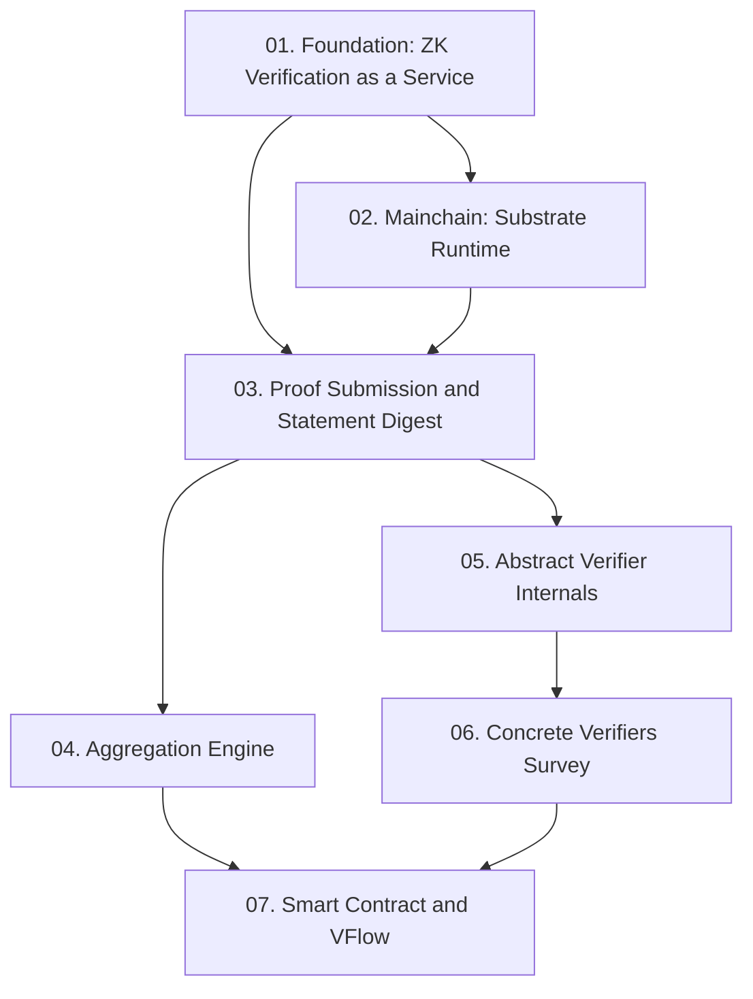

Course này distill toàn bộ nội dung của zkVerify Documentation thành 7 lesson có cấu trúc, tập trung vào hiểu kiến trúc hệ thống từ góc độ bảo mật — phục vụ cho bug bounty hunting trên Immunefi.

**Tài liệu gốc**: [zkVerify Documentation](https://docs.zkverify.io)  
**Kiến thức nền tảng yêu cầu** (🔴 Prerequisite references): Groth16 [Groth16], PLONK [PLONK], STARK/FRI [STARK], Substrate framework [Substrate], BABE/GRANDPA consensus [Polkadot], keccak256 [NIST], Solidity smart contracts [Solidity]

---

## Lesson Overview

| # | Title | Type | Covers (sections) | File | Dependencies |
|---|-------|------|-------------------|------|-------------|
| 01 | zkVerify: ZK Verification as a Service | Foundation | §1, §2 | [[01-zkverify-zk-verification-as-a-service\|01. zkVerify Foundation]] | — |
| 02 | Mainchain: Substrate Runtime & Consensus | Specification | §3.1–3.4 | [[02-mainchain-substrate-runtime-consensus\|02. Mainchain]] | 01 |
| 03 | Proof Submission Flow & Statement Digest | Protocol | §4 | [[03-proof-submission-flow-statement-digest\|03. Proof Submission]] | 01, 02 |
| 04 | Proof Aggregation Engine: Domains & Publishing | Specification | §5.1–5.5 | [[04-proof-aggregation-engine\|04. Aggregation Engine]] | 03 |
| 05 | Abstract Verifier & Statement Digest Internals | Deep Dive | §7.0 | [[05-abstract-verifier-internals\|05. Abstract Verifier]] | 03 |
| 06 | Concrete Verifiers: Survey & Bug Hunting Guide | Survey | §7.1–7.8, §10 | [[06-concrete-verifiers-survey\|06. Concrete Verifiers]] | 05 |
| 07 | On-Chain Verification: Smart Contract & VFlow | Specification | §6, §8, §9 | [[07-smart-contract-vflow\|07. Smart Contract & VFlow]] | 04, 06 |

**Lesson types**: Foundation · Math Component · Scheme · Attack · Protocol · Deep Dive · Specification · Survey

---

## Coverage Map

| Document section | Covered in lesson |
|------------------|-------------------|
| §1 What is zkVerify | 01 |
| §2 Core Architecture | 01 |
| §3.1 Mainchain Overview (Substrate) | 02 |
| §3.2 Consensus (BABE + GRANDPA) | 02 |
| §3.3 State and Proof Storage | 02 |
| §3.4 zkVerify Mainchain API | 02 |
| §4 Proof Submission Flow | 03 |
| §4 Domain Separated Aggregation | 03 |
| §5.1 Aggregation Engine Overview | 04 |
| §5.2 Handle Valid Proof | 04 |
| §5.3 Concepts (Domain lifecycle) | 04 |
| §5.4 Publish Aggregations | 04 |
| §5.5 Domain Management | 04 |
| §6 Proof Verification Smart Contract | 07 |
| §7.0 Abstract Verifier | 05 |
| §7.1 risc0 Verifier | 06 |
| §7.2 Groth16 Verifier | 06 |
| §7.3 Ultraplonk Verifier | 06 |
| §7.4 Plonky2 Verifier | 06 |
| §7.5 SP1 Verifier | 06 |
| §7.6 Ultrahonk Verifier | 06 |
| §7.7 EZKL Verifier | 06 |
| §7.8 TEE Verifier | 06 |
| §8 VFlow | 07 |
| §9 Supported Networks | 07 |
| §10 Supported Proofs | 06 |

---

## Dependency Graph

---

## Progress

- [x] [[01-zkverify-zk-verification-as-a-service|01. zkVerify: ZK Verification as a Service]]
- [x] [[02-mainchain-substrate-runtime-consensus|02. Mainchain: Substrate Runtime & Consensus]]
- [x] [[03-proof-submission-flow-statement-digest|03. Proof Submission Flow & Statement Digest]]
- [x] [[04-proof-aggregation-engine|04. Proof Aggregation Engine]]
- [x] [[05-abstract-verifier-internals|05. Abstract Verifier & Statement Digest Internals]]
- [x] [[06-concrete-verifiers-survey|06. Concrete Verifiers: Survey & Bug Hunting Guide]]
- [x] [[07-smart-contract-vflow|07. On-Chain Verification: Smart Contract & VFlow]]

---

## 🟡 Integrated References

| Ref Key | Used in lesson | What is integrated |
|---------|---------------|--------------------|
| EigenDA Merkle.sol | 07 | `verifyProofAggregation` dùng trực tiếp; adapted cho Substrate Binary Merkle tree |
| Substrate binary-merkle-tree | 07 | Substrate dùng non-complete Merkle tree → smart contract phải adapt; potential Critical bug |

---

## Notes

**Thứ tự học khuyến nghị**: 01 → 02 → 03 → 05 → 06 → 04 → 07

**Ưu tiên cho bug hunting**:
1. **Lesson 06** (Concrete Verifiers) + **Lesson 05** (Abstract Verifier): Attack surface cao nhất, reward lớn nhất (Critical $50k). Đặc biệt chú ý EZKL (unaudited) và Groth16 (subgroup check).
2. **Lesson 07** (Smart Contract): Merkle tree mismatch → Critical $10k trên Web/App tier.
3. **Lesson 03** (Proof Submission): leaf_digest formula bugs → global impact.
4. **Lesson 04** (Aggregation Engine): High-severity economic attacks và state transition bugs.
5. **Lesson 02** (Mainchain): Node stability bugs → High tier $5k–10k.
