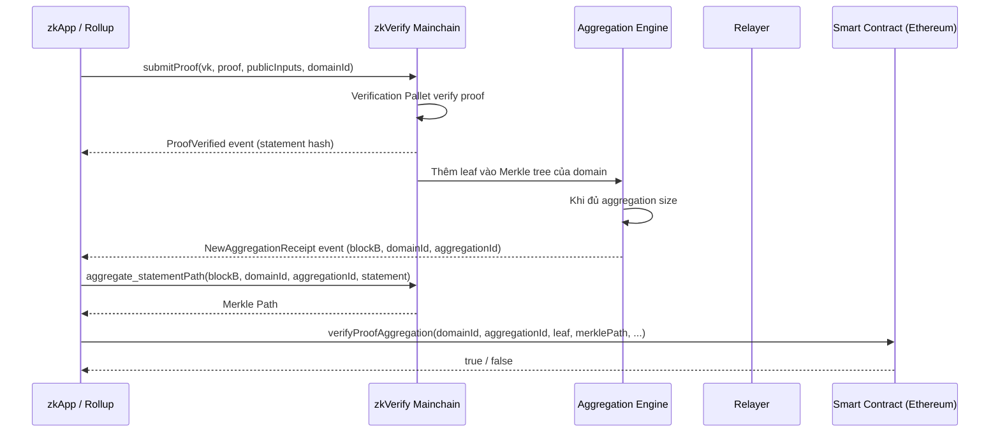

> **Prerequisites**: Zero-knowledge proof cơ bản (completeness, soundness, zero-knowledge property), khái niệm zkRollup / zkApp  
> 🔴 **Prerequisite references**: Groth16 proving system [Groth16]; PLONK/UltraHonk [PLONK]; STARK proving system [STARK]  
> **Lesson type**: Foundation  
> **Covers**: §1 (What is zkVerify, Goals, Problems), §2 (Core Architecture overview)
>
> **Notation**:
> | Ký hiệu | Ý nghĩa |
> |---------|---------|
> | ZKP | Zero-Knowledge Proof |
> | VK | Verification Key |
> | zkApp | Ứng dụng sử dụng ZK proof |
> | zkRollup | Layer 2 dùng ZK proof để compress và settle transactions |
> | L1 | Layer 1 blockchain (ví dụ Ethereum) |
> | gas | Đơn vị đo chi phí computation trên EVM |

---

## Motivation

Zero-knowledge proof (ZKP) là một trong những công cụ mật mã học mạnh nhất của thập kỷ này. Chúng cho phép một bên (*prover*) thuyết phục bên khác (*verifier*) rằng một phép tính được thực hiện đúng mà **không tiết lộ bất kỳ dữ liệu đầu vào nào**. Ứng dụng bao gồm tóm tắt giao dịch hàng loạt (zkRollup), chia sẻ thông tin định danh chọn lọc, bỏ phiếu bí mật, và ẩn thông tin trong game on-chain.

Một ZK proof hoàn chỉnh có hai bước bắt buộc:

1. **Proof Generation** — prover thực hiện phép tính và tạo ra proof.
2. **Proof Verification** — verifier kiểm tra proof có hợp lệ không.

Cả hai bước đều cần thiết. Trong khi cộng đồng đang đẩy mạnh cải thiện tốc độ generation, bước **verification** lại đang trở thành nút cổ chai về chi phí — đặc biệt trên Ethereum.

---

## Bài Toán zkVerify Giải Quyết

### 1 — Chi Phí Xác Minh Proof Quá Cao

Xác minh một ZK proof trên Ethereum tiêu tốn từ **200,000 đến 300,000 gas**, tùy loại proof. Trong thời điểm tắc nghẽn mạng, gas có thể vượt 100 Gwei, khiến chi phí verify một proof lên đến **\$20–\$60** hoặc hơn.

Ở quy mô toàn thị trường, chi phí verification ước tính vượt **\$100 triệu** chỉ riêng cho zkRollups năm 2024, và dự kiến đạt **\$1.5 tỷ** vào 2028 khi tính cả zkApps. Ngoài chi phí danh nghĩa, sự biến động của gas fee còn gây bất ổn cho sản phẩm.

### 2 — Không Phải Mọi Proof Đều Verify Được Trên EVM

STARK proof — nền tảng của hầu hết các zkVM hiện tại — có kích thước proof lớn và tốn kém để verify trên EVM. Giải pháp hiện tại là **"bọc" (wrap)** STARK proof bên trong một SNARK proof (thường là Groth16) trước khi submit lên Ethereum, nhưng bước wrap này:
- Tốn thêm thời gian prove đáng kể.
- Thêm độ trễ cho toàn bộ pipeline.

zkVerify giải quyết cả hai vấn đề bằng cách đưa verification ra một chain chuyên dụng.

---

## zkVerify là Gì?

> [!note] Định nghĩa 1.1 — zkVerify
> **zkVerify** là một L1 blockchain công khai, phi tập trung, hiệu suất cao, chuyên biệt cho việc xác minh zero-knowledge proof (ZK proof verification).
>
> zkVerify cung cấp phương pháp tiếp cận **mô-đun (modular)** và **có thể kết hợp (composable)** để các zkApp xác minh proof một cách hiệu quả — cho phép các mạng blockchain giảm tải quá trình xác minh tốn kém về mặt tính toán.

Thay vì mỗi zkApp tự triển khai verifier đắt tiền trên Ethereum, họ submit proof lên zkVerify, nhận kết quả và sử dụng **Merkle proof** để chứng minh với smart contract on-chain rằng proof của họ đã được xác minh.

---

## Kiến Trúc Tổng Quan

> [!note] Specification 1.2 — Core Architecture Components
> **5 thành phần chính** của hệ thống zkVerify:
>
> **1. Core Blockchain (Mainchain)**
> L1 Proof-of-Stake blockchain xây trên Substrate framework. Token: VFY. Chuyên biệt với các Verification Pallet tích hợp sẵn.
>
> **2. Proof Submission Interface**
> Entry point: zkApp submit transaction (extrinsic `submitProof`) và thực hiện RPC calls. SDK: `zkVerifyJS`.
>
> **3. Proof Receipt Mechanism (Aggregation)**
> Sau khi proof được verify và thêm vào block, hệ thống gom các proof thành **Merkle tree**. Merkle root = "proof receipt" được publish lên destination chain qua relayer.
>
> **4. Aggregation Engine**
> Permissionless: bất kỳ ai cũng có thể publish aggregation và nhận phí. Hỗ trợ nhiều **Domain** với kích thước aggregation khác nhau.
>
> **5. On-Chain Verification (Smart Contract)**
> User submit Merkle proof lên zkVerify contract trên Ethereum (hoặc L2) để prove rằng proof của họ đã được xác minh trên zkVerify chain.

### Verifier Pallets Được Hỗ Trợ

zkVerify tích hợp sẵn các verifier pallet cho các proving scheme sau:

| Pallet | Proving Scheme | Ghi chú |
|--------|---------------|---------|
| `groth16` | Groth16 | Circom/SnarkJS/Gnark; BN128, BN254, BLS12-381 |
| `risc0` | STARK (Risc0 zkVM) | v2.1, v2.2, v2.3; native STARK, không cần wrap thành SNARK |
| `ultraplonk` | UltraPlonk (Noir) | >= v0.31.0 |
| `ultrahonk` | UltraHonk (Noir) | v1.0.0-beta.6 |
| `plonky2` | Plonky2 | Keccak256 hoặc Poseidon |
| `sp1` | SP1 zkVM | v5.x |
| `ezkl` | EZKL | BN254, BDFG21 |
| `tee` | TEE (Intel TDX) | Trusted Execution Environment |

---

## Luồng Hoạt Động End-to-End

---

## Tại Sao Kiến Trúc Này Đúng?

**Về correctness**: Proof đã được verify bởi Verification Pallet trên Mainchain. Nếu hợp lệ, nó được emit event `ProofVerified` và thêm vào Merkle tree. Khi Merkle root được publish lên smart contract, bất kỳ ai cũng có thể verify Merkle path để xác nhận một leaf (proof statement) cụ thể đã được include.

**Về security**: Ngay cả khi proof không hợp lệ, transaction vẫn được include vào block (user phải trả phí) — đây là thiết kế chống DoS attack. Relayer chỉ post các aggregation đã được finalize bởi GRANDPA finality.

> [!tip] 💡 Agent note
> Đây là mô hình "pay-per-verify" với **externalized verification**: zkApp không cần viết verifier contract trên Ethereum nữa. Họ chỉ cần 1 lần gọi `verifyProofAggregation` trên zkVerify smart contract — rẻ hơn nhiều so với chạy full ZK verifier. Đây là tương đương ZK của việc dùng Chainlink oracle thay vì tự fetch data on-chain.

---

## Vị Trí Trong Bug Bounty Scope

| Thành phần | Scope | Mức thưởng tối đa |
|------------|-------|------------------|
| Mainchain (Substrate runtime) | Blockchain/DLT | $50,000 Critical |
| Verification Pallets | Blockchain/DLT | $50,000 Critical |
| Aggregation Engine | Blockchain/DLT | $10,000 High |
| Smart Contract (Ethereum) | Web & App | $10,000 Critical |
| zkVerifyJS SDK | Web & App | $10,000 Critical |

---

## Summary

- zkVerify = L1 blockchain chuyên dụng verify ZK proof, giải quyết vấn đề chi phí gas cao và STARK proof không verify được trực tiếp trên EVM.
- Kiến trúc gồm 5 thành phần: Mainchain → Verification Pallets → Aggregation Engine → Relayer → Smart Contract trên Ethereum.
- Proof được verify on-chain, gom vào Merkle tree, Merkle root published lên Ethereum contract.
- zkApp dùng Merkle proof để chứng minh proof đã được xác minh — chi phí thấp hơn nhiều so với tự verify trên L1.
- Hỗ trợ 8 proving scheme: Groth16, Risc0, UltraPlonk, UltraHonk, Plonky2, SP1, EZKL, TEE.

---

## References

- zkVerify Documentation: https://docs.zkverify.io (🔴 nguồn gốc toàn bộ lesson này)
- zkVerify GitHub: https://github.com/zkVerify/zkVerify
