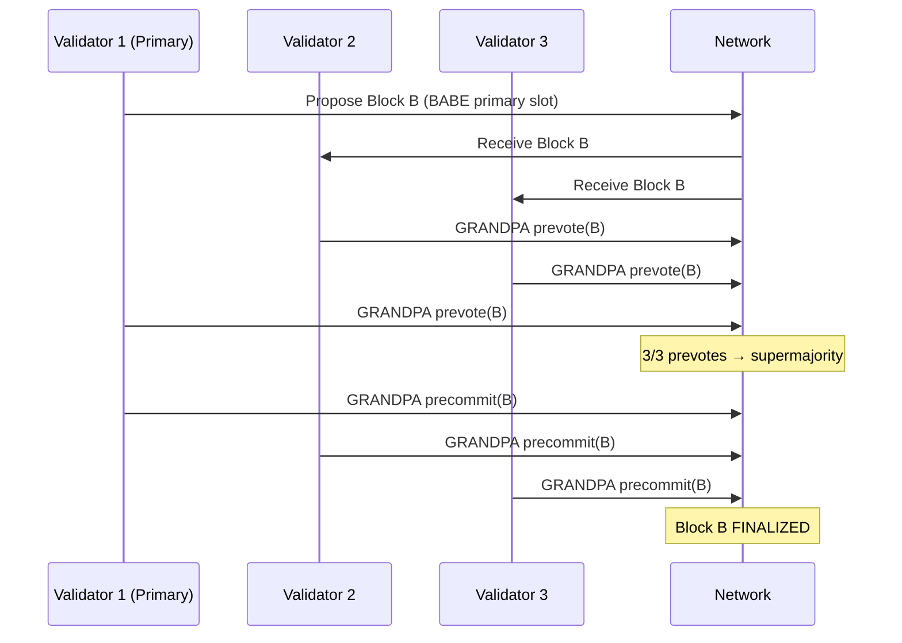

> **Prerequisites**: Xem [[01-zkverify-zk-verification-as-a-service|01. zkVerify: ZK Verification as a Service]]  
> 🔴 **Prerequisite references**: Substrate framework (Polkadot SDK) [Substrate]; BABE block authoring [BABE]; GRANDPA finality [GRANDPA]; Nominated Proof-of-Stake (NPoS) [NPoS]  
> **Lesson type**: Specification  
> **Covers**: §3.1 Mainchain Overview (Substrate rationale), §3.2 Consensus (BABE + GRANDPA), §3.3 State and Proof Storage, §3.4 Mainchain API
>
> **Notation**:
> | Ký hiệu | Ý nghĩa |
> |---------|---------|
> | BABE | Blind Assignment for Blockchain Extension — thuật toán tạo block |
> | GRANDPA | GHOST-based Recursive ANcestor Deriving Prefix Agreement — finality gadget |
> | VRF | Verifiable Random Function |
> | NPoS | Nominated Proof-of-Stake |
> | WASM | WebAssembly — runtime được compile và lưu on-chain |
> | extrinsic | Substrate tương đương của "transaction" (bao gồm cả signed và unsigned) |
> | pallet | Module Substrate — đơn vị logic trong runtime |
> | H256 | 256-bit hash (keccak256 hoặc blake2) |

---

## Tại Sao Chọn Substrate?

zkVerify là blockchain mô-đun (modular blockchain) — thiết kế nhấn mạnh vào các thành phần có thể thay thế được (interchangeable components). Substrate được chọn vì 5 lý do chiến lược:

| Lý do | Chi tiết kỹ thuật |
|-------|-----------------|
| **Modularity** | Substrate cho phép tạo blockchain với logic tùy chỉnh; pallet hệ thống có thể swap được |
| **Upgradability** | WASM runtime: logic được distribute on-chain, validator tự cập nhật mà không cần hard fork |
| **Robustness** | Core của Polkadot ecosystem; >150 projects; GitHub nhận hàng trăm contributions/tháng |
| **Performance** | Erasure coding, blockchain state pruning, viết bằng Rust |
| **Support** | Community lớn; tools (explorer, wallet, SDK) sẵn có |

> [!tip] 💡 Agent note
> Điểm then chốt nhất cho bug bounty: **WASM runtime upgradability**. Runtime logic lưu on-chain dưới dạng WASM blob có thể được upgrade qua governance mà không cần hard fork. Điều này tạo ra attack surface mới: nếu có lỗ hổng trong runtime upgrade mechanism, kẻ tấn công có thể inject code độc hại vào runtime. Đây là điều cả hai audit (Trail of Bits, SRLabs) đều xem xét kỹ.

---

## Consensus: BABE + GRANDPA

zkVerify dùng delegated proof-of-stake với hai lớp consensus tách biệt:

> [!note] Specification 2.1 — BABE Block Authoring
> **BABE** (Blind Assignment for Blockchain Extension) — thuật toán tạo block theo slot.
>
> **Cơ chế**:
> - Time được chia thành các **slot** cố định; nhiều slot tạo thành một **epoch**.
> - Mỗi validator được gán một **weight** cho mỗi epoch (tỉ lệ với stake).
> - Tại mỗi slot, validator evaluate **VRF** bằng epoch randomness + slot number.
> - Nếu output VRF < weight tương đối của validator → validator đó là **primary author** của slot đó.
> - **Secondary slots**: mỗi slot luôn có ít nhất 1 block được produce (từ secondary assignment) → block time ổn định.
>
> **Output**: chuỗi block được propose; có thể có fork tạm thời nếu nhiều validator cùng là primary author một slot.

> [!note] Specification 2.2 — GRANDPA Block Finalization
> **GRANDPA** (GHOST-based Recursive ANcestor Deriving Prefix Agreement) — finality gadget chạy song song với BABE.
>
> **Các bước**:
> 1. **Block Production**: BABE produce block; broadcast ra mạng dưới dạng "tentative" (chưa finalized).
> 2. **Voting Rounds**: Validators vote cho block mà họ tin là có thể finalize. Vote cho block B ngầm bao gồm vote cho tất cả ancestors của B.
> 3. **GHOST Rule**: GRANDPA dùng GHOST (Greedy Heaviest Observed Sub-Tree) để chọn block có supermajority vote → block đó và tất cả ancestors được finalize.
> 4. **Deterministic Finality**: Khi ≥2/3 validators đã finalize, block không thể bị revert.
>
> **Tính chất**: High availability (BABE tiếp tục produce dù có fork) + deterministic finality khi supermajority complete GRANDPA rounds.

> [!info] So sánh với Ethereum
> BABE + GRANDPA có nhiều điểm tương đồng với **Gasper** (Ethereum consensus = LMD-GHOST + Casper FFG) và **Ouroboros Praos** (Cardano). BABE ~ LMD-GHOST cho liveness, GRANDPA ~ Casper FFG cho finality. Điểm khác biệt: GRANDPA vote trên chain chứ không phải block, cho phép finalize nhiều block trong một vòng.

---

## State and Proof Storage

Substrate sử dụng **Patricia Merkle Trie** cho state storage. Một số điểm quan trọng với zkVerify:

> [!note] Specification 2.3 — Storage Architecture
> - **RocksDB** backend mặc định; hỗ trợ **ParityDB** tối ưu hơn cho blockchain.
> - State được tổ chức theo pallet: mỗi pallet có storage prefix riêng.
> - **State pruning**: Substrate có thể prune các state cũ để tiết kiệm disk; archive node giữ toàn bộ lịch sử.
> - **Proof storage**: Verification key (VK) được lưu on-chain sau khi registered qua `registerVk`. Key được index bởi hash của nó (H256).
> - **Published aggregations**: Aggregation sau khi publish chỉ tồn tại trong block được publish — không được lưu lâu dài. Lý do: tiết kiệm storage, user cần query Merkle path ngay tại block đó.

> [!warning] Security Note 2.4 — Storage vs Memory trong Substrate
> Trong Substrate runtime, storage calls có chi phí I/O cao. Các bugs thường gặp liên quan đến:
> - **Unbounded storage growth**: loop không giới hạn ghi vào storage → DoS.
> - **Missing weight benchmarks**: extrinsic chưa benchmark → có thể bypass block weight limit → node crash/slow.
> - **Storage deposit miscalculation**: thiếu charge deposit cho storage → economic attack.

---

## Mainchain API

### Custom Extrinsics

Ngoài các standard Substrate extrinsics, zkVerify expose các custom extrinsics sau:

> [!note] Specification 2.5 — Verifier Extrinsics (mỗi pallet verifier)
>
> **`submitProof(vkOrHash, proof, pubs, domainId)`**
> - `vkOrHash`: VK đầy đủ hoặc hash H256 của VK đã registered
> - `proof`: bytes của proof (encoding tùy verifier)
> - `pubs`: public inputs (encoding tùy verifier)
> - `domainId`: Option<u32> — nếu Some(id) thì proof được aggregate vào domain đó
>
> **`registerVk(vk)`**
> - Lưu VK vào storage, emit `VkRegistered(hash)` event
> - Hash có thể dùng thay VK trong các lần `submitProof` sau

> [!note] Specification 2.6 — Aggregate Extrinsics
>
> **`aggregate(domainId, aggregationId)`**
> - Publish aggregation đang pending
> - Compensate aggregator (phí transaction + incentive)
> - Pay delivery_owner cho cross-chain dispatch cost
> - Emit `NewAggregationReceipt` nếu thành công

### Custom RPC Methods

> [!note] Specification 2.7 — Custom RPC
>
> **`aggregate_statementPath(at, domainId, aggregationId, statement)`**
> - `at`: block hash nơi `NewAggregationReceipt` event được emit
> - Trả về Merkle path của `statement` trong aggregation đó
> - Chỉ available tại block cụ thể (aggregation không persist)

### Events và Errors

| Event | Pallet | Ý nghĩa |
|-------|--------|---------|
| `ProofVerified(statement)` | Verifier | Proof hợp lệ; `statement` = H256 hash |
| `VkRegistered(hash)` | Verifier | VK đã được đăng ký |
| `NewProof(digest, domainId, aggregationId)` | Aggregate | Proof được add vào aggregation |
| `AggregationComplete(domainId, aggregationId)` | Aggregate | Aggregation đủ kích thước |
| `NewAggregationReceipt(domainId, aggregationId, receipt)` | Aggregate | Aggregation đã published |
| `CannotAggregate(...)` | Aggregate | Domain không nhận proof (queue đầy / thiếu funds) |

| Error | Ý nghĩa |
|-------|---------|
| `InvalidProof` | Proof bytes không deserialize được |
| `VerificationFailed` | Proof deserialize được nhưng verify thất bại |
| `InvalidPublicInputs` | Public inputs bytes không hợp lệ |
| `InvalidVerificationKey` | VK không hợp lệ |
| `DomainNotFound` | Domain ID không tồn tại |

> [!warning] Security Note 2.8 — Fee-on-Failure Design
> Ngay cả khi proof invalid, transaction vẫn được include vào block và user phải trả phí. Đây là thiết kế **chống DoS**: nếu failed transactions miễn phí, kẻ tấn công có thể spam invalid proofs để làm tắc nghẽn mạng mà không tốn chi phí.
>
> **Bug bounty angle**: Nếu có cách bypass fee mechanism khi proof invalid (ví dụ: làm node crash trước khi charge phí), đây là High-severity bug.

---

## Summary

- zkVerify Mainchain = Substrate-based L1, VFY token, WASM runtime (upgradeable không cần hard fork).
- Consensus: **BABE** (slot-based VRF block authoring, constant block time) + **GRANDPA** (supermajority finality gadget, deterministic).
- State storage: Patricia Merkle Trie + RocksDB; VK lưu on-chain sau `registerVk`; aggregation chỉ tồn tại tại block publish.
- Custom API: `submitProof`, `registerVk`, `aggregate` extrinsics; `aggregate_statementPath` RPC.
- Design choice quan trọng: invalid proof vẫn tốn phí → chống DoS.

---

## References

- zkVerify Mainchain Docs: https://docs.zkverify.io/architecture/mainchain/overview
- Substrate framework: https://substrate.io
- BABE paper: https://research.web3.foundation/Polkadot/protocols/block-production/Babe (🔴 Prerequisite)
- GRANDPA paper: https://github.com/w3f/consensus/blob/master/pdf/grandpa.pdf (🔴 Prerequisite)
