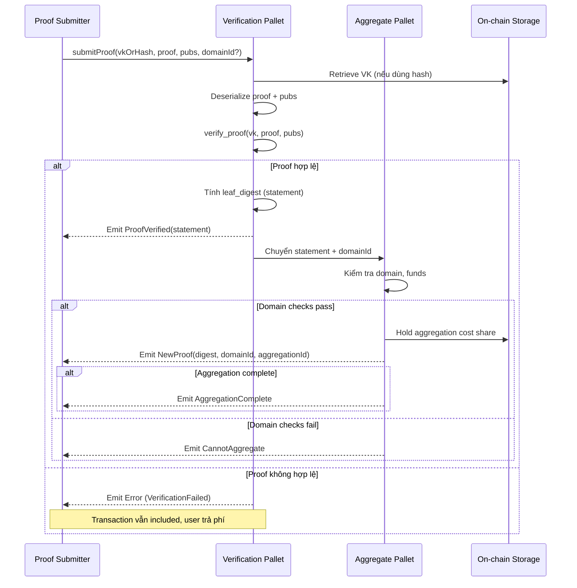

> **Prerequisites**: Xem [[01-zkverify-zk-verification-as-a-service|01. zkVerify: ZK Verification as a Service]], [[02-mainchain-substrate-runtime-consensus|02. Mainchain: Substrate Runtime & Consensus]]  
> 🔴 **Prerequisite references**: keccak256 hash function [NIST]; Merkle tree [Merkle]  
> **Lesson type**: Protocol  
> **Covers**: §4 Proof Submission Flow (submitProof extrinsic, leaf_digest formula, domain-separated aggregation flow)
>
> **Notation**:
> | Ký hiệu | Ý nghĩa |
> |---------|---------|
> | `leaf_digest` | Hash định danh duy nhất cho một proof đã được xác minh |
> | `verifier_ctx` | Byte sequence định danh verifier (ví dụ: `b"groth16"`) |
> | `vk` | Verification Key |
> | `pubs` | Public inputs của proof |
> | `version_hash` | Hash fingerprint của phiên bản verifier |
> | `statement` | = `leaf_digest` — dùng thay thế nhau trong docs |
> | `domainId` | Định danh Domain trong Aggregation Engine |
> | `aggregationId` | Định danh aggregation batch trong một Domain |
> | `keccak256(x)` | Hàm hash keccak-256 của x |

---

## Participants & Goal

**Participants**:
- **Proof Submitter** (zkApp / zkRollup / bất kỳ user nào có VFY): submit proof lên zkVerify
- **Verification Pallet** (zkVerify runtime): xác minh proof và tính toán statement hash
- **Aggregate Pallet** (zkVerify runtime): gom proofs vào domain, quản lý Merkle tree

**Mục tiêu của flow này**: Chuyển đổi một ZK proof (có thể dung lượng lớn, đắt để lưu trữ) thành một **statement hash** nhỏ gọn (32 bytes), được anchor vào Merkle tree, để sau này có thể verify on-chain với chi phí thấp.

---

## Protocol Flow



---

## Công Thức leaf_digest — Trái Tim của Protocol

Đây là công thức quan trọng nhất trong zkVerify. Mỗi proof hợp lệ được đại diện bởi một `leaf_digest` duy nhất:

> [!note] Formula 3.1 — leaf_digest (Statement Hash)
>
> $$
> \texttt{leaf\_digest} = \mathsf{keccak256}\!\bigl(\mathsf{keccak256}(\texttt{verifier\_ctx}) \,\|\, \mathsf{hash}(\texttt{vk}) \,\|\, \mathsf{version\_hash}(\texttt{proof}) \,\|\, \mathsf{keccak256}(\texttt{public\_inputs\_bytes})\bigr)
> $$
>
> Trong đó:
> - `verifier_ctx` — byte sequence duy nhất định danh verifier (ví dụ: `b"risc0"`, `b"groth16"`)
> - `hash(vk)` — hash của verification key; mỗi verifier tự định nghĩa hàm hash này
> - `version_hash(proof)` — fingerprint phiên bản verifier; dùng để distinguish các breaking changes trong verifier logic
> - `public_inputs_bytes` — byte encoding của public inputs; mỗi verifier tự định nghĩa cách encode

> [!tip] 💡 Agent note
> Cụ thể hơn, trong code Rust của Abstract Verifier, công thức được hiện thực hóa như sau:
>
> ```rust
> let ctx = V::hash_context_data();          // keccak256(verifier_ctx)
> let vk_hash = V::vk_hash(&vk);            // hash(vk) — mỗi verifier có thể override
> let pubs_bytes = V::pubs_bytes(&pubs);     // byte encoding của public inputs
> let version_hash = V::verifier_version_hash(proof); // fingerprint phiên bản
>
> let mut data_to_hash = keccak_256(ctx).to_vec();
> data_to_hash.extend_from_slice(vk_hash.as_bytes());
> data_to_hash.extend_from_slice(version_hash.as_bytes());
> data_to_hash.extend_from_slice(keccak_256(pubs_bytes).as_bytes_ref());
> H256(keccak_256(data_to_hash.as_slice()))
> ```

### Tại Sao leaf_digest Được Thiết Kế Như Vậy?

| Thành phần | Mục đích bảo mật |
|-----------|-----------------|
| `keccak256(verifier_ctx)` | Domain separation: proof từ Groth16 không thể bị nhầm với Risc0 |
| `hash(vk)` | Bind proof với VK cụ thể; không thể dùng VK của người khác |
| `version_hash(proof)` | Distinguish verifier versions; tránh proof cũ replay khi verifier upgrade |
| `keccak256(pubs)` | Bind proof với public inputs cụ thể; không thể thay đổi public inputs |

> [!warning] Security Critical 3.2 — Tại Sao leaf_digest Là Mục Tiêu Tấn Công Ưu Tiên
> Nếu kẻ tấn công có thể tạo ra hai cặp proof/inputs khác nhau mà cùng tạo ra một `leaf_digest` (collision), hoặc tạo ra `leaf_digest` hợp lệ từ một proof *không hợp lệ* (forgery), thì toàn bộ hệ thống bị phá vỡ.
>
> **Bug scenarios cần test**:
> - Verifier `A` và verifier `B` tạo ra cùng `verifier_ctx` → namespace collision
> - `vk_hash()` implementation cho phép hai VK khác nhau có cùng hash
> - `version_hash()` không đổi khi verifier logic thay đổi breaking → proof cũ replay attack
> - `pubs_bytes()` encoding không injective (hai public inputs khác nhau → cùng bytes)

---

## Domain Separated Aggregation Flow

Sau khi proof được verify, nếu `domainId` được cung cấp, flow tiếp tục:

> [!note] Specification 3.3 — Domain Aggregation Checks
>
> **Bước 1** — Kiểm tra domain tồn tại:
> - Nếu `domainId` không tồn tại → emit `CannotAggregate`
>
> **Bước 2** — Kiểm tra domain capacity:
> - Nếu domain không thể nhận proof mới (publish queue đầy) → emit `CannotAggregate`
>
> **Bước 3** — Kiểm tra funds:
> - Nếu submitter không đủ VFY để trả aggregation cost share → emit `CannotAggregate`
>
> **Nếu tất cả checks pass**:
> 1. Hold aggregation cost share từ submitter wallet
> 2. Emit `NewProof(digest, domainId, aggregationId)`
> 3. Nếu aggregation đủ kích thước → emit `AggregationComplete`

> [!note] Specification 3.4 — Proof Retrieval Flow (sau khi aggregate)
>
> Proof Submitter cần thực hiện các bước sau để lấy Merkle path:
> 1. Lắng nghe event `NewAggregationReceipt(domainId, aggregationId)` và ghi lại **block B** chứa event này.
> 2. Gọi RPC `aggregate_statementPath(at=blockB, domainId, aggregationId, statement)`.
> 3. Nhận `merklePath` — dùng cho on-chain verification.
>
> **Lưu ý**: `aggregationId` chỉ available tại block B — sau đó không persist. Archive node cần thiết để query historical data.

---

## Mối Quan Hệ Với Smart Contract On-Chain

leaf_digest chính là `_leaf` trong hàm `verifyProofAggregation` trên Ethereum smart contract:

```solidity
function verifyProofAggregation(
    uint256 _domainId,
    uint256 _aggregationId,
    bytes32 _leaf,          // = leaf_digest của proof đã verify
    bytes32[] calldata _merklePath,
    uint256 _leafCount,
    uint256 _index
) external view returns (bool)
```

Smart contract dùng `_leaf` để verify Merkle path chống lại `proofsAggregations[domainId][aggregationId]` (Merkle root đã được relayer post lên).

> [!tip] 💡 Agent note
> zkApp muốn dùng zkVerify cần **tự tính lại leaf_digest** theo công thức 3.1 để truyền vào `verifyProofAggregation`. Điều này có nghĩa là zkApp contract trên Ethereum cần biết `verifier_ctx`, cách hash VK, và cách encode public inputs — tất cả đều được định nghĩa bởi mỗi Verification Pallet cụ thể (xem lesson 05–06).

---

## Summary

- `leaf_digest` = statement hash = định danh cryptographic của một proof đã verify; công thức: `keccak256(keccak256(ctx) || vk_hash || version_hash || keccak256(pubs_bytes))`.
- 4 thành phần của `leaf_digest` đảm bảo: domain separation (ctx), VK binding (vk_hash), version isolation (version_hash), input binding (pubs).
- Flow: `submitProof` → verify → nếu valid: emit `ProofVerified` + thêm vào Domain aggregation.
- Invalid proof vẫn tốn phí (chống DoS); CannotAggregate khi domain full hoặc thiếu funds.
- `aggregate_statementPath` RPC trả Merkle path — chỉ query được tại block publish.
- `leaf_digest` là input `_leaf` cho `verifyProofAggregation` trên smart contract Ethereum.

---

## References

- zkVerify Proof Submission Flow: https://docs.zkverify.io/architecture/proof-submission-interface
- Abstract Verifier source: https://github.com/zkVerify/zkVerify/tree/main/pallets/verifiers
- EigenDA Merkle.sol (tham chiếu cho on-chain Merkle verification): https://github.com/zkVerify/zkv-attestation-contracts
