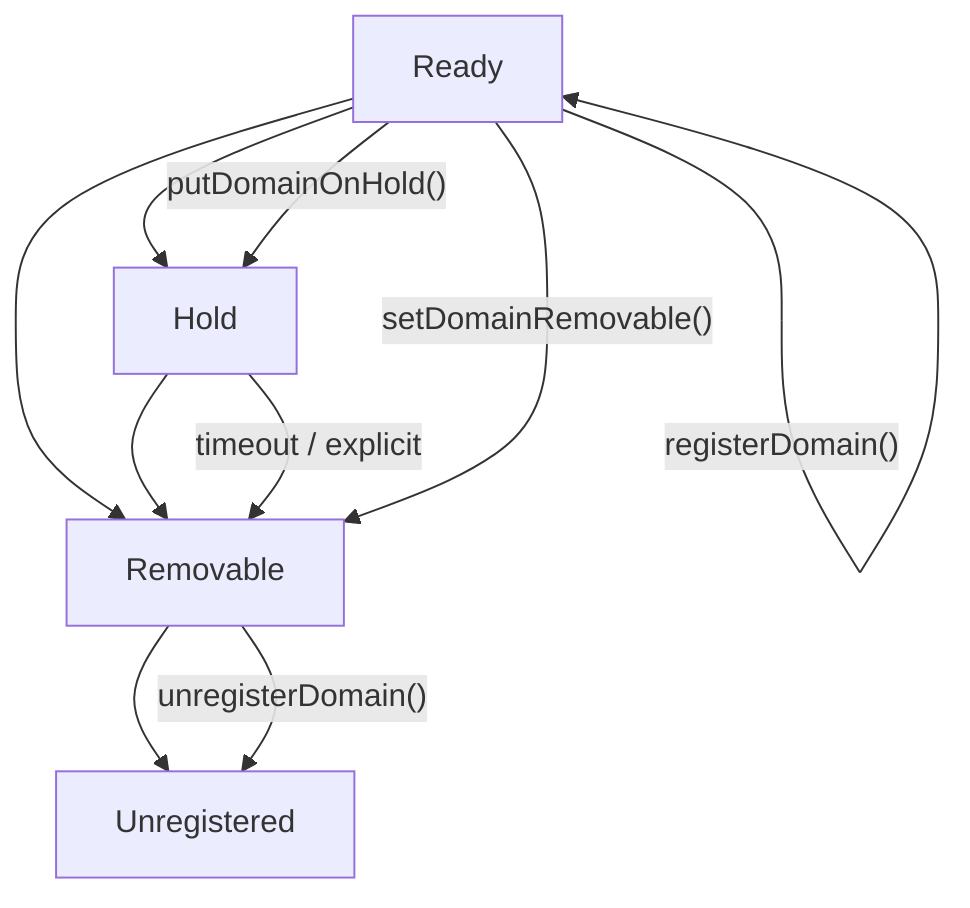

> **Prerequisites**: Xem [[03-proof-submission-flow-statement-digest|03. Proof Submission Flow & Statement Digest]]  
> 🔴 **Prerequisite references**: Binary Merkle Tree [Merkle]; Substrate storage deposits [Substrate]  
> **Lesson type**: Specification  
> **Covers**: §5.1 Overview (Domain concept, aggregation size, publish queue), §5.2 Handle Valid Proof, §5.3 Concepts, §5.4 Publish Aggregations, §5.5 Domain Management
>
> **Notation**:
> | Ký hiệu | Ý nghĩa |
> |---------|---------|
> | Domain | Ngữ cảnh aggregation độc lập; có aggregation size và queue riêng |
> | A | Aggregation size — số proof tối đa trong một aggregation |
> | Q | Publish queue size — số aggregation tối đa đang chờ publish |
> | VFY | Token gốc của zkVerify |
> | `Hold` | Số VFY bị khóa (bonded) để cover storage cost của Domain |
> | `NewAggregationReceipt` | Event phát ra khi aggregation được publish lên chain |

---

## Khái Niệm Domain

> [!note] Definition 4.1 — Domain
> **Domain** là ngữ cảnh aggregation độc lập trong Aggregation Engine. Mỗi Domain có:
> - **`id`** (u32): định danh duy nhất
> - **Aggregation size** (A): số proof tối đa trong một aggregation batch
> - **Publish queue size** (Q): số aggregation tối đa đang pending publish
> - **Destination**: chain đích (Ethereum mainnet, testnet, Base, v.v.) để publish Merkle root
> - **Proof rules**: `AllowAll` hoặc `OnlyAllowlisted` (chỉ address trong allowlist được submit)

Mỗi Domain tạo ra một Merkle tree riêng: khi đủ A proof → một aggregation batch được tạo và có thể publish.

---

## Proof Handle Flow: Từ Verify Đến Aggregation

Sau khi `submitProof` verify thành công, statement hash được pass vào Aggregation Engine:

> [!note] Specification 4.2 — Handle Valid Proof
>
> **Nếu domainId = None**: proof chỉ được verify và emit `ProofVerified`; không aggregate.
>
> **Nếu domainId = Some(id)**:
> 1. Kiểm tra domain tồn tại và ở trạng thái `Ready`.
> 2. Kiểm tra publish queue chưa đầy (current pending count < Q).
> 3. Kiểm tra submitter có đủ funds cho aggregation cost share.
> 4. **Hold** aggregation cost share từ submitter.
> 5. Thêm statement hash vào current aggregation batch của domain.
> 6. Emit `NewProof(digest, domainId, aggregationId)`.
> 7. Nếu batch đã đủ A proof → emit `AggregationComplete(domainId, aggregationId)`.

---

## Aggregation Size và Publish Queue: Trade-offs

> [!note] Specification 4.3 — Aggregation Size Trade-offs
>
> | Aggregation size nhỏ | Aggregation size lớn |
> |---------------------|---------------------|
> | Verify on Ethereum rẻ hơn (Merkle path ngắn hơn) | Verify on Ethereum đắt hơn |
> | Publication xảy ra thường xuyên hơn | Publication xảy ra ít hơn |
> | Bridging cost chia cho ít proof → mỗi proof đắt hơn | Bridging cost chia cho nhiều proof → mỗi proof rẻ hơn |

> [!note] Specification 4.4 — Publish Queue Trade-offs
>
> | Queue size lớn | Queue size nhỏ |
> |---------------|---------------|
> | Ít khả năng proof bị từ chối (CannotAggregate) | Proof dễ bị từ chối khi queue đầy |
> | Domain owner phải lock nhiều VFY hơn | Domain owner lock ít VFY hơn |

---

## Storage Cost và Hold Formula

Domain owner phải bond (lock) đủ VFY để cover storage cost:

> [!note] Formula 4.5 — Domain Storage Hold
>
> $$
> \text{Hold} = 2.64 + 0.1 \times \text{StorageBytes}
> $$
>
> Trong đó:
>
> $$
> \text{StorageBytes} = 62 + 56A + 22Q + 56AQ
> $$
>
> Ví dụ: A=10, Q=5:
> - StorageBytes = 62 + 560 + 110 + 2800 = 3532 bytes
> - Hold = 2.64 + 0.1 × 3532 = 355.84 VFY

Funds được release khi domain owner xóa domain (gọi `unregisterDomain`).

---

## Domain Lifecycle & State Machine

> [!note] Specification 4.6 — Domain State Machine
>
> Domain có các trạng thái sau:

> - **Ready**: Domain đang hoạt động, nhận proof.
> - **Hold**: Domain tạm dừng, không nhận proof mới, không thể về Ready.
> - **Removable**: Chờ xóa hoàn toàn. Nếu dùng `OnlyAllowlisted`, cần `removeProofSubmitters` trước.
> - **Unregistered**: Domain đã bị xóa, funds released.
>
> **Lưu ý**: Khi domain ở Hold hoặc Removable, không nhận proof mới và không thể về Ready.

---

## Permissionless Publication

> [!note] Specification 4.7 — Permissionless Aggregation Publication
>
> **Bất kỳ ai** có thể publish một aggregation hoàn chỉnh (hoặc đang pending) bằng cách gọi extrinsic `aggregate(domainId, aggregationId)`.
>
> **Reward khi publish thành công**:
> 1. **Aggregation reward**: compensate aggregator cho transaction cost + incentive (từ funds đã hold của submitters).
> 2. **Delivery reward**: pay `delivery_owner` cho cross-chain dispatch cost.
>
> **Sau khi publish**: Emit `NewAggregationReceipt(domainId, aggregationId, merkleRoot)`. Aggregation data **chỉ available trong block đó** — không persist.

> [!warning] Security Note 4.8 — Published Aggregation Lifetime
> Aggregation chỉ tồn tại trong block nơi nó được publish. Ai cần Merkle path phải query RPC `aggregate_statementPath` tại đúng block đó. Nếu miss block này, cần archive node để query historical state.
>
> **Bug bounty angle**: Nếu kẻ tấn công có thể làm aggregation expire mà không trigger `NewAggregationReceipt` (hoặc trigger event giả), submitter mất khả năng verify proof on-chain.

---

## Domain Management: Các Extrinsics

> [!note] Specification 4.9 — Domain Management Extrinsics
>
> | Extrinsic | Caller | Mô tả |
> |-----------|--------|-------|
> | `registerDomain(size, queueSize, destination, rules)` | Anyone | Tạo domain mới; hold funds tự động |
> | `putDomainOnHold(domainId)` | Domain owner | Dừng domain (→ Hold state) |
> | `setDomainRemovable(domainId)` | Domain owner | Đánh dấu domain để xóa (→ Removable state) |
> | `unregisterDomain(domainId)` | Domain owner | Xóa domain ở Removable state; release funds |
> | `updateDeliveryPrice(domainId, price)` | Delivery owner | Cập nhật giá delivery cross-chain |
> | `addProofSubmitters(domainId, addresses)` | Domain owner | Thêm vào allowlist (nếu `OnlyAllowlisted`) |
> | `removeProofSubmitters(domainId, addresses)` | Domain owner | Xóa khỏi allowlist |

---

## Bug Bounty Angles Trong Aggregation Engine

> [!warning] Security Note 4.10 — Potential Attack Vectors
>
> **1. Queue Manipulation / Griefing**
> Kẻ tấn công tạo domain với Q rất lớn, submit đủ proof để fill queue, làm CannotAggregate cho các submitter khác cùng domain. Tuy nhiên: domain owner phải lock funds → attack có chi phí.
>
> **2. Delivery Price Manipulation**
> `updateDeliveryPrice` có thể được gọi bởi delivery_owner để tăng giá đột ngột, gây cost overrun cho aggregation.
>
> **3. Fund Accounting Bugs**
> Nếu `hold` / `release` funds không được tính đúng (ví dụ: integer overflow, off-by-one), kẻ tấn công có thể submit proof mà không đủ funds, hoặc lấy lại funds nhiều hơn đã deposited.
>
> **4. State Transition Bugs**
> Domain transition không hợp lệ (ví dụ: Ready → Ready bypass checks) → domain accept proof sau khi đã được đánh dấu removable.
>
> **5. Aggregation Receipt Spoofing**
> Nếu có thể emit `NewAggregationReceipt` với merkleRoot giả → smart contract trên Ethereum nhận merkleRoot giả → mọi Merkle proof đều "verify" thành công. Đây là Critical bug.

---

## Summary

- Domain = ngữ cảnh aggregation độc lập; có aggregation size (A), publish queue (Q), destination chain, proof rules.
- Trade-off: A nhỏ → verify rẻ hơn nhưng bridging đắt hơn/proof; Q lớn → ít bị reject nhưng phải lock nhiều VFY.
- Hold formula: `2.64 + 0.1 × (62 + 56A + 22Q + 56AQ)` VFY; release khi unregister domain.
- Permissionless publication: bất kỳ ai có thể aggregate và nhận reward.
- Published aggregation chỉ tồn tại 1 block → phải query Merkle path ngay lập tức.
- Domain lifecycle: Ready → Hold → Removable → Unregistered.

---

## References

- zkVerify Aggregation Engine: https://docs.zkverify.io/architecture/proof-aggregation/overview
- Domain Management: https://docs.zkverify.io/architecture/proof-aggregation/domain-management
- Substrate binary-merkle-tree: https://github.com/paritytech/polkadot-sdk/tree/main/substrate/utils/binary-merkle-tree (🟡 — Substrate dùng Merkle tree không complete-balanced, ảnh hưởng đến smart contract adaptation)
