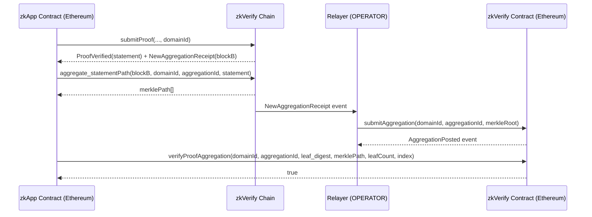

> **Prerequisites**: Xem [[03-proof-submission-flow-statement-digest|03. Proof Submission Flow & Statement Digest]], [[04-proof-aggregation-engine|04. Proof Aggregation Engine]]  
> 🔴 **Prerequisite references**: Solidity smart contract [Solidity]; ERC access control patterns [OpenZeppelin]; Polkadot parachain [Polkadot]  
> 🟡 **Integrated references**: EigenDA Merkle.sol [EigenDA] — dùng trực tiếp trong `verifyProofAggregation`; Substrate binary-merkle-tree [ParityTech] — ảnh hưởng đến Merkle tree structure  
> **Lesson type**: Specification  
> **Covers**: §6 Proof Verification Smart Contract, §8 VFlow, §9 Supported Networks
>
> **Notation**:
> | Ký hiệu | Ý nghĩa |
> |---------|---------|
> | `proofsAggregations` | Solidity mapping lưu Merkle roots: `mapping(uint256 => mapping(uint256 => bytes32))` |
> | `_domainId` | Domain ID (uint256) |
> | `_aggregationId` | Aggregation ID (uint256) |
> | `_leaf` | = `leaf_digest` từ lesson 03 (bytes32) |
> | `_merklePath` | Array bytes32 — Merkle proof path |
> | `_leafCount` | Tổng số leaves trong aggregation |
> | `_index` | Index của `_leaf` trong Merkle tree |
> | OPERATOR | Role trong AccessControl — chỉ relayer được submit aggregation |
> | VFlow | zkVerify System Parachain — EVM gateway |
> | AURA | Authority Round — PoA consensus của VFlow |

---

## Proof Verification Smart Contract

### Overview

> [!note] Specification 7.1 — Smart Contract Architecture
> zkVerify smart contract được deploy trên nhiều chain (Ethereum mainnet, Sepolia testnet, Base, Arbitrum, Optimism, Horizen, EDU Chain).
>
> Contract đóng vai trò **anchor on-chain**: nhận Merkle roots từ zkVerify relayer và cho phép bất kỳ contract nào verify rằng một proof cụ thể đã được xác minh trên zkVerify chain.

### Storage Variables

> [!note] Specification 7.2 — Storage Structure
>
> ```solidity
> // Mapping: domainId → aggregationId → proofsAggregation (Merkle root)
> mapping(uint256 => mapping(uint256 => bytes32)) public proofsAggregations;
> ```
>
> **Lưu ý**: Mapping này là `public` → ai cũng có thể đọc Merkle root cho bất kỳ `(domainId, aggregationId)` nào.

---

### Methods

> [!note] Specification 7.3 — submitAggregation (OPERATOR only)
>
> ```solidity
> function submitAggregation(
>     uint256 _domainId,
>     uint256 _aggregationId,
>     bytes32 _proofsAggregation  // Merkle root
> ) external onlyRole(OPERATOR);
> ```
>
> - Thêm entry mới vào `proofsAggregations[_domainId][_aggregationId]`.
> - Emit `AggregationPosted(domainId, aggregationId, proofsAggregation)`.
> - Chỉ OPERATOR (relayer) mới được gọi.

> [!note] Specification 7.4 — submitAggregationBatchByDomainId (OPERATOR only)
>
> ```solidity
> function submitAggregationBatchByDomainId(
>     uint256 _domainId,
>     uint256[] calldata _aggregationIds,
>     bytes32[] calldata _proofsAggregations
> ) external onlyRole(OPERATOR);
> ```
>
> - Kiểm tra `_aggregationIds.length == _proofsAggregations.length`.
> - Gọi `registerAggregation` internal nhiều lần.
> - Rẻ hơn gọi `submitAggregation` từng cái (tiết kiệm initial gas fee, tránh nonce race).
> - Dùng khi relayer down và cần catch up nhiều aggregations.

> [!note] Specification 7.5 — verifyProofAggregation (public view)
>
> ```solidity
> function verifyProofAggregation(
>     uint256 _domainId,
>     uint256 _aggregationId,
>     bytes32 _leaf,          // = leaf_digest của proof
>     bytes32[] calldata _merklePath,
>     uint256 _leafCount,
>     uint256 _index
> ) external view returns (bool);
> ```
>
> **Steps**:
> 1. Kiểm tra `proofsAggregations[_domainId][_aggregationId]` tồn tại.
> 2. Gọi `Merkle.verifyProofKeccak(proofsAggregation, _merklePath, _leafCount, _index, _leaf)`.
> 3. Return `true` nếu Merkle path hợp lệ.

---

### Merkle.sol — EigenDA vs Substrate

> [!info] 🟡 EigenDA Merkle.sol Integration
> Contract dùng thư viện `Merkle.sol` từ **EigenDA** (không phải OpenZeppelin) vì lý do sau:
>
> - OpenZeppelin Merkle assumes leaves và internal nodes được sort lexicographically — điều này không luôn đúng với zkVerify.
> - EigenDA implementation được optimize hơn.
>
> *(theo EigenDA documentation và zkVerify smart contract docs)*

> [!warning] Security Critical 7.6 — Substrate Binary Merkle Tree vs Standard
>
> Substrate sử dụng **Binary Merkle Tree không hoàn toàn cân bằng (không complete-balanced)**. EigenDA Merkle.sol assume Merkle tree luôn complete và balanced. Do đó, smart contract phải được **sửa đổi** để accommodate Substrate's Merkle tree.
>
> (theo [Substrate source code](https://github.com/paritytech/polkadot-sdk/blob/b0741d4f78ebc424c7544e1d2d5db7968132e577/substrate/utils/binary-merkle-tree/src/lib.rs#L237))
>
> **Bug bounty angle — CRITICAL**:
> - Nếu smart contract adaptation của Substrate Merkle tree **không chính xác**, kẻ tấn công có thể craft Merkle path giả mà `verifyProofAggregation` vẫn return `true`, mặc dù `_leaf` không nằm trong aggregation.
> - Điều này cho phép forge "proof đã được zkVerify verify" cho một proof **chưa bao giờ được submit**.
> - Đây là **Critical-severity bug** với reward tiềm năng $10,000.
>
> **Test approach**:
> 1. Tạo aggregation nhỏ (ví dụ 3 leaves) trên local fork.
> 2. Lấy Merkle root từ Substrate.
> 3. Craft Merkle path "giả" cho một leaf không tồn tại.
> 4. Gọi `verifyProofAggregation` với path giả đó.
> 5. Nếu return `true` → Critical bug.

---

## Luồng End-to-End: Từ Proof đến On-Chain Verification



---

## VFlow — EVM Gateway Parachain

### Khái Niệm Parachain

> [!note] Specification 7.7 — Parachain Architecture
> **VFlow** là **System Parachain** đầu tiên của zkVerify — một EVM-compatible sidechain được finalize bởi zkVerify validators (para-validators).
>
> **Parachain mechanics**:
> - **Collators**: Tập hợp node produce para-blocks; hiện tại là **Invulnerables** (fixed set, không thể slash/kick, governance-only).
> - **Block authoring**: **AURA** (Authority Round) — round-robin PoA giữa các collator được authorized.
> - **Finality**: Bởi zkVerify para-validators (không phải Ethereum).
>
> **Mục đích chính**: Bridge VFY token từ zkVerify sang EVM chains thông qua **XCM** (Cross-Chain Messaging).

### Permissioned EVM

> [!note] Specification 7.8 — VFlow EVM Permissions
>
> - Chỉ **địa chỉ được phép** mới deploy smart contract.
> - Mọi user action khác (transfers, contract calls) đều được phép.
>
> **Gas-nomics**:
> - Max 22.5M gas/block.
> - Gas price điều chỉnh theo block fullness (Polkadot fee multiplier algorithm).
>
> **Substrate-EVM Equivalence**:
> - VFlow expose EVM-style addresses (Ethereum-compatible).
> - Substrate wallet cũng dùng được (auto-mapped sang EVM address).
> - EVM calls qua Substrate extrinsic bị **disable** (tránh double-counting/monitoring issues).

### Governance và Tokenomics

> [!note] Specification 7.9 — VFlow Governance & Tokenomics
>
> - **Governance**: Technical committee qua **sudo pallet** (tập trung hóa hiện tại).
> - **Token**: VFY (share với zkVerify mainchain).
> - **Supply**: Không có initial allocation hoặc fixed supply — chỉ tokens bridged từ zkVerify qua XCM.
> - **Collator rewards**: Không có inflation; reward từ tx fees theo cơ chế "half-pot" (mỗi block author nhận 1/2 pot, còn lại cho future authors).

---

## Supported Networks — Deployment

Hiện tại zkVerify contracts được deploy trên:

| Network | Loại |
|---------|------|
| Ethereum Mainnet | Mainnet |
| Base Mainnet | Mainnet |
| Horizen Mainnet | Mainnet |
| Sepolia Testnet | Testnet |
| Base Sepolia Testnet | Testnet |
| Arbitrum Sepolia Testnet | Testnet |
| Optimism Sepolia Testnet | Testnet |
| EDU Chain Testnet | Testnet |

---

## Bug Bounty Angles Trong Smart Contract & VFlow

> [!warning] Security Note 7.10 — Smart Contract Vulnerabilities
>
> **1. Merkle tree mismatch (xem Spec 7.6)**: Critical — adapter cho Substrate Binary Merkle không correct → forge proof.
>
> **2. Access Control bypass**: `submitAggregation` dùng `onlyRole(OPERATOR)`. Nếu có cách grant OPERATOR role không authorized → kẻ tấn công có thể submit Merkle root giả.
> Kiểm tra: Ai có thể grant OPERATOR role? `DEFAULT_ADMIN_ROLE` holder? Có multisig không?
>
> **3. aggregationId collision**: Nếu hai aggregation có cùng `(domainId, aggregationId)`, mapping bị overwrite. Design có prevent duplicate không? (thứ tự `submitAggregation` calls?)
>
> **4. Mapping zero-value issue**: `proofsAggregations[x][y]` trả về `bytes32(0)` cho key không tồn tại. Nếu một aggregation hợp lệ có Merkle root = `bytes32(0)` → `verifyProofAggregation` không phân biệt được. (Khả năng thấp nhưng cần kiểm tra.)
>
> **5. VFlow sudo pallet**: Governance tập trung qua sudo. Không phải bug trực tiếp nhưng là centralization risk — nằm trong Out-of-Scope.

> [!warning] Security Note 7.11 — zkVerifyJS SDK (Web/App Scope)
>
> zkVerifyJS là TypeScript library trong scope của bug bounty (Web & App tier).
>
> **Bug angles**:
> - **Proof format serialization**: Nếu `formatVk()` hoặc `format()` serialize sai format (endianness, padding) → proof valid locally nhưng fail trên chain.
> - **optimisticVerify race condition**: `optimisticVerify` submit proof và assume success. Nếu có race condition giữa transaction submission và inclusion → double-spend hoặc missed verification.
> - **Session management**: Seed phrase handling trong `withAccount()` — memory safety, logging?
> - **RPC endpoint injection**: `Custom({ websocket, rpc })` — nếu không validate URL → potential SSRF trong server-side usage.

---

## Summary

- Smart contract lưu Merkle roots theo `mapping(domainId → aggregationId → bytes32)`.
- 3 methods chính: `submitAggregation` (OPERATOR only), `submitAggregationBatchByDomainId` (OPERATOR only), `verifyProofAggregation` (public view).
- Dùng EigenDA Merkle.sol (không phải OpenZeppelin) vì lexicographic sort assumption; adaptation cho Substrate non-complete Merkle tree là điểm quan trọng nhất.
- **Critical bug angle**: Nếu Substrate Merkle adaptation sai → forge proof → $10,000 reward.
- VFlow = EVM parachain, Invulnerable collators, AURA consensus, permissioned contract deploy, VFY token qua XCM.
- zkVerifyJS SDK trong Web/App scope: serialization bugs, RPC injection, session management.

---

## References

- Proof Verification Smart Contract: https://docs.zkverify.io/architecture/proof-verification-smart-contract
- VFlow: https://docs.zkverify.io/architecture/VFlow/what-is-vflow
- Supported Networks: https://docs.zkverify.io/architecture/contract-addresses
- zkVerify attestation contracts: https://github.com/zkVerify/zkv-attestation-contracts
- EigenDA Merkle.sol: https://github.com/Layr-Labs/eigenda (🟡 Integrate — dùng trực tiếp)
- Substrate binary-merkle-tree: https://github.com/paritytech/polkadot-sdk (🟡 Integrate — Substrate Merkle tree không complete-balanced)
