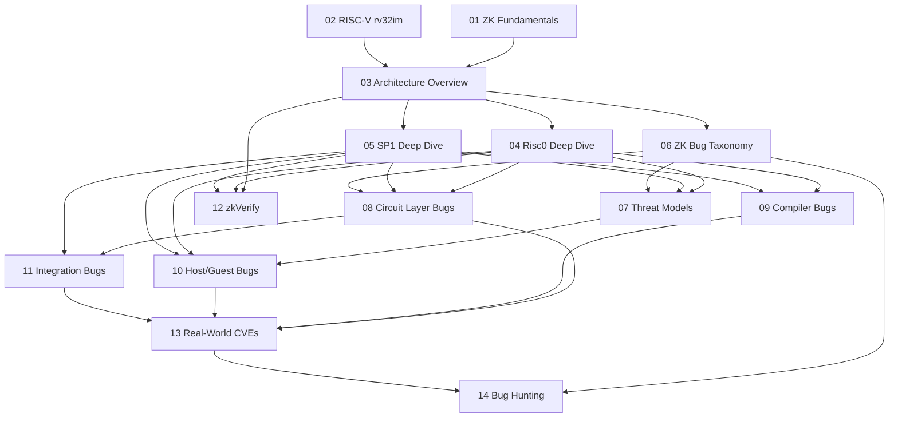

> **Topic**: zkVM Security — Risc0 & SP1  
> **Domain**: ZK / Cryptography Security (Applied Bug Hunting)  
> **Level**: Intermediate → Advanced  
> **Background**: SNARK/STARK concept cơ bản, Rust, Cryptography cơ bản, CTF/security mindset  
> **Tools / Code**: Rust, cargo-risczero, sp1up, Picus, ARGUZZ  
> **Context**: Bug bounty hunting trên zkVerify (Horizen Labs)  
> **Sources**: USENIX'24 ZK corpus, Veridise audit reports, Sigma Prime SP1 guide, Risc0/SP1 docs, GitHub advisories  

---

## Lessons

| # | Title | Nội dung chính | Prerequisites | Độ khó |
|---|-------|---------------|---------------|--------|
| 01 | ZK Proof Fundamentals for zkVM | STARK/SNARK review, soundness/completeness, execution trace, AIR | — | ★★☆☆☆ |
| 02 | RISC-V rv32im cho zkVM | Registers, memory model, instruction encoding, ecall | — | ★★☆☆☆ |
| 03 | zkVM Architecture Overview | Pipeline, prover/verifier model, trust model, so sánh hệ thống | 01, 02 | ★★★☆☆ |
| 04 | Risc0 Deep Dive | Executor, Zirgen DSL, circuit rv32im, STARK→SNARK, receipt | 03 | ★★★★☆ |
| 05 | SP1 Deep Dive | Plonky3, AIR chips, LogUp, syscalls, precompiles, host/guest | 03 | ★★★★☆ |
| 06 | ZK Bug Taxonomy | Underconstrained, overconstrained, computational, integration | 03 | ★★★☆☆ |
| 07 | Threat Models in zkVM | Adversarial prover/user, attack surfaces theo từng layer | 04, 05, 06 | ★★★☆☆ |
| 08 | Circuit Layer Bugs | CVEs thực tế, underconstrained deep-dive, Poseidon, ExpandU32 | 04, 05, 06 | ★★★★☆ |
| 09 | Compiler & Preprocessing Bugs | Compiler correctness, determinism, precompile circuit bugs | 04, 05 | ★★★★☆ |
| 10 | Host/Guest Interface Bugs | Trust boundary, DEV_MODE, syscall bugs, integer overflow | 04, 05, 07 | ★★★☆☆ |
| 11 | Integration & Verifier Bugs | Frozen Heart, STARK→SNARK, recursive proofs, on-chain verifier | 04, 05, 08 | ★★★★★ |
| 12 | zkVerify Architecture & Attack Surface | zkVerify pallets, proof submission, attestation, bug surface | 03, 04, 05 | ★★★★☆ |
| 13 | Real-World CVEs Deep Dive | CVE-2025-52484, GHSA-5xgj, Veridise findings, SP1 Jan 2025 | 08, 09, 10, 11 | ★★★★★ |
| 14 | Bug Hunting Methodology & Tools | Checklist, Picus, ARGUZZ, manual review, report writing | 06-13 | ★★★★☆ |

## Appendix Candidates

| ID | Nội dung | Liên quan | Ghi chú |
|----|---------|-----------|---------|
| A0 | RISC-V rv32im Instruction Reference | 02, 08, 09 | Bảng tra cứu nhanh |
| A1 | ZK Vulnerability Taxonomy Reference | 06, 08-11 | Phân loại đầy đủ + ví dụ thực |
| A2 | Bug Hunting Checklist (Risc0 + SP1) | 14 | Checklist thực chiến |

---

## Dependency Graph

---

## Progress Tracker

- [ ] [[00-roadmap|00. Roadmap]]
- [ ] [[01-zk-proof-fundamentals|01. ZK Proof Fundamentals for zkVM]]
- [ ] [[02-riscv-for-zkvm|02. RISC-V rv32im cho zkVM]]
- [ ] [[03-zkvm-architecture-overview|03. zkVM Architecture Overview]]
- [ ] [[04-risc0-deep-dive|04. Risc0 Deep Dive]]
- [ ] [[05-sp1-deep-dive|05. SP1 Deep Dive]]
- [ ] [[06-zk-bug-taxonomy|06. ZK Bug Taxonomy]]
- [ ] [[07-threat-models-zkvm|07. Threat Models in zkVM]]
- [x] [[08-circuit-bugs|08. Circuit Bugs]] ✅
- [x] [[09-compiler-frontend-bugs|09. Compiler & Frontend Bugs]] ✅
- [x] [[10-host-guest-bugs|10. Host/Guest Bugs]] ✅
- [x] [[11-integration-bugs|11. Integration Bugs]] ✅
- [ ] [[12-zkverify-architecture|12. zkVerify Architecture & Attack Surface]]
- [ ] [[13-real-world-cves|13. Real-World CVEs Deep Dive]]
- [ ] [[14-bug-hunting-methodology|14. Bug Hunting Methodology & Tools]]
- [ ] [[a0-riscv-instruction-reference|A0. RISC-V rv32im Instruction Reference]]
- [ ] [[a0-riscv-instruction-reference|A0. RISC-V rv32im Reference]] *(chưa viết)*
- [x] [[A1-bug-taxonomy-reference|A1. ZK Bug Taxonomy Reference Card]] ✅
- [x] [[A2-audit-checklist|A2. Security Audit Checklist]] ✅
