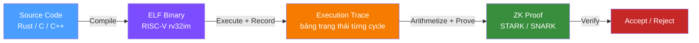
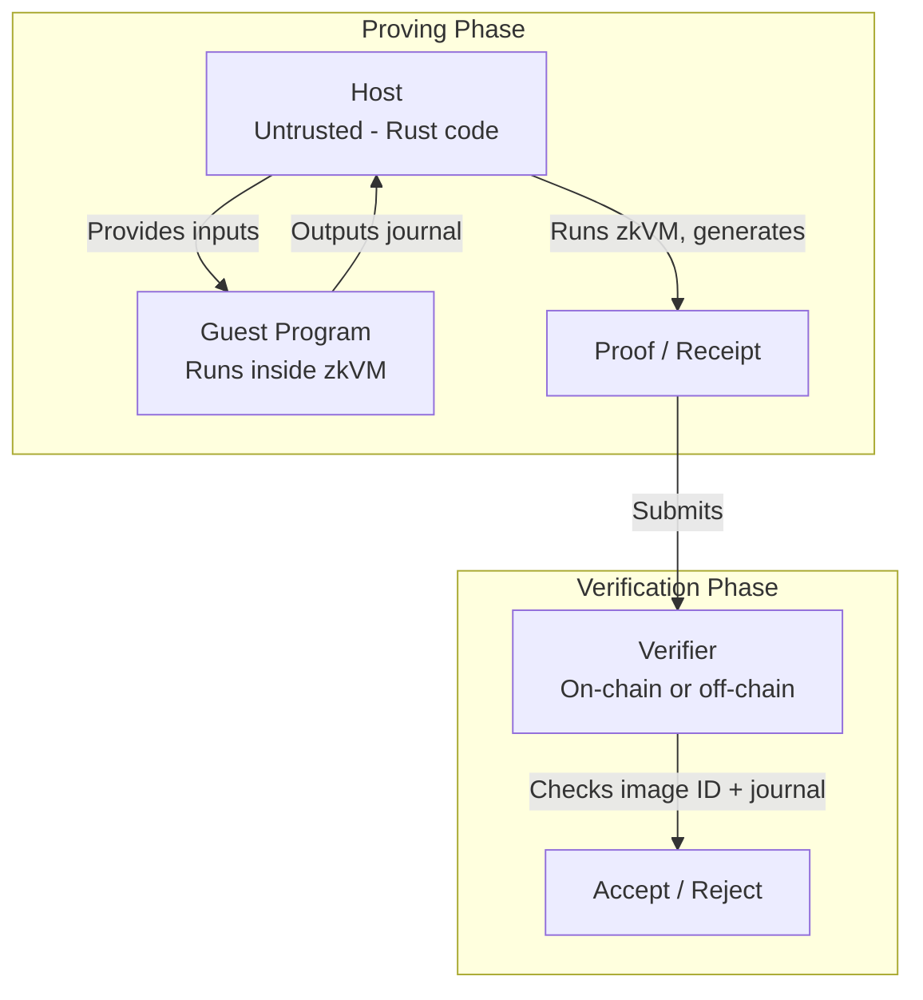
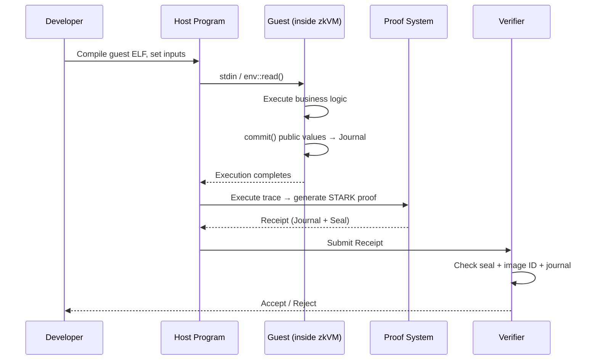
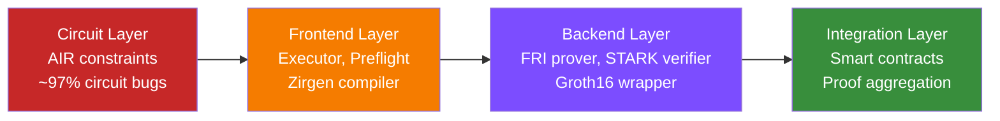

> **Prerequisites**: [[01-zk-proof-fundamentals|01. ZK Proof Fundamentals]], [[02-riscv-for-zkvm|02. RISC-V rv32im]] (hoặc đã biết STARK/SNARK cơ bản và RISC-V basics)  
> **Objectives**:  
> - Nắm được pipeline đầy đủ của một zkVM: từ source code đến verified proof
> - Phân biệt vai trò của prover, verifier, host, guest trong trust model
> - Hiểu tại sao zkVM cần từng thành phần và mỗi thành phần mang theo attack surface gì
> - So sánh kiến trúc tổng thể của Risc0 và SP1 ở mức cao

---

## Motivation

Trước khi zkVM tồn tại, muốn chứng minh một phép tính được thực hiện đúng bằng ZK, developer phải viết tay một **circuit** (mạch ràng buộc) mô tả chính xác từng bước toán học của phép tính đó. Đây là công việc cực kỳ khó, tốn thời gian, và dễ sai — tương tự như phải lập trình bằng assembly thay vì ngôn ngữ bậc cao.

zkVM (Zero-Knowledge Virtual Machine) giải quyết bài toán này bằng cách xây dựng **một circuit duy nhất** mô tả hoạt động của một bộ vi xử lý (thường là RISC-V). Khi circuit này đúng, mọi chương trình chạy trên bộ vi xử lý đó đều được chứng minh tự động — developer chỉ cần viết Rust/C bình thường.

> [!definition] Definition 3.1 — Zero-Knowledge Virtual Machine (zkVM)
> Một **zkVM** là hệ thống cho phép:
> 1. Thực thi một chương trình tùy ý trên một kiến trúc ISA xác định
> 2. Sinh ra một bằng chứng mật mã **(proof / receipt)** chứng minh chương trình đó đã thực thi đúng với input/output cụ thể
> 3. Bất kỳ bên thứ ba nào cũng có thể **xác minh (verify)** bằng chứng đó mà không cần chạy lại toàn bộ chương trình

Hiện tại, các zkVM phổ biến nhất đều target **RISC-V rv32im** (Risc0, SP1, Jolt) vì RISC-V là ISA mở, có compiler toolchain (LLVM/Clang, `rustc`) trưởng thành và đơn giản đủ để arithmetize.

---

## Pipeline tổng thể của một zkVM

Một zkVM hoạt động theo 4 giai đoạn chính:

### Giai đoạn 1: Compilation (Biên dịch)

Source code được biên dịch thành **ELF binary** nhắm mục tiêu RISC-V rv32im. Bước này dùng toolchain tiêu chuẩn (`rustc` với `riscv32im-risc0-zkvm-elf` target). Từ ELF binary, một **image ID** (Risc0) hoặc **verification key — vkey** (SP1) được tính toán — đây là định danh mật mã của chương trình, cần thiết cho bước verify.

> [!definition] Definition 3.2 — Image ID (Risc0) và Verification Key (SP1)
> - **Image ID** (Risc0): Hash Merkle của trạng thái bộ nhớ ban đầu khi ELF được nạp vào zkVM. Ràng buộc mật mã giữa source code và proof.
> - **Verification Key (vkey)** (SP1): Commitment mật mã của chương trình, được derive từ ELF. Verifier dùng vkey để kiểm tra proof.
>
> Nếu ELF binary thay đổi (dù chỉ 1 bit), image ID / vkey sẽ thay đổi → proof cũ sẽ không verify được.

### Giai đoạn 2: Execution (Thực thi)

**Executor** chạy ELF binary và ghi lại **execution trace** — một bảng khổng lồ ghi trạng thái của toàn bộ máy tính (registers, memory, program counter) tại mỗi clock cycle.

> [!definition] Definition 3.3 — Execution Trace
> Execution trace là một ma trận $T$ có dạng:
> $$T = \begin{bmatrix} \text{cycle}_0 \\ \text{cycle}_1 \\ \vdots \\ \text{cycle}_N \end{bmatrix}$$
> Mỗi hàng $\text{cycle}_i$ ghi lại: giá trị tất cả registers ($x_0$…$x_{31}$), PC, memory access, opcode, operands, kết quả.
>
> Trace phải **deterministic**: cùng một input → cùng một trace.

Một trace hợp lệ phải thỏa mãn hai điều kiện:
1. **State transition correctness**: Mỗi bước chuyển trạng thái tuân theo đúng semantic của RISC-V instruction tương ứng
2. **Memory consistency**: Các phép đọc/ghi memory phải nhất quán với nhau

### Giai đoạn 3: Proving (Chứng minh)

Prover nhận execution trace và sinh ra một ZK proof chứng minh trace đó hợp lệ. Quá trình này gồm:

1. **Arithmetization**: Chuyển bảng trace thành polynomial constraints (AIR — Algebraic Intermediate Representation)
2. **Commitment**: Commit vào các cột của trace bằng Merkle tree (FRI commitment)
3. **Proof generation**: Sinh STARK proof bằng FRI protocol
4. **Proof compression** (tuỳ chọn): Wrap STARK trong SNARK (Groth16/Plonk) để giảm kích thước

### Giai đoạn 4: Verification (Xác minh)

Verifier nhận proof + public outputs + image ID/vkey, sau đó kiểm tra:
- Proof hợp lệ về mặt toán học
- Image ID/vkey khớp với chương trình mong đợi
- Public outputs (journal) nhất quán với proof

Verification **không** cần chạy lại chương trình, và có thể thực hiện on-chain (smart contract).

---

## Prover, Verifier, Host, Guest — Trust Model

Đây là một trong những điểm quan trọng nhất về mặt bảo mật. zkVM phân biệt rõ 4 vai trò:

> [!definition] Definition 3.4 — Host vs Guest
> - **Guest**: Chương trình Rust/C chạy **bên trong** zkVM. Mọi instruction của guest đều được constraint bởi circuit. **Execution của guest được guarantee bởi proof.**
> - **Host**: Chương trình Rust chạy **bên ngoài** zkVM, điều phối toàn bộ quá trình proving. Host cung cấp input cho guest, nhưng **không thể thay đổi execution của guest mà không làm proof bị sai**.

> [!definition] Definition 3.5 — Prover vs Verifier
> - **Prover**: Thực thể chạy guest program và sinh proof. Được coi là **potentially malicious** — mô hình bảo mật phải đảm bảo prover không thể tạo proof cho computation sai.
> - **Verifier**: Thực thể nhận proof và kiểm tra. Chỉ tin vào **cryptographic assumptions**, không tin vào prover.

> [!warning] Security Insight 3.6 — Ranh giới tin cậy (Trust Boundary)
> Ranh giới tin cậy **quan trọng nhất** trong zkVM là giữa host và guest:
> - Code trong **guest**: Đúng nếu proof hợp lệ (guaranteed bởi circuit)
> - Code trong **host**: **Không được guarantee** bởi proof — host có thể làm bất cứ điều gì
>
> Một lỗi phổ biến: đặt logic security-critical vào host thay vì guest. Kết quả là prover có thể bypass mà proof vẫn verify.

---

## Luồng dữ liệu chi tiết: Input → Output

Điểm cần chú ý trong luồng này:
- **Private inputs** (stdin): Chỉ host và guest biết, không xuất hiện trong proof
- **Public outputs** (journal/commit): Xuất hiện trong receipt, verifier có thể đọc
- **Image ID/vkey**: Được verifier kiểm tra độc lập, đảm bảo đúng program được chạy

---

## Kiến trúc 4 Layer của zkVM

Theo phân tích của Risc0 và nghiên cứu USENIX'24, một zkVM gồm 4 layers, **mỗi layer là một attack surface riêng**:

> [!definition] Definition 3.7 — zkVM Security Layers
>
> **Layer 1 — Circuit Layer**: Mô tả toán học của computation cần prove. Đây là nơi **~97% circuit-layer bugs** xảy ra dưới dạng underconstrained (USENIX'24 corpus).
>
> **Layer 2 — Frontend Layer**: Dịch circuit description sang artifacts dùng bởi prover/verifier. Gồm executor, preflight, compiler output (ví dụ: Zirgen compiler trong Risc0).
>
> **Layer 3 — Backend Layer**: Core proof system — prover và verifier logic. Gồm FRI prover, STARK verifier, Groth16 wrapper.
>
> **Layer 4 — Integration Layer**: Mọi thứ còn lại — proof delegation, proof aggregation, verifier smart contracts, API surface.

---

## So sánh Risc0 và SP1

| Tiêu chí | Risc0 | SP1 |
|---------|-------|-----|
| **ISA** | RISC-V rv32im | RISC-V rv32im |
| **Circuit DSL** | Zirgen (custom DSL) | AIR tables (Plonky3) |
| **Proof backend** | FRI-based STARK | Plonky3 STARK |
| **SNARK wrap** | Groth16 (trusted setup) | Groth16 / Plonk (compressed) |
| **Cross-table lookup** | Logup / permutation | LogUp (Ulrich Habock) |
| **Precompiles** | SHA-256, Keccak, secp256k1... | SHA-256, Keccak, secp256k1, ed25519... |
| **Language** | Rust, C, C++ | Rust (+ bất kỳ LLVM target) |
| **License** | Apache 2.0 | MIT / Apache 2.0 |
| **Audit status** | Veridise 96 person-weeks (2024–2025) | Veridise, Cantina, Zellic, KALOS |
| **Bug bounty** | HackenProof | Immunefi |
| **DEV_MODE pitfall** | Có — RISC0_DEV_MODE bypass proof | Không có tương đương |

> [!warning] Security Insight 3.8 — `RISC0_DEV_MODE`
> Risc0 có biến môi trường `RISC0_DEV_MODE=1` cho phép chạy mà không cần generate proof thực sự (dùng fake receipt). Nếu production code vô tình để flag này, **verifier sẽ accept mọi proof kể cả invalid**.
>
> SP1 không có cơ chế tương tự, nhưng có thể bị ảnh hưởng bởi cách configure ProverClient (network vs local mock).

---

## Cách một bug trong mỗi layer ảnh hưởng đến security

> [!danger] Danger 3.9 — Circuit Bug (Layer 1) → Soundness Break
> Nếu circuit thiếu constraint (underconstrained), prover có thể sinh proof cho execution **sai** mà verifier vẫn accept. Đây là class bug nghiêm trọng nhất.
>
> **Ví dụ thực tế (Risc0 CVE-2025-52484)**: Thiếu constraint phân biệt register rs1 và rs2 trong instruction 3-register. Prover có thể thay thế giá trị rs2 bằng rs1 mà proof vẫn hợp lệ.

> [!warning] Warning 3.10 — Frontend Bug (Layer 2) → Completeness hoặc Soundness
> Nếu executor chạy code sai (khác semantic RISC-V thực), trace được generate sẽ không phản ánh đúng computation. Có thể gây:
> - Completeness failure: Honest prover không thể prove valid execution
> - Soundness failure: Honest prover vô tình prove invalid execution vì executor tính sai

> [!warning] Warning 3.11 — Backend Bug (Layer 3) → Proof System Break
> Lỗi trong FRI prover, STARK verifier, hoặc Fiat-Shamir transformation có thể cho phép prover forge proof hoàn toàn không liên quan đến bất kỳ execution nào.
>
> **Ví dụ**: Frozen Heart vulnerability — thiếu một message trong Fiat-Shamir hash dẫn đến prover có thể forge proof.

> [!note] Note 3.12 — Integration Bug (Layer 4) → Application-level Attack
> Lỗi trong smart contract verifier, proof aggregation, hay on-chain logic có thể cho phép attacker bypass verification hoàn toàn dù proof system hoàn hảo.

---

## Điều gì được và không được đảm bảo bởi zkVM proof

Đây là điểm cực kỳ quan trọng khi đánh giá bảo mật của một application dùng zkVM:

> [!definition] Definition 3.13 — Đảm bảo của zkVM proof
>
> **Được đảm bảo** (khi proof hợp lệ):
> - Guest program **đúng này** (xác định bởi image ID/vkey) đã thực thi
> - Execution tuân theo đúng semantic của RISC-V (nếu circuit không có bug)
> - Public outputs (journal) được sinh ra bởi execution đó
>
> **Không được đảm bảo**:
> - Logic của guest program là **đúng về mặt business** (programmer vẫn có thể viết code sai)
> - Inputs có **hợp lệ** hay không (validation phải nằm trong guest)
> - Host không **thao túng** environment (host vẫn là untrusted)
> - Proof system không có **bug** (phụ thuộc vào correctness của zkVM implementation)

---

## Summary

- zkVM cho phép prove arbitrary computation mà không cần viết circuit tay, bằng cách xây dựng một circuit duy nhất mô tả RISC-V processor.
- Pipeline gồm 4 giai đoạn: **Compilation → Execution (Trace) → Proving → Verification**.
- Trust model: **Guest được guarantee bởi proof; Host là untrusted**. Logic security-critical phải nằm trong guest.
- 4 security layers: Circuit (97% lỗi), Frontend, Backend, Integration — mỗi layer có attack surface riêng.
- Risc0 và SP1 cùng target rv32im nhưng khác nhau về circuit DSL, proof backend, và một số security implications.
- zkVM proof chỉ đảm bảo **computational integrity** — không đảm bảo business logic correctness hay input validity.

---

## References

- RISC Zero — Overview of the zkVM: https://www.risczero.com/docs/explainers/zkvm/
- RISC Zero — Key Terminology: https://dev.risczero.com/terminology
- RISC Zero — Path to First Formally Verified RISC-V zkVM: https://risczero.com/blog/RISCZero-formally-verified-zkvm
- Sigma Prime — SP1 and zkVMs: A Security Auditor's Guide: https://blog.sigmaprime.io/sp1-zkvm-security-guide.html
- zksecurity.xyz — zkVM Security: What Could Go Wrong?: https://blog.zksecurity.xyz/posts/zkvm-security/
- Chaliasos et al. — USENIX Security'24 ZK Vulnerability Corpus: https://arxiv.org/pdf/2402.15293
