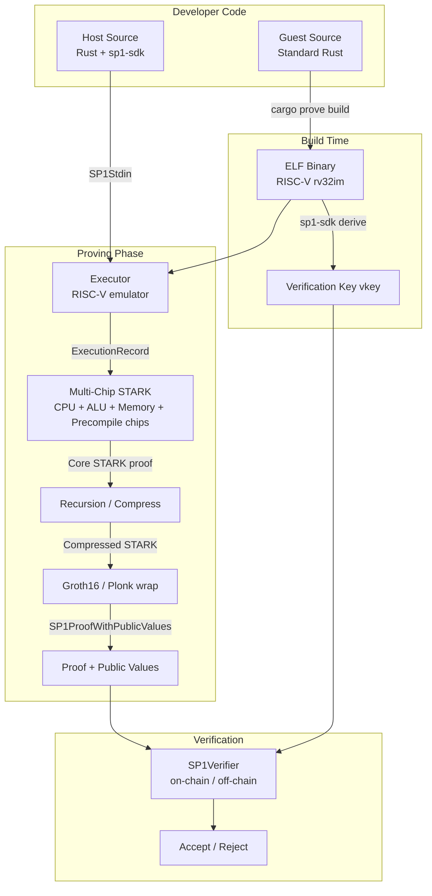
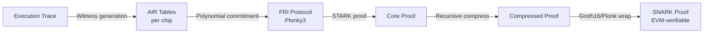
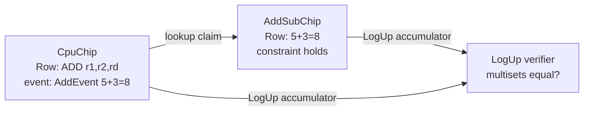
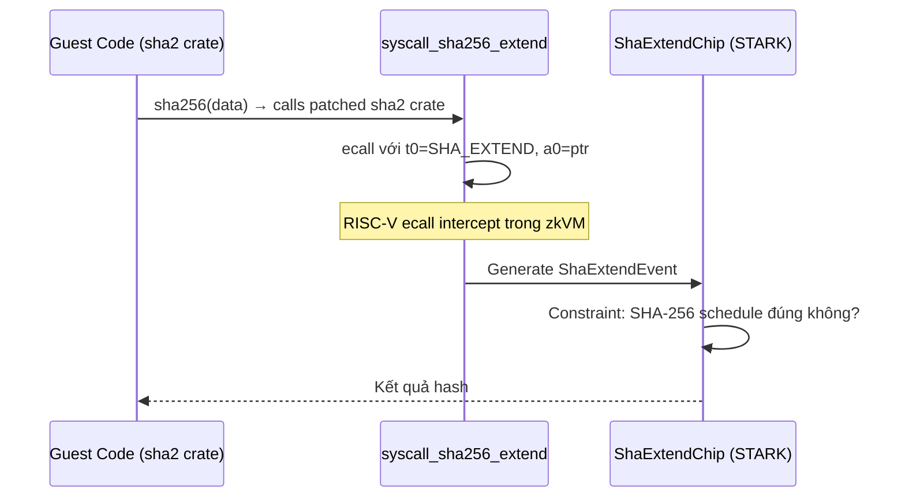

> **Prerequisites**: [[03-zkvm-architecture-overview|03. zkVM Architecture Overview]]  
> **Objectives**:  
> - Hiểu kiến trúc SP1: Plonky3 backend, chip/AIR table, cross-table lookup
> - Nắm hệ thống syscall và precompile — cách hoạt động và tại sao là attack surface
> - Phân biệt host/guest boundary trong SP1 và các implication bảo mật
> - Biết "patched crates" là gì và tại sao việc dùng sai có thể gây bug
> - Hiểu các lỗi đặc thù của SP1 được vá trong tháng 1/2025

---

## Motivation

SP1 (Succinct Processor 1) do Succinct Labs phát triển, ra mắt năm 2024, nhanh chóng trở thành zkVM được dùng nhiều nhất trong hệ sinh thái rollup (Polygon, Celestia, Mantle, ...). SP1 có kiến trúc khác với Risc0 ở một số điểm quan trọng về mặt bảo mật:

- Dùng **Plonky3** (thay vì custom STARK) → nhiều component tái sử dụng từ cộng đồng
- Kiến trúc **multi-chip** với cross-table lookups → mỗi chip là attack surface riêng
- Hệ thống **patched crates** — thay thế standard library calls bằng precompile syscalls
- **Không có DEV_MODE** như Risc0, nhưng có pitfalls riêng với ProverClient

---

## Tổng quan kiến trúc SP1



---

## Host và Guest trong SP1

SP1 project có cấu trúc tương tự Risc0 nhưng dùng workspace khác:

```text
my-sp1-project/
├── program/            ← Guest code (chạy BÊN TRONG zkVM)
│   ├── src/main.rs
│   └── Cargo.toml      ← target = riscv32im-succinct-zkvm-elf
├── script/             ← Host code (chạy bên ngoài)
│   ├── src/main.rs
│   └── Cargo.toml
└── Cargo.toml
```

**Guest** — nhận/gửi dữ liệu qua `sp1_zkvm::io`:

```rust
// program/src/main.rs
#![no_main]
sp1_zkvm::entrypoint!(main);

use sp1_zkvm::io;

pub fn main() {
    // Đọc private input (không xuất hiện trong proof)
    let n: u32 = io::read::<u32>();

    // Tính toán
    let result = fibonacci(n);

    // Commit public output (xuất hiện trong proof)
    io::commit(&result);
}
```

**Host** — tạo proof và verify:

```rust
// script/src/main.rs
use sp1_sdk::{ProverClient, SP1Stdin, include_elf};

pub const FIBONACCI_ELF: &[u8] = include_elf!("fibonacci-program");

fn main() {
    let client = ProverClient::from_env();

    let mut stdin = SP1Stdin::new();
    stdin.write(&20u32);  // private input

    // Setup: derive verification key từ ELF
    let (pk, vk) = client.setup(FIBONACCI_ELF);

    // Prove
    let proof = client.prove(&pk, &stdin).compressed().run().unwrap();

    // Verify
    client.verify(&proof, &vk).expect("Verification failed");

    // Đọc public output
    let result: u64 = proof.public_values.read::<u64>();
    println!("Fibonacci(20) = {}", result);
}
```

> [!warning] Warning 5.1 — vkey phải được kiểm tra
> Tương tự Image ID của Risc0, **verification key (vkey)** của SP1 phải được verifier kiểm tra. Nếu on-chain verifier không hardcode vkey, attacker có thể submit proof từ chương trình khác.
>
> ```rust
> // BUG: verify không truyền vkey cụ thể
> sp1_verifier.verifyProof(proof, publicValues);
>
> // CORRECT: verify với vkey đã biết trước
> sp1_verifier.verifyProof(EXPECTED_VKEY_HASH, proof, publicValues);
> ```

---

## Plonky3 — Proof Backend

SP1 sử dụng **Plonky3** làm proving backend — một framework STARK mã nguồn mở do Polygon Zero phát triển.

> [!definition] Definition 5.2 — Plonky3
> **Plonky3** là một bộ primitive mật mã để xây dựng STARK proof systems, gồm:
> - Các field implementations (Goldilocks, BabyBear, Mersenne31)
> - FRI polynomial commitment scheme
> - AIR constraint framework
> - Challenger (Fiat-Shamir transcript)
>
> SP1 xây dựng các "chips" (AIR tables) của mình trên Plonky3, tái sử dụng FRI prover và verifier.

Kiến trúc chứng minh của Plonky3 trong SP1:



---

## Multi-Chip Architecture — AIR Tables

Đây là điểm khác biệt lớn nhất giữa SP1 và Risc0. Thay vì một circuit monolithic, SP1 chia thành nhiều **chips** (AIR tables) độc lập, kết nối với nhau qua cross-table lookups.

> [!definition] Definition 5.3 — Chip (AIR Table) trong SP1
> Mỗi **chip** trong SP1 là một AIR table riêng biệt — một ma trận với:
> - **Rows**: Các sự kiện (events) được ghi lại trong execution
> - **Columns**: Các giá trị cần prove
> - **Constraints**: Polynomial relations phải thỏa mãn giữa các rows và columns

SP1 implements khoảng 39 RISC-V instructions, phân chia thành các chips:

| Chip | Chức năng | Ví dụ instructions |
|------|-----------|-------------------|
| `CpuChip` | CPU core — dispatch instruction events | Tất cả instructions |
| `AddSubChip` | Phép cộng và trừ | ADD, SUB, ADDI |
| `MulChip` | Phép nhân | MUL, MULH, MULHU |
| `DivRemChip` | Phép chia và lấy dư | DIV, DIVU, REM, REMU |
| `ShiftLeftChip` | Dịch bit trái | SLL, SLLI |
| `ShiftRightChip` | Dịch bit phải | SRL, SRA, SRLI, SRAI |
| `LtChip` | So sánh nhỏ hơn | SLT, SLTU, SLTI |
| `MemoryChip` | Load/store bộ nhớ | LW, LH, LB, SW, SH, SB |
| `BranchChip` | Conditional branches | BEQ, BNE, BLT, BGE |
| `JumpChip` | Unconditional jumps | JAL, JALR |
| `AuipcChip` | PC-relative addressing | AUIPC, LUI |
| `SyscallChip` | Ecall dispatch | ECALL |
| `ProgramChip` | Track instruction occurrences | — |
| Precompile chips | Accelerated crypto ops | SHA-256, Keccak, ... |

---

## Cross-Table Lookup — LogUp Protocol

Để đảm bảo tính nhất quán giữa các chips, SP1 dùng **cross-table lookups** dựa trên thuật toán **LogUp** (Ulrich Habock).

> [!definition] Definition 5.4 — Cross-Table Lookup
> **Cross-table lookup** là cơ chế cho phép một chip "tham chiếu" dữ liệu từ chip khác và prove rằng giá trị được tham chiếu thực sự tồn tại trong chip kia.
>
> Ví dụ: `CpuChip` ghi lại rằng "instruction ADD đã dùng registers r1=5, r2=3, rd=8". `AddSubChip` prove rằng "5 + 3 = 8". Cross-table lookup đảm bảo **cùng một sự kiện** được ghi nhận nhất quán ở cả hai chips.



> [!warning] Warning 5.5 — Cross-Table Lookup là Attack Surface
> Nếu lookup constraint bị thiếu hoặc sai (underconstrained), prover có thể:
> - Claim một computation trong CPU chip nhưng **không có row tương ứng** trong chip kia
> - Hoặc có row trong chip phụ nhưng với **giá trị khác**
>
> Đây là class bug quan trọng khi audit SP1.

---

## Syscalls và Precompiles

Precompile trong SP1 được expose qua cơ chế **syscall** — tương tự ecall trong RISC-V.

> [!definition] Definition 5.5 — SP1 Precompile Architecture
> Mỗi precompile trong SP1 là:
> 1. Một **syscall number** duy nhất (ví dụ: `SHA_EXTEND = 0x00_01_01_72`)
> 2. Một **RISC-V ecall** trong guest code với syscall number trong register `t0`
> 3. Một **custom STARK chip** (AIR table riêng) trong proof system
> 4. Một **patched crate** — Rust crate override để gọi precompile thay vì standard implementation

Ví dụ flow của SHA-256 precompile:



**Danh sách precompiles quan trọng trong SP1:**

| Precompile | Syscall number | Chức năng |
|-----------|----------------|-----------|
| `SHA256_EXTEND` | `0x00_01_01_72` | SHA-256 message schedule |
| `SHA256_COMPRESS` | `0x00_01_01_71` | SHA-256 compression function |
| `KECCAK_PERMUTE` | `0x00_00_01_09` | Keccak-f permutation |
| `SECP256K1_ADD` | `0x00_01_01_0a` | secp256k1 point addition |
| `SECP256K1_DOUBLE` | `0x00_01_01_0b` | secp256k1 point doubling |
| `ED25519_ADD` | `0x00_01_01_0c` | ed25519 point addition |
| `ED25519_DECOMPRESS` | `0x00_01_01_0f` | ed25519 point decompress |
| `BLS12381_ADD` | `0x00_01_01_1e` | BLS12-381 point addition |
| `SYS_RAND` | `0x00_00_01_02` | Deterministic randomness |

> [!warning] Warning 5.6 — Precompile Circuit là Attack Surface
> Mỗi precompile chip có AIR constraints riêng. Nếu constraint sai hoặc thiếu:
> - Underconstrained → prover có thể forge kết quả crypto operation (ví dụ: fake SHA-256 hash)
> - Overconstrained → valid SHA-256 computation bị reject
>
> Đặc biệt nguy hiểm: Nếu precompile **signature verification** (secp256k1, ed25519) bị underconstrained, prover có thể accept signature giả.

---

## Patched Crates — Cơ chế và Pitfalls

SP1 cung cấp các **patched crates** — fork của standard Rust crates được modify để gọi precompile syscall thay vì standard implementation.

> [!definition] Definition 5.7 — Patched Crates
> **Patched crates** là Rust crates được SP1 fork và modify:
> - Redirect các function calls (vd: `sha2::Sha256::digest()`) sang precompile syscall
> - Khi compile cho `riscv32im-succinct-zkvm-elf` target, gọi ecall
> - Khi compile cho native target, vẫn dùng standard implementation

Cách khai báo patched crates trong `Cargo.toml` của guest:

```toml
# program/Cargo.toml — GUEST side
[dependencies]
# Patched crate: redirect sha2 sang SP1 precompile
sha2 = { git = "https://github.com/sp1-patches/RustCrypto-hashes",
         package = "sha2",
         tag = "patch-sha2-0.10.9-sp1-4.0.0" }

# Patched crate: redirect secp256k1 operations
k256 = { git = "https://github.com/sp1-patches/RustCrypto-elliptic-curves",
          tag = "patch-k256-0.13.3-sp1-4.0.0" }
```

> [!danger] Danger 5.8 — Version Mismatch trong Patched Crates
> Dùng patched crate **sai version** so với SP1 SDK đang dùng có thể gây:
> - **Syscall number mismatch**: Guest gọi syscall với số sai → precompile không được invoke → execution sai
> - **Interface mismatch**: ABI của patched crate không khớp với chip constraint → proof fail hoặc soundness bug
>
> **Bug pattern thực tế** (SP1 Jan 2025 update): Một số patched crates cũ thiếu assertion kiểm tra recursive proofs là "complete executions". Prover có thể bypass essential checks bằng cách return early.

> [!warning] Warning 5.9 — Không dùng Patched Crate cho Native Target
> Patched crate không nên được add vào host (`script/`) Cargo.toml, chỉ cho guest. Nếu thêm vào cả host, native execution sẽ gọi ecall trên non-zkVM environment → undefined behavior.

---

## SP1Stdin và Serialization

Dữ liệu được truyền vào guest qua `SP1Stdin`, sử dụng serialization:

```rust
// HOST side
let mut stdin = SP1Stdin::new();
stdin.write(&42u32);              // serialize u32
stdin.write(&"hello".to_string()); // serialize String
stdin.write_vec(raw_bytes);        // raw bytes

// GUEST side
let n: u32 = io::read::<u32>();
let s: String = io::read::<String>();
let raw: Vec<u8> = io::read_vec();
```

> [!danger] Danger 5.10 — Thiếu Input Validation trong Guest
> `io::read()` deserializes dữ liệu nhưng **không validate** tính hợp lệ. Host (prover) có thể cung cấp bất kỳ input nào — kể cả giá trị out-of-range, malformed, hoặc specially crafted.
>
> **Attack scenario**: Guest dùng `io::read::<u32>()` để đọc một giá trị "index", sau đó dùng làm index vào array mà không check bounds.
>
> ```rust
> // BUG: Không validate input
> let index: u32 = io::read();
> let value = data[index as usize]; // panic nếu index >= data.len()
>
> // CORRECT: Validate trước khi dùng
> let index: u32 = io::read();
> assert!(index < data.len() as u32, "Index out of bounds");
> let value = data[index as usize];
> ```
>
> **Lưu ý**: Panic trong guest không break soundness — proof vẫn hợp lệ nhưng reflect execution panicked. Tuy nhiên, ứng dụng có thể có logic lỗi.

---

## Integer Overflow — Rust Debug vs Release

> [!danger] Danger 5.11 — Integer Overflow trong Guest (Release Mode)
> Rust mặc định **panic on overflow** trong debug mode, nhưng **wrap around** (không panic) trong release mode. Guest programs thường compile ở release mode trong production.
>
> **Bug pattern**:
> ```rust
> // GUEST — compile release: overflow âm thầm wrap
> let a: u32 = io::read(); // 4_000_000_000
> let b: u32 = io::read(); // 1_000_000_000
> let c = a + b;           // wraps to 705_032_704 — KHÔNG panic!
> io::commit(&c);          // proof commit giá trị SAI mà không báo lỗi
> ```
>
> **Fix** — thêm overflow check trong `Cargo.toml` của guest:
> ```toml
> # program/Cargo.toml
> [profile.release]
> overflow-checks = true  # Bật panic on overflow trong release mode
> ```
>
> **Quan trọng**: `overflow-checks = true` chỉ check integer overflow, KHÔNG check type casting.
>
> ```rust
> let x: u64 = io::read(); // 5_000_000_000
> let y = x as u32;        // Silent truncation: 705_032_704 — overflow-checks KHÔNG bắt được!
> ```

---

## Public Values và Commitment

SP1 gọi public output là **public values**, committed qua `io::commit()`:

> [!warning] Warning 5.12 — Nhầm lẫn Private Input và Public Output
> Một lỗi thiết kế phổ biến: Developer muốn **commit** một giá trị (public) nhưng lại chỉ **read** (private), hoặc ngược lại.
>
> ```rust
> // BUG: signature được commit → lộ private key scenario
> let sig: [u8; 64] = io::read();
> io::commit(&sig);  // Signature xuất hiện trong proof public values!
>
> // CORRECT: chỉ commit kết quả xác minh (bool), không commit chính signature
> let sig: [u8; 64] = io::read();
> let valid = verify_signature(&sig, &message, &pubkey);
> io::commit(&valid); // Chỉ public: "có valid hay không"
> ```

---

## ProverClient Modes và Security

SP1 hỗ trợ nhiều modes proving khác nhau:

| Mode | Cách dùng | Bảo mật |
|------|-----------|---------|
| **Network** | `ProverClient::from_env()` với `SP1_PROVER=network` | Production — proof thực |
| **Local CPU** | `ProverClient::from_env()` với `SP1_PROVER=local` | Production — proof thực, chậm |
| **Mock** | `ProverClient::mock()` | Development only — **KHÔNG proof thực** |

> [!danger] Danger 5.13 — Mock ProverClient trong Production
> Dùng `ProverClient::mock()` trong production environment tạo **proof giả** — tương tự `RISC0_DEV_MODE`. Proof được tạo sẽ fail khi verify với standard verifier.
>
> **Bug pattern**: `.env` file trong production có `SP1_PROVER=mock` từ development.
>
> **Detection**: Kiểm tra `ProverClient` initialization trong host code và CI/CD environment variables.

---

## SP1 Security Update — January 2025

Tháng 1/2025, Succinct public một security update với 3 vulnerabilities được vá:

> [!danger] Danger 5.14 — SP1 Jan 2025 Security Issues
>
> **Issue 1 — Incomplete recursion assertion**: Một số patched crates thiếu assertion kiểm tra recursive proofs là complete executions. Prover có thể return early trước khi tất cả commitments được thực hiện.
>
> **Issue 2 — Verifier router freeze**: Legacy verifier router contracts bị freeze (tương tự Risc0 estop) sau khi phát hiện các proofs từ version cũ có thể pass verification không đúng cách.
>
> **Issue 3 — Serialization assumption**: Một số precompile assume input đã được validate trước khi gọi syscall. Nếu guest code bypass validation, precompile chip nhận invalid input.
>
> **Bài học**: Sau update này, SP1 khuyến nghị:
> - Luôn dùng latest patched crates khớp với SP1 SDK version
> - Validate tất cả inputs trong guest trước khi pass vào precompile
> - Enable `overflow-checks = true` trong guest release profile

---

## So sánh Risc0 và SP1 — Security Perspective

| Khía cạnh | Risc0 | SP1 |
|-----------|-------|-----|
| **Circuit DSL** | Zirgen (domain-specific) | AIR trực tiếp (Plonky3) |
| **Chip architecture** | Monolithic circuit | Multi-chip + cross-table lookup |
| **Circuit bugs** | Tìm trong Zirgen code | Tìm trong chip AIR constraints |
| **Dev mode pitfall** | `RISC0_DEV_MODE=1` | `ProverClient::mock()` |
| **Trusted setup** | Groth16 ceremony | Groth16 / Plonk ceremony |
| **Patched crates** | Không có hệ thống này | Có — version mismatch là bug |
| **Overflow check** | Rust default (phụ thuộc mode) | Phải set `overflow-checks=true` |
| **Cross-table lookup** | Permutation checks | LogUp protocol |
| **Bug bounty** | HackenProof | Immunefi |
| **Public audit reports** | github.com/risc0/rz-security | github.com/succinctlabs/sp1-security |

---

## Summary

- SP1 dùng **Plonky3** làm proving backend với kiến trúc **multi-chip**: mỗi loại instruction/operation có AIR table riêng, kết nối qua **LogUp cross-table lookup**.
- **Syscalls** expose precompiles qua RISC-V ecall — mỗi precompile có syscall number duy nhất và STARK chip riêng.
- **Patched crates** redirect standard library calls sang precompile syscalls — version mismatch là nguồn bug.
- Guest phải **tự validate inputs** vì `io::read()` không validate — host (prover) là untrusted.
- **Integer overflow** trong release mode là silent — phải set `overflow-checks = true`.
- **`ProverClient::mock()`** bypass proof hoàn toàn — nguy hiểm trong production.
- **vkey** phải được on-chain verifier kiểm tra — nếu không, attacker dùng program khác.
- Cross-table lookup constraints là attack surface riêng — thiếu constraint có thể cho phép inconsistency giữa chips.

---

## References

- Succinct — Introducing SP1: https://blog.succinct.xyz/introducing-sp1/
- SP1 Book — Getting Started: https://docs.succinct.xyz/
- Sigma Prime — SP1 and zkVMs: A Security Auditor's Guide: https://blog.sigmaprime.io/sp1-zkvm-security-guide.html
- 7BlockLabs — Auditing zkVM Guest Programs Checklist: https://www.7blocklabs.com/blog/auditing-zkvm-guest-programs-a-checklist-inspired-by-2025s-sp1-security-guidance
- Gavin Ygy — Mastering SP1 zkVM design part 1: https://medium.com/@gavin.ygy/mastering-sp1-zkvm-design-part-1-how-to-execute-guest-program-5d59547e1967
- Gavin Ygy — Mastering SP1 zkVM design part 2 (AIR constraints): https://medium.com/@gavin.ygy/mastering-sp1-zkvm-design-part-2-air-constraints-for-core-proof-1565ff5aed8f
- Trapdoor-Tech — Introduction to SP1 zkVM Source Code: https://trapdoortech.medium.com/zero-knowledge-proof-introduction-to-sp1-zkvm-source-code-d26f88f90ce4
- zksecurity.xyz — zkVM Security: What Could Go Wrong?: https://blog.zksecurity.xyz/posts/zkvm-security/
