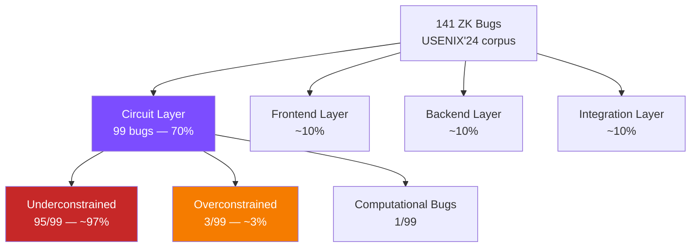

> **Prerequisites**: [[03-zkvm-architecture-overview|03. zkVM Architecture Overview]]  
> **Objectives**:  
> - Nắm vững phân loại bug trong ZK systems theo taxonomy chuẩn (USENIX Security'24 corpus 141 bugs)
> - Phân biệt rõ underconstrained, overconstrained, computational, và integration bugs
> - Hiểu ý nghĩa security của từng loại: loại nào break soundness, loại nào break completeness
> - Biết tỷ lệ phân bổ bug thực tế — để ưu tiên effort khi audit
> - Nắm các sub-class đặc biệt: arithmetic overflow, division by zero, nondeterminism, Fiat-Shamir bugs

---

## Motivation

Năm 2024, nhóm nghiên cứu từ Imperial College London, TU Munich, Ethereum Foundation, và zkSecurity đã phân tích **141 vulnerability reports** trong các SNARK/zkVM systems từ 2018–2024. Đây là corpus ZK bug lớn nhất và có hệ thống nhất hiện tại — được dùng làm nền tảng cho nhiều security tool và audit framework.

Kết quả nổi bật nhất: **~97% circuit-layer bugs là underconstrained**, và tính tổng thể **67% trong tất cả bugs** thuộc class này. Hiểu rõ taxonomy này giúp auditor biết **chỗ nào nên đào sâu nhất**.

> [!definition] Definition 6.1 — ZK Vulnerability Corpus (USENIX'24)
> Nghiên cứu của Chaliasos et al. (USENIX Security 2024) phân tích 141 bugs từ:
> - 107 audit reports của các ZK projects
> - 16 public vulnerability disclosures
> - Bug trackers của các SNARK projects
>
> Phạm vi: 2018–2024, bao gồm Circom, Halo2, Groth16, zkEVM, Risc0, SP1, và nhiều hệ thống khác.

---

## Ba thuộc tính bảo mật cần bảo vệ

Trước khi phân loại bug, cần hiểu zkVM cần bảo vệ ba thuộc tính:

> [!definition] Definition 6.2 — Soundness, Completeness, Zero-Knowledge
>
> **Soundness** (Tính đúng đắn): Một prover không trung thực **không thể** thuyết phục verifier chấp nhận một statement sai, trừ xác suất negligible.
>
> $$\Pr[\text{Verify}(\pi, x) = 1 \mid x \notin L] \leq \text{negl}(\lambda)$$
>
> **Completeness** (Tính đầy đủ): Một prover trung thực **luôn luôn** có thể thuyết phục verifier chấp nhận statement đúng.
>
> $$\Pr[\text{Verify}(\pi, x) = 1 \mid x \in L, \text{ honest prover}] = 1$$
>
> **Zero-Knowledge** (Tính không rò rỉ): Proof không tiết lộ thông tin nào về **witness** (private input) ngoài việc statement là đúng.

| Thuộc tính bị break | Hậu quả |
|-------------------|---------|
| **Soundness** | Prover gian lận có thể tạo proof cho statement **sai** → verifier bị lừa |
| **Completeness** | Honest prover **không thể** prove statement đúng → DoS, liveness failure |
| **Zero-Knowledge** | Private inputs bị **lộ** từ proof |

---

## Phân loại Bug theo Layer (USENIX'24 taxonomy)

Taxonomy chuẩn chia bugs theo **layer** và **loại**:



**Key insight**: Nếu chỉ có thể audit một loại bug, hãy tập trung vào **underconstrained bugs trong circuit layer** — chúng chiếm đại đa số và thường là Critical/High severity.

---

## V1 — Underconstrained Bugs (Lỗi thiếu ràng buộc)

> [!definition] Definition 6.3 — Underconstrained Circuit
> Một circuit bị **underconstrained** khi hệ constraint không đủ để xác định duy nhất output từ input. Tức là, tồn tại nhiều **witness** (assignment của các intermediate variables) thỏa mãn cùng một tập constraints — nhưng chỉ một trong số đó là "đúng" về mặt semantic.
>
> **Hệ quả**: Prover có thể chọn witness sai để convince verifier về một computation không xảy ra.

**Ví dụ minh họa — Boolean constraint thiếu:**

```rust
// Circom-like pseudocode
// MONG MUỐN: b là một bit (0 hoặc 1)
// BUG: Không có constraint nào giới hạn giá trị của b
signal input b;
signal output result;
result <== b * 10;  // Constraint: result = b * 10

// Prover có thể đặt b = 5 → result = 50
// Không có constraint nào ngăn chặn điều này!
```

```rust
// FIX: Thêm constraint Boolean
signal input b;
b * (b - 1) === 0;  // Constraint: b ∈ {0, 1}
signal output result;
result <== b * 10;
```

> [!danger] Danger 6.4 — Underconstrained = Soundness Break
> Underconstrained bug **luôn** dẫn đến soundness failure. Đây là class bug nguy hiểm nhất:
> - Prover gian lận có thể prove **bất kỳ output nào** cho cùng một input
> - Verifier không thể phát hiện gian lận
> - Trong context blockchain: attacker có thể forge transactions, mint tokens, bypass signature checks

### Sub-classes của Underconstrained

> [!definition] Definition 6.5 — Sub-class UC1: Arithmetic Overflow
> Khi constraint hệ sử dụng arithmetic trên **finite field** $\mathbb{F}_p$, nhưng computation logic giả định overflow không xảy ra.
>
> **Ví dụ**: Constraint kiểm tra `a + b < 2^32`, nhưng trong field $\mathbb{F}_p$ (với $p > 2^{32}$), phép cộng không overflow → constraint không thực sự enforces điều kiện này.

> [!definition] Definition 6.6 — Sub-class UC2: Division by Zero
> Khi một constraint sử dụng phép chia `a / b` nhưng **không có constraint** nào đảm bảo `b ≠ 0`.
>
> **Hệ quả**: Prover có thể cung cấp `b = 0` → computation undefined → circuit có thể accept bất kỳ output nào.

> [!definition] Definition 6.7 — Sub-class UC3: Nondeterministic Output
> Khi với cùng một input, circuit cho phép **nhiều output hợp lệ** do thiếu constraint phân biệt.
>
> **Ví dụ thực tế (Risc0 ExpandU32)**: Field `_rd_0` được phép nhận giá trị {0,1,2,3} thay vì chỉ {0,1}. Một encoded instruction có nhiều decoding hợp lệ → prover có thể chọn interpretation nào có lợi cho mình.

> [!definition] Definition 6.8 — Sub-class UC4: Missing Range Check
> Khi một giá trị phải nằm trong khoảng `[a, b]` nhưng constraint chỉ check một phía hoặc không check gì.
>
> **Pattern**: Trong RISC-V, register index phải ∈ [0, 31]. Nếu không có range check, prover có thể dùng register index 32, 33, ... → truy cập memory ngoài registers.

### Ví dụ từ Risc0 CVE-2025-52484

> [!example] Example 6.9 — rs1/rs2 Confusion Bug
>
> **Codebase**: Risc0 circuit rv32im, 3-register instructions (ADD, SUB, MUL, DIV, ...)
>
> **Bug**: Trong circuit xử lý 3-register instruction `op rd, rs1, rs2`, thiếu constraint đảm bảo rằng `rs1` và `rs2` được decode từ **đúng bit-field** của instruction word.
>
> **Attack**:
> - Instruction mã hóa: `ADD x5, x1, x2` (rd=x5, rs1=x1, rs2=x2)
> - Prover có thể thực thi như: `ADD x5, x1, x1` (dùng x1 cho cả rs1 lẫn rs2)
> - Proof vẫn verify vì circuit không enforce rs1 ≠ rs2 từ instruction encoding
>
> **Impact**: Mọi 3-register instruction đều bị ảnh hưởng — critical, vá trong v2.1.0.

---

## V2 — Overconstrained Bugs (Lỗi ràng buộc quá chặt)

> [!definition] Definition 6.10 — Overconstrained Circuit
> Một circuit bị **overconstrained** khi hệ constraint **quá chặt** — có những constraint sai hoặc mâu thuẫn khiến một số **witness hợp lệ không thể được tạo ra**, dù computation thực sự đúng.
>
> **Hệ quả**: Completeness failure — honest prover không thể prove valid execution.

**Ví dụ:**

```rust
// MONG MUỐN: result = a nếu flag=1, result = b nếu flag=0
signal input a, b, flag;
signal output result;

flag * (1 - flag) === 0;  // flag là bit — OK
result === flag * a + (1 - flag) * b;  // logic đúng

// BUG OVERCONSTRAINED: Thêm constraint sai
result === a;  // Luôn require result = a, mâu thuẫn với trường hợp flag=0!
```

> [!note] Note 6.11 — Overconstrained ít nguy hiểm hơn nhưng vẫn nghiêm trọng
> Overconstrained **không** break soundness — prover không thể gian lận. Nhưng nó gây:
> - **DoS**: Legitimate transactions bị reject, hệ thống không thể hoạt động
> - **Liveness failure**: Proof generation fail cho valid inputs
> - Trong production: có thể block toàn bộ hệ thống rollup

---

## V3 — Computational Bugs (Lỗi tính toán trong witness generation)

> [!definition] Definition 6.12 — Computational Bug
> Xảy ra khi **witness generation** (phần code tạo ra witness từ input) tính toán sai — nhưng constraint system thực ra đúng.
>
> Kết quả: Honest prover tạo ra witness sai → proof generation fail hoặc proof invalid cho valid execution.
>
> **Khác biệt với underconstrained**: Ở đây constraints đúng, nhưng code tạo witness sai. Đây là completeness bug, không phải soundness bug.

**Ví dụ:**

```python
# Constraint: result = a * b mod p (đúng)
# Witness generation code:
def compute_witness(a, b, p):
    return (a * b) % (p + 1)  # BUG: dùng p+1 thay vì p!
    # Witness sai → proof fail dù computation thực sự đúng
```

---

## V4 — Integration/Application Bugs

Ngoài circuit layer, bugs còn xuất hiện ở các layer khác:

> [!definition] Definition 6.13 — Frontend Bugs
> Lỗi trong **compiler** hoặc **executor** — phần dịch từ high-level circuit description sang constraints, hoặc từ program sang execution trace.
>
> **Examples**:
> - Compiler sinh ra constraints sai từ Circom/Zirgen code đúng
> - Executor tính toán trace khác với semantic RISC-V thực → dishonest trace mà circuit không detect
> - Risc0 executor có bug → trace không phản ánh đúng execution

> [!definition] Definition 6.14 — Backend Bugs
> Lỗi trong **proof system** — FRI prover, STARK verifier, Groth16, hoặc Fiat-Shamir transformation.
>
> **Examples**:
> - Frozen Heart (xem phần sau)
> - Fiat-Shamir transcript ordering bug (xem phần sau)
> - FRI low-degree test thiếu checks → prover có thể commit polynomial bậc cao

> [!definition] Definition 6.15 — Integration/Application Bugs
> Lỗi trong cách **ứng dụng** tích hợp với proof system — smart contract verifier, proof aggregation, nullifier logic, public input handling.
>
> **Examples**:
> - Smart contract không check image ID/vkey → accept proof từ program khác
> - Nullifier không được kiểm tra → double-spend attack
> - Public inputs không được validate trước verify

---

## Backend Bug đặc biệt — Fiat-Shamir Transcript Bugs

Đây là class bug quan trọng ở backend layer, ảnh hưởng nhiều zkVM:

> [!definition] Definition 6.16 — Fiat-Shamir Transformation
> **Fiat-Shamir** là kỹ thuật chuyển interactive proof thành non-interactive bằng cách thay thế random challenges của verifier bằng **hash của transcript** (tất cả messages đã trao đổi trước đó).
>
> **Invariant quan trọng**: Mỗi giá trị ảnh hưởng đến một verifier equation phải được **hash vào transcript trước khi** challenge liên quan được sample.

> [!danger] Danger 6.17 — Frozen Heart Vulnerability (2022)
> **Frozen Heart** là class bug trong Fiat-Shamir implementation: một message quan trọng bị **bỏ sót** khỏi transcript hash trước khi challenge được tạo.
>
> **Hệ quả**: Challenge không phụ thuộc vào giá trị đó → prover có thể **chọn giá trị sau khi biết challenge** → forge proof hoàn toàn không liên quan đến computation thực sự.
>
> **Ảnh hưởng lịch sử**: Nhiều hệ thống ZK bị ảnh hưởng năm 2022: Plonk implementations, Bulletproofs, và nhiều protocol khác.

> [!danger] Danger 6.18 — Unfaithful Claims Bug (2026, 6 zkVMs)
> Nghiên cứu của OSEC (tháng 3/2026) phát hiện một class bug mới trong 6 zkVMs (Jolt, Nexus, Cairo-M, Ceno, Expander, Binius64):
>
> **Root cause**: **Public claim values** (input/output của chương trình) không được bound vào Fiat-Shamir transcript **trước khi** challenge được derive.
>
> **Attack**: Public values trở thành "biến tự do" trong verification equations. Attacker có thể giải một hệ phương trình tuyến tính nhỏ để tìm giá trị giả mạo khiến tất cả checks pass.
>
> **Ví dụ thực tế**: Prove rằng `1 + 1 = 3` với proof hợp lệ — vì claim `3` không được bind vào transcript đúng thời điểm.
>
> **Bài học**: Transcript ordering là **non-negotiable invariant** — nếu một value ảnh hưởng đến verifier equation, nó phải được absorb trước khi sample challenge tương ứng.

---

## Tóm tắt phân bổ bug và severity

| Bug Class | % trong corpus | Break | Severity điển hình |
|-----------|---------------|-------|-------------------|
| Underconstrained | ~67% tổng, ~97% circuit | **Soundness** | Critical |
| Overconstrained | ~2% tổng | Completeness | Medium–High |
| Computational Bug | ~1% | Completeness | Medium |
| Fiat-Shamir Bug | ~5% | **Soundness** | Critical |
| Integration Bug | ~15% | Varies | Medium–Critical |
| Application Logic Bug | ~10% | Application-specific | Low–Critical |

---

## Cách phát hiện từng loại bug

| Bug Class | Technique phù hợp |
|-----------|------------------|
| Underconstrained | Formal verification (Picus), symbolic execution, manual audit |
| Overconstrained | Fuzzing (ARGUZZ), differential testing với honest prover |
| Computational | Unit testing witness generation, differential fuzzing |
| Fiat-Shamir | Manual review transcript code, formal spec comparison |
| Integration | Manual code review, smart contract audit |

> [!note] Note 6.19 — Tại sao Underconstrained khó detect hơn Overconstrained?
> **Overconstrained** dễ phát hiện: chỉ cần chạy honest prover với valid input và xem nó fail hay không.
>
> **Underconstrained** khó hơn nhiều: phải *chế tạo* một malicious witness thỏa mãn constraints nhưng compute sai — điều này đòi hỏi hiểu sâu về circuit và tìm "khoảng trống" trong hệ constraints. Formal verification (SMT solvers) và fuzzing có thể tự động hóa việc này.

---

## Checklist nhận diện nhanh khi đọc circuit code

Khi review circuit (Zirgen, AIR constraints, Circom, ...), hỏi:

1. **Mỗi intermediate signal có đủ constraints không?** Nếu một signal được declare nhưng không có constraint ràng buộc giá trị của nó → underconstrained.
2. **Range checks có đầy đủ không?** Bit, byte, u32 — tất cả đều cần explicit range constraint.
3. **Division có check denominator ≠ 0 không?**
4. **Conditional logic** (`if flag then X else Y`) — cả hai nhánh đều được constraint không?
5. **Cross-table lookups** — claim trong chip A có được enforce bởi chip B không?
6. **Fiat-Shamir transcript** — mọi public value đều được hash trước khi challenge tương ứng được sample chưa?

---

## Summary

- **Ba thuộc tính cần bảo vệ**: Soundness, Completeness, Zero-Knowledge.
- **~67%** trong tất cả ZK bugs là underconstrained circuit bugs — ưu tiên audit class này.
- **Underconstrained** (thiếu constraint) → **soundness** failure → prover có thể gian lận.
- **Overconstrained** (constraint quá chặt) → **completeness** failure → DoS.
- **Computational bugs** → completeness failure → honest prover fail.
- **Fiat-Shamir bugs** (Frozen Heart, Unfaithful Claims) → soundness failure → proof forgery.
- **Integration bugs** → application-level bypasses.
- Formal verification (Picus, SMT) và fuzzing (ARGUZZ) là tools chính để detect underconstrained bugs tự động.

---

## References

- Chaliasos et al. — SoK: What don't we know? Understanding Security Vulnerabilities in SNARKs (USENIX Security 2024): https://arxiv.org/pdf/2402.15293
- RISC Zero — Path to First Formally Verified RISC-V zkVM: https://risczero.com/blog/RISCZero-formally-verified-zkvm
- Veridise — Risc0 ZK-VM Security: https://veridise.com/blog/audit-insights/risc-zeros-zk-vm-security-how-veridise-enabled-risc-zero-to-achieve-provable-continuous-zk-security/
- Hochrainer et al. — ARGUZZ: Testing zkVMs for Soundness and Completeness Bugs: https://arxiv.org/pdf/2509.10819
- OSEC — Unfaithful Claims: Breaking 6 zkVMs (March 2026): https://osec.io/blog/2026-03-03-zkvms-unfaithful-claims/
- zksecurity.xyz — zkVM Security: What Could Go Wrong?: https://blog.zksecurity.xyz/posts/zkvm-security/
