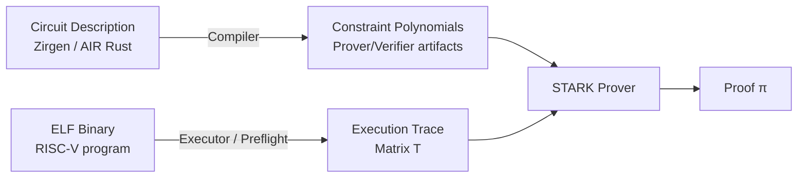

> **Prerequisites**: [[08-circuit-bugs|08. Circuit Bugs in zkVM]]  
> **Objectives**:  
> - Hiểu frontend layer trong zkVM: compiler và executor làm gì, tại sao chúng là attack surface
> - Phân biệt circuit bug (constraints sai) vs compiler bug (compiler sinh constraints sai) vs executor bug (execution trace sai)
> - Nắm các class bug phổ biến trong executor/preflight: semantic mismatch, RISC-V edge cases
> - Hiểu Rust/LLVM compiler risks khi compile cho RISC-V target trong zkVM context

---

## Vị trí Frontend trong zkVM Stack



**Frontend layer** = tất cả code *dịch* từ high-level description sang artifacts mà prover và verifier dùng:

- **Zirgen compiler** (Risc0): Dịch `.zir` → constraint polynomials
- **Executor** (Risc0/SP1): Emulate RISC-V execution → tạo execution trace matrix
- **Preflight** (Risc0): Pre-compute hints/witnesses cho prover
- **Rust/LLVM compiler**: Dịch guest Rust code → RISC-V ELF binary

---

## Frontend Bug vs Circuit Bug — Phân biệt quan trọng

> [!definition] Definition 9.1 — Frontend Bug vs Circuit Bug
>
> **Circuit bug**: Constraint system *định nghĩa sai* relation cần prove. Constraints là polynomial equations — nếu sai, prover có thể exploit khoảng trống.
>
> **Frontend bug**: Constraint system *định nghĩa đúng*, nhưng **translator** sinh ra constraints sai hoặc **executor** tạo trace không đúng RISC-V semantics.
>
> | Loại | Constraints đúng không? | Impact |
> |------|------------------------|--------|
> | Circuit bug | Sai (khoảng trống) | Soundness — prover gian lận được |
> | Frontend/compiler bug | Đúng về mặt spec, nhưng code sai | Completeness (honest prover fail) hoặc Soundness nếu executor sai |

---

## Executor — Attack Surface Chính của Frontend

Executor là component **emulate từng RISC-V instruction** và ghi lại execution trace. Nếu executor có bug, trace không phản ánh đúng RISC-V semantics → circuit verify trace này nhưng trace **không correspond** với computation thực sự.

> [!definition] Definition 9.2 — Semantic Mismatch Bug
> Xảy ra khi **executor** (frontend) implement một instruction khác với cách **circuit** (constraint system) expect, hoặc cả hai implement sai RISC-V spec.
>
> **Ba trường hợp:**
> 1. Executor đúng, circuit sai → circuit bug (bài 08)
> 2. Circuit đúng, executor sai → completeness bug (honest prover dùng executor, tạo trace sai → proof fail)
> 3. Cả hai đều sai theo cùng một cách → proof "thành công" nhưng prove *sai semantics*

**Trường hợp 3 là nguy hiểm nhất**: Nếu executor và circuit đều implement instruction sai theo cùng cách, honest proof generation sẽ thành công — nhưng hệ thống về cơ bản là proving execution của một *VM khác*, không phải RISC-V.

---

## RISC-V Edge Cases — Nguồn Semantic Mismatch

RISC-V specification có nhiều edge cases mà implementation dễ bỏ sót:

> [!warning] Warning 9.3 — Division và Remainder: Signed Edge Cases
> RISC-V spec định nghĩa behavior rõ ràng cho division edge cases:
>
> ```
> DIV  rd, rs1, rs2:
>   - rs2 = 0: rd = -1 (không phải trap hay undefined)
>   - rs1 = INT_MIN, rs2 = -1: rd = INT_MIN (overflow không trap)
>
> REM  rd, rs1, rs2:
>   - rs2 = 0: rd = rs1
>   - rs1 = INT_MIN, rs2 = -1: rd = 0
> ```
>
> **Bug pattern**: Implementation bỏ sót special case `rs2 = 0` → behavior khác spec → mismatch giữa executor và circuit, hoặc cả hai đều xử lý sai.

> [!warning] Warning 9.4 — Shift Instructions: Shift Amount Masking
> RISC-V quy định shift amount chỉ dùng **5 bits thấp nhất** (cho rv32):
>
> ```
> SLL rd, rs1, rs2: rd = rs1 << (rs2 & 0x1F)
> SRL rd, rs1, rs2: rd = rs1 >> (rs2 & 0x1F)
> ```
>
> Nếu circuit không mask `rs2 & 0x1F` (chỉ dùng toàn bộ rs2), shift amount > 31 cho kết quả khác.

> [!warning] Warning 9.5 — Load/Store: Misaligned Access Behavior
> RISC-V base spec cho phép misaligned load/store (không trap). Một số zkVM implementations có thể reject hoặc handle khác → semantic mismatch với programs dựa vào behavior này.

---

## Risc0 Executor/Preflight Bug Surface

Trong Risc0, ngoài executor Rust còn có các components khác:

**Preflight** — Tính toán `hints` (non-deterministic witnesses) trước khi proving:
- Hints là data prover *cung cấp* cho circuit (ví dụ: kết quả division, bảng lookup)
- Nếu preflight tính hints sai → circuit nhận hint sai → proof fail (completeness bug)
- Nếu hint mechanism không bị constrain đúng → có thể là underconstrained bug

> [!warning] Warning 9.6 — Risc0 Preflight Hint Consistency
> Preflight tính toán và ghi hints vào bộ nhớ chia sẻ với executor. Nếu preflight compute sai nhưng circuit *không verify* hint content đầy đủ → soundness risk.
>
> **Audit focus**: Mỗi hint type (division result, lookup table entry, ...) phải có constraint trong circuit verify nó.

**Executor/Emulator Race** (CVE-2025-52484 fix pattern):

Khi circuit fix được apply trong Zirgen, **emulator code** (Rust và C++/CUDA) phải được update đồng thời:

```rust
// risc0/circuit/rv32im/src/execute/rv32im.rs
// Hàm step_compute và step_store phải được update
// để match cách ReadSourceRegs component hoạt động

// Nếu chỉ fix Zirgen nhưng không fix emulator:
// - Honest prover dùng emulator cũ → generate trace theo cách cũ
// - Circuit mới expect trace theo format mới
// - Proof fail → completeness bug!
```

---

## SP1 Executor — Specific Risks

SP1's executor là Rust code simulate RISC-V rv32im. Các risks:

> [!warning] Warning 9.7 — SP1 Execution Shard Boundaries
> SP1 chia execution thành shards (mỗi shard ~1M cycles). Tại boundary giữa shards, state (registers, memory) phải được truyền đúng. Nếu state transfer không đúng → shard tiếp theo bắt đầu với sai state.

> [!danger] Danger 9.8 — SP1 next_pc và Shard Completion (LambdaClass Dec 2025)
> Bug `is_complete` được phân tích ở Lesson 08 có frontend component quan trọng:
>
> **Executor role**: Khi malicious executor muốn exploit, nó dừng execution với:
> - `next_pc = start_of_main` (loop back thay vì terminate)
> - Đặt `is_complete = true`
>
> **Frontend contract bị vi phạm**: Executor *nói dối* rằng execution đã complete trong khi `next_pc != 0`. Circuit (frontend layer) không verify `next_pc == 0` khi `is_complete = true` → contract không được enforce.
>
> **Root cause ở đây là ở circuit** (không enforce invariant), nhưng **exploit path đi qua executor** (tạo malicious trace).

---

## Compiler Bug — Rust/LLVM Risks

Guest code được compile bởi Rust compiler với LLVM backend, targeting `riscv32im-unknown-none-elf` hoặc tương tự. Compiler bugs có thể:

1. **Sinh code sai cho RISC-V target**: Optimization pass của LLVM có thể có bugs đặc biệt cho riscv32im target
2. **Miscompile với `-O2`/`-O3`**: Undefined behavior trong Rust/C code có thể bị optimize theo cách bất ngờ
3. **Linker script bugs**: Custom linker scripts cho zkVM targets có thể map segments sai

> [!warning] Warning 9.9 — Unsafe Code trong Guest
> `unsafe` Rust code trong guest có thể khai thác undefined behavior bị LLVM optimize theo cách unexpected. Trong normal execution, UB có thể không có vấn đề — nhưng trong zkVM, behavior phải hoàn toàn deterministic và match RISC-V spec.
>
> **Best practice**: Tránh `unsafe` trong guest code. Nếu cần, document rõ invariants và test kỹ với masm/zkVM toolchain.

> [!warning] Warning 9.10 — OS-Dependent Crates trong Guest
> Một số Rust crates dùng OS-specific features không available trong zkVM environment:
> - `std::thread` → không có threads trong zkVM
> - `std::fs` → không có filesystem
> - `rand::thread_rng()` → không có OS randomness (non-deterministic)
>
> Dùng các crates này trong guest gây **runtime panic** hoặc **undefined behavior** — cả hai đều fail proof generation. Trong worst case, nếu panic xảy ra trước một commit, committed values sẽ là mặc định.

---

## Detecting Frontend Bugs

**Differential Testing** — Cách tốt nhất:
- Chạy cùng program trên honest RISC-V emulator (qemu, spike)
- Chạy cùng program trên zkVM executor
- So sánh register states, memory states, output sau mỗi instruction
- Bất kỳ sự khác biệt nào = potential semantic mismatch

**Metamorphic Testing** (được ARGUZZ dùng):
- Tạo nhiều versions của cùng computation (semantically equivalent)
- Verify chúng produce cùng output trong zkVM
- Nếu khác → bug

> [!note] Note 9.11 — Veridise Audit Methodology cho Frontend
> Trong audit Risc0 96 person-week, Veridise dùng:
> - **Tool-assisted analysis**: Picus cho circuit determinism
> - **Manual code review**: Đặc biệt cho executor và preflight
> - **Test harness development**: Viết harnesses kiểm tra từng instruction
>
> Frontend bugs khó detect tự động hơn circuit bugs vì cần biết RISC-V spec để phát hiện semantic mismatch.

---

## Summary

- **Frontend layer** bao gồm Zirgen compiler, executor/preflight, và Rust/LLVM compiler chain.
- **Executor** là component nguy hiểm nhất: nếu nó tạo trace sai, proof verify trace sai đó.
- **Semantic mismatch**: Executor và circuit phải cả hai agree với RISC-V spec. Nếu cả hai sai theo cùng một cách, hệ thống prove execution của VM khác.
- **RISC-V edge cases**: Division by zero, INT_MIN overflow, shift masking — dễ bị implement sai.
- **Executor/circuit sync**: Khi fix circuit, emulator code phải được update đồng thời (CVE-2025-52484 lesson).
- **SP1 LambdaClass bug**: Malicious executor exploit `is_complete` contract không được circuit enforce.
- **Rust/LLVM compiler**: Unsafe code, OS-dependent crates, và UB là nguồn undefined behavior trong guest.

---

## References

- Veridise — Risc0 zkVM Security Audit Report (Phase 2): https://veridise.com/wp-content/uploads/2025/04/VAR-Risc0-241028-Round2-V4.pdf
- LambdaClass — SP1 Exploit Disclosure (Dec 2025): https://blog.lambdaclass.com/responsible-disclosure-of-an-exploit-in-succincts-sp1-zkvm-found-in-partnership-with-3mi-labs-and-aligned-which-arises-from-the-interaction-of-two-distinct-security-vulnerabilities/
- Hochrainer et al. — ARGUZZ: https://arxiv.org/pdf/2509.10819
- Sigma Prime — SP1 Security Auditor's Guide: https://blog.sigmaprime.io/sp1-zkvm-security-guide.html
- zksecurity.xyz — zkVM Security: What Could Go Wrong?: https://blog.zksecurity.xyz/posts/zkvm-security/
- RISC-V Spec — RV32I Base Integer Instruction Set: https://riscv.org/wp-content/uploads/2017/05/riscv-spec-v2.2.pdf
