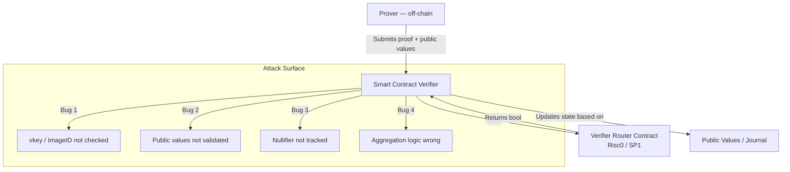

> **Prerequisites**: [[07-threat-models-zkvm|07. Threat Models in zkVM]], [[10-host-guest-bugs|10. Host/Guest Bugs]]  
> **Objectives**:  
> - Hiểu integration layer: on-chain verifier, proof aggregation, cross-chain bridges
> - Nắm class bugs phổ biến nhất trong integration: vkey bypass, nullifier reuse, public input mismatch
> - Phân tích Groth16 trusted setup pitfalls và snarkjs misconfiguration
> - Biết cách audit smart contract verifier khi tích hợp với Risc0/SP1

---

## Integration Layer trong zkVM Stack

Integration layer bao gồm tất cả code *ngoài* proving/verifying core nhưng *kết nối* proof system với ứng dụng thực tế:



---

## Class 1 — Vkey / Image ID Bypass (Critical)

Đây là integration bug phổ biến nhất và nguy hiểm nhất:

> [!danger] Danger 11.1 — Verifier không check vkey / Image ID
>
> Nếu on-chain verifier không hardcode `vkey` (SP1) hoặc `imageId` (Risc0), attacker có thể submit proof từ **bất kỳ program nào** — miễn là proof structure hợp lệ.
>
> **Attack**:
> 1. Attacker viết chương trình: `fn main() { io::commit(&u64::MAX); }` (luôn commit giá trị tối đa)
> 2. Generate proof hợp lệ cho chương trình này
> 3. Submit proof lên contract **không kiểm tra** vkey/imageId
> 4. Contract đọc `public_values = u64::MAX` → attacker nhận lợi ích

**Risc0 — Solidity Example:**

```solidity
// BUG: Không verify imageId
function submitResult(bytes calldata seal, bytes calldata journal) external {
    // Chỉ verify proof structure
    IRiscZeroVerifier(VERIFIER).verify(seal, sha256(journal));
    // imageId không được check!
    
    uint256 result = abi.decode(journal, (uint256));
    balances[msg.sender] = result; // EXPLOIT!
}

// CORRECT
bytes32 constant IMAGE_ID = 0xabcdef...; // Hardcoded từ trusted build

function submitResult(bytes calldata seal, bytes calldata journal) external {
    // Verify proof VÀ imageId
    IRiscZeroVerifier(VERIFIER).verify(
        seal,
        IMAGE_ID,           // ← Critical check
        sha256(journal)
    );
    
    uint256 result = abi.decode(journal, (uint256));
    balances[msg.sender] = result;
}
```

**SP1 — Solidity Example:**

```solidity
// BUG
ISP1Verifier(VERIFIER).verifyProof(proof, publicValues);

// CORRECT
bytes32 constant VKEY_HASH = 0x...;

ISP1Verifier(VERIFIER).verifyProof(
    VKEY_HASH,     // ← vkey phải được hardcode
    publicValues,
    proof
);
```

---

## Class 2 — Public Values Không Được Validate

> [!danger] Danger 11.2 — Public Values Được Tin Tưởng Hoàn Toàn
>
> Proof chỉ verify rằng *program đã execute* với *những public values đó*. Nó không verify rằng public values có *ý nghĩa hợp lý* trong ngữ cảnh của contract.

**Bug pattern 1 — Thiếu range check:**

```solidity
// Guest commits: (new_balance, user_address)
// Proof verifies execution đúng

function updateBalance(
    bytes calldata seal,
    bytes calldata journal
) external {
    verifier.verify(seal, IMAGE_ID, sha256(journal));
    
    (uint256 newBalance, address user) = abi.decode(journal, (uint256, address));
    
    // BUG: Không check nếu newBalance reasonable
    // Guest code có thể có integer overflow → newBalance = u256::MAX
    balances[user] = newBalance; // No range check!
}

// CORRECT: Check business logic constraints
require(newBalance <= MAX_BALANCE, "Balance exceeds maximum");
require(newBalance >= oldBalance || withdrawalAuthorized, "Unauthorized decrease");
```

**Bug pattern 2 — Không kiểm tra address trong public values:**

```solidity
// Guest commits: (result, requester_address)
// Guest đọc requester_address từ host — host có thể cung cấp address giả!

function claimResult(bytes calldata seal, bytes calldata journal) external {
    verifier.verify(seal, IMAGE_ID, sha256(journal));
    
    (uint256 result, address requester) = abi.decode(journal, (uint256, address));
    
    // BUG: requester trong journal là giá trị host cung cấp!
    // Attacker host có thể đặt requester = victim_address
    balances[requester] += result; // Exploit!
}

// CORRECT: msg.sender phải match requester, hoặc guest verify signature
require(requester == msg.sender, "Requester mismatch");
```

---

## Class 3 — Nullifier và Replay Attack

> [!definition] Definition 11.3 — Nullifier trong ZK Systems
> **Nullifier** là một giá trị duy nhất được derive từ private input, commit vào proof, và track trên-chain để ngăn **replay** (submit cùng proof nhiều lần).
>
> Nếu không có nullifier mechanism, cùng một proof có thể được submit và execute nhiều lần.

**Bug — Thiếu nullifier:**

```solidity
// zkRollup withdraw: User prove họ có note worth X
function withdraw(
    bytes calldata seal,
    bytes calldata journal
) external {
    verifier.verify(seal, IMAGE_ID, sha256(journal));
    
    (uint256 amount, address recipient) = abi.decode(journal, (uint256, address));
    
    // BUG: Không track nullifier → cùng proof submit nhiều lần
    payable(recipient).transfer(amount); // DOUBLE SPEND!
}

// CORRECT: Track nullifier
mapping(bytes32 => bool) public usedNullifiers;

function withdraw(
    bytes calldata seal,
    bytes calldata journal
) external {
    verifier.verify(seal, IMAGE_ID, sha256(journal));
    
    (uint256 amount, address recipient, bytes32 nullifier) = 
        abi.decode(journal, (uint256, address, bytes32));
    
    require(!usedNullifiers[nullifier], "Note already spent");
    usedNullifiers[nullifier] = true; // Mark as used
    
    payable(recipient).transfer(amount);
}
```

**Guest code phải commit nullifier:**

```rust
// Guest code — derive và commit nullifier
let note_secret: [u8; 32] = io::read(); // Private note secret
let nullifier = sha256(&note_secret);    // Derive nullifier
// (nullifier là public → on-chain tracking, note_secret là private)
io::commit(&amount);
io::commit(&recipient);
io::commit(&nullifier);
```

---

## Class 4 — Verifier Router và Versioning

> [!danger] Danger 11.4 — Sử dụng Deprecated Verifier Router
>
> Risc0 và SP1 dùng **Verifier Router** contracts cho phép upgrade verifier khi có bug. Khi một zkVM version bị deprecate (bị dùng `estop`), router contract từ chối proofs từ version đó.
>
> **Bug**: Application contract hardcode address của **verifier cụ thể** thay vì **verifier router** → không nhận được security updates tự động.
>
> ```solidity
> // BUG: Hardcode verifier cụ thể (không thể upgrade)
> address constant RISC0_VERIFIER = 0x1234...;  // v2.0 verifier
> // → Khi Risc0 v2.0 bị disable do CVE-2025-52484, proofs không được verify
> // → Application bị DoS, hoặc nếu cũ hơn — still accepts v2.0 proofs!
>
> // CORRECT: Dùng verifier router
> address constant RISC0_ROUTER = 0xabcd...;  // Router tự động route đến latest
> // → Khi v2.0 disabled, router tự động fail
> // → Application nhận security update tự động
> ```

> [!note] Note 11.5 — Tradeoff: Router vs Direct Verifier
> Verifier router cho phép Risc0/SP1 team disable vulnerable versions (estop). Đây là *security feature*.
>
> Tuy nhiên, nếu bạn không dùng official router, bạn **chịu trách nhiệm** track và upgrade verifier khi có security update.

---

## Class 5 — Groth16 Trusted Setup và Snarkjs Misconfiguration

> [!danger] Danger 11.6 — Incomplete Groth16 Setup (snarkjs)
>
> Năm 2022, zksecurity phát hiện **hai exploits đầu tiên** trên live ZK circuits (trên Tornado Cash và một dự án khác). Cả hai đều từ cùng nguyên nhân: Groth16 verifiers được generate bởi **snarkjs** thiếu bước cuối cùng trong setup.
>
> **Root cause**: snarkjs setup quy trình gồm nhiều bước. Nếu bỏ qua bước cuối (`contribute()` hay `beacon()`), trusted setup không được finalized đúng → malicious prover có thể forge arbitrary proofs.
>
> **Lesson**: Khi dùng snarkjs hoặc bất kỳ Groth16 toolkit nào:
> - Verify trusted setup ceremony đã complete
> - Dùng canonical verifier bytecode từ project chính thức (Risc0, SP1) thay vì tự generate

> [!warning] Warning 11.7 — Risc0 Groth16 Trusted Setup Assumptions
> Như đã đề cập ở Lesson 04, Risc0 Groth16 circuit dùng trusted setup từ **Hermez ceremony** (Powers of Tau). Security của proof phụ thuộc vào assumption rằng ít nhất một participant ceremony đã destroy toxic waste.
>
> Đây không phải là bug, nhưng là risk cần acknowledge khi deploy Risc0 Groth16 proofs.

---

## Class 6 — Proof Aggregation Bugs

Khi nhiều proofs được aggregated thành một proof duy nhất, có class bugs riêng:

> [!danger] Danger 11.8 — Aggregation Identity Confusion
>
> Trong proof aggregation, mỗi inner proof có **image ID / vkey** riêng. Aggregator phải verify rằng inner proofs đến từ đúng program.
>
> **Bug**: Aggregator không verify image ID của inner proofs → attacker substitute inner proof từ malicious program.
>
> ```rust
> // Guest aggregator — BUG
> let inner_receipt: Receipt = env::read();
> // Không check image ID của inner receipt!
> env::verify_integrity(&inner_receipt.claim())?; // Chỉ check proof valid, không check program
>
> let result: u64 = inner_receipt.journal.decode()?;
> env::commit(&result);
>
> // CORRECT
> let inner_receipt: Receipt = env::read();
> inner_receipt.verify(EXPECTED_INNER_IMAGE_ID)?; // Check cả proof VÀ image ID
> let result: u64 = inner_receipt.journal.decode()?;
> env::commit(&result);
> ```

---

## Class 7 — Public Input Commitment Mismatch

> [!danger] Danger 11.9 — Commitment Mismatch giữa Guest và Verifier
>
> Guest commit values theo một **thứ tự và schema** cụ thể. On-chain verifier phải decode theo đúng thứ tự đó. Mismatch gây misparse mà không có error.
>
> ```solidity
> // Guest commits: amount (u64), recipient (address/[u8;20]), timestamp (u64)
>
> // BUG trong Solidity verifier — decode sai order
> (address recipient, uint256 amount) = abi.decode(journal, (address, uint256));
> // Decode amount là bytes của recipient → garbage value!
> // Vẫn pass ABI decode nếu size match
>
> // CORRECT: Order phải match guest commit order
> (uint64 amount, address recipient, uint64 timestamp) = 
>     abi.decode(journal, (uint64, address, uint64));
> ```

---

## Cross-Chain Bridge Integration

Khi zkVM được dùng trong cross-chain bridge, có thêm attack surface:

> [!warning] Warning 11.10 — Oracle Data trong Cross-Chain Context
>
> Nếu guest program đọc on-chain state từ chain A (ví dụ: block hash, Merkle root), host cung cấp data này. Host có thể cung cấp stale hoặc manipulated data.
>
> **Defense**: Guest nên commit block hash / timestamp được dùng → on-chain verifier có thể check rằng data không quá cũ.
>
> ```rust
> // Guest
> let block_hash: [u8; 32] = io::read();  // Host cung cấp
> let state_root: [u8; 32] = io::read(); // Host cung cấp
>
> // Verify Merkle proof với state_root
> // ...
>
> // Commit cả state root và block hash để on-chain verifier check
> io::commit(&block_hash);    // Verifier check hash này là recent
> io::commit(&state_root);    // Verifier verify root against block_hash
> io::commit(&result);
> ```

---

## Audit Checklist cho Smart Contract Integration

Khi audit một smart contract dùng Risc0/SP1 proofs:

1. **Verifier address**: Dùng official router hay verifier cụ thể?
2. **Image ID / vkey**: Được hardcode không? Được check trong mỗi verify call không?
3. **Public values decode**: Thứ tự match guest commit order không?
4. **Nullifiers**: Nếu proof có thể reuse → có nullifier tracking không?
5. **Business logic constraints**: Contract có validate range/sanity của decoded values không?
6. **Address binding**: msg.sender có được verify match với address trong journal không?
7. **Aggregation**: Inner proof image IDs có được verified không?
8. **Upgrade path**: Nếu zkVM có bug, contract có thể upgrade verifier không?

---

## Summary

- **Integration layer** kết nối proof system với ứng dụng thực tế — nhiều bug ở đây mà proof system đúng hoàn toàn.
- **vkey/imageId bypass** (Critical): Không check → accept proof từ bất kỳ program nào.
- **Public values trust**: Contract phải validate values, không chỉ verify proof.
- **Nullifier missing**: Không track → replay attack / double-spend.
- **Verifier router**: Dùng official router để nhận security updates tự động.
- **Groth16 setup**: Phải dùng verifier từ completed trusted setup ceremony.
- **Aggregation**: Inner proof program IDs phải được verified.
- **Journal decode order**: Phải match guest commit order.

---

## References

- RISC Zero Verifier Management Design (estop mechanism): https://github.com/risc0/risc0-ethereum/blob/main/contracts/VERIFIER_MANAGEMENT.md
- SP1 Contracts Documentation: https://docs.succinct.xyz/verification/onchain/contract-addresses
- zksecurity.xyz — First ZK Exploits on Live Circuits (2022): https://blog.zksecurity.xyz/posts/zkvm-security/
- Sigma Prime — SP1 Auditor Guide: https://blog.sigmaprime.io/sp1-zkvm-security-guide.html
- 7BlockLabs — Auditing zkVM Guest Programs Checklist: https://www.7blocklabs.com/blog/auditing-zkvm-guest-programs-a-checklist-inspired-by-2025s-sp1-security-guidance
