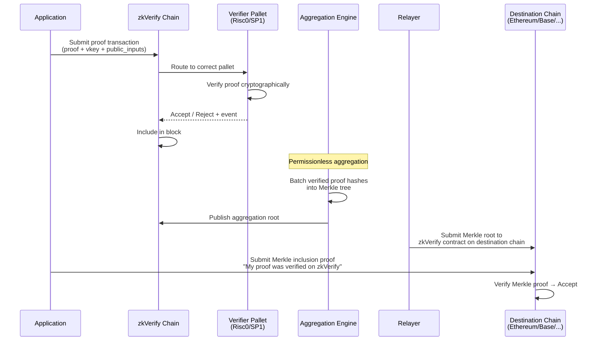
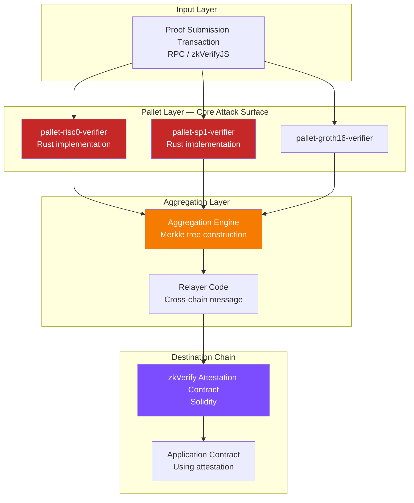

> **Prerequisites**: [[11-integration-bugs|11. Integration Bugs]], [[04-risc0-deep-dive|04. Risc0 Deep Dive]], [[05-sp1-deep-dive|05. SP1 Deep Dive]]  
> **Objectives**:  
> - Hiểu kiến trúc end-to-end của zkVerify: từ proof submission đến attestation on destination chain
> - Nắm role của Substrate pallets, aggregation engine, và Merkle attestation mechanism
> - Map từng component của zkVerify sang attack surface cụ thể
> - Biết cách submit và verify Risc0/SP1 proof qua zkVerify — từ đó xác định bug hunting entry points

---

## zkVerify là gì?

zkVerify (Horizen Labs, mainnet launch 30/9/2025) là **L1 blockchain chuyên dụng** cho verification ZK proofs. Thay vì mỗi rollup/application tự verify proof trên Ethereum (tốn $20–60/proof), họ submit lên zkVerify và nhận **Merkle attestation** — bằng chứng rằng proof đã được verified, có thể sử dụng trên bất kỳ chain nào.

> [!definition] Definition 12.1 — zkVerify Network Architecture
> zkVerify là L1 Proof-of-Stake blockchain xây dựng trên **Substrate framework** (Rust). Native token: **VFY**.
>
> Các component chính:
> - **Verifier Pallets**: Rust modules implement verification logic cho từng proof system
> - **Proof Submission Interface**: RPC endpoint nhận proof transactions
> - **Aggregation Engine**: Batch proofs thành Merkle tree
> - **Relayers**: Publish Merkle root attestations lên destination chains (Ethereum, Base, Arbitrum, ...)

**Supported proof systems** (tính đến 3/2026):
Groth16, UltraPlonk, UltraHonk (Noir), Risc Zero, SP1, Plonky2, EZKL, TEE (Intel TDX).

---

## End-to-End Flow



---

## Verifier Pallets — Chi tiết

Mỗi pallet trong zkVerify là một Substrate **FRAME module** implement interface:

```rust
// zkVerify pallet interface (simplified)
pub trait VerifierPallet {
    type Proof: Decode;         // Proof type đặc thù cho từng system
    type Vk: Decode;            // Verification key
    type PublicInputs: Decode;  // Public inputs / journal

    fn verify(
        vk: &Self::Vk,
        proof: &Self::Proof,
        public_inputs: &Self::PublicInputs,
    ) -> DispatchResult;  // Ok(()) hoặc Error
}
```

> [!definition] Definition 12.2 — Risc0 Verifier Pallet
> Crate: `pallet-risc0-verifier` (github.com/zkVerify/risc0-verifier)
>
> **Input format**:
> - `proof`: Groth16 seal bytes (từ `Receipt::Groth16`)
> - `vk`: Image ID (32 bytes)
> - `public_inputs`: Journal bytes (SHA-256 hash nếu dùng `verify_by_hash`)
>
> **Verification**: Gọi Risc0 Groth16 verifier logic, check seal validity + image ID match.

> [!definition] Definition 12.3 — SP1 Verifier Pallet
> **Input format**:
> - `proof`: SP1 `shrink` type proof bytes (từ `SP1Prover::shrink()` method)
> - `vk`: SP1VerifyingKey hashed thành 8 BabyBear field elements → 32 bytes little-endian
> - `public_inputs`: public_values bytes
>
> **Verification**: Gọi SP1 compressed proof verifier, check vkey hash match.

---

## Proof Submission — API và zkVerifyJS

Developers dùng **zkVerifyJS** SDK hoặc direct RPC để submit proofs:

```typescript
// zkVerifyJS — Submit Risc0 proof
import { ZkVerifySession } from 'zkverifyjs';

const session = await ZkVerifySession.start()
    .Mainnet()
    .withAccount(signer);

// Submit proof
const { events, transactionResult } = await session
    .verify()
    .risc0()
    .execute({
        proofData: {
            proof: groth16Seal,         // Groth16 seal bytes
            vk: imageId,                // Image ID (hex string)
            publicSignals: journalHash  // SHA-256 của journal
        }
    });

// Listen for verification event
const { attestationId } = await transactionResult;
```

```typescript
// SP1 proof submission
const { events, transactionResult } = await session
    .verify()
    .sp1()
    .execute({
        proofData: {
            proof: shrinkProofBytes,          // SP1 shrink proof
            vk: vkeyHashBabyBear32Bytes,      // vkey hash
            publicSignals: publicValuesBytes   // public values
        }
    });
```

---

## Aggregation Engine

> [!definition] Definition 12.4 — zkVerify Aggregation
> Sau khi proofs được verified và included trong block, **aggregation engine** batch chúng:
>
> 1. Collect tất cả `(proof_hash, vkey_hash, public_inputs_hash)` trong một batch
> 2. Build Merkle tree từ các tuples này
> 3. Merkle root được published như một **aggregation attestation**
>
> Aggregation là **permissionless**: bất kỳ participant nào cũng có thể build và publish aggregation để nhận fee.

```mermaid
graph LR
    P1[Proof 1<br>Risc0: fibonacci] --> LEAF1[leaf1 = H(imageId1 || journal1)]
    P2[Proof 2<br>SP1: signature] --> LEAF2[leaf2 = H(vkey2 || pubvals2)]
    P3[Proof 3<br>Groth16: zkEVM] --> LEAF3[leaf3 = H(vk3 || pubinputs3)]
    LEAF1 --> MT[Merkle Tree]
    LEAF2 --> MT
    LEAF3 --> MT
    MT --> ROOT[Merkle Root<br>Attestation]
    ROOT --> ETH[Ethereum zkVerify Contract]
    ROOT --> BASE[Base zkVerify Contract]
```

**Dùng attestation on-chain:**

```solidity
// Destination chain contract
interface IZkVerifyAttestation {
    function verifyProofAttestation(
        uint64 attestationId,
        bytes32 leaf,          // H(vk || publicInputs)
        bytes32[] calldata merklePath,
        uint256 leafCount,
        uint256 index
    ) external view returns (bool);
}

// Application contract
function claimWithZkVerify(
    uint64 attestationId,
    bytes32 vkHash,
    bytes32 publicInputsHash,
    bytes32[] calldata merklePath,
    uint256 leafCount,
    uint256 index
) external {
    bytes32 leaf = keccak256(abi.encodePacked(vkHash, publicInputsHash));
    require(
        zkVerifyAttestation.verifyProofAttestation(
            attestationId, leaf, merklePath, leafCount, index
        ),
        "Proof not verified"
    );
    // Process claim...
}
```

---

## Attack Surface Map của zkVerify



---

## Bug Classes Riêng Biệt của zkVerify

Ngoài tất cả bugs của Risc0/SP1 (đã cover ở Module 3), zkVerify có thêm attack surface riêng:

> [!danger] Danger 12.5 — Pallet Implementation Bugs
> Rust code implement verification trong zkVerify pallets là một **independent reimplementation** (hoặc wrapper) của Risc0/SP1 verifier. Bugs có thể tồn tại trong:
> - Proof deserialization logic (parsing bytes → structs)
> - Vkey/imageId check logic
> - Hashing scheme cho public inputs (SHA-256 hay keccak256?)
> - Error handling — panic vs return Error

> [!danger] Danger 12.6 — Proof Forgery qua Deserialization Bug
> **Attack pattern**: Submit malformed proof bytes mà Rust deserializer parse sai → verification code nhận data khác với intent → accept hoặc reject không đúng.
>
> **Ví dụ**: Proof bytes có padding đặc biệt → deserializer bỏ qua một số bytes → effective vkey khác với vkey được check.

> [!warning] Warning 12.7 — Public Inputs Hashing Mismatch
> zkVerify hash public inputs trước khi verify. Nếu application hash public inputs theo cách khác (keccak256 thay vì SHA-256, hoặc encoding khác) → leaf trong Merkle tree khác → attestation không match → DoS.
>
> Hoặc ngược lại: nếu application dùng `leaf = H(vk || publicInputs)` nhưng zkVerify dùng `leaf = H(vk || H(publicInputs))` → mismatch.

> [!danger] Danger 12.8 — Aggregation Merkle Tree Bug
> Nếu aggregation engine có bug trong Merkle tree construction (wrong leaf ordering, wrong hashing), Merkle proofs có thể:
> - Accept invalid proof as verified (forge proof verified attestation)
> - Reject valid proof (DoS)
>
> Đặc biệt nguy hiểm vì aggregation là **permissionless** — malicious aggregator có thể submit sai Merkle root.

> [!danger] Danger 12.9 — Attestation Contract Replay
> Nếu attestation contract on destination chain không track đã-used attestations, attacker có thể:
> - Submit cùng một attestation+Merkle proof nhiều lần
> - Replay proof từ một app cho app khác (nếu leaf structure tương tự)

> [!warning] Warning 12.10 — VFY Token / Fee Manipulation
> zkVerify là public blockchain — verification cần VFY fee. Nếu fee mechanism có bug, attacker có thể:
> - Submit free proofs (bypass fee check)
> - DoS chain bằng cách spam proof submissions

---

## Risc0-Verifier Crate — Specific Attack Surface

zkVerify dùng riêng crate `risc0-verifier` tại `github.com/zkVerify/risc0-verifier`:

> [!note] Note 12.11 — risc0-verifier là Dependency Riêng
> Crate `risc0-verifier` của zkVerify là **separate từ** official `risc0-zkvm` crate. Nó implement Risc0 Groth16 verification bằng cách reuse một phần code từ Risc0 nhưng adapt cho zkVerify's pallet architecture.
>
> **Implication cho bug hunting**:
> - Bugs trong `risc0-zkvm` (official) không nhất thiết có trong zkVerify
> - Bugs trong `zkVerify/risc0-verifier` không được covered bởi Risc0 bug bounty
> - Risc0 **HackenProof** scope và zkVerify **bug bounty** scope là riêng biệt

---

## Bug Hunting Entry Points — Practical

Khi bug hunt trên zkVerify với Risc0/SP1:

**1. Pallet source code review**:

```bash
# Clone zkVerify repos
git clone https://github.com/zkVerify/zkVerify
git clone https://github.com/zkVerify/risc0-verifier

# Key files to review:
# zkVerify/pallets/verifiers/risc0/src/lib.rs
# zkVerify/pallets/verifiers/sp1/src/lib.rs
# risc0-verifier/src/lib.rs
```

**2. Submit edge case proofs**:
- Proof với zero-length public inputs
- Proof với maximum-size public inputs
- Proof với malformed vkey (wrong length, wrong encoding)
- Risc0 proof từ version cũ (bị deprecated)
- SP1 proof từ loại sai (compressed thay vì shrink)

**3. Aggregation edge cases**:
- Single proof per batch
- Maximum size batch
- Duplicate proof submissions

**4. Cross-chain attestation verification**:
- Verify Merkle proof với wrong index
- Verify proof for wrong attestationId
- Submit proof twice với same attestation

---

## Summary

- zkVerify là **L1 Substrate blockchain** chuyên dụng cho ZK proof verification — mainnet từ 9/2025.
- Architecture: Proof submission → Verifier Pallet (Rust) → Block inclusion → Aggregation → Merkle root → Destination chain attestation.
- **Verifier pallets** implement verification cho từng proof system (Risc0, SP1, Groth16, ...) trong Rust.
- **Aggregation** là permissionless — bất kỳ ai cũng có thể aggregate để nhận fee.
- **Attack surface riêng** của zkVerify: pallet deserialization bugs, hashing mismatch, aggregation Merkle bugs, attestation replay, vkey bypass trong pallet layer.
- `zkVerify/risc0-verifier` crate là separate từ official Risc0 — có attack surface riêng.
- **Practical entry points**: pallet source review, edge case proof submission, aggregation fuzzing, cross-chain attestation testing.

---

## References

- zkVerify Core Architecture Docs: https://docs.zkverify.io/architecture/core-architecture
- zkVerify SP1 Pallet Docs: https://docs.zkverify.io/architecture/verification_pallets/sp1
- zkVerify Risc0 Pallet Docs: https://docs.zkverify.io/architecture/verification_pallets/risc0
- risc0-verifier GitHub: https://github.com/zkVerify/risc0-verifier
- zkVerify GitHub: https://github.com/zkVerify/zkVerify
- zkVerify Generating Proofs Guide: https://docs.zkverify.io/overview/getting-started/generating-proof
- zkVerify Mainnet Launch Press Release (Sep 30, 2025): https://www.prnewswire.com/news-releases/zkverify-mainnet-launches-as-first-dedicated-blockchain-for-zero-knowledge-proof-verification-302570087.html
