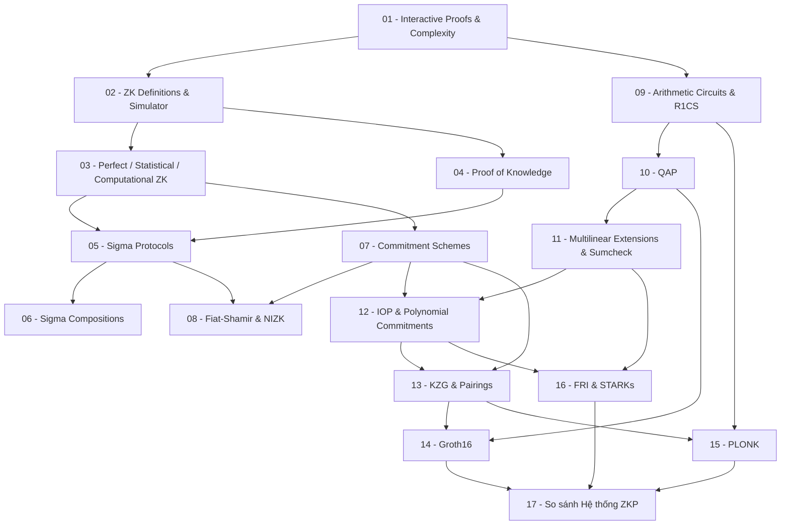

> **Topic**: Zero-Knowledge Proofs (ZKP)  
> **Domain**: Cryptography  
> **Level**: Advanced  
> **Background**: Modular arithmetic, group theory, polynomials, probability, hash functions  
> **Tools / Code**: Python + SageMath  
> **Sources**: Thaler — *Proofs, Arguments, and ZK*; Boneh & Shoup; Berkeley ZK MOOC; IACR ePrint

---

## Lessons

### Phần I — Nền tảng lý thuyết ZKP

| # | Title | Key Concepts | Prerequisites | Difficulty |
|---|-------|-------------|---------------|------------|
| 01 | Interactive Proofs & Complexity | Mô hình prover-verifier, IP, AM, IP = PSPACE, completeness, soundness, public-coin vs. private-coin | — | ★★★☆☆ |
| 02 | Zero-Knowledge: Định nghĩa & Simulator Paradigm | "Không tiết lộ thông tin" là gì, view của verifier, định nghĩa ZK qua simulator, distinguisher | 01 | ★★★★☆ |
| 03 | Perfect, Statistical, Computational ZK | Ba mức độ ZK, information-theoretic vs. computational indistinguishability, ví dụ từng loại, quan hệ giữa chúng | 02 | ★★★★☆ |
| 04 | Proof of Knowledge & Knowledge Soundness | Phân biệt "proof of a statement" vs. "proof of knowledge", knowledge extractor, rewind-based extraction, định nghĩa formal PoK | 02 | ★★★★☆ |
| 05 | Sigma Protocols — Cấu trúc & Security | 3-move (commit/challenge/response), HVZK, SHVZK, special soundness, Schnorr protocol, Chaum-Pedersen | 03, 04 | ★★★★☆ |
| 06 | Sigma Protocol Compositions | AND/OR composition, chứng minh quan hệ tuyến tính giữa nhiều discrete log, equality of openings, Okamoto protocol | 05 | ★★★★★ |
| 07 | Commitment Schemes | Hiding/binding (information-theoretic vs. computational), Pedersen commitment, homomorphic property, hash-based commitment, vector commitments | 03 | ★★★★☆ |
| 08 | Fiat-Shamir Transform & NIZK | Random Oracle Model, biến đổi public-coin interactive → non-interactive, strong vs. weak Fiat-Shamir, transcript completeness, domain separation | 05, 07 | ★★★★☆ |

### Phần II — Arithmetization & Công cụ Đa thức

| # | Title | Key Concepts | Prerequisites | Difficulty |
|---|-------|-------------|---------------|------------|
| 09 | Arithmetic Circuits & R1CS | Arithmetic circuits trên finite field, circuit satisfiability, Rank-1 Constraint System, ma trận A/B/C, witness | 01 | ★★★★☆ |
| 10 | Quadratic Arithmetic Programs | Biến đổi R1CS → QAP, Lagrange interpolation, Schwartz-Zippel lemma, vanishing polynomial, polynomial divisibility check | 09 | ★★★★★ |
| 11 | Multilinear Extensions & Sumcheck | Multilinear extension của hàm, sumcheck protocol, GKR protocol, delegating layered circuit evaluation | 10 | ★★★★★ |
| 12 | Interactive Oracle Proofs & Polynomial Commitments | Mô hình IOP, oracle access, IOP → SNARK compilation, polynomial commitment scheme (định nghĩa abstract), binding/hiding cho PCS | 07, 11 | ★★★★★ |

### Phần III — Các Hệ thống ZKP Hiện đại (Conceptual)

| # | Title | Key Concepts | Prerequisites | Difficulty |
|---|-------|-------------|---------------|------------|
| 13 | KZG & Pairing-Based Polynomial Commitments | Bilinear pairings, trusted setup (SRS), KZG commit/open/verify, ý nghĩa của constant-size proof | 07, 12 | ★★★★★ |
| 14 | Groth16 — Kiến trúc & Ý tưởng | QAP → pairing-based SNARK, cấu trúc 3-element proof, circuit-specific setup, verification equation (ý tưởng) | 10, 13 | ★★★★★ |
| 15 | PLONK & Universal SNARKs | Plonkish arithmetization, permutation argument, grand product check, universal vs. circuit-specific setup, so sánh với Groth16 | 09, 13 | ★★★★★ |
| 16 | FRI & ZK-STARKs | Reed-Solomon codes, proximity testing, FRI folding (ý tưởng), AIR arithmetization, transparent setup, tradeoff proof size vs. no trusted setup | 11, 12 | ★★★★★ |
| 17 | So sánh & Tổng quan Hệ thống ZKP | Bảng so sánh toàn diện: trusted setup, proof size, verification time, assumptions, applications; hướng phát triển hiện tại | 13, 14, 15, 16 | ★★★☆☆ |

---

## Appendix Candidates

| ID | Content | Related Lesson | Notes |
|----|---------|----------------|-------|
| A0 | Forking Lemma — Phát biểu & Chứng minh đầy đủ | 05, 06 | Rewinding argument, Bellare-Neven formalization |
| A1 | Bilinear Pairings — Nền tảng toán học | 13 | Weil pairing, Tate pairing, Type III pairing, BLS12-381 |
| A2 | So sánh Polynomial Commitment Schemes | 12–16 | KZG vs. IPA vs. FRI: assumptions, size, time |

---

## Dependency Graph

*Đồ thị phụ thuộc — mũi tên chỉ chiều "cần học trước".*

---

## Progress Tracker

**Phần I — Nền tảng lý thuyết**
- [ ] [[00-roadmap|00. Roadmap]]
- [ ] [[01-interactive-proofs-and-complexity|01. Interactive Proofs & Complexity]]
- [ ] [[02-zk-definitions-and-simulator|02. ZK Definitions & Simulator Paradigm]]
- [ ] [[03-perfect-statistical-computational-zk|03. Perfect, Statistical, Computational ZK]]
- [ ] [[04-proof-of-knowledge|04. Proof of Knowledge & Knowledge Soundness]]
- [ ] [[05-sigma-protocols|05. Sigma Protocols]]
- [ ] [[06-sigma-compositions|06. Sigma Protocol Compositions]]
- [ ] [[07-commitment-schemes|07. Commitment Schemes]]
- [ ] [[08-fiat-shamir-and-nizk|08. Fiat-Shamir Transform & NIZK]]

**Phần II — Arithmetization**
- [ ] [[09-arithmetic-circuits-and-r1cs|09. Arithmetic Circuits & R1CS]]
- [ ] [[10-qap|10. Quadratic Arithmetic Programs]]
- [ ] [[11-multilinear-extensions-and-sumcheck|11. Multilinear Extensions & Sumcheck]]
- [ ] [[12-iop-and-polynomial-commitments|12. IOP & Polynomial Commitments]]

**Phần III — Hệ thống ZKP Hiện đại**
- [ ] [[13-kzg-and-pairings|13. KZG & Pairing-Based Polynomial Commitments]]
- [ ] [[14-groth16|14. Groth16]]
- [ ] [[15-plonk|15. PLONK & Universal SNARKs]]
- [ ] [[16-fri-and-starks|16. FRI & ZK-STARKs]]
- [ ] [[17-zkp-systems-comparison|17. So sánh Hệ thống ZKP]]

**Appendix**
- [ ] [[a0-forking-lemma|A0. Forking Lemma — Full Proof]]
- [ ] [[a1-bilinear-pairings-math|A1. Bilinear Pairings — Nền tảng toán học]]
- [ ] [[a2-pcs-comparison|A2. So sánh Polynomial Commitment Schemes]]
