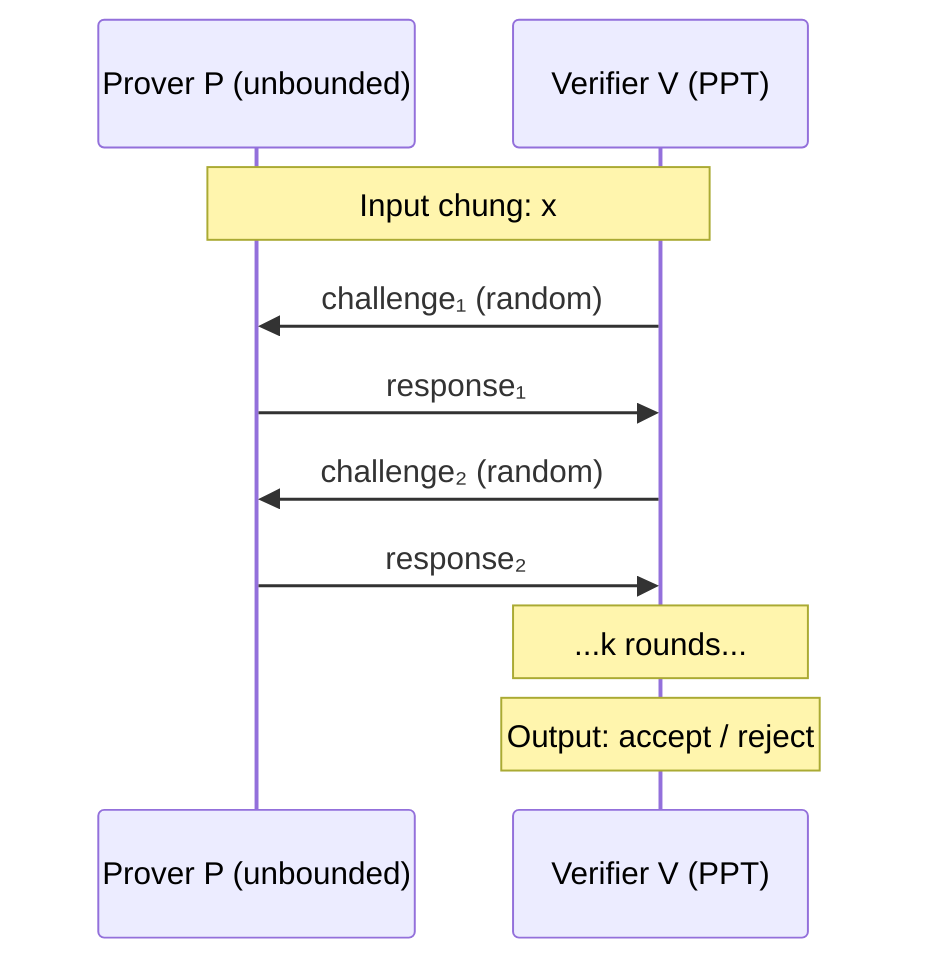
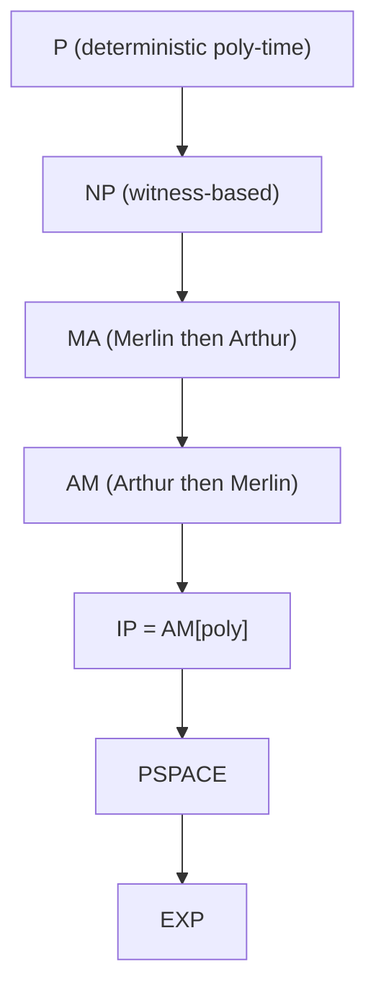

> **Prerequisites**: Lý thuyết tính toán cơ bản (Turing machine, P, NP), xác suất cơ bản, đại số modular  
> **Objectives**:
> - Hiểu mô hình tương tác giữa prover và verifier
> - Nắm vững định nghĩa formal của completeness và soundness
> - Phân biệt IP, NP, AM, và vị trí của chúng trong bức tranh độ phức tạp
> - Hiểu tại sao tương tác và ngẫu nhiên mở rộng sức mạnh tính toán của verifier

---

## Motivation

Cách kiểm tra kiến thức truyền thống trong lý thuyết tính toán là: đưa ra một **witness** (bằng chứng) và verifier kiểm tra trong thời gian đa thức. Đây chính là lớp NP. Ví dụ: để chứng minh rằng một công thức SAT có thể thỏa mãn, prover cung cấp một phép gán biến, verifier kiểm tra trong $O(n)$.

Nhưng có những bài toán mà cách tiếp cận này gặp khó khăn căn bản. Hãy xét bài toán **Graph Non-Isomorphism (GNI)**: cho hai đồ thị $G_0$ và $G_1$, chứng minh rằng *không tồn tại* đẳng cấu nào giữa chúng. Làm thế nào để prover chứng minh sự *vắng mặt* của một cấu trúc? Không có witness ngắn gọn nào rõ ràng cho điều này.

Ý tưởng then chốt: **thay vì prover trình bày một bằng chứng tĩnh, ta cho phép prover và verifier tương tác**. Verifier được dùng đồng xu ngẫu nhiên, đặt câu hỏi, và quyết định chấp nhận hay từ chối sau nhiều vòng trao đổi. Đây là nền tảng của **hệ thống chứng minh tương tác** (interactive proof system) — và cũng là nền tảng để xây dựng Zero-Knowledge Proofs.

---

## Mô hình Interactive Proof

### Các thành phần

Một hệ thống chứng minh tương tác gồm hai thực thể tính toán:

> [!definition] Definition 1.1 — Interactive Proof System
> Một **hệ thống chứng minh tương tác** (interactive proof system) cho ngôn ngữ $L$ là một cặp thuật toán $(P, V)$:
>
> - **Prover** $P$: có sức mạnh tính toán không giới hạn (computationally unbounded). Mục tiêu là thuyết phục $V$ chấp nhận.
> - **Verifier** $V$: chạy trong thời gian đa thức probabilistic (PPT — probabilistic polynomial-time). $V$ có access đến một nguồn random bits.
>
> Cả hai cùng nhận input $x$ và tham gia vào $k$ vòng trao đổi tin nhắn. Sau đó $V$ output $\text{accept}$ hoặc $\text{reject}$.

Lưu ý: $P$ không giới hạn tính toán vì trong mô hình lý thuyết, ta muốn hiểu điều gì *về nguyên tắc* có thể được chứng minh, không phải về hiệu quả.

### Cấu trúc trao đổi

*Mô hình trao đổi k-round giữa prover và verifier. Verifier gửi challenge ngẫu nhiên, prover trả lời.*

### Completeness và Soundness

Đây là hai tính chất cốt lõi của mọi interactive proof system:

> [!definition] Definition 1.2 — Completeness và Soundness
>
> Cho ngôn ngữ $L$ và interactive proof system $(P, V)$:
>
> **Completeness**: Nếu $x \in L$, thì prover trung thực $P$ thuyết phục được $V$ chấp nhận với xác suất cao:
>
> $$\Pr[\langle P, V \rangle(x) = \text{accept}] \geq 1 - \text{negl}(|x|)$$
>
> **Soundness**: Nếu $x \notin L$, thì *mọi* prover gian lận $P^*$ (dù có sức mạnh không giới hạn) cũng không thể thuyết phục $V$ chấp nhận với xác suất đáng kể:
>
> $$\forall P^*: \Pr[\langle P^*, V \rangle(x) = \text{accept}] \leq \text{negl}(|x|)$$

> [!note] Remark
> Trong các tài liệu cũ, completeness và soundness thường được đặt ở các ngưỡng cụ thể như $2/3$ và $1/3$. Tuy nhiên, bằng **repetition** (lặp lại giao thức nhiều lần), ta có thể khuếch đại bất kỳ gap hằng số nào thành $1 - 2^{-k}$ sau $k$ lần lặp. Vì vậy ngưỡng chính xác không quan trọng bằng việc có một **gap hằng số** giữa completeness và soundness.

Sự phân biệt quan trọng: trong NP, soundness đòi hỏi verifier *luôn luôn* từ chối khi $x \notin L$ (soundness = 1). Trong IP, ta chấp nhận soundness xác suất — verifier có thể bị lừa với xác suất cực nhỏ. Đây là sự đánh đổi căn bản cho phép IP mạnh hơn NP.

---

## Lớp Độ Phức Tạp IP

### Định nghĩa IP

> [!definition] Definition 1.3 — Lớp IP
> **IP** là tập hợp các ngôn ngữ $L$ có interactive proof system $(P, V)$ với $V$ chạy trong thời gian đa thức, số vòng tương tác là đa thức, và thỏa mãn completeness cùng soundness như trên.

So sánh với NP: NP là trường hợp đặc biệt của IP với **0 vòng tương tác** (prover chỉ gửi witness, verifier kiểm tra). Do đó $\text{NP} \subseteq \text{IP}$.

### Ví dụ: Graph Non-Isomorphism trong IP

Đây là ví dụ kinh điển minh họa sức mạnh của IP vượt NP.

**Bài toán**: Cho $G_0 = (V_0, E_0)$ và $G_1 = (V_1, E_1)$. Chứng minh rằng $G_0 \not\cong G_1$ (hai đồ thị không đẳng cấu).

> [!example] Example 1.4 — Interactive Proof cho Graph Non-Isomorphism
>
> **Giao thức** (Goldreich-Micali-Wigderson, 1986):
>
> 1. $V$ chọn ngẫu nhiên bit $b \in \{0, 1\}$ và một hoán vị $\pi$ ngẫu nhiên trên tập đỉnh.
> 2. $V$ gửi cho $P$ đồ thị $H = \pi(G_b)$ — một bản sao hoán vị của $G_b$.
> 3. $P$ phải trả lời: $H$ xuất phát từ $G_0$ hay $G_1$?
>
> **Phân tích**:
>
> - *Nếu $G_0 \not\cong G_1$*: $P$ có thể phân biệt $G_0$ và $G_1$ (vì chúng không đẳng cấu), nên $P$ luôn trả lời đúng. Completeness = 1.
> - *Nếu $G_0 \cong G_1$*: $H$ có phân phối đồng nhất dù $b = 0$ hay $b = 1$. Mọi $P^*$ chỉ đoán đúng với xác suất $1/2$. Soundness error = $1/2$.
>
> Lặp lại $k$ lần: soundness error giảm xuống $2^{-k}$.

Điều đặc biệt: GNI được tin là không có witness ngắn (không ở trong NP), nhưng nó có trong IP! Tương tác và randomness cho phép verifier kiểm tra điều mà NP không thể.

---

## Public-Coin Protocols và Lớp AM

### Public-coin vs. Private-coin

> [!definition] Definition 1.5 — Public-coin vs. Private-coin
>
> - **Private-coin** (coin-flipping in private): Verifier giữ bí mật các random bits của mình với prover. Đây là mô hình tổng quát của IP.
> - **Public-coin** (coin-flipping in public): Mọi message từ verifier đến prover chỉ là các random bits thuần túy — verifier không tính toán gì thêm. Prover thấy toàn bộ randomness của verifier.

Giao thức public-coin tự nhiên hơn và dễ phân tích hơn. Mọi challenge của verifier là một chuỗi random bits.

### Arthur-Merlin Games

> [!definition] Definition 1.6 — Lớp AM và MA
>
> Các lớp **Arthur-Merlin** mô tả interactive proofs dạng public-coin:
>
> - **AM**: Arthur (verifier) gửi random challenge trước, Merlin (prover) trả lời. Giao thức 2 round: $V \to P \to V$.
> - **MA**: Merlin gửi witness trước, Arthur kiểm tra. Giao thức 2 round: $P \to V$ (giống NP nhưng với verifier xác suất).
> - **AM[k]**: giao thức AM với $k$ rounds.
>
> Quan hệ: $\text{MA} \subseteq \text{AM} \subseteq \text{AM[poly]} = \text{IP}$

> [!theorem] Theorem 1.7 — Goldwasser-Sipser Theorem
> Mọi private-coin interactive proof có thể được mô phỏng bởi một public-coin interactive proof với chỉ thêm **2 rounds** và tăng soundness error không đáng kể.
>
> Hệ quả: $\text{IP} = \text{AM[poly]}$ — private-coin và public-coin có cùng sức mạnh biểu đạt.

Định lý này có ý nghĩa quan trọng: ta có thể giả sử không mất tổng quát rằng verifier chỉ gửi random bits (public-coin) mà không mất biểu đạt. Đây là lý do tại sao nhiều giao thức ZKP được thiết kế theo dạng public-coin.

---

## Định lý IP = PSPACE

Đây là một trong những kết quả sâu sắc nhất của lý thuyết độ phức tạp, được Shamir chứng minh năm 1992:

> [!theorem] Theorem 1.8 — Shamir's Theorem (IP = PSPACE)
> $$\text{IP} = \text{PSPACE}$$
>
> Tức là: một ngôn ngữ có interactive proof system khi và chỉ khi nó có thể được quyết định bởi một máy Turing chạy trong không gian đa thức.

*Quan hệ bao hàm giữa các lớp độ phức tạp. IP = PSPACE nằm ở vị trí rộng hơn NP rất nhiều.*

**Ý nghĩa thực tiễn**: PSPACE chứa các bài toán cực kỳ phức tạp (như QBF — Quantified Boolean Formula, games lý thuyết, ...). Định lý này nói rằng *bất kỳ* bài toán nào trong PSPACE đều có thể chứng minh bằng một interactive proof system với verifier chạy trong thời gian đa thức. Đây là minh chứng rằng **tương tác và ngẫu nhiên mở rộng sức mạnh chứng minh lên một cách đáng kể**.

### Phác thảo ý tưởng: IP ⊇ PSPACE

Để PSPACE ⊆ IP, ta cần chứng minh rằng mọi bài toán PSPACE-complete có interactive proof. Bài toán tiêu biểu là **#SAT** (đếm số phép gán thỏa mãn) — một bài toán \#P-hard. Giao thức sử dụng **sumcheck protocol** (sẽ được phân tích chi tiết trong Bài 11):

1. Prover tuyên bố: tổng $S = \sum_{x \in \{0,1\}^n} \phi(x)$ bằng một giá trị cụ thể.
2. Verifier giảm bài toán kiểm tra $S$ xuống bài toán kiểm tra một điểm đơn lẻ của đa thức, qua $n$ rounds.
3. Cuối cùng verifier kiểm tra trực tiếp một phép đánh giá đa thức đơn giản.

Điểm mấu chốt: mỗi round, verifier chỉ cần thực hiện phép tính đa thức thời gian, nhưng tổng thể kiểm tra được một tuyên bố về tổng trên $2^n$ phần tử.

---

## Soundness Amplification

> [!note] Remark — Khuếch đại Soundness
> Nếu một giao thức $k$-round có soundness error $\delta < 1$, ta có thể giảm error xuống $\delta^r$ bằng cách chạy $r$ lần song song (parallel repetition) hoặc tuần tự (sequential repetition).
>
> - **Sequential repetition**: chạy giao thức $r$ lần độc lập, chấp nhận nếu tất cả đều accept. Soundness error $= \delta^r$.
> - **Parallel repetition**: gửi $r$ challenges cùng lúc. Cho interactive proofs tổng quát, parallel repetition phức tạp hơn và không luôn cho kết quả tốt. Đây là một chủ đề nghiên cứu tích cực (Raz's parallel repetition theorem).

---

## Summary

- **Interactive proof system** $(P, V)$: prover không giới hạn tính toán, verifier PPT, trao đổi $k$ rounds.
- **Completeness**: $x \in L$ → $V$ chấp nhận với xác suất cao.
- **Soundness**: $x \notin L$ → mọi $P^*$ gian lận đều bị từ chối với xác suất cao.
- **NP ⊊ IP**: tương tác và randomness cho phép chứng minh những gì NP không thể (ví dụ: Graph Non-Isomorphism).
- **IP = AM[poly]**: public-coin và private-coin có cùng sức mạnh biểu đạt (Goldwasser-Sipser).
- **IP = PSPACE** (Shamir 1992): tương tác và randomness khuếch đại sức mạnh chứng minh lên toàn bộ PSPACE.
- Zero-Knowledge Proofs là tập con đặc biệt của IP: không chỉ yêu cầu completeness và soundness, mà còn đòi hỏi verifier không học được gì ngoài tính đúng của tuyên bố — đây là chủ đề của các bài tiếp theo.

---

## References

- Goldwasser, Micali, Rackoff — *The Knowledge Complexity of Interactive Proof Systems* (1989) — SIAM Journal on Computing
- Shamir — *IP = PSPACE* (1992) — Journal of the ACM
- Goldwasser, Sipser — *Private coins versus public coins in interactive proof systems* (1986)
- Arora & Barak — *Computational Complexity: A Modern Approach*, Ch. 8 (Interactive Proofs)
- Thaler — *Proofs, Arguments, and Zero-Knowledge*, Ch. 1–4 (people.cs.georgetown.edu/jthaler/ProofsArgsAndZK.pdf)
- Boneh & Shoup — *A Graduate Course in Applied Cryptography*, Ch. 19–20 (toc.cryptobook.us)
