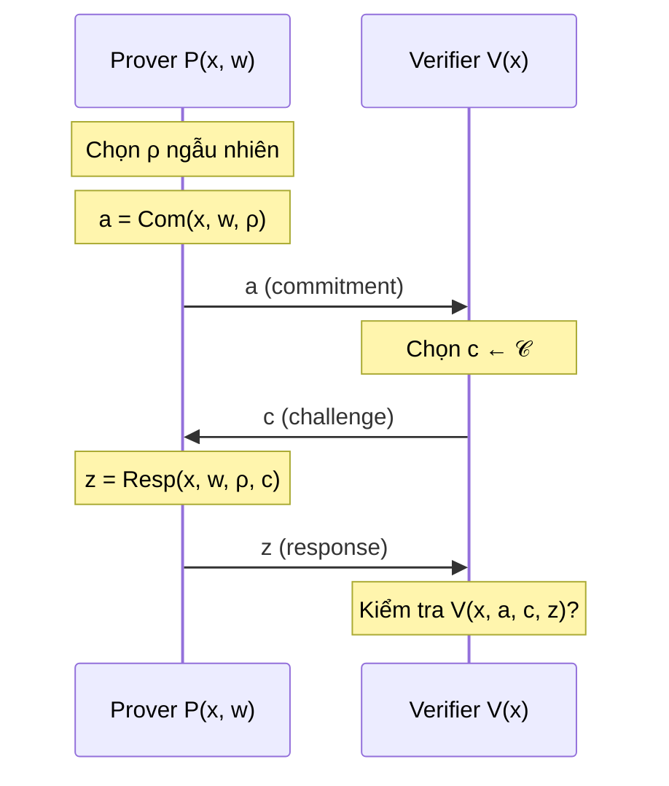

> **Prerequisites**: [[03-perfect-statistical-computational-zk|03. Perfect, Statistical, Computational ZK]]; [[04-proof-of-knowledge|04. Proof of Knowledge & Knowledge Soundness]]
> **Objectives**:
> - Nắm vững cấu trúc 3-move của Sigma protocol và ba tính chất bảo mật
> - Phân tích chi tiết Schnorr protocol: completeness, SHVZK, special soundness
> - Hiểu Chaum-Pedersen protocol: chứng minh đẳng thức discrete log
> - Thấy cách các tính chất từ Bài 03–04 (ZK, PoK) áp dụng cụ thể vào đây

---

## Motivation

Bài 02–04 xây dựng định nghĩa lý thuyết: ZK là gì, PoK là gì. Bài này trả lời câu hỏi: **giao thức cụ thể nào đạt được những tính chất đó, và tại sao?**

Sigma protocols là lớp giao thức 3-move đơn giản nhất có tất cả các tính chất mong muốn. Tên "Sigma" đến từ chữ $\Sigma$ trong bảng chữ cái Hy Lạp, ám chỉ hình dạng luồng trao đổi: $P \to V \to P$. Đây là backbone của phần lớn ZKP thực tế — từ chữ ký số Schnorr đến các giao thức xác thực hiện đại.

---

## Cấu trúc Sigma Protocol

> [!definition] Definition 5.1 — Sigma Protocol
>
> Cho quan hệ $R = \{(x, w)\}$ (statement, witness). Một **Sigma protocol** $\Sigma = (P, V)$ là giao thức tương tác 3-move:
>
> 1. **Commit**: Prover $P(x, w)$ chọn randomness $\rho$, tính **commitment** $a = \text{Com}(x, w, \rho)$. Gửi $a$ cho $V$.
> 2. **Challenge**: Verifier $V$ chọn ngẫu nhiên $c \leftarrow \mathcal{C}$ từ **challenge space** $\mathcal{C}$. Gửi $c$ cho $P$.
> 3. **Response**: Prover $P$ tính **response** $z = \text{Resp}(x, w, \rho, c)$. Gửi $z$ cho $V$.
> 4. **Verify**: Verifier tính $V(x, a, c, z) \in \{\text{accept}, \text{reject}\}$.
>
> Một triple $(a, c, z)$ được gọi là **accepting transcript** nếu $V(x, a, c, z) = \text{accept}$.

*Cấu trúc 3-move chuẩn của Sigma protocol: commit — challenge — response.*

---

## Ba Tính Chất Bảo Mật

> [!definition] Definition 5.2 — Ba tính chất của Sigma Protocol
>
> Sigma protocol $\Sigma$ phải thỏa mãn đồng thời:
>
> **1. Completeness**: Nếu $(x, w) \in R$, thì prover trung thực luôn tạo được accepting transcript:
> $$\Pr[V(x, a, c, z) = \text{accept}] = 1$$
>
> **2. Special Honest-Verifier Zero-Knowledge (SHVZK)**: Tồn tại PPT simulator $S$ sao cho với mọi $c \in \mathcal{C}$, output của $S(x, c)$ có phân phối đồng nhất (hoặc computationally indistinguishable) với $(a, c, z)$ từ giao thức thực khi verifier dùng challenge $c$.
>
> **3. Special Soundness**: Tồn tại PPT extractor $E$ sao cho: cho bất kỳ hai accepting transcript $(a, c_1, z_1)$ và $(a, c_2, z_2)$ với $c_1 \neq c_2$, $E$ tính được $w$ với $(x, w) \in R$.

> [!note] Remark — SHVZK vs. ZK Đầy Đủ
>
> **SHVZK** yêu cầu simulator biết challenge $c$ *trước* khi sinh commitment $a$. Đây là điểm khác biệt then chốt với ZK đầy đủ: trong giao thức thực, prover sinh $a$ *trước* khi biết $c$. Simulator "gian lận" bằng cách đảo ngược thứ tự này.
>
> Tính SHVZK đã đủ cho nhiều ứng dụng: sau khi áp dụng Fiat-Shamir (Bài 08), ta đạt ZK trong Random Oracle Model.

---

## Schnorr Identification Protocol

### Thiết lập

Cho nhóm cyclic $\mathbb{G} = \langle g \rangle$ bậc $q$ (số nguyên tố). Public parameter: $(g, q, \mathbb{G})$.

- **Statement**: $x = X \in \mathbb{G}$
- **Witness**: $w = x_{\text{sk}} \in \mathbb{Z}_q$ sao cho $g^{x_{\text{sk}}} = X$

> [!definition] Definition 5.3 — Schnorr Protocol
>
> **Commit**: Prover chọn $r \leftarrow \mathbb{Z}_q$, tính $R = g^r$. Gửi $R$.
>
> **Challenge**: Verifier gửi $c \leftarrow \mathbb{Z}_q$.
>
> **Response**: Prover gửi $s = r + c \cdot x_{\text{sk}} \pmod q$.
>
> **Verify**: Verifier kiểm tra $g^s = R \cdot X^c$.

### Chứng minh Ba Tính Chất

> [!theorem] Theorem 5.4 — Completeness của Schnorr
>
> Nếu prover biết $x_{\text{sk}}$ với $g^{x_{\text{sk}}} = X$, thì verifier luôn chấp nhận.
>
> **Proof**: $g^s = g^{r + c \cdot x_{\text{sk}}} = g^r \cdot g^{c \cdot x_{\text{sk}}} = R \cdot (g^{x_{\text{sk}}})^c = R \cdot X^c$. $\blacksquare$

> [!theorem] Theorem 5.5 — Special Soundness của Schnorr
>
> Từ hai accepting transcript $(R, c_1, s_1)$ và $(R, c_2, s_2)$ với $c_1 \neq c_2$:
>
> $$g^{s_1} = R \cdot X^{c_1}, \quad g^{s_2} = R \cdot X^{c_2}$$
>
> Trừ hai phương trình (trong nhóm $\mathbb{G}$, tức là chia trong số mũ):
>
> $$g^{s_1 - s_2} = X^{c_1 - c_2}$$
>
> Vì $c_1 \neq c_2$ và $q$ là số nguyên tố, $(c_1 - c_2)$ khả nghịch mod $q$:
>
> $$x_{\text{sk}} = \frac{s_1 - s_2}{c_1 - c_2} \pmod q$$
>
> Extractor tính ra $x_{\text{sk}}$ trong thời gian $O(\log q)$. $\blacksquare$

> [!theorem] Theorem 5.6 — SHVZK của Schnorr
>
> Simulator $S(X, c)$ hoạt động: chọn $s \leftarrow \mathbb{Z}_q$ ngẫu nhiên, tính $R = g^s \cdot X^{-c}$. Xuất $(R, c, s)$.
>
> **Kiểm tra hợp lệ**: $g^s = R \cdot X^c$ theo cách xây dựng → $(R, c, s)$ là accepting transcript.
>
> **Phân phối**: Trong giao thức thực, $R = g^r$ với $r$ ngẫu nhiên, và $s = r + cx_{\text{sk}}$. Vì $r$ đều trong $\mathbb{Z}_q$, $s = r + cx_{\text{sk}}$ cũng đều trong $\mathbb{Z}_q$ (với $c$ cố định). Trong simulator, $s$ cũng đều trong $\mathbb{Z}_q$. Hai phân phối **đồng nhất** → Schnorr là **Perfect SHVZK**. $\blacksquare$

> [!note] Remark — Tầm quan trọng của thứ tự
>
> Trong giao thức thực: prover chọn $r$ trước → tính $R = g^r$ → nhận $c$ → tính $s = r + cx$.
>
> Trong simulator: chọn $s$ trước → chọn $c$ (đã biết) → tính $R = g^s X^{-c}$.
>
> Simulator "đảo ngược" thứ tự. Điều này chỉ hợp lệ khi simulator biết $c$ trước — đúng với SHVZK (simulator nhận $c$ làm input). Không hợp lệ với ZK đầy đủ chống malicious verifier (verifier có thể chọn $c$ sau khi thấy $R$).

---

## Bảo mật của Schnorr dưới Giả định DLOG

Schnorr là PoK dưới giả định discrete logarithm:

> [!definition] Definition 5.7 — Discrete Logarithm Assumption (DLOG)
>
> Cho nhóm $\mathbb{G} = \langle g \rangle$ bậc $q$. Bài toán **discrete logarithm** là: cho $X = g^x$, tìm $x$.
>
> **DLOG assumption**: Không có thuật toán PPT nào giải DLOG với xác suất không negligible. Tức là với mọi PPT $A$:
> $$\Pr[A(g, X) = x \mid X = g^x, x \leftarrow \mathbb{Z}_q] \leq \text{negl}(\lambda)$$

> [!theorem] Theorem 5.8 — Schnorr là PoK dưới DLOG
>
> Schnorr protocol có special soundness (Theorem 5.5), do đó là proof of knowledge với knowledge error $1/q \approx 2^{-128}$ (negligible). Giao thức *buộc* prover phải biết $x_{\text{sk}}$ — không thể "giả vờ" biết discrete log và vẫn thuyết phục verifier với xác suất đáng kể.

---

## Chaum-Pedersen Protocol

Schnorr chứng minh "biết discrete log của $X$". Chaum-Pedersen chứng minh "discrete log của $X$ theo $g$ bằng discrete log của $Y$ theo $h$" — tức là chứng minh **đẳng thức discrete log**.

### Thiết lập

Cho $\mathbb{G} = \langle g \rangle = \langle h \rangle$ bậc $q$, với $g, h$ là hai generator.

- **Statement**: $(X, Y) \in \mathbb{G}^2$ sao cho $X = g^x$ và $Y = h^x$ cho *cùng* một $x$
- **Witness**: $w = x \in \mathbb{Z}_q$

> [!definition] Definition 5.9 — Chaum-Pedersen Protocol
>
> **Commit**: Prover chọn $r \leftarrow \mathbb{Z}_q$. Tính $A = g^r$, $B = h^r$. Gửi $(A, B)$.
>
> **Challenge**: Verifier gửi $c \leftarrow \mathbb{Z}_q$.
>
> **Response**: Prover gửi $s = r + cx \pmod q$.
>
> **Verify**: Verifier kiểm tra $g^s = A \cdot X^c$ **và** $h^s = B \cdot Y^c$.

Bản chất: Schnorr chạy *song song* hai lần với cùng $x$ và cùng $r$ — điều này buộc cả $X$ và $Y$ phải dùng cùng discrete log $x$.

> [!theorem] Theorem 5.10 — Tính chất Chaum-Pedersen
>
> Chaum-Pedersen protocol có:
> - **Completeness**: $g^s = A \cdot X^c$ và $h^s = B \cdot Y^c$ vì $s = r + cx$. ✓
> - **Special soundness**: Từ hai transcript với $c_1 \neq c_2$, extract $x = (s_1 - s_2)/(c_1 - c_2)$ từ cả hai cặp phương trình — chứng minh đẳng thức discrete log của $X$ và $Y$.
> - **Perfect SHVZK**: Simulator chọn $s \leftarrow \mathbb{Z}_q$, tính $A = g^s X^{-c}$, $B = h^s Y^{-c}$.

> [!example] Example 5.11 — Ứng dụng: DDH tuple
>
> Một **DDH tuple** (Decisional Diffie-Hellman) là $(g, g^a, g^b, g^{ab})$. Chaum-Pedersen cho phép prover chứng minh rằng $(g, X, h, Y)$ là DDH tuple (tức là $X = g^x$ và $Y = h^x$) mà không tiết lộ $x$.
>
> Ứng dụng: verifiable ElGamal re-encryption, anonymous voting (Boneeh-Franklin), mix-nets.

---

## Giao thức Okamoto

Okamoto mở rộng Schnorr để chứng minh kết hợp tuyến tính: biết $(x_1, x_2)$ sao cho $X = g^{x_1} h^{x_2}$.

> [!definition] Definition 5.12 — Okamoto Protocol
>
> **Statement**: $X \in \mathbb{G}$
> **Witness**: $(x_1, x_2)$ sao cho $X = g^{x_1} h^{x_2}$ (representation của $X$ theo $g, h$)
>
> **Commit**: Prover chọn $r_1, r_2 \leftarrow \mathbb{Z}_q$. Tính $A = g^{r_1} h^{r_2}$. Gửi $A$.
>
> **Challenge**: $c \leftarrow \mathbb{Z}_q$.
>
> **Response**: $s_1 = r_1 + cx_1$, $s_2 = r_2 + cx_2 \pmod q$. Gửi $(s_1, s_2)$.
>
> **Verify**: $g^{s_1} h^{s_2} = A \cdot X^c$.

Okamoto là nền tảng của Pedersen commitment và các giao thức liên quan đến homomorphic commitments (Bài 07).

---

## Cấu trúc Chung: Sigma Protocols cho Tuyến tính

Schnorr, Chaum-Pedersen, và Okamoto đều là trường hợp đặc biệt của một khuôn mẫu (framework) chung:

> [!definition] Definition 5.13 — Linear Sigma Protocol (Sigma Protocols for Linear Relations)
>
> Cho quan hệ tuyến tính $R = \{(X, (x_1, \ldots, x_k)) : X = g_1^{x_1} \cdots g_k^{x_k}\}$.
>
> **Commit**: $A = g_1^{r_1} \cdots g_k^{r_k}$ với $r_i \leftarrow \mathbb{Z}_q$.
> **Challenge**: $c \leftarrow \mathbb{Z}_q$.
> **Response**: $s_i = r_i + c x_i \pmod q$ cho mỗi $i$.
> **Verify**: $g_1^{s_1} \cdots g_k^{s_k} = A \cdot X^c$.
>
> Framework này có completeness, special soundness, và Perfect SHVZK với cùng một cấu trúc chứng minh.

Ý nghĩa: bất kỳ **quan hệ tuyến tính** nào giữa discrete log của các group elements đều có Sigma protocol tự nhiên. Đây là sức mạnh của cấu trúc algebraic.

---

## Summary

| Protocol | Statement | Witness | Đặc điểm |
|----------|-----------|---------|-----------|
| **Schnorr** | $X = g^x$ | $x$ | Discrete log đơn giản |
| **Chaum-Pedersen** | $X = g^x,\ Y = h^x$ | $x$ | Đẳng thức discrete log trên hai base |
| **Okamoto** | $X = g^{x_1} h^{x_2}$ | $(x_1, x_2)$ | Representation theo hai generator |
| **Linear** | $X = \prod g_i^{x_i}$ | $(x_1, \ldots, x_k)$ | Tổng quát — mọi quan hệ tuyến tính |

- **Sigma protocol**: 3-move (commit / challenge / response) với completeness, SHVZK, special soundness.
- **SHVZK**: simulator biết challenge trước, đảo ngược thứ tự để tạo transcript.
- **Special soundness**: hai transcript cùng commitment, khác challenge → extract witness bằng phép tính đơn giản.
- **Schnorr** là Perfect SHVZK + PoK dưới DLOG — mẫu chuẩn của mọi Sigma protocol.
- Bài 06 sẽ mở rộng: làm thế nào để compose các Sigma protocol (AND/OR, chứng minh quan hệ phức tạp hơn).

---

## References

- Schnorr — *Efficient Signature Generation by Smart Cards* (1991) — Journal of Cryptology
- Chaum, Pedersen — *Wallet Databases with Observers* (1992) — CRYPTO
- Okamoto — *Provably Secure and Practical Identification Schemes and Corresponding Signature Schemes* (1992) — CRYPTO
- Damgård — *On Sigma Protocols* (lecture notes, 2010) — cs.au.dk/~ivan/Sigma.pdf
- Boneh & Shoup — *A Graduate Course in Applied Cryptography*, Ch. 19 (toc.cryptobook.us)
- Thaler — *Proofs, Arguments, and Zero-Knowledge*, Ch. 12 (people.cs.georgetown.edu/jthaler/ProofsArgsAndZK.pdf)
