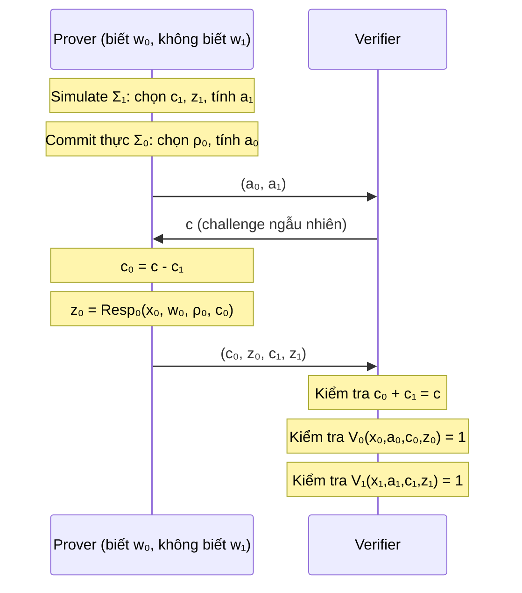
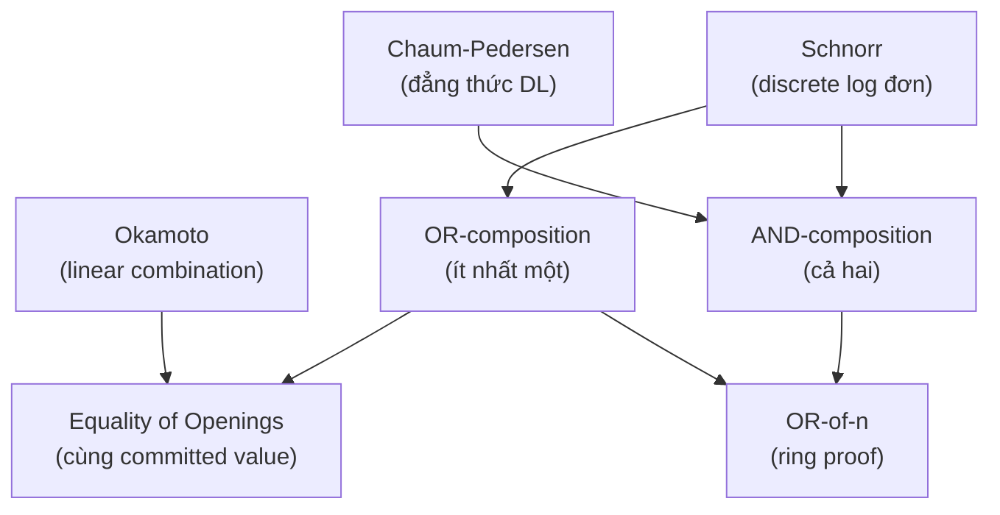

> **Prerequisites**: [[05-sigma-protocols|05. Sigma Protocols]] — cấu trúc 3-move, SHVZK, special soundness, Schnorr
> **Objectives**:
> - Hiểu AND-composition: chứng minh knowledge của nhiều witness cùng lúc
> - Nắm vững OR-composition (Cramer-Damgård-Schoenmakers): chứng minh "ít nhất một trong hai" mà không tiết lộ cái nào
> - Hiểu cách compose Sigma protocols để chứng minh các quan hệ phức tạp hơn
> - Thấy OR-proof như một primitive bảo mật quan trọng trong thực tế (e-voting, ring signatures)

---

## Motivation

Trong Bài 05, Sigma protocols chứng minh các tuyên bố dạng "tôi biết $x$ sao cho $X = g^x$". Nhưng các ứng dụng thực tế thường cần tuyên bố phức tạp hơn:

- "Tôi biết *cả hai* $x$ và $y$ sao cho $X = g^x$ và $Y = h^y$" — **AND**
- "Tôi biết *ít nhất một* trong $x$ hoặc $y$, nhưng không tiết lộ cái nào" — **OR**
- "Giá trị bí mật tôi cam kết nằm trong tập hợp hợp lệ" — dùng OR trên nhiều phần tử

Phần thú vị nhất là **OR-composition**: nó cho phép prover chứng minh rằng *một trong nhiều tuyên bố* là đúng mà không tiết lộ tuyên bố nào đúng. Đây là primitive cực kỳ mạnh — là nền tảng của ring signatures, anonymous credentials, và e-voting.

---

## AND-Composition

### Ý tưởng

AND-composition đơn giản: chạy hai Sigma protocols song song, dùng *cùng một challenge*.

> [!definition] Definition 6.1 — AND-Composition
>
> Cho hai Sigma protocols $\Sigma_0$ cho quan hệ $R_0 = \{(x_0, w_0)\}$ và $\Sigma_1$ cho $R_1 = \{(x_1, w_1)\}$.
>
> **AND-composition** $\Sigma_0 \wedge \Sigma_1$ là Sigma protocol cho quan hệ:
> $$R_\wedge = \{((x_0, x_1),\ (w_0, w_1)) : (x_0, w_0) \in R_0 \wedge (x_1, w_1) \in R_1\}$$
>
> **Giao thức**:
> 1. Prover chạy bước commit của cả $\Sigma_0$ và $\Sigma_1$ độc lập: $(a_0, \rho_0)$ và $(a_1, \rho_1)$. Gửi $(a_0, a_1)$.
> 2. Verifier gửi *một* challenge $c \leftarrow \mathcal{C}$ (dùng chung cho cả hai).
> 3. Prover tính response $z_0$ và $z_1$ cho $\Sigma_0$ và $\Sigma_1$ tương ứng. Gửi $(z_0, z_1)$.
> 4. Verifier kiểm tra cả hai: $V_0(x_0, a_0, c, z_0) = 1$ và $V_1(x_1, a_1, c, z_1) = 1$.

> [!theorem] Theorem 6.2 — Tính chất AND-Composition
>
> Nếu $\Sigma_0$ và $\Sigma_1$ đều có completeness, SHVZK, và special soundness, thì $\Sigma_0 \wedge \Sigma_1$ cũng có cả ba tính chất.
>
> - **Completeness**: Prover biết cả $w_0$ lẫn $w_1$ → cả hai response đều đúng. ✓
> - **SHVZK**: Simulator nhận $c$, sinh $(a_0, c, z_0)$ từ $S_0(x_0, c)$ và $(a_1, c, z_1)$ từ $S_1(x_1, c)$, ghép lại.
> - **Special soundness**: Từ hai accepting transcripts với cùng $(a_0, a_1)$ và khác $c$, extract $w_0$ từ $\Sigma_0$ và $w_1$ từ $\Sigma_1$ độc lập.

AND-composition không tinh tế — nó đơn thuần là chạy song song. Challenge chung đảm bảo prover không thể "chuyển randomness" giữa hai protocol.

---

## OR-Composition

### Tại sao OR phức tạp hơn?

Trong OR-proof, prover muốn chứng minh rằng ít nhất một trong $x_0 \in L_0$ hoặc $x_1 \in L_1$ là đúng — nhưng không tiết lộ cái nào. Điều này yêu cầu:

1. Prover thực sự biết witness cho *một trong hai* (giả sử $w_0$ cho $x_0 \in L_0$, không biết $w_1$).
2. Giao thức phải **soundness**: nếu cả hai đều sai, prover không thể thuyết phục.
3. Giao thức phải **ZK**: verifier không biết $b \in \{0, 1\}$ là tuyên bố nào đúng.

Vấn đề: làm sao prover "chứng minh" một tuyên bố mà mình không biết witness? Bí quyết là Sigma protocol cho phép **simulate** transcript mà không cần witness — nếu simulator biết challenge trước.

### OR-Proof: Chiến lược Cốt Lõi

Giả sử prover biết $w_0$ (cho $x_0$) nhưng không biết $w_1$ (cho $x_1$). Chiến lược:

1. Prover **simulate** transcript cho $\Sigma_1$ (cái mình không biết): chọn $c_1$ và $z_1$ trước, tính $a_1 = \text{Sim}(x_1, c_1, z_1)$ — đây là SHVZK simulator của $\Sigma_1$ chạy ngược.
2. Prover tạo commitment thực $a_0$ cho $\Sigma_0$ (cái mình biết).
3. Verifier gửi challenge $c$.
4. Prover đặt $c_0 = c \oplus c_1$ (hoặc $c_0 = c - c_1$ trong trường hợp tổng quát).
5. Prover tính $z_0$ thực từ $\Sigma_0$ với challenge $c_0$.
6. Gửi $(c_0, z_0, c_1, z_1)$.

Verifier kiểm tra: $c_0 + c_1 = c$ và cả hai transcript hợp lệ.

### OR-Composition Chính Thức (Cramer-Damgård-Schoenmakers)

> [!definition] Definition 6.3 — OR-Composition (CDS 1994)
>
> Cho $\Sigma_0$ và $\Sigma_1$ là hai Sigma protocols với cùng challenge space $\mathcal{C}$. OR-composition cho quan hệ:
> $$R_\vee = \{((x_0, x_1),\ (b, w_b)) : (x_b, w_b) \in R_b\}$$
>
> Prover biết $b \in \{0,1\}$ và $w_b$ (witness cho $x_b$). Không biết $w_{1-b}$.
>
> **Giao thức** (giả sử $b = 0$, prover biết $w_0$):
>
> 1. *Commit*:
>    - Prover mô phỏng $\Sigma_1$: chọn $c_1 \leftarrow \mathcal{C}$ và $z_1 \leftarrow$ uniform, tính $a_1 = \text{Sim}_1(x_1, c_1, z_1)$.
>    - Prover tạo commitment thực cho $\Sigma_0$: chọn $\rho_0$, tính $a_0 = \text{Com}_0(x_0, w_0, \rho_0)$.
>    - Gửi $(a_0, a_1)$.
>
> 2. *Challenge*: Verifier gửi $c \leftarrow \mathcal{C}$.
>
> 3. *Response*:
>    - Đặt $c_0 = c - c_1 \pmod{|\mathcal{C}|}$.
>    - Tính $z_0 = \text{Resp}_0(x_0, w_0, \rho_0, c_0)$.
>    - Gửi $(c_0, z_0, c_1, z_1)$.
>
> 4. *Verify*:
>    - $c_0 + c_1 = c \pmod{|\mathcal{C}|}$ ✓
>    - $V_0(x_0, a_0, c_0, z_0) = 1$ ✓
>    - $V_1(x_1, a_1, c_1, z_1) = 1$ ✓

*OR-proof: prover mô phỏng transcript cho tuyên bố không biết witness, tạo transcript thực cho tuyên bố biết witness, phân chia challenge sao cho tổng khớp.*

### Chứng minh Tính chất OR-Composition

> [!theorem] Theorem 6.4 — Completeness của OR-Composition
>
> Nếu prover biết $w_b$ cho $x_b$, giao thức luôn tạo accepting transcript.
>
> **Proof**: Transcript mô phỏng $(a_1, c_1, z_1)$ hợp lệ theo SHVZK của $\Sigma_1$ (simulator sinh transcript hợp lệ). Transcript thực $(a_0, c_0, z_0)$ hợp lệ vì completeness của $\Sigma_0$. Ràng buộc $c_0 + c_1 = c$ đúng theo cách xây dựng. $\blacksquare$

> [!theorem] Theorem 6.5 — Special Soundness của OR-Composition
>
> Từ hai accepting transcripts $(a_0, a_1, c, c_0, z_0, c_1, z_1)$ và $(a_0, a_1, c', c_0', z_0', c_1', z_1')$ với $c \neq c'$:
>
> Vì $c_0 + c_1 = c$ và $c_0' + c_1' = c'$ với $c \neq c'$, ta có:
> $(c_0 - c_0') + (c_1 - c_1') = c - c' \neq 0$, nên ít nhất một trong hai: $c_0 \neq c_0'$ hoặc $c_1 \neq c_1'$.
>
> **Trường hợp $c_0 \neq c_0'$**: ta có hai transcripts hợp lệ $(a_0, c_0, z_0)$ và $(a_0, c_0', z_0')$ với $a_0$ giống nhau, challenge khác → special soundness của $\Sigma_0$ cho $w_0$.
>
> **Trường hợp $c_1 \neq c_1'$**: tương tự, special soundness của $\Sigma_1$ cho $w_1$.
>
> Trong cả hai trường hợp, extractor tìm được witness cho ít nhất một statement. $\blacksquare$

> [!theorem] Theorem 6.6 — SHVZK của OR-Composition
>
> Simulator $S(x_0, x_1, c)$ hoạt động: chọn $c_0, c_1$ với $c_0 + c_1 = c$. Sinh $(a_0, c_0, z_0) \leftarrow S_0(x_0, c_0)$ và $(a_1, c_1, z_1) \leftarrow S_1(x_1, c_1)$. Xuất $(a_0, a_1, c_0, z_0, c_1, z_1)$.
>
> **Phân phối**: Trong giao thức thực khi prover biết $w_0$: $c_1$ là random uniform trong $\mathcal{C}$ (prover chọn), $c_0 = c - c_1$ cũng uniform. Trong simulator, $c_0$ cũng uniform (vì chia $c$ tùy ý). Cả hai phân phối giống hệt nhau → SHVZK. $\blacksquare$

---

## OR trên Nhiều Phần Tử: OR-of-$n$

> [!definition] Definition 6.7 — OR-of-n Composition
>
> Tổng quát hóa OR lên $n$ statements $(x_0, \ldots, x_{n-1})$: prover biết witness cho đúng một (hoặc nhiều hơn) trong số đó.
>
> **Giao thức**: Prover biết $w_b$ cho $x_b$. Mô phỏng tất cả $n-1$ transcript còn lại. Phân chia challenge $c$:
> $$c_0 + c_1 + \cdots + c_{n-1} = c \pmod{|\mathcal{C}|}$$
> Cố định $c_j$ ngẫu nhiên cho $j \neq b$, đặt $c_b = c - \sum_{j \neq b} c_j$.

> [!example] Example 6.8 — Ring Signature từ OR-of-n
>
> **Ring signature** cho phép thành viên ký thay mặt một nhóm (ring) mà không tiết lộ ai ký. Cách xây dựng:
>
> - Statement: "tôi biết private key của *một trong các* public keys $\{X_0, X_1, \ldots, X_{n-1}\}$"
> - Giao thức: OR-of-n trên các Schnorr protocols (một protocol cho mỗi public key)
> - Witness: private key $x_b$ sao cho $g^{x_b} = X_b$ (cho người ký thực)
>
> ZK đảm bảo verifier không biết $b$ — không biết ai ký thực sự.

---

## Equality of Openings

Một kỹ thuật composition quan trọng khác: chứng minh rằng hai commitments **cam kết cùng một giá trị**.

> [!definition] Definition 6.9 — Equality of Openings
>
> Cho Pedersen commitments (Bài 07) $C_0 = g^m h^{r_0}$ và $C_1 = g^m h^{r_1}$. Prover muốn chứng minh cả hai commit cùng $m$ mà không tiết lộ $m$, $r_0$, hay $r_1$.
>
> **Cách tiếp cận**: Xét $D = C_0 \cdot C_1^{-1} = h^{r_0 - r_1}$. Đây là commitment của $0$ với randomness $r_0 - r_1$. Prover cần chứng minh biết $\delta = r_0 - r_1$ sao cho $h^\delta = D$ — đây là Schnorr protocol đơn giản!
>
> Tổng quát hơn: dùng Okamoto protocol (Definition 5.12) để chứng minh các quan hệ tuyến tính giữa các committed values.

---

## Tổng kết: Sức Mạnh của Composition

*Từ Schnorr đơn giản, composition cho phép xây dựng các giao thức phức tạp cho các quan hệ bất kỳ.*

---

## Summary

- **AND-composition**: chạy hai Sigma protocols song song với *cùng challenge* → chứng minh biết cả hai witnesses.
- **OR-composition** (CDS 1994): prover mô phỏng transcript cho tuyên bố không biết witness, tạo transcript thực cho tuyên bố biết; phân chia challenge $c = c_0 + c_1$ → chứng minh biết *ít nhất một*, không tiết lộ cái nào.
- **Cơ chế then chốt**: SHVZK cho phép prover simulate transcript hợp lệ cho statement không biết witness — đây là sức mạnh làm cho OR-proof khả thi.
- **OR-of-n**: tổng quát hóa tự nhiên, nền tảng của ring signatures và anonymous credentials.
- **Equality of openings**: reduce về Schnorr/Okamoto — công cụ quan trọng khi làm việc với commitments.

---

## References

- Cramer, Damgård, Schoenmakers — *Proofs of Partial Knowledge and Simplified Design of Witness Hiding Protocols* (1994) — CRYPTO
- Damgård — *On Sigma Protocols* (lecture notes, 2010) — cs.au.dk/~ivan/Sigma.pdf
- Rivest, Shamir, Tauman — *How to Leak a Secret* (2001) — ASIACRYPT (ring signatures)
- Boneh & Shoup — *A Graduate Course in Applied Cryptography*, Ch. 19 (toc.cryptobook.us)
