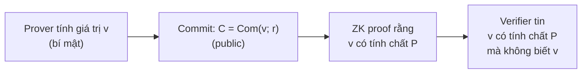

> **Prerequisites**: [[03-perfect-statistical-computational-zk|03. Perfect, Statistical, Computational ZK]] — computational indistinguishability; [[05-sigma-protocols|05. Sigma Protocols]] — Pedersen context
> **Objectives**:
> - Nắm vững định nghĩa formal của hiding và binding, và sự đánh đổi giữa chúng
> - Phân tích Pedersen commitment: perfectly hiding, computationally binding, homomorphic
> - Hiểu hash-based commitment và tradeoff so với Pedersen
> - Thấy cách commitment scheme là building block của ZKP: "lock and reveal"

---

## Motivation

Commitment scheme là một trong những building blocks cơ bản nhất của cryptography hiện đại. Ý tưởng là mô phỏng hành động "niêm phong một bức thư vào phong bì": sender đặt message vào phong bì (commit), phong bì che giấu nội dung (hiding), nhưng sau này sender không thể thay đổi nội dung (binding).

Trong ZKP, commitment schemes xuất hiện ở nhiều nơi:
- **Sigma protocols**: commit $a = g^r$ trước khi nhận challenge (Bài 05)
- **Pedersen commitments**: cam kết giá trị $m$ với randomness $r$ trong Schnorr-family protocols
- **Polynomial commitments** (KZG, FRI): cam kết toàn bộ đa thức một cách súc tích (Bài 12–16)

Hiểu commitment scheme sâu là điều kiện tiên quyết để hiểu mọi SNARK/STARK hiện đại.

---

## Định nghĩa Formal

### Cấu trúc Commitment Scheme

> [!definition] Definition 7.1 — Commitment Scheme
>
> Một **commitment scheme** là một triple thuật toán $(\text{Gen}, \text{Com}, \text{Open})$:
>
> - $\text{Gen}(1^\lambda) \to pp$: Sinh ra public parameters $pp$ (có thể là trusted setup hoặc transparent).
> - $\text{Com}(pp, m; r) \to c$: Với message $m$ và randomness $r$, tạo commitment $c$.
> - $\text{Open}(pp, c, m, r) \to \{\text{accept}, \text{reject}\}$: Kiểm tra $(c, m, r)$ có nhất quán không.
>
> Thường viết gọn: $c = \text{Com}(m; r)$ khi $pp$ ngầm định.

Commitment scheme yêu cầu **correctness**: nếu $c = \text{Com}(m; r)$ thì $\text{Open}(c, m, r) = \text{accept}$.

### Hiding

> [!definition] Definition 7.2 — Hiding
>
> Commitment scheme có **hiding** nếu $c = \text{Com}(m; r)$ không tiết lộ thông tin về $m$.
>
> **Perfectly hiding**: Với mọi $m_0, m_1$ và mọi adversary (kể cả vô hạn):
> $$\{\text{Com}(m_0; r) : r \leftarrow \mathcal{R}\} \equiv \{\text{Com}(m_1; r) : r \leftarrow \mathcal{R}\}$$
> Commitment có cùng phân phối bất kể message là $m_0$ hay $m_1$.
>
> **Computationally hiding** (IND): Không có PPT adversary nào có thể phân biệt $\text{Com}(m_0)$ và $\text{Com}(m_1)$ với xác suất đáng kể:
> $$|\Pr[A(\text{Com}(m_0)) = 1] - \Pr[A(\text{Com}(m_1)) = 1]| \leq \text{negl}(\lambda)$$

### Binding

> [!definition] Definition 7.3 — Binding
>
> Commitment scheme có **binding** nếu committer không thể mở $c$ ra hai giá trị khác nhau.
>
> **Perfectly binding**: Không tồn tại $(c, m_0, r_0, m_1, r_1)$ với $m_0 \neq m_1$ sao cho:
> $$\text{Com}(m_0; r_0) = \text{Com}(m_1; r_1) = c$$
>
> **Computationally binding**: Không có PPT adversary nào có thể tìm được $(c, m_0, r_0, m_1, r_1)$ với $m_0 \neq m_1$ như trên với xác suất đáng kể.

### Sự Đánh Đổi Căn Bản

> [!theorem] Theorem 7.4 — Information-Theoretic Impossibility
>
> Không thể đồng thời có **perfectly hiding** và **perfectly binding**.
>
> **Proof**: Giả sử perfectly hiding: mọi commitment $c$ có thể là commit của *bất kỳ* message nào (phân phối đều). Vậy tồn tại $m_0 \neq m_1$ và $r_0, r_1$ sao cho $\text{Com}(m_0; r_0) = c = \text{Com}(m_1; r_1)$ → vi phạm perfectly binding. $\blacksquare$

Hệ quả thực tế: phải chọn một trong hai:

| Scheme | Hiding | Binding |
|--------|--------|---------|
| **Pedersen** | Perfectly hiding | Computationally binding (dưới DLOG) |
| **Hash-based** | Computationally hiding | Perfectly binding |

---

## Pedersen Commitment

### Xây Dựng

> [!definition] Definition 7.5 — Pedersen Commitment
>
> **Setup**: Nhóm cyclic $\mathbb{G} = \langle g \rangle$ bậc $q$ (số nguyên tố), chọn ngẫu nhiên $h = g^\alpha$ với $\alpha$ ẩn (không ai biết discrete log của $h$ theo $g$). Public parameters: $(g, h, q, \mathbb{G})$.
>
> **Message space**: $\mathbb{Z}_q$.
>
> **Commit**: Với $m \in \mathbb{Z}_q$ và $r \leftarrow \mathbb{Z}_q$:
> $$C = \text{Com}(m; r) = g^m h^r \in \mathbb{G}$$
>
> **Open**: Prover tiết lộ $(m, r)$. Verifier kiểm tra $C = g^m h^r$.

### Perfectly Hiding

> [!theorem] Theorem 7.6 — Pedersen là Perfectly Hiding
>
> Với mọi $m_0, m_1 \in \mathbb{Z}_q$, phân phối của $\text{Com}(m_0)$ và $\text{Com}(m_1)$ (theo $r \leftarrow \mathbb{Z}_q$) đồng nhất.
>
> **Proof**: Với $m$ cố định và $r$ uniform trong $\mathbb{Z}_q$: $C = g^m h^r = g^m g^{\alpha r}$. Vì $r$ uniform, $\alpha r \pmod q$ cũng uniform (nhân một số ngẫu nhiên với hằng số không bằng 0 trong trường $\mathbb{Z}_q$). Do đó $C = g^{m + \alpha r}$ với $m + \alpha r$ uniform trong $\mathbb{Z}_q$ → $C$ phân phối đều trên $\mathbb{G}$, độc lập với $m$. $\blacksquare$

> [!note] Remark — Ý nghĩa của Perfectly Hiding
>
> Ngay cả adversary có sức mạnh vô hạn cũng không thể biết $m$ từ $C$. Đây là bảo mật thông tin lý thuyết — lý tưởng cho hiding. Sức mạnh của Pedersen nằm ở đây.

### Computationally Binding

> [!theorem] Theorem 7.7 — Pedersen là Computationally Binding dưới DLOG
>
> Nếu DLOG khó trong $\mathbb{G}$, thì Pedersen là computationally binding.
>
> **Proof** (contrapositive): Giả sử PPT adversary $A$ phá binding — tức là tìm được $(m_0, r_0) \neq (m_1, r_1)$ với $m_0 \neq m_1$ và $g^{m_0} h^{r_0} = g^{m_1} h^{r_1}$. Ta có:
>
> $$g^{m_0 - m_1} = h^{r_1 - r_0} = g^{\alpha(r_1 - r_0)}$$
>
> Vì $m_0 \neq m_1$, $(m_0 - m_1) \neq 0 \pmod q$. Suy ra:
>
> $$\alpha = \frac{m_0 - m_1}{r_1 - r_0} \pmod q$$
>
> Adversary $A$ đã tính được $\alpha$ = discrete log của $h$ theo $g$ → mâu thuẫn với DLOG assumption. $\blacksquare$

### Tính Homomorphic

Đây là tính chất phân biệt Pedersen khỏi các commitment thông thường và là lý do nó xuất hiện khắp nơi trong ZKP:

> [!definition] Definition 7.8 — Homomorphic Commitment
>
> Commitment scheme là **homomorphic** (cộng tính) nếu:
> $$\text{Com}(m_0; r_0) \cdot \text{Com}(m_1; r_1) = \text{Com}(m_0 + m_1; r_0 + r_1)$$
>
> Pedersen thỏa mãn điều này:
> $$g^{m_0} h^{r_0} \cdot g^{m_1} h^{r_1} = g^{m_0 + m_1} h^{r_0 + r_1}$$

> [!example] Example 7.9 — Ứng dụng Homomorphic: E-Voting
>
> Trong hệ thống bỏ phiếu điện tử, mỗi cử tri commit phiếu bầu $v_i \in \{0, 1\}$ thành $C_i = \text{Com}(v_i; r_i)$. Ban tổ chức có thể tính:
>
> $$C_{\text{total}} = \prod_i C_i = \text{Com}\!\left(\sum_i v_i;\ \sum_i r_i\right)$$
>
> Tức là commitment của *tổng phiếu* có thể tính từ các commitment riêng lẻ — không cần biết phiếu bầu cá nhân. Sau đó dùng ZK proof để mở $C_{\text{total}}$ và chứng minh đây là tổng hợp lệ.

### Pedersen Vector Commitment

> [!definition] Definition 7.10 — Pedersen Vector Commitment
>
> Cho $n$ generators $g_1, \ldots, g_n, h \in \mathbb{G}$ (discrete log giữa các $g_i$ và $h$ là ẩn). Commit vector $(m_1, \ldots, m_n)$:
>
> $$C = g_1^{m_1} \cdots g_n^{m_n} \cdot h^r$$
>
> Tính chất: Perfectly hiding, computationally binding dưới DLOG. Homomorphic theo từng coordinate.

---

## Hash-Based Commitment

> [!definition] Definition 7.11 — Hash-Based Commitment
>
> **Setup**: Hash function $H : \{0,1\}^* \to \{0,1\}^\lambda$ (random oracle).
>
> **Commit**: $C = H(m \| r)$ với $r \leftarrow \{0,1\}^\lambda$.
>
> **Open**: Tiết lộ $(m, r)$, verifier kiểm tra $H(m \| r) = C$.

> [!theorem] Theorem 7.12 — Tính chất Hash-Based Commitment
>
> Trong Random Oracle Model (ROM):
> - **Computationally hiding**: Vì $r$ là random salt, $H(m \| r)$ trông như output ngẫu nhiên — không tiết lộ $m$ cho PPT adversary.
> - **Perfectly binding**: Vì $H$ là deterministic, không thể có $(m_0, r_0) \neq (m_1, r_1)$ với $H(m_0 \| r_0) = H(m_1 \| r_1)$ (không có collision trong ROM).

So sánh với Pedersen:

| | Pedersen | Hash-Based |
|--|---------|-----------|
| Hiding | **Perfectly** | Computationally |
| Binding | Computationally | **Perfectly** |
| Homomorphic | **Có** | Không |
| Trusted setup | Cần ($g, h$) | Không cần |
| Dùng trong | Sigma protocols, SNARK | Merkle tree, FRI, STARK |

---

## Vai Trò trong ZKP

Commitment scheme là cầu nối giữa "giữ bí mật" và "chứng minh tính đúng". Cơ chế "lock and reveal" hoạt động như sau:

*Commitment scheme cho phép prover "khóa" giá trị trước, sau đó chứng minh tính chất của giá trị đã khóa mà không cần tiết lộ.*

Cụ thể trong Sigma protocols (Bài 05):
- Commitment $R = g^r$ trong Schnorr là **commitment của randomness** $r$ — prover "lock" $r$ trước khi nhận challenge.
- Tính **binding** đảm bảo prover không thể thay đổi $r$ sau khi đã gửi $R$.
- Tính **hiding** của $R = g^r$ (là perfectly hiding vì $r$ uniform → $R$ uniform) đảm bảo ZK.

---

## Commitment Scheme như Nền Tảng của SNARK

Trong Phần III của lộ trình, ta sẽ thấy **polynomial commitment schemes** (PCS) là nền tảng trực tiếp của các SNARK/STARK:

| Polynomial Commitment Scheme | Dùng trong | Hiding | Binding |
|-----------------------------|------------|--------|---------|
| **KZG** (Bài 13) | Groth16, PLONK | Computationally | Computationally (dưới pairing assumptions) |
| **FRI** (Bài 16) | STARKs | Statistically | Computationally (dưới hash collision resistance) |
| **IPA/Bulletproofs** (Bài 11) | Halo2 | Perfectly | Computationally (dưới DLOG) |

PCS là generalization của Pedersen/Hash-based commitments: thay vì commit một *scalar* $m$, commit một *đa thức* $f(X)$ với kích thước commitment cố định (ngắn), và vẫn có thể chứng minh evaluation $f(a) = b$ tại bất kỳ điểm $a$ nào.

---

## Summary

- **Commitment scheme**: $(c = \text{Com}(m; r))$ — hiding (ẩn $m$) và binding (không thể đổi $m$ sau khi commit).
- **Perfectly hiding vs. computationally hiding**: mức độ bảo mật hiding.
- **Perfectly binding vs. computationally binding**: mức độ bảo mật binding.
- **Không thể đồng thời perfectly hiding và perfectly binding** (Theorem 7.4).
- **Pedersen**: $C = g^m h^r$ — perfectly hiding, computationally binding (DLOG), **homomorphic** — dùng cho Sigma protocols và nhiều SNARK.
- **Hash-based**: $C = H(m \| r)$ — computationally hiding, perfectly binding, không homomorphic — dùng cho Merkle trees và FRI.
- Homomorphic commitments cho phép tính toán trên committed values: $\text{Com}(a) \cdot \text{Com}(b) = \text{Com}(a+b)$.
- Polynomial commitment schemes (KZG, FRI, IPA) là generalization quan trọng — nền tảng của mọi SNARK/STARK hiện đại.

---

## References

- Pedersen — *Non-Interactive and Information-Theoretic Secure Verifiable Secret Sharing* (1991) — CRYPTO
- Brassard, Chaum, Crépeau — *Minimum Disclosure Proofs of Knowledge* (1988)
- Boneh & Shoup — *A Graduate Course in Applied Cryptography*, Ch. 12, 19 (toc.cryptobook.us)
- Thaler — *Proofs, Arguments, and Zero-Knowledge*, Ch. 14 (Polynomial Commitment Schemes)
- Bootle et al. — *Efficient Zero-Knowledge Arguments for Arithmetic Circuits* (2016) — EUROCRYPT
