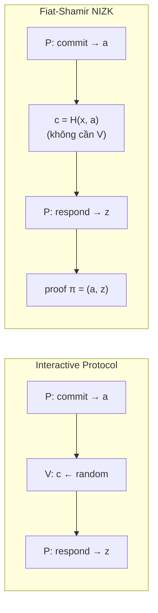

> **Prerequisites**: [[05-sigma-protocols|05. Sigma Protocols]] — SHVZK, public-coin; [[07-commitment-schemes|07. Commitment Schemes]] — hiding/binding; [[04-proof-of-knowledge|04. Proof of Knowledge & Knowledge Soundness]] — Forking Lemma
> **Objectives**:
> - Hiểu Random Oracle Model (ROM) và vai trò của nó trong cryptographic proofs
> - Nắm vững Fiat-Shamir transform: biến interactive protocol thành non-interactive
> - Phân biệt **strong** vs. **weak** Fiat-Shamir và tại sao điều này quan trọng
> - Hiểu định nghĩa NIZK và tại sao ROM cho phép NIZK hiệu quả
> - Nắm được tầm quan trọng của **transcript completeness** và **domain separation**

---

## Motivation

Tất cả Sigma protocols từ Bài 05–06 là **interactive**: prover và verifier phải trao đổi trực tiếp. Điều này không khả thi trong nhiều ứng dụng thực tế:

- **Blockchain**: proof được lưu trên chain, không có verifier trực tiếp — cần proof ai cũng có thể verify sau.
- **Chữ ký số**: Schnorr signature cần biến giao thức tương tác thành non-interactive.
- **zkSNARK**: verifier không online, proof được tạo trước và verify sau.

Fiat-Shamir transform giải quyết vấn đề này bằng một ý tưởng đơn giản và sâu sắc: thay thế challenge ngẫu nhiên của verifier bằng **output của hash function** áp dụng lên transcript.

---

## Random Oracle Model

### Hash Functions như "Random Oracle"

Trong thực tế, hash functions như SHA-256 hay SHA-3 không phải là random — chúng là các hàm deterministic có cấu trúc. Nhưng đối với mục đích phân tích bảo mật, ta thường mô hình hóa chúng như là **random oracle**.

> [!definition] Definition 8.1 — Random Oracle Model (ROM)
>
> Trong **Random Oracle Model**, hash function $H : \{0,1\}^* \to \{0,1\}^\lambda$ được mô hình hóa như một oracle ngẫu nhiên:
>
> - Với mọi query $q$ *mới*, $H(q)$ được chọn uniform từ $\{0,1\}^\lambda$ và ghi nhớ.
> - Với cùng query $q$ lặp lại, $H(q)$ luôn trả về cùng giá trị (consistent).
> - Tất cả các parties (prover, verifier, adversary) đều có quyền query $H$, và có thể thấy queries của nhau (public oracle).

Trong ROM, $H$ thực sự là ngẫu nhiên — không có cấu trúc nào để khai thác. Bảo mật trong ROM thường coi là bằng chứng tốt rằng scheme an toàn với hash function tốt trong thực tế, dù không phải là chứng minh formal.

> [!warning] Pitfall — ROM không phải là Standard Model
>
> Các scheme chỉ an toàn trong ROM có thể *không* an toàn với hash function cụ thể nào. Có những separation results cho thấy điều này về mặt lý thuyết. Tuy nhiên, trong thực tế, ROM là mô hình phổ biến và hợp lý cho hầu hết ứng dụng.

---

## Fiat-Shamir Transform

### Ý Tưởng Cơ Bản

Trong Sigma protocol, challenge $c$ của verifier là một giá trị ngẫu nhiên. Nhưng nếu $c$ là output của hash function áp dụng lên transcript trước đó, thì:

1. Prover có thể tự tính $c$ mà không cần verifier.
2. Verifier kiểm tra bằng cách tính lại $H(\cdot)$ với cùng transcript.
3. Trong ROM, $c = H(\cdot)$ thực sự là ngẫu nhiên từ góc nhìn của prover.

> [!definition] Definition 8.2 — Fiat-Shamir Transform
>
> Cho Sigma protocol $\Sigma = (P, V)$ với statement $x$, witness $w$, và challenge space $\mathcal{C}$.
>
> **Fiat-Shamir transform** biến $\Sigma$ thành NIZK:
>
> **Prove** $(x, w) \to \pi$:
> 1. Prover chạy bước commit: $a \leftarrow P.\text{Commit}(x, w; \rho)$.
> 2. Tính challenge: $c = H(x, a) \in \mathcal{C}$.
> 3. Tính response: $z \leftarrow P.\text{Respond}(x, w, \rho, c)$.
> 4. Proof: $\pi = (a, z)$.
>
> **Verify** $(x, \pi = (a, z)) \to \{\text{accept}, \text{reject}\}$:
> 1. Tính lại $c = H(x, a)$.
> 2. Kiểm tra $V(x, a, c, z) = \text{accept}$.

*Fiat-Shamir: challenge ngẫu nhiên của verifier được thay bằng hash của transcript — loại bỏ interaction.*

---

## Strong vs. Weak Fiat-Shamir

Đây là điểm tinh tế quan trọng nhất của bài này, và là nguồn gốc của nhiều lỗ hổng bảo mật trong thực tế.

### Weak Fiat-Shamir

> [!definition] Definition 8.3 — Weak Fiat-Shamir
>
> **Weak Fiat-Shamir**: challenge được tính chỉ từ commitment $a$:
> $$c = H(a)$$
>
> Statement $x$ **không** được đưa vào hash.

### Strong Fiat-Shamir

> [!definition] Definition 8.4 — Strong Fiat-Shamir
>
> **Strong Fiat-Shamir**: challenge được tính từ *toàn bộ context có liên quan*:
> $$c = H(x, a)$$
>
> Ít nhất statement $x$ và commitment $a$ phải được đưa vào hash. Trong thực tế, thường hash cả public parameters nữa:
> $$c = H(pp, x, a)$$

> [!danger] Vulnerability — Weak Fiat-Shamir cho phép Proof Reuse
>
> Với weak Fiat-Shamir ($c = H(a)$), một proof $\pi = (a, z)$ cho statement $x$ cũng là proof hợp lệ cho *bất kỳ* statement $x'$ nào! Verifier tính $c = H(a)$ (không phụ thuộc $x$) và kiểm tra $V(x', a, c, z)$.
>
> **Tấn công**: Adversary lấy proof hợp lệ cho $x$ và submit nó như proof cho $x' \neq x$. Nếu giao thức verification không ràng buộc proof với statement cụ thể, tấn công thành công.
>
> Đây là lỗ hổng đã xuất hiện trong một số hệ thống ZK thực tế (ví dụ: các verifier contract trên blockchain không include statement vào hash).

---

## Transcript Completeness

### Định Nghĩa

> [!definition] Definition 8.5 — Transcript Completeness
>
> Fiat-Shamir được gọi là có **transcript completeness** nếu *toàn bộ thông tin cần thiết để tái tạo và verify proof* được include trong hash khi tính challenge.
>
> Trong thực tế: hash phải include tất cả thông tin public mà verifier cần biết để tính challenge một cách đúng đắn.

### Tại Sao Điều Này Quan Trọng?

Xét giao thức PLONK (Bài 15): quá trình tạo proof gồm 5 rounds, mỗi round prover gửi polynomials và nhận challenge. Nếu round cuối — khi prover gửi KZG evaluation proofs — không được include vào hash của challenge round trước đó, adversary có thể:

1. Tạo proof "chính xác" cho các rounds 1–4.
2. Sau khi nhận challenge round 4, *tính toán lại* evaluation proofs sao cho chúng "khớp" với một witness giả.
3. Submit proof không hợp lệ.

Đây là **Last Challenge Attack** (Bài 14). Nguyên nhân gốc: transcript không đầy đủ trong hash.

**Nguyên tắc**: Mọi giá trị prover gửi trước khi nhận một challenge phải được include trong hash khi tính challenge đó.

---

## Domain Separation

> [!definition] Definition 8.6 — Domain Separation
>
> **Domain separation** là kỹ thuật đảm bảo hash queries từ các "ngữ cảnh" khác nhau không va chạm nhau, bằng cách thêm một **tag** (nhãn) phân biệt:
>
> $$c_i = H(\text{tag}_i \| x \| a_1 \| a_2 \| \cdots \| a_i)$$
>
> Trong đó $\text{tag}_i$ là một chuỗi cố định xác định "đây là challenge thứ $i$ trong giao thức $\Pi$".

Domain separation quan trọng khi:
- Một hệ thống dùng hash cho nhiều mục đích khác nhau (challenge generation, commitment, key derivation).
- Không có domain separation: adversary có thể tạo collision giữa queries từ các context khác nhau.
- Có domain separation: hash queries từ mỗi context tạo ra output độc lập.

Trong thực tế, chuẩn IETF và các hệ thống như PLONK, Halo2 dùng domain separation bằng cách prefix hash với tên protocol và context cụ thể.

---

## Bảo Mật của Fiat-Shamir trong ROM

### Soundness trong ROM

> [!theorem] Theorem 8.7 — Fiat-Shamir NIZK là Proof of Knowledge trong ROM
>
> Nếu Sigma protocol $\Sigma$ có special soundness với extractor $E$, thì Fiat-Shamir transform của $\Sigma$ là **proof of knowledge** trong ROM.
>
> **Chứng minh phác thảo** (dùng Forking Lemma):
>
> Giả sử adversary $A$ xuất ra proof $\pi = (a, z)$ hợp lệ cho $x$ (tức là $V(x, a, H(x,a), z) = 1$) với xác suất $\epsilon$.
>
> Extractor $E^{A, H}$ (với oracle access đến $A$ và khả năng lập trình ROM):
> 1. Chạy $A$ để lấy proof $(a, z)$ — gọi query $H(x, a) = c$.
> 2. **Reprogram**: đặt lại $H(x, a) = c'$ với $c' \neq c$ ngẫu nhiên.
> 3. Chạy lại $A$ từ điểm $A$ đã tính $a$ (rewinding) — $A$ nhận challenge $c'$ và xuất ra $z'$.
> 4. Ta có hai accepting transcripts $(a, c, z)$ và $(a, c', z')$ với $c \neq c'$.
> 5. Special soundness: $E(a, c, z, a, c', z') = w$. $\blacksquare$

Điểm then chốt: ROM cho phép extractor **reprogram** hash function — đặt lại giá trị $H(x, a)$ sau khi biết $a$. Đây là điều không thể làm với hash function thực tế, nhưng hợp lệ trong ROM.

### Zero-Knowledge trong ROM

> [!theorem] Theorem 8.8 — Fiat-Shamir NIZK là ZK trong ROM
>
> Nếu $\Sigma$ là SHVZK, thì Fiat-Shamir transform là zero-knowledge trong ROM.
>
> **Chứng minh phác thảo** (simulator):
>
> Simulator $S(x)$ (không có witness):
> 1. Chọn $c \leftarrow \mathcal{C}$ ngẫu nhiên.
> 2. Dùng SHVZK simulator của $\Sigma$: $(a, c, z) \leftarrow S_\Sigma(x, c)$.
> 3. **Program** ROM: đặt $H(x, a) = c$.
> 4. Xuất proof $\pi = (a, z)$.
>
> Proof $\pi$ hợp lệ vì $(a, c, z)$ là accepting transcript và $H(x, a) = c$ theo programming. Phân phối của $\pi$ giống như proof thực trong ROM. $\blacksquare$

Lại sử dụng khả năng **program** ROM — đặt hash value sao cho challenge khớp với transcript đã sinh trước.

---

## Định Nghĩa NIZK

Bây giờ ta có thể định nghĩa NIZK chính xác:

> [!definition] Definition 8.9 — Non-Interactive Zero-Knowledge (NIZK)
>
> Một **NIZK proof system** là triple $(\text{Setup}, \text{Prove}, \text{Verify})$:
>
> - $\text{Setup}(1^\lambda) \to \sigma$: Sinh common reference string (CRS) $\sigma$.
> - $\text{Prove}(\sigma, x, w) \to \pi$: Sinh proof $\pi$ (không tương tác, chỉ dùng $\sigma, x, w$).
> - $\text{Verify}(\sigma, x, \pi) \to \{0, 1\}$: Kiểm tra proof.
>
> Thỏa mãn:
> - **Completeness**: $(x, w) \in R \Rightarrow \Pr[\text{Verify}(\sigma, x, \text{Prove}(\sigma, x, w)) = 1] \geq 1 - \text{negl}$.
> - **Soundness** (hoặc Knowledge Soundness): $x \notin L \Rightarrow$ mọi adversary không tạo được proof hợp lệ (hoặc extractor extract được witness).
> - **Zero-Knowledge**: Tồn tại simulator $S(\sigma, x)$ tạo proof không thể phân biệt với proof thực.

> [!note] Remark — CRS và ROM
>
> Trong Fiat-Shamir NIZK, CRS là $\sigma = H$ (hash function). Trong ROM, $H$ là random oracle — không có trusted setup thực sự. Ngược lại, các NIZK như Groth16 cần CRS là structured reference string (SRS) từ trusted setup (Bài 13–14).

### NIZK trong ROM vs. Standard Model

| | NIZK trong ROM | NIZK trong Standard Model |
|--|---------------|--------------------------|
| **Ví dụ** | Fiat-Shamir + Sigma protocol | Groth16, PLONK |
| **CRS** | Hash function (transparent) | SRS từ trusted setup |
| **Bảo mật** | Heuristic (ROM assumption) | Formal dưới pairing assumptions |
| **Proof size** | Phụ thuộc Sigma protocol | Thường nhỏ hơn (constant-size) |

---

## Fiat-Shamir cho Multi-Round Protocols

Fiat-Shamir không chỉ áp dụng cho Sigma protocol (3-move). Với giao thức nhiều round, áp dụng Fiat-Shamir *từng round*:

> [!definition] Definition 8.10 — Fiat-Shamir cho $k$-Round Protocol
>
> Với giao thức public-coin $(m_1, c_1, m_2, c_2, \ldots, m_k, c_k)$:
>
> $$c_i = H(\text{tag}_i \| x \| m_1 \| c_1 \| \cdots \| m_i)$$
>
> Mỗi challenge $c_i$ là hash của *toàn bộ transcript trước đó* (kể cả tất cả messages và challenges trước đó).

**Nguyên tắc quan trọng**: Challenge $c_i$ phải commit vào *tất cả* messages $m_1, \ldots, m_i$ và challenges $c_1, \ldots, c_{i-1}$ đã xảy ra trước đó. Nếu bỏ sót bất kỳ giá trị nào, có thể dẫn đến tấn công.

Đây là lý do tại sao strong Fiat-Shamir (Definition 8.4) và transcript completeness (Definition 8.5) không chỉ là khuyến cáo mà là **điều kiện bắt buộc** cho bảo mật.

---

## Summary

- **ROM**: hash function được mô hình hóa như oracle ngẫu nhiên — mọi output đều independent và uniform.
- **Fiat-Shamir transform**: thay challenge ngẫu nhiên bằng $c = H(x, a)$ — biến interactive protocol thành non-interactive proof.
- **Weak FS** ($c = H(a)$): nguy hiểm — proof có thể reuse cho statement khác.
- **Strong FS** ($c = H(x, a)$): đúng đắn — proof ràng buộc chặt với statement $x$.
- **Transcript completeness**: *mọi* giá trị prover gửi trước challenge phải được include trong hash.
- **Domain separation**: dùng tag để phân biệt hash queries từ các context khác nhau.
- **Bảo mật trong ROM**: Fiat-Shamir NIZK là PoK + ZK, dùng reprogram/rewind ROM trong chứng minh.
- **NIZK**: proof không tương tác với completeness, soundness, ZK — Fiat-Shamir cho ROM, Groth16/PLONK cho standard model.

---

## References

- Fiat, Shamir — *How to Prove Yourself: Practical Solutions to Identification and Signature Problems* (1986) — CRYPTO
- Pointcheval, Stern — *Security Arguments for Digital Signatures and Blind Signatures* (2000) — Journal of Cryptology (Forking Lemma)
- Bellare, Neven — *Multi-Signatures in the Plain Public-Key Model and a General Forking Lemma* (2006) — ACM CCS
- Bernhard et al. — *Not So Blindly Signed: Schnorr Blind Signatures in the Real World* (2011) (strong vs weak FS)
- Boneh & Shoup — *A Graduate Course in Applied Cryptography*, Ch. 8, 19 (toc.cryptobook.us)
- Thaler — *Proofs, Arguments, and Zero-Knowledge*, Ch. 3 (people.cs.georgetown.edu/jthaler/ProofsArgsAndZK.pdf)
- zkdocs — *Fiat-Shamir Vulnerabilities* (zkdocs.com/docs/zkdocs/protocol-primitives/fiat-shamir/)
