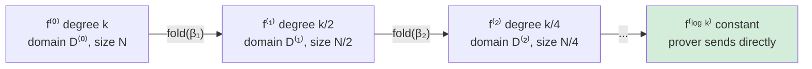
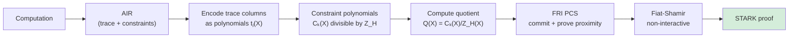

> **Prerequisites**: [[11-multilinear-extensions-and-sumcheck|11. Multilinear Extensions & Sumcheck]] — IOP model, sumcheck; [[12-iop-and-polynomial-commitments|12. IOP & Polynomial Commitments]] — PCS phân loại, hash-based PCS; [[08-fiat-shamir-and-nizk|08. Fiat-Shamir]] — Random Oracle Model
> **Objectives**:
> - Hiểu tại sao STARK không cần trusted setup và hậu quả với proof size
> - Nắm được khái niệm Reed-Solomon codes và proximity testing
> - Hiểu ý tưởng FRI folding: giảm bậc đa thức qua từng round
> - Hiểu AIR arithmetization — cách encode execution traces
> - Phân biệt STARK vs. SNARK về tradeoff và ứng dụng

---

## Motivation: Vượt Ra Khỏi Trusted Setup

Cả Groth16 và PLONK đều dựa vào bilinear pairings và trusted setup (SRS với toxic waste $\tau$). Điều này có hai vấn đề:

1. **Trusted setup risk**: nếu $\tau$ bị lộ hoặc không xóa đúng cách → compromised
2. **Quantum vulnerability**: elliptic curve DLP bị phá bởi Shor's algorithm → không post-quantum

**ZK-STARK** (Scalable Transparent ARguments of Knowledge) giải quyết cả hai bằng cách dùng hash functions thay pairings:
- **Transparent**: không trusted setup (transparent SRS = random oracle)
- **Post-quantum**: dựa vào collision-resistant hash functions

Tradeoff: proof lớn hơn (~10–100× so với Groth16).

---

## Reed-Solomon Codes

FRI dựa vào lý thuyết mã sửa lỗi (error-correcting codes), đặc biệt **Reed-Solomon codes**.

> [!definition] Definition 16.1 — Reed-Solomon Code
>
> Cho evaluation domain $D = \{d_0, d_1, \ldots, d_{N-1}\} \subset \mathbb{F}_p$ kích thước $N$, và tham số **rate** $\rho = k/N$ (với $k \leq N$).
>
> **Reed-Solomon code** $\mathsf{RS}[D, k]$: tập hợp tất cả codewords là evaluation của đa thức bậc $< k$ trên domain $D$:
>
> $$\mathsf{RS}[D, k] = \{(f(d_0), f(d_1), \ldots, f(d_{N-1})) : f \in \mathbb{F}_p[X], \deg(f) < k\}$$
>
> **Relative distance**: hai codeword khác nhau tại ít nhất $N - k + 1$ vị trí (Singleton bound).
>
> Nếu rate $\rho = k/N$ nhỏ (say $\rho = 1/4$): codewords "rất xa nhau" — sai sót dễ phát hiện.

### Proximity Testing

Bài toán: verifier có oracle access vào một hàm $f: D \to \mathbb{F}_p$. Verifier muốn kiểm tra $f$ có **gần** là codeword RS[$D, k$] không — tức là $f$ khác codeword RS thật tại ít nhất $\delta N$ vị trí (proximity parameter $\delta$).

> [!definition] Definition 16.2 — $\delta$-Proximity
>
> Hàm $f: D \to \mathbb{F}_p$ được gọi là $\delta$-far từ RS[$D, k$] nếu với mọi đa thức $g$ bậc $< k$:
>
> $$\Pr_{i \xleftarrow{\$} [N]}[f(d_i) \neq g(d_i)] > \delta$$
>
> Ngược lại, $f$ là $\delta$-close nếu tồn tại $g$ đa thức bậc $< k$ với $f$ và $g$ agree tại $> (1-\delta)N$ vị trí.

Kiểm tra proximity với $q$ queries là "hard" trực tiếp — cần FRI protocol.

---

## FRI Protocol — Fast Reed-Solomon IOP of Proximity

FRI (Ben-Sasson et al., 2018) là protocol để prover thuyết phục verifier rằng $f$ là **gần với đa thức bậc thấp** — với số queries polylogarithmic.

### Ý Tưởng Cốt Lõi: Folding

FRI hoạt động theo cơ chế **folding**: chia đa thức bậc $k$ thành hai đa thức bậc $k/2$, kết hợp ngẫu nhiên.

> [!definition] Definition 16.3 — FRI Folding
>
> Cho đa thức $f$ bậc $< k$. Viết:
>
> $$f(X) = f_E(X^2) + X \cdot f_O(X^2)$$
>
> trong đó $f_E$ là phần chẵn (even powers), $f_O$ là phần lẻ (odd powers). Cả $f_E, f_O$ đều có bậc $< k/2$.
>
> Với random challenge $\beta \xleftarrow{\$} \mathbb{F}_p$, define:
>
> $$f^{(1)}(X^2) := f_E(X^2) + \beta \cdot f_O(X^2) = \frac{f(X) + f(-X)}{2} + \beta \cdot \frac{f(X) - f(-X)}{2X}$$
>
> $f^{(1)}$ là đa thức bậc $< k/2$ trên domain $D^{(1)} = \{x^2 : x \in D\}$ (kích thước $N/2$).

Sau $\log_2(k)$ rounds folding, đa thức được reduce về bậc $O(1)$ — prover gửi trực tiếp.

### FRI Protocol Chi Tiết

> [!definition] Definition 16.4 — FRI Protocol
>
> **Commit phase** ($\log_2 k$ rounds):
>
> - Round 0: Prover commit (Merkle) $f^{(0)} = f$ trên $D^{(0)} = D$.
> - Round $i \geq 1$: Verifier gửi $\beta_i$. Prover fold:
>   $$f^{(i)}(y) = f^{(i-1)}_E(y) + \beta_i \cdot f^{(i-1)}_O(y)$$
>   Prover commit (Merkle) $f^{(i)}$ trên $D^{(i)} = \{x^2 : x \in D^{(i-1)}\}$.
> - Cuối cùng: $f^{(\log k)}$ là hằng số hoặc đa thức bậc thấp — prover gửi trực tiếp.
>
> **Query phase** ($s$ repetitions để đạt soundness $2^{-s}$):
>
> Với mỗi repetition: Verifier chọn ngẫu nhiên $x^{(0)} \in D^{(0)}$.
> - Verifier query $f^{(0)}(x^{(0)})$ và $f^{(0)}(-x^{(0)})$ từ Merkle tree (round 0).
> - Verifier tính $x^{(1)} = (x^{(0)})^2$, query $f^{(1)}(x^{(1)})$ từ Merkle tree (round 1).
> - Tiếp tục đến $f^{(\log k)}$ (check với giá trị prover gửi).
> - Verifier xác minh từng bước folding: $f^{(i)}(x^{(i)}) = \frac{f^{(i-1)}(x^{(i-1)}) + f^{(i-1)}(-x^{(i-1)})}{2} + \beta_i \cdot \frac{f^{(i-1)}(x^{(i-1)}) - f^{(i-1)}(-x^{(i-1)})}{2 x^{(i-1)}}$



*FRI commit phase: mỗi round fold đa thức về bậc nhỏ hơn một nửa.*

### FRI Complexity

| Đặc trưng | Giá trị |
|-----------|---------|
| Commit phase | $O(\log k)$ rounds, $O(N)$ total hashes |
| Proof size | $O(s \cdot \log^2 N)$ hashes (với $s$ query reps) |
| Query complexity | $O(s \cdot \log N)$ |
| Verify time | $O(s \cdot \log N)$ hash operations |

### Soundness của FRI

> [!theorem] Theorem 16.5 — FRI Soundness (informal)
>
> Nếu $f$ là $\delta$-far từ $\mathsf{RS}[D, k]$ với $\delta > \rho$ (rate), thì FRI verifier reject với xác suất $\geq 1 - 2^{-s}$ sau $s$ query repetitions.
>
> Concrete: với $\rho = 1/4$, $s = 80$ reps, $N = 2^{20}$: proof size ~$200$ KB, soundness $2^{-80}$.

---

## FRI như là PCS

FRI là **proximity test** — không trực tiếp là PCS. Để dùng FRI như PCS:

> [!definition] Definition 16.6 — FRI-based PCS
>
> Để commit đến đa thức $f$ bậc $< k$:
> 1. **Commit**: tính Merkle root của $(f(d_0), \ldots, f(d_{N-1}))$.
>
> Để open tại điểm $z$:
> 1. Prover gửi $v = f(z)$.
> 2. Prover chạy FRI để chứng minh $g(X) = (f(X) - v)/(X - z)$ có bậc $< k-1$ (quotient polynomial, tương tự KZG).
> 3. FRI output: log-size proof rằng $g$ gần đa thức bậc thấp.
>
> **Proof size**: $O(\log^2 k)$ hashes — $O(\text{polylog})$ thay vì $O(1)$ của KZG.

---

## Algebraic Intermediate Representation (AIR)

STARK cần arithmetization riêng: không dùng R1CS hay Plonkish, mà dùng **AIR** — phù hợp cho encode execution traces của computation.

> [!definition] Definition 16.7 — AIR (Algebraic Intermediate Representation)
>
> Một **AIR** gồm:
> - **Trace**: ma trận $T \in \mathbb{F}_p^{n \times w}$ — $n$ steps (rows), $w$ registers (columns).
>   - $T[i][j]$ là giá trị register $j$ tại step $i$ của computation.
> - **Boundary constraints**: điều kiện trên $T[0][j]$ (initial state) và $T[n-1][j]$ (final state).
> - **Transition constraints**: đa thức $P_k(T[i], T[i+1]) = 0$ cho mọ $i$ — encode computation step.

**Ví dụ**: Fibonacci sequence $a_{n+2} = a_{n+1} + a_n$:

```text
Trace (2 registers):
Step 0:  [1, 0]     ← initial: a₀=1, a₁=0
Step 1:  [1, 1]
Step 2:  [2, 1]
Step 3:  [3, 2]
...
Step n:  [Fₙ, Fₙ₋₁]  ← final
```

Transition constraint: $T[i+1][0] = T[i][0] + T[i][1]$ và $T[i+1][1] = T[i][0]$.

Boundary: $T[0][0] = 1, T[0][1] = 0$. Final: verifier checks $T[n][0]$ = claimed Fibonacci value.

### Execution Trace → Polynomials

Mỗi column $j$ của trace được interpolate thành đa thức $t_j(X)$ trên $H = \{\omega^0, \ldots, \omega^{n-1}\}$:

$$t_j(\omega^i) = T[i][j]$$

Transition constraint $P_k(T[i], T[i+1]) = 0$ trở thành:

$$P_k(t_0(\omega^i X), t_1(\omega^i X), \ldots; t_0(\omega^{i+1} X), \ldots) = 0 \quad \forall i$$

Tức là $C_k(X) = P_k(t_0(X), \ldots, t_{w-1}(X); t_0(\omega X), \ldots, t_{w-1}(\omega X))$ phải bằng 0 trên $H$, tương đương $Z_H \mid C_k$.

---

## ZK-STARK Pipeline



*ZK-STARK pipeline: AIR arithmetization → polynomial constraints → FRI proximity proof.*

### Bước Tinh Chỉnh: DEEP-ALI

Để kết hợp nhiều column và constraint polynomials hiệu quả, STARK dùng:

1. **ALI** (Algebraic Linking IOP): link trace polynomials và constraint polynomials
2. **DEEP** (Domain Extending for Eliminating Pretenders): query ngoài trace domain để tránh attack

Những kỹ thuật này đảm bảo soundness tốt hơn với số queries ít hơn.

---

## STARK vs. SNARK — Tradeoff Tổng Quát

| Đặc trưng | SNARK (Groth16/PLONK) | STARK (FRI-based) |
|-----------|-----------------------|-------------------|
| Trusted setup | Cần | **Không cần** |
| Proof size | **Nhỏ** (~kB) | Lớn (~100s kB–MB) |
| Verify time | **Rất nhanh** ($O(1)$ pairings) | Nhanh ($O(\log^2 n)$ hashes) |
| Prover time | Chậm (multi-scalar mult.) | Tương đương |
| Quantum safe | **Không** | **Có** |
| Assumptions | Pairing, DLP | Hash collision-resistance |
| Transparency | Không | **Có** |
| Arithmetization | R1CS, Plonkish | AIR, PLONKD |

> [!note] Remark — Khi Nào Dùng STARK?
>
> STARK phù hợp hơn khi:
> - **Không thể có trusted setup** (e.g., công khai, permissionless)
> - **Cần post-quantum security** (e.g., long-term data)
> - **Computation có cấu trúc lặp** (Fibonacci, hash chains, VM execution) → AIR tự nhiên
>
> SNARK phù hợp khi:
> - **Proof size quan trọng** (e.g., on-chain verification)
> - **Verify cost quan trọng** (e.g., Ethereum L1)
> - **Trusted setup chấp nhận được** (e.g., MPC ceremony)

---

## Ứng Dụng Thực Tế

| Dự án | Sử dụng | Đặc điểm |
|-------|---------|----------|
| StarkEx (StarkWare) | STARK + FRI | zkRollup, Cairo VM |
| StarkNet | STARK + FRI | General computation, Cairo |
| Polygon zkEVM (Miden) | STARK + FRI | EVM-compatible |
| Winterfell (Polygon) | STARK library | Rust, open source |
| Risc Zero | STARK + FRI | General RISC-V execution |

---

## Summary

- **STARK** = Scalable Transparent Arguments of Knowledge — không trusted setup, post-quantum safe, dựa vào hash.
- **Reed-Solomon code** $\mathsf{RS}[D, k]$: evaluations của đa thức bậc $< k$ trên domain $D$.
- **FRI** (Fast Reed-Solomon IOP): protocol $O(\log k)$ rounds để prove đa thức gần RS code bằng cách fold liên tục.
- **FRI như PCS**: commit = Merkle root; open = quotient + FRI proximity proof; proof size $O(\log^2 k)$.
- **AIR** (Algebraic Intermediate Representation): execution trace (matrix) + transition constraints (polynomials) — phù hợp cho VM execution.
- **STARK pipeline**: AIR → constraint polynomials → FRI PCS → Fiat-Shamir → proof.
- **Tradeoff**: STARK lớn hơn ($\times 10$–$100$) nhưng transparent, post-quantum, no setup.

---

## References

- Ben-Sasson et al. — *Scalable, transparent, and post-quantum secure computational integrity* (2018) — ePrint 2018/046 (STARK gốc)
- Ben-Sasson et al. — *Fast Reed-Solomon Interactive Oracle Proofs of Proximity* (2018) — ICALP 2018 (FRI gốc)
- Ben-Sasson, Bentov, Horesh, Riabzev — *Scalable Zero-Knowledge with No Trusted Setup* (2019) — CRYPTO 2019
- StarkWare — *STARK Math blog series* (medium.com/starkware)
- Thaler — *Proofs, Arguments, and Zero-Knowledge*, Ch. 10, 11 (people.cs.georgetown.edu/jthaler/ProofsArgsAndZK.pdf)
- Polygon Miden — *STARK-based VM* (polygon.technology/miden)
- Risc Zero — *STARK-based RISC-V zkVM* (risczero.com)
