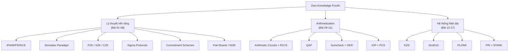
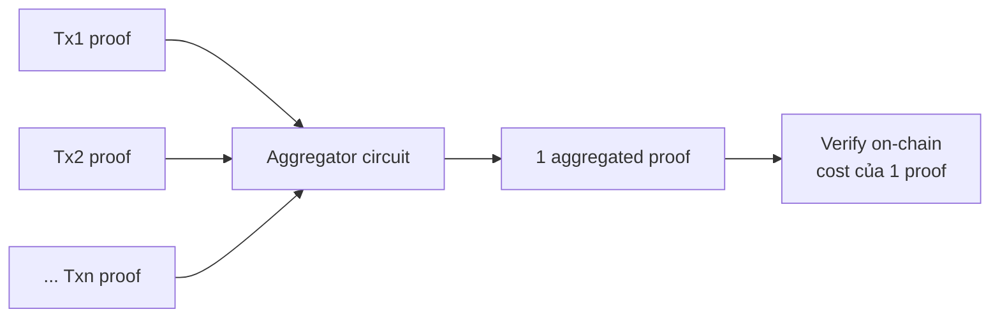
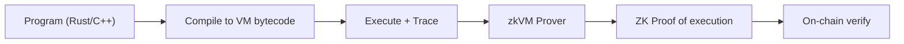
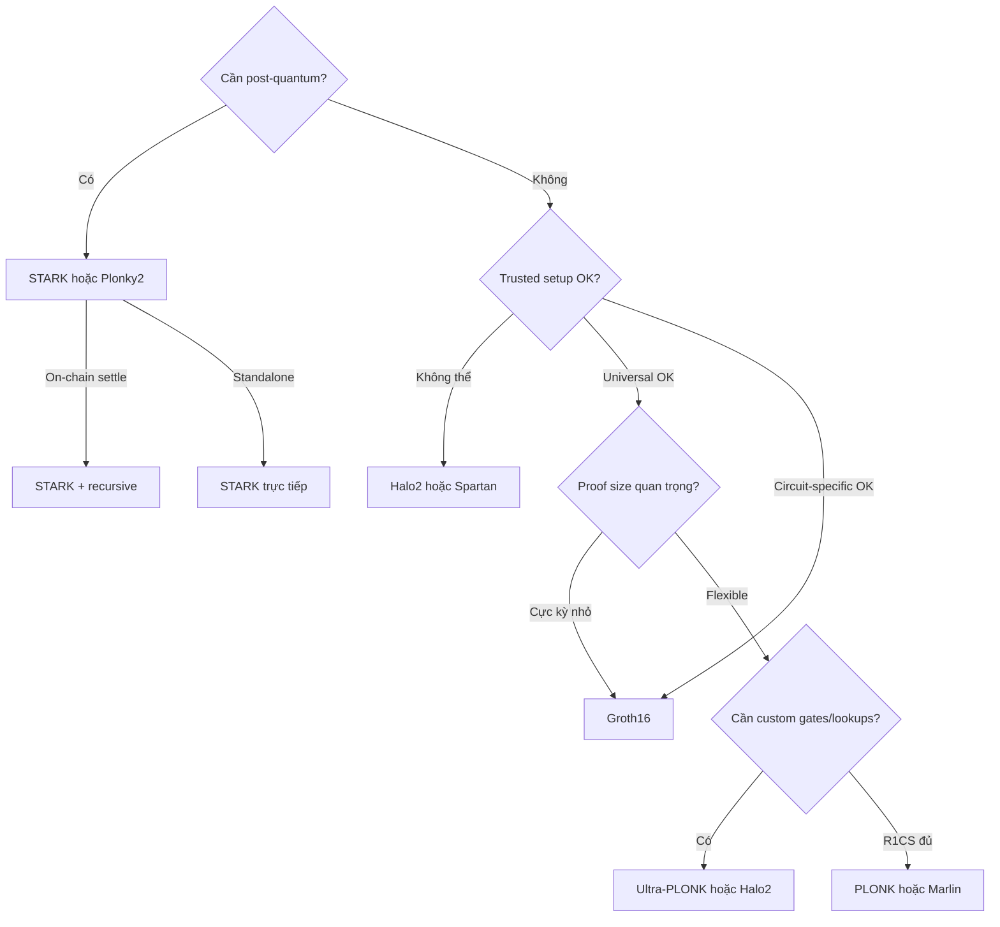

> **Prerequisites**: [[13-kzg-and-pairings|13. KZG & Pairings]], [[14-groth16|14. Groth16]], [[15-plonk|15. PLONK]], [[16-fri-and-starks|16. FRI & STARKs]]
> **Objectives**:
> - Tổng hợp toàn bộ kiến thức về ZKP systems thành một bức tranh nhất quán
> - Hiểu các tradeoff cốt lõi: trusted setup, proof size, verify time, quantum safety
> - Phân biệt khi nào dùng loại ZKP nào
> - Biết hướng phát triển hiện tại (2024–2026): recursion, zkVM, aggregation

---

## Bức Tranh Tổng Thể

Sau 16 bài, ta đã đi qua toàn bộ hành trình từ lý thuyết đến thực tiễn:



*Bản đồ toàn bộ ZKP series.*

---

## Bảng So Sánh Toàn Diện

### Hệ Thống Chính

| Hệ thống | Arithmetization | PCS | Setup | Proof Size | Verify | Quantum |
|---------|----------------|-----|-------|-----------|--------|---------|
| **Groth16** | QAP (R1CS) | KZG | Circuit-specific | **~200B** | **~1ms** | ✗ |
| **PLONK** | Plonkish | KZG (universal) | Universal | ~1–2KB | ~3ms | ✗ |
| **Halo2** | Plonkish | IPA (no setup) | Universal | ~2–3KB | ~10–50ms | ✗ |
| **Marlin** | R1CS | KZG | Universal | ~1KB | ~3ms | ✗ |
| **Spartan** | R1CS | IPA | Transparent | ~10KB | ~50ms | ✗ |
| **STARK** | AIR | FRI | **Transparent** | ~100–500KB | ~10ms | **✓** |
| **Plonky2** | Plonkish | FRI | **Transparent** | ~40KB | ~1ms | **✓** |
| **Binius** | Multilinear | Binary-field | Transparent | ~50KB | fast | **✓** |

### Theo Trục Tradeoff

**Proof size vs. Verify time:**

```
Nhỏ nhất ←──────────────────────────────→ Lớn nhất
Groth16 < PLONK ≈ Marlin < Halo2 < Spartan < STARK < (naive)

Nhanh nhất ←───────────────────────────→ Chậm nhất
Groth16 ≈ PLONK < Marlin < Plonky2 < STARK < Halo2 < Spartan
```

**Trusted setup:**
```
Circuit-specific → Universal → Transparent
Groth16            PLONK       STARK, FRI
                   Marlin      Halo2 (universal, no trapdoor)
                   Spartan     Plonky2
```

---

## Phân Tích Theo Tiêu Chí

### 1. Trusted Setup

> [!note] Remark — Setup Spectrum
>
> **Circuit-specific** (Groth16): mỗi circuit cần ceremony riêng, SRS encode circuit structure → nhỏ nhất.
>
> **Universal** (PLONK, Marlin): một ceremony cho mọi circuit bậc $\leq d$ → linh hoạt hơn, proof lớn hơn.
>
> **Transparent** (STARK, FRI, Halo2): không cần trusted setup — SRS là public randomness (hash-based), hoặc không cần SRS. An toàn nhất về mặt trust assumptions.

Khi nào quan trọng? **Permissionless applications** (public blockchain, distributed protocols) cần transparent setup — không thể tổ chức ceremony cho bên thứ ba.

### 2. Proof Size và Verification Cost

Proof size quan trọng khi verify **on-chain** (Ethereum L1): mỗi byte calldata tốn gas.

| Scenario | Lựa chọn | Lý do |
|---------|----------|-------|
| Ethereum L1 verify | Groth16 hoặc PLONK | Proof nhỏ = ít gas |
| Layer 2 with L1 settle | STARK + recursive | Aggregate nhiều txs, settle 1 proof |
| Standalone app | STARK | Không cần minimize L1 cost |
| Post-quantum | STARK / Plonky2 | Hash-based assumptions |

### 3. Prover Time

Prover time quan trọng khi cần proof nhanh (real-time applications, zkVM).

| Operation | Chi phí |
|-----------|---------|
| FFT (R1CS/QAP) | $O(n \log n)$ field ops |
| Multi-scalar multiplication (KZG) | $O(n)$ elliptic curve ops (bottleneck) |
| Merkle hashing (FRI) | $O(n)$ hash ops — nhanh hơn nhiều |
| FRI folding | $O(n)$ field ops |

STARK prover nhanh hơn Groth16/PLONK về constant factor (hash vs. elliptic curve ops), mặc dù proof lớn hơn.

### 4. Quantum Safety

Tất cả SNARK dựa trên elliptic curve DLP (Shor's algorithm sẽ phá). STARK/FRI dựa trên hash (collision resistance) — assumed post-quantum secure với hash đủ lớn.

Với quantum computers thực tế (>2030?): cần migrate sang STARK hoặc lattice-based schemes.

---

## Đường Phát Triển Hiện Đại

### Recursive Proofs

**Recursion**: dùng ZKP để chứng minh rằng "tôi đã verify một ZKP khác đúng".

Ứng dụng: aggregate $N$ proofs thành 1 proof — verify $N$ transactions với chi phí của 1.



*Recursive aggregation: N proofs → 1 proof.*

Để recursion hiệu quả, cần proof verification circuit nhỏ:
- **Halo/Halo2**: dùng IPA + cycle of curves — verification circuit ~$10^5$ gates
- **Nova**: incrementally verifiable computation (IVC) — không fold, không aggregate, continuous
- **PLONK-based**: verify PLONK inside PLONK (zkVM cho PLONK verifier)

### zkVM — Zero-Knowledge Virtual Machine

**zkVM**: tạo ZKP cho việc thực hiện một chương trình tùy ý trên virtual machine. Không cần viết circuit thủ công — chỉ cần viết program, zkVM tự sinh proof.



| zkVM | Base ZK system | VM |
|------|---------------|-----|
| Risc Zero | STARK + FRI | RISC-V |
| SP1 (Succinct) | STARK + FRI | RISC-V |
| Cairo + StarkNet | STARK | Cairo VM |
| Scroll | PLONK/Halo2 | EVM |
| zkSync Era | PLONK | EVM |
| Polygon zkEVM | STARK + FRI | EVM |

### Lookup Tables & Custom Gates

PLONK variants với **lookup arguments** (Plookup, logUp) cho phép:
- Range checks: $0 \leq x < 2^{16}$ — một lookup thay vì 16 constraints
- XOR, AND: table lookup thay vì boolean decomposition
- SHA-256, Keccak: hash gadgets hiệu quả

Xu hướng: circuit size giảm đáng kể nhờ lookups → proof nhỏ hơn và prover nhanh hơn.

---

## Lựa Chọn Hệ Thống: Decision Tree



*Decision tree chọn ZKP system.*

---

## Convergence: Xu Hướng 2024–2026

### 1. Folding Schemes

**Nova** (Kothapalli, Setty, Tzialla 2021) và **SuperNova**: IVC (Incrementally Verifiable Computation) không dùng recursion truyền thống — "fold" hai instances thành một.

Chi phí per step: rất nhỏ ($O(n)$) — không phải $O(n \log n)$ như SNARK.

### 2. Binius — Binary Fields

**Binius** (Ben-Sasson et al. 2024): dùng binary fields $\mathbb{F}_2$ thay vì $\mathbb{F}_p$ lớn.

Lợi ích: hardware-friendly (XOR = addition), compact representation, nhanh hơn cho bitwise ops (SHA-256, Keccak).

### 3. Circle STARKs

**Circle STARK** (StarkWare 2024): dùng "circle group" thay vì multiplicative subgroup — cho phép dùng Mersenne primes (31-bit) hiệu quả hơn.

### 4. Lattice-Based ZKP

Nếu quantum computers thực sự đến sớm: lattice-based ZKP (dựa LWE/SIS) là alternative post-quantum. Hiện tại proof size còn lớn (~MB) nhưng đang cải thiện nhanh.

---

## Tổng Kết Toàn Bộ Series

### Phần I — Lý thuyết Nền tảng (Bài 01–08)

| Bài | Khái niệm cốt lõi |
|-----|------------------|
| 01 | IP = PSPACE: interactive proofs mạnh hơn NP |
| 02 | ZK ⟺ simulator paradigm: không tiết lộ thêm gì |
| 03 | PZK ⊊ SZK ⊊ CZK; NP ⊆ CZK (GMW) |
| 04 | PoK: knowledge extractor, rewinding, special soundness |
| 05 | Sigma protocols: 3-move, SHVZK, Schnorr |
| 06 | AND/OR composition; ring signatures |
| 07 | Commitment schemes: Pedersen (perfectly hiding), hash (perfectly binding) |
| 08 | Fiat-Shamir: interactive → NIZK qua Random Oracle |

### Phần II — Arithmetization (Bài 09–12)

| Bài | Biến đổi |
|-----|---------|
| 09 | Program → R1CS: $(A\mathbf{w}) \circ (B\mathbf{w}) = C\mathbf{w}$ |
| 10 | R1CS → QAP: $Z_H \mid (A \cdot B - C)$ |
| 11 | GKR: Sumcheck cho layered circuits |
| 12 | PIOP + PCS = SNARK; KZG vs FRI vs IPA |

### Phần III — Hệ thống Hiện đại (Bài 13–17)

| Bài | Hệ thống |
|-----|---------|
| 13 | KZG: bilinear pairing + SRS → constant-size polynomial commitment |
| 14 | Groth16: QAP + KZG + pairing equation → 3-element proof |
| 15 | PLONK: Plonkish + permutation argument + universal KZG |
| 16 | FRI: folding → $O(\log^2 k)$ hash proof; STARK = AIR + FRI |
| **17** | **So sánh: trusted setup, proof size, quantum, tradeoffs** |

---

## Câu Hỏi Mở Trong ZKP

1. **Proof size**: Có thể đạt $O(1)$ proof với transparent setup không? (Hiện chưa biết — polylogarithmic là best known)

2. **Prover time**: Giới hạn dưới của prover time là bao nhiêu? (linear trong circuit size là conjectured lower bound)

3. **Recursion efficiency**: zkVM circuit cho verifier có thể nhỏ đến mức nào? (đang cải thiện tích cực)

4. **Post-quantum với proof nhỏ**: Có thể đạt $O(\text{poly}(\lambda))$ proof size từ hash-based assumptions? (FRI là $O(\log^2 n)$, không constant)

5. **Proof aggregation**: Có thể aggregate $N$ arbitrary SNARKs thành 1 mà không rebuild? (Groth16 aggregation, Nova, Hypernova)

---

## Summary Tổng Kết

ZKP đã đi từ lý thuyết học thuật (IP = PSPACE, 1992) đến công nghệ sản xuất (Ethereum zkRollups, 2020s) trong khoảng 30 năm. Các concept cốt lõi:

1. **ZK = Simulator paradigm**: không tiết lộ gì ngoài tính đúng của statement
2. **Arithmetization**: mọi computation đều encode được thành polynomial constraints
3. **PCS**: oracle access có thể thực hiện bằng cryptography
4. **IOP + PCS = SNARK**: framework compile proof system thành short proof
5. **Tradeoff chính**: trusted setup ↔ proof size ↔ quantum safety

Hệ sinh thái đang hội tụ về:
- **Plonkish + lookups** cho circuit design
- **KZG** khi proof size quan trọng
- **FRI/STARK** khi transparent setup quan trọng
- **Recursion/folding** để aggregate và scale

---

## References

- Thaler — *Proofs, Arguments, and Zero-Knowledge* (people.cs.georgetown.edu/jthaler/ProofsArgsAndZK.pdf) — toàn bộ series
- ZK Proof Community — *Comparison of ZKP Systems* (zkproof.org)
- Boneh et al. — *A Survey of Zero-Knowledge Proofs with Applications to Cryptography* — Stanford 2023
- L2Beat — *ZK Stack Comparison* (l2beat.com) — hệ sinh thái L2
- Kothapalli, Setty, Tzialla — *Nova: Recursive Zero-Knowledge Arguments from Folding Schemes* (2021) — ePrint 2021/370
- Ben-Sasson et al. — *Binius: highly efficient proofs over binary tower fields* (2024) — ePrint 2023/1784
- ZKProof Workshop Proceedings (zkproof.org/workshop) — hàng năm, cập nhật nhất
