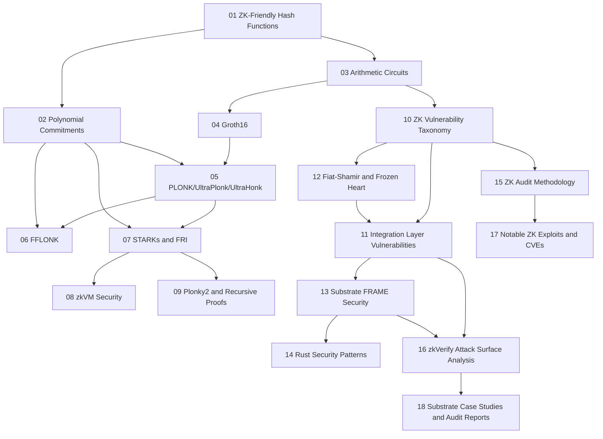

> **Topic**: zkVerify Bug Bounty Roadmap
> **Domain**: ZK Cryptography x Blockchain Security (Substrate / Rust)
> **Level**: Intermediate -> Advanced
> **Background giả định**: ZKP fundamentals, Rust cơ bản, smart contract/audit mindset
> **Phạm vi hiện tại**: Bỏ ECC và Finite Field riêng lẻ, tập trung các topic phục vụ bug bounty trực tiếp
> **Mục tiêu cuối**: Audit và săn bug có hệ thống trên zkVerify theo Immunefi scope

---

## Topic Map

| # | Topic | Layer | Trạng thái | Notes |
|---|-------|-------|------------|-------|
| 01 | ZK-Friendly Hash Functions (Poseidon, MiMC, Keccak) | Layer 1 | Done | Hash gadget và hash config bugs |
| 02 | Polynomial Commitments (KZG, FRI, IPA) | Layer 1 | Done | Nền tảng PLONK/FFLONK/STARK/Plonky2 |
| 03 | Arithmetic Circuits | Layer 2 | Done | Constraint model, under/over-constrained |
| 04 | Groth16 | Layer 2 | Done | Pairing verifier và setup risks |
| 05 | PLONK, UltraPlonk & UltraHonk | Layer 2 | Done | Proof systems mới trong zkVerify |
| 06 | FFLONK | Layer 2 | Done | Verifier class cốt lõi của zkVerify |
| 07 | STARKs & FRI Protocol | Layer 2 | Done | Nền tảng Risc0 và Plonky2 |
| 08 | zkVM Security (Risc0 & SP1) | Layer 2 | Done | Instruction-level soundness bugs |
| 09 | Plonky2 & Recursive Proofs | Layer 2 | Planned | Custom serialization + recursion risks |
| 10 | ZK Vulnerability Classes / Taxonomy | Layer 3 | Done | V1/V2/V3 + root causes R1-R7 |
| 11 | Integration Layer Vulnerabilities | Layer 3 | Done | V4-V7, bridge và auxiliary logic |
| 12 | Fiat-Shamir Transformation & Frozen Heart | Layer 3 | Planned | Transcript binding, challenge soundness |
| 13 | Substrate FRAME Pallet Security | Layer 4 | Planned | Weight/origin/transactional/storage bugs |
| 14 | Rust Security Patterns for Blockchain | Layer 4 | Planned | overflow, panic trap, unsafe/casting bugs |
| 15 | ZK Audit Methodology | Layer 5 | Planned | Spec-to-constraint, static+dynamic workflow |
| 16 | zkVerify Attack Surface Analysis | Layer 5 | Planned | pallet-by-pallet + bridge surfaces |
| 17 | Notable ZK Exploits & CVEs | Layer 6 | Planned | Zcash, zkSync, Frozen Heart, Risc0 bounty |
| 18 | Substrate Exploit Case Studies & Audit Reports | Layer 6 | Planned | Acala, ToB/SRLabs findings, PoC replay |

---

## Learning Order (Recommended)

```text
ZK-Friendly Hash Functions -> Arithmetic Circuits -> Groth16
-> PLONK/UltraPlonk/UltraHonk -> FFLONK -> STARKs/FRI
-> zkVM Security -> Polynomial Commitments -> Plonky2 & Recursive Proofs
-> ZK Vulnerability Classes -> Fiat-Shamir & Frozen Heart
-> Integration Layer Vulnerabilities -> Substrate FRAME Security
-> Rust Security Patterns -> ZK Audit Methodology
-> zkVerify Attack Surface Analysis -> ZK Exploits/CVEs
-> Substrate Case Studies
```

---

## Dependency Graph



---

## Progress Tracker

- [x] [[zk-friendly-hash-functions/index|01. ZK-Friendly Hash Functions]]
- [x] [[polynomial-commitments/index|02. Polynomial Commitments]]
- [x] [[arithmetic-circuits/index|03. Arithmetic Circuits]]
- [x] [[groth16/index|04. Groth16]]
- [x] [[plonk-ultraplonk-ultrahonk/index|05. PLONK, UltraPlonk & UltraHonk]]
- [x] [[fflonk/index|06. FFLONK]]
- [x] [[starks-fri-protocol/index|07. STARKs & FRI Protocol]]
- [x] [[zkvm-security/index|08. zkVM Security (Risc0 & SP1)]]
- [ ] 09. Plonky2 & Recursive Proofs
- [x] [[zk-vulnerability-taxonomy/index|10. ZK Vulnerability Classes - Taxonomy]]
- [x] [[integration-layer-vulnerabilities/index|11. Integration Layer Vulnerabilities]]
- [ ] 12. Fiat-Shamir Transformation & Frozen Heart
- [ ] 13. Substrate FRAME Pallet Security
- [ ] 14. Rust Security Patterns for Blockchain
- [ ] 15. ZK Audit Methodology
- [ ] 16. zkVerify Attack Surface Analysis
- [ ] 17. Notable ZK Exploits & CVEs
- [ ] 18. Substrate Exploit Case Studies & Audit Reports

## Priority After Current Core

- [x] 1) ZK Vulnerability Classes
- [ ] 2) Substrate FRAME Pallet Security
- [ ] 3) Fiat-Shamir & Frozen Heart
