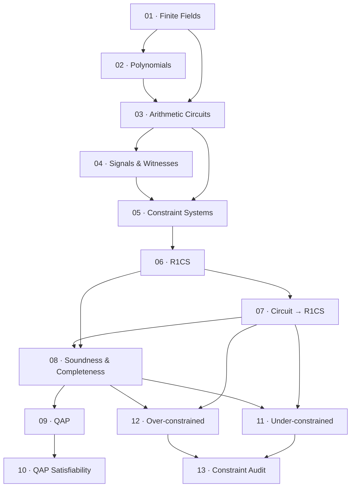

> **Topic**: Arithmetic Circuits — R1CS, QAP & Constraint Analysis
> **Domain**: Cryptography / Zero-Knowledge Proofs
> **Level**: Intermediate → Advanced
> **Background**: Group theory, field theory, modular arithmetic
> **Tools / Code**: Python, SageMath, Circom (tham khảo)
> **Sources**: Boneh & Shoup, ZKProof Community Reference, Oded Goldreich, Justin Thaler — *Proofs, Arguments, and Zero-Knowledge*

---

## Lessons

| # | Title | Key Concepts | Prerequisites | Difficulty |
|---|-------|-------------|---------------|------------|
| 01 | Finite Fields & Field Arithmetic | $\mathbb{F}_p$, phép toán field, multiplicative inverse, extension fields | Group/field theory cơ bản | ★★☆☆☆ |
| 02 | Polynomials over Finite Fields | Evaluation, roots, Lagrange interpolation, Schwartz-Zippel lemma | 01 | ★★★☆☆ |
| 03 | Arithmetic Circuits — Định nghĩa & Cấu trúc | Gates (+, ×), wires, fan-in, depth, circuit satisfiability | 01, 02 | ★★★☆☆ |
| 04 | Signals, Witnesses & Visibility | Public input, private input, intermediate signals, luồng dữ liệu | 03 | ★★★☆☆ |
| 05 | Constraint Systems — Tổng quan | Tại sao cần encode circuit → constraint, các dạng constraint system | 03, 04 | ★★★☆☆ |
| 06 | R1CS — Rank-1 Constraint System | Ma trận $A, B, C$, witness vector $z$, phương trình $Az \circ Bz = Cz$ | 05 | ★★★★☆ |
| 07 | Chuyển đổi Circuit → R1CS | Flatten, mỗi gate → 1 constraint, ví dụ end-to-end | 06 | ★★★★☆ |
| 08 | R1CS — Soundness & Completeness | Assignment thỏa mãn R1CS, completeness vs soundness, ý nghĩa bảo mật | 06, 07 | ★★★★☆ |
| 09 | QAP — Quadratic Arithmetic Programs | Chuyển R1CS → QAP, polynomial encoding, target polynomial $t(x)$ | 08 | ★★★★★ |
| 10 | QAP Satisfiability & Divisibility | $h(x) \cdot t(x) = p(x)$, ý nghĩa hình học, vai trò trong proof systems | 09 | ★★★★★ |
| 11 | Under-constrained Circuits | Thiếu constraint → witness space quá rộng → fake proof, attack patterns | 07, 08 | ★★★★☆ |
| 12 | Over-constrained Circuits | Constraint mâu thuẫn → circuit không satisfiable → DoS vector | 07, 08 | ★★★★☆ |
| 13 | Constraint Completeness Audit | Phương pháp kiểm tra coverage, tool hỗ trợ (ECNE, Picus) | 11, 12 | ★★★★★ |

## Appendix

| ID | Content | Related Lessons |
|----|---------|----------------|
| A0 | Ký hiệu & Notation Reference | Tất cả |
| A1 | R1CS / QAP Worked Examples — Bài toán đầy đủ | 06–10 |

---

## Dependency Graph

*Dependency graph — học theo thứ tự từ trái sang phải, từ trên xuống dưới.*

---

## Progress Tracker

- [ ] [[zkverify-series/arithmetic-circuits/00-roadmap|00. Roadmap]]
- [ ] [[01-finite-fields|01. Finite Fields & Field Arithmetic]]
- [ ] [[02-polynomials-over-finite-fields|02. Polynomials over Finite Fields]]
- [ ] [[03-arithmetic-circuits|03. Arithmetic Circuits — Định nghĩa & Cấu trúc]]
- [ ] [[04-signals-witnesses-visibility|04. Signals, Witnesses & Visibility]]
- [ ] [[05-constraint-systems-overview|05. Constraint Systems — Tổng quan]]
- [ ] [[06-r1cs|06. R1CS — Rank-1 Constraint System]]
- [ ] [[07-circuit-to-r1cs|07. Chuyển đổi Circuit → R1CS]]
- [ ] [[08-r1cs-soundness-completeness|08. R1CS — Soundness & Completeness]]
- [ ] [[09-qap|09. QAP — Quadratic Arithmetic Programs]]
- [ ] [[10-qap-satisfiability|10. QAP Satisfiability & Divisibility]]
- [ ] [[11-under-constrained-circuits|11. Under-constrained Circuits]]
- [ ] [[12-over-constrained-circuits|12. Over-constrained Circuits]]
- [ ] [[13-constraint-completeness-audit|13. Constraint Completeness Audit]]
- [ ] [[a0-notation-reference|A0. Notation Reference]]
- [ ] [[a1-worked-examples|A1. R1CS / QAP Worked Examples]]
