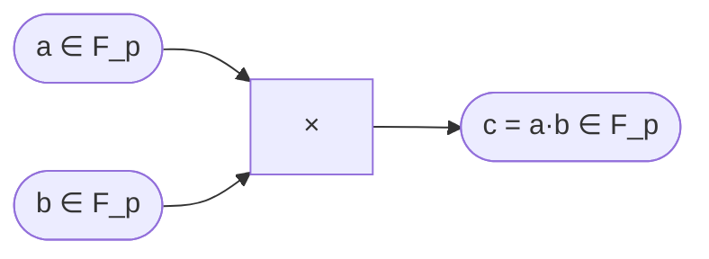

> **Prerequisites**: Group theory cơ bản (group, abelian group, order), định nghĩa ring và field, modular arithmetic ($a \bmod p$, phép tính $\mathbb{Z}/n\mathbb{Z}$)
> **Objectives**:
> - Hiểu tại sao arithmetic circuits phải chạy trên finite field thay vì số nguyên thông thường
> - Nắm vững phép toán trên $\mathbb{F}_p$: cộng, trừ, nhân, tìm nghịch đảo
> - Hiểu extension fields và khi nào chúng xuất hiện trong ZK systems
> - Tính toán thành thạo trên $\mathbb{F}_p$ bằng Python / SageMath

---

## Motivation

Khi ta viết một arithmetic circuit để chứng minh tính toán — ví dụ "tôi biết $x$ sao cho $x^3 + x + 5 = y$" — các phép tính trong circuit phải xảy ra trên một tập số **có cấu trúc đại số đầy đủ**: cộng, trừ, nhân, **chia** đều phải được định nghĩa và nhất quán.

Số nguyên $\mathbb{Z}$ **không đủ**: phép chia không luôn ra số nguyên ($3 / 7$ không có nghĩa trong $\mathbb{Z}$). Số thực $\mathbb{R}$ có chia được nhưng **không thể biểu diễn chính xác** trên máy tính, gây sai số floating-point — thảm họa cho cryptographic proof.

Giải pháp: **Finite field** (trường hữu hạn) — một tập hữu hạn các phần tử với đầy đủ 4 phép toán, hoạt động hoàn toàn chính xác bằng số nguyên modulo. Đây là nền tảng số học của **mọi** ZK proof system hiện đại: Groth16, PLONK, STARKs đều làm việc trên một finite field cụ thể.

---

## 1. Định nghĩa Field

> [!definition] Definition 1.1 — Field (Trường)
> Một **field** $(\mathbb{F}, +, \cdot)$ là một tập $\mathbb{F}$ cùng hai phép toán cộng $(+)$ và nhân $(\cdot)$ thỏa mãn:
> 
> 1. $(\mathbb{F}, +)$ là abelian group (phần tử trung hòa: $0$)
> 2. $(\mathbb{F} \setminus \{0\}, \cdot)$ là abelian group (phần tử trung hòa: $1$)
> 3. **Distributivity**: $a \cdot (b + c) = a \cdot b + a \cdot c$ với mọi $a, b, c \in \mathbb{F}$

> [!definition] Definition 1.2 — Finite Field $\mathbb{F}_p$ (Prime Field)
> Với $p$ là số nguyên tố, **prime field** $\mathbb{F}_p$ được định nghĩa là:
> 
> $$\mathbb{F}_p = \mathbb{Z}/p\mathbb{Z} = \{0, 1, 2, \ldots, p-1\}$$
> 
> với phép cộng và nhân đều thực hiện **modulo $p$**:
> 
> $$a + b \equiv (a + b) \bmod p, \qquad a \cdot b \equiv (a \cdot b) \bmod p$$

**Tại sao $p$ phải là số nguyên tố?** Vì nghịch đảo nhân tồn tại khi và chỉ khi $\gcd(a, p) = 1$. Nếu $p$ nguyên tố, mọi $a \neq 0$ đều thoả $\gcd(a, p) = 1$, nên mọi phần tử khác 0 đều có nghịch đảo — điều kiện bắt buộc để $\mathbb{F}_p$ là field.

> [!example] Example 1.3 — $\mathbb{F}_7$
> $\mathbb{F}_7 = \{0, 1, 2, 3, 4, 5, 6\}$
> 
> - $3 + 5 = 8 \equiv 1 \pmod{7}$
> - $3 \cdot 5 = 15 \equiv 1 \pmod{7}$ — vậy $3$ và $5$ là nghịch đảo của nhau!
> - $6 + 1 = 7 \equiv 0 \pmod{7}$ — $6 \equiv -1$ trong $\mathbb{F}_7$

---

## 2. Phép toán trong $\mathbb{F}_p$

### 2.1 Cộng, Trừ, Nhân

Hoàn toàn giống số nguyên, chỉ thêm bước `mod p` ở cuối:

```python
p = 7  # prime field F_7

def add(a, b): return (a + b) % p
def sub(a, b): return (a - b) % p
def mul(a, b): return (a * b) % p

print(add(3, 5))  # 1  (8 mod 7)
print(sub(2, 5))  # 4  (-3 mod 7 = 4)
print(mul(3, 5))  # 1  (15 mod 7)
```

### 2.2 Nghịch đảo nhân (Multiplicative Inverse)

Đây là phép toán quan trọng nhất và **không tồn tại trong $\mathbb{Z}$**. Trong $\mathbb{F}_p$, ta tìm $a^{-1}$ sao cho $a \cdot a^{-1} \equiv 1 \pmod{p}$.

**Phương pháp 1 — Thuật toán Euclid mở rộng (Extended Euclidean Algorithm):**

> [!theorem] Theorem 1.4 — Bézout's Identity
> Với $\gcd(a, p) = 1$, tồn tại $x, y \in \mathbb{Z}$ sao cho:
> 
> $$a \cdot x + p \cdot y = 1$$
> 
> Khi đó $x \bmod p$ là nghịch đảo nhân của $a$ trong $\mathbb{F}_p$.

```python
def extended_gcd(a, b):
    """Trả về (g, x, y) sao cho a*x + b*y = g = gcd(a,b)"""
    if b == 0:
        return a, 1, 0
    g, x, y = extended_gcd(b, a % b)
    return g, y, x - (a // b) * y

def modinv(a, p):
    g, x, _ = extended_gcd(a % p, p)
    assert g == 1, f"{a} không có nghịch đảo trong F_{p}"
    return x % p

print(modinv(3, 7))   # 5  (vì 3*5 = 15 ≡ 1 mod 7)
print(modinv(5, 7))   # 3
print(modinv(2, 7))   # 4  (vì 2*4 = 8 ≡ 1 mod 7)
```

**Phương pháp 2 — Fermat's Little Theorem:**

> [!theorem] Theorem 1.5 — Fermat's Little Theorem
> Với $p$ nguyên tố và $a \not\equiv 0 \pmod{p}$:
> 
> $$a^{p-1} \equiv 1 \pmod{p}$$
> 
> Suy ra: $a^{-1} \equiv a^{p-2} \pmod{p}$

```python
def modinv_fermat(a, p):
    """Dùng Fermat: a^{-1} = a^{p-2} mod p"""
    return pow(a, p - 2, p)   # Python pow(base, exp, mod) rất hiệu quả

print(modinv_fermat(3, 7))   # 5
```

> [!note] Khi nào dùng phương pháp nào?
> - **Extended GCD**: Tổng quát hơn, dùng được khi modulus không phải prime.
> - **Fermat**: Đơn giản hơn khi $p$ là prime, thường dùng trong circuit vì chỉ cần một phép lũy thừa.

### 2.3 Chia

Chia trong $\mathbb{F}_p$ chính là nhân với nghịch đảo:

$$\frac{a}{b} = a \cdot b^{-1} \pmod{p}$$

```python
def modinv(a, p):
    return pow(a, p - 2, p)   # Fermat's little theorem

def div(a, b, p):
    return (a * modinv(b, p)) % p   # a * b^{-1} mod p

print(div(1, 3, 7))   # 5  (1/3 = 1 * 3^{-1} = 5 trong F_7)
```

---

## 3. Cấu trúc của $\mathbb{F}_p^*$

> [!definition] Definition 1.6 — Multiplicative Group $\mathbb{F}_p^*$
> Tập $\mathbb{F}_p^* = \mathbb{F}_p \setminus \{0\} = \{1, 2, \ldots, p-1\}$ cùng phép nhân tạo thành một **cyclic group** có order $p-1$.

**Cyclic group** có nghĩa là: tồn tại một phần tử $g \in \mathbb{F}_p^*$ gọi là **primitive root** (hay **generator**) sao cho:

$$\mathbb{F}_p^* = \{g^0, g^1, g^2, \ldots, g^{p-2}\} = \{1, g, g^2, \ldots, g^{p-2}\}$$

> [!example] Example 1.7 — Generator của $\mathbb{F}_7^*$
> Thử $g = 3$:
> 
> $3^0 = 1,\ 3^1 = 3,\ 3^2 = 2,\ 3^3 = 6,\ 3^4 = 4,\ 3^5 = 5$
> 
> Tất cả 6 phần tử $\{1,2,3,4,5,6\}$ xuất hiện → $g = 3$ là generator của $\mathbb{F}_7^*$.

```python
p = 7
g = 3
print([pow(g, i, p) for i in range(p - 1)])
# [1, 3, 2, 6, 4, 5] — đủ 6 phần tử khác nhau
```

**Tại sao quan trọng trong ZK?** Roots of unity — dùng để xây dựng NTT (Number Theoretic Transform) và polynomial evaluation trong PLONK/STARKs — được lấy từ subgroup của $\mathbb{F}_p^*$.

---

## 4. Roots of Unity trong $\mathbb{F}_p$

> [!definition] Definition 1.8 — $n$-th Root of Unity
> $\omega \in \mathbb{F}_p^*$ là **primitive $n$-th root of unity** nếu:
> 
> $$\omega^n = 1 \qquad \text{và} \qquad \omega^k \neq 1 \text{ với mọi } 1 \leq k < n$$
> 
> Điều kiện tồn tại: $n \mid (p-1)$.

> [!example] Example 1.9 — Root of unity trong $\mathbb{F}_{17}$
> $p = 17$, $p - 1 = 16 = 2^4$. Ta có thể tìm primitive $4$-th root of unity ($n = 4$).
> 
> Generator $g = 3$ (có thể kiểm tra). Đặt $\omega = g^{(p-1)/n} = 3^{16/4} = 3^4 = 81 \equiv 13 \pmod{17}$.
> 
> Kiểm tra: $13^1 = 13$, $13^2 = 169 \equiv 16 \equiv -1$, $13^4 = (13^2)^2 = (-1)^2 = 1$. ✓

```python
p = 17
g = 3     # generator của F_17*
n = 4     # muốn primitive 4th root of unity

omega = pow(g, (p - 1) // n, p)
print(omega)               # 13

# Kiểm tra: omega^n = 1
print(pow(omega, n, p))    # 1  ✓
# omega^k ≠ 1 với k < n
print([pow(omega, k, p) for k in range(1, n + 1)])
# [13, 16, 4, 1] — chỉ k=4 cho 1
```

---

## 5. Extension Fields (Trường Mở Rộng)

Đôi khi $p - 1$ không chia hết cho $n$ ta cần (ví dụ BN254 curve cần các roots cỡ $2^{28}$), hoặc ta cần biểu diễn điểm trên elliptic curve với tọa độ "phức hơn". Khi đó ta dùng **extension field**.

> [!definition] Definition 1.10 — Extension Field $\mathbb{F}_{p^k}$
> Với $f(x) \in \mathbb{F}_p[x]$ là đa thức bất khả quy (irreducible) bậc $k$, **extension field** được định nghĩa:
> 
> $$\mathbb{F}_{p^k} = \mathbb{F}_p[x] / (f(x))$$
> 
> Phần tử của $\mathbb{F}_{p^k}$ là các đa thức bậc $< k$ với hệ số trong $\mathbb{F}_p$, nhân với nhau lấy phần dư theo $f(x)$.

> [!example] Example 1.11 — $\mathbb{F}_{p^2}$ (Quadratic Extension)
> Đặt $f(x) = x^2 + 1$ (bất khả quy trên $\mathbb{F}_p$ khi $-1$ không là quadratic residue).
> 
> Phần tử: $a + b\alpha$ với $a, b \in \mathbb{F}_p$ và $\alpha^2 = -1$.
> 
> Nhân: $(a + b\alpha)(c + d\alpha) = (ac - bd) + (ad + bc)\alpha$
> 
> Giống nhân số phức! $\alpha$ đóng vai trò như $i$ trong $\mathbb{C}$.

**Ứng dụng trong ZK**: BN254 (dùng trong Groth16) và BLS12-381 (dùng trong nhiều protocol) đều cần extension fields $\mathbb{F}_{p^{12}}$ để tính **bilinear pairing** — phép toán nền của verifier.

```sage
# SageMath: làm việc với F_{p^2}
# (Chạy trong SageMath, không phải Python thuần)
p = 7
Fp = GF(p)
R.<x> = Fp[]
f = x^2 + 1          # irreducible over F_7 (kiểm tra: -1 không là QR mod 7)
Fp2.<alpha> = Fp.extension(f)

a = 3 + 2*alpha
b = 5 + 4*alpha
print(a * b)          # (3+2α)(5+4α) = 15-8 + (12+10)α = 7+22α ≡ 0+1α mod 7
```

---

## 6. Các Finite Fields thường gặp trong ZK Systems

Trong thực tế, các ZK proof systems sử dụng các field đặc biệt, được chọn để tối ưu hiệu năng hoặc tương thích với elliptic curve:

| Field | $p$ (scalar field) | Dùng trong |
|-------|--------------------|------------|
| BN254 scalar | $p = 2^{254} + \ldots$ (254-bit prime) | Groth16, Circom mặc định |
| BLS12-381 scalar | $p = \texttt{0x73eda...}$ (255-bit prime) | Ethereum PoS, PLONK |
| Goldilocks | $p = 2^{64} - 2^{32} + 1$ | STARK/Plonky2 — tối ưu 64-bit |
| Mersenne-31 | $p = 2^{31} - 1$ | Circle STARK, Stwo prover |
| Baby Bear | $p = 2^{31} - 2^{27} + 1$ | Plonky3, Risc Zero |

> [!note] Goldilocks & NTT-friendly primes
> Các prime như Goldilocks, Baby Bear được gọi là **NTT-friendly**: $p - 1$ có nhiều thừa số $2$, cho phép thực hiện **Number Theoretic Transform** (FFT trên finite field) hiệu quả. Điều này trực tiếp ảnh hưởng đến tốc độ prove trong STARKs.

```python
# Kiểm tra Goldilocks: p = 2^64 - 2^32 + 1
p = 2**64 - 2**32 + 1
print(p)              # 18446744069414584321

# p - 1 = 2^32 * (2^32 - 1) -- có thừa số 2^32 → NTT tốt đến bậc 2^32
import sympy
print(sympy.factorint(p - 1))
# {2: 32, 3: 1, 5: 1, 17: 1, 257: 1, 65537: 1} — 2^32 là thừa số!
```

---

## 7. Tại sao đây là nền tảng của Arithmetic Circuits?

Mọi **wire** (dây dẫn) trong một arithmetic circuit mang một **giá trị trong $\mathbb{F}_p$**. Mọi **gate** là một phép toán trong $\mathbb{F}_p$:



Nếu ta dùng $\mathbb{Z}$ (số nguyên) thay vì $\mathbb{F}_p$: phép nhân có thể sinh ra số lớn vô hạn, không encode được trong polynomial commitment (cần bounded domain). Finite field giải quyết điều này: mọi giá trị đều nằm trong $\{0, \ldots, p-1\}$.

> [!warning] Lưu ý quan trọng khi kiểm tra circuit
> Circuit chạy trên $\mathbb{F}_p$ **không phải số nguyên thông thường**. Ví dụ:
> 
> - Trong $\mathbb{F}_p$: $(p-1) + 1 = 0$ (wrap-around — không phải overflow!)
> - $3 \cdot 3 = 9$ nhưng nếu $p = 7$ thì kết quả là $2$
> 
> **Bug thường gặp**: Lập trình viên viết constraint theo logic số nguyên, nhưng circuit chạy trên $\mathbb{F}_p$ — dẫn đến constraint không đúng với hành vi thực tế.

---

## Summary

- **Finite field** $\mathbb{F}_p$ là tập $\{0, \ldots, p-1\}$ với phép toán modulo $p$, nơi mọi phần tử $\neq 0$ đều có nghịch đảo nhân.
- $\mathbb{F}_p^*$ là **cyclic group** bậc $p-1$; primitive root tạo ra toàn bộ nhóm.
- **Nghịch đảo** tính được qua Extended GCD hoặc $a^{p-2} \bmod p$ (Fermat).
- **Roots of unity** $\omega$ ($\omega^n = 1$) tồn tại khi $n \mid (p-1)$ — dùng trong polynomial evaluation.
- **Extension field** $\mathbb{F}_{p^k}$ mở rộng $\mathbb{F}_p$, cần thiết cho pairing-based cryptography.
- Mọi wire và gate trong arithmetic circuit mang giá trị và thực hiện phép toán trong $\mathbb{F}_p$.

---

## References

- Dan Boneh & Victor Shoup — *A Graduate Course in Applied Cryptography*, Ch. 1–2 (toc.cryptobook.us)
- Justin Thaler — *Proofs, Arguments, and Zero-Knowledge*, Ch. 2 (people.cs.georgetown.edu/jthaler/ProofsArgsAndZK.pdf)
- Vitalik Buterin — *Quadratic Arithmetic Programs: from Zero to Hero* (medium.com, 2016)
- ZKProof Community Reference, Section 2: Finite Field Arithmetic
