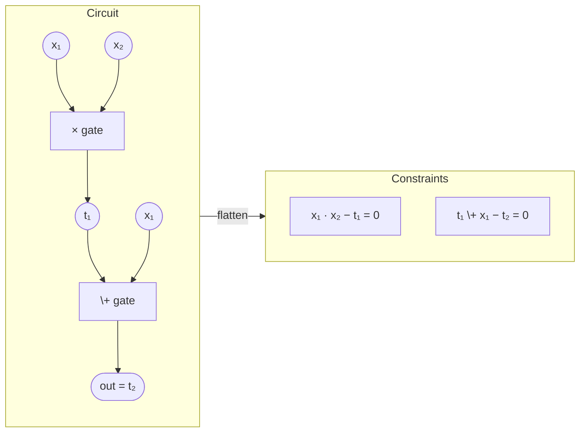
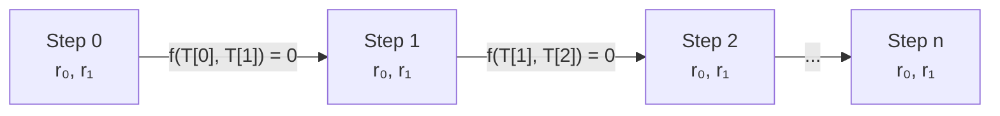
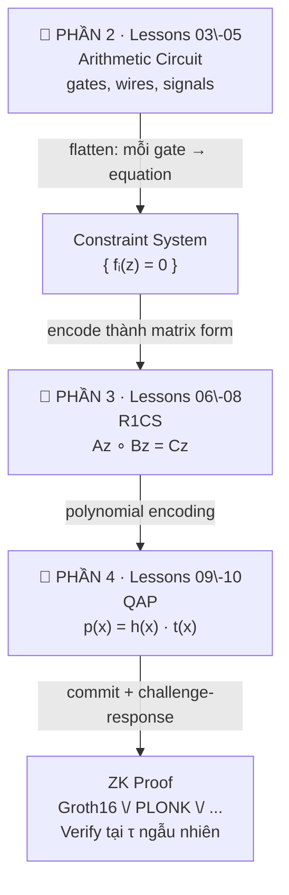

> **Prerequisites**: [[03-arithmetic-circuits|03. Arithmetic Circuits — Định nghĩa & Cấu trúc]] — gates, wires; [[04-signals-witnesses-visibility|04. Signals, Witnesses & Visibility]] — witness vector $\vec{z}$
> **Objectives**:
> - Hiểu tại sao cần "encode" circuit thành constraint system — không thể prove trực tiếp trên circuit
> - Nắm được ý tưởng tổng quát của constraint system: tập phương trình phải được thỏa mãn
> - Phân biệt các loại constraint system phổ biến: R1CS, Plonkish, AIR
> - Hiểu "satisfying assignment" và mối quan hệ với circuit satisfiability

---

## Motivation

Ta đã có circuit — tại sao không prove trực tiếp trên circuit mà phải thêm bước "constraint system"?

Lý do: **proof system không làm việc với circuit trực tiếp**. Proof system cần một ngôn ngữ **algebraic** — một tập phương trình toán học — để có thể áp dụng các kỹ thuật cryptographic (polynomial commitment, Fiat-Shamir...). Circuit là mô hình *tính toán*; constraint system là mô hình *đại số* tương đương.

Chuyển đổi: **Circuit → Constraint System → Polynomial Identity → ZK Proof**.

Mỗi bước mất một chút "cấu trúc" nhưng thêm khả năng prove cryptographically.

---

## 1. Constraint System là gì?

> [!definition] Definition 5.1 — Constraint System
> Một **constraint system** trên $\mathbb{F}_p$ là một tập phương trình đại số:
>
> $$\mathcal{C} = \{f_1(\vec{z}) = 0,\ f_2(\vec{z}) = 0,\ \ldots,\ f_k(\vec{z}) = 0\}$$
>
> trong đó $\vec{z} = (z_0, z_1, \ldots, z_n)$ là **witness vector** và $f_i \in \mathbb{F}_p[z_0, \ldots, z_n]$ là các đa thức.
>
> Một **satisfying assignment** là bộ giá trị $\vec{z}^* \in \mathbb{F}_p^{n+1}$ sao cho $f_i(\vec{z}^*) = 0$ với mọi $i$.

**Nguyên tắc cốt lõi**: Circuit satisfied $\Longleftrightarrow$ Constraint system có satisfying assignment.

Hai phía tương đương nhau — nhưng constraint system dễ làm việc hơn về mặt đại số.

---

## 2. Từ Circuit đến Constraints — Ý tưởng Tổng quát

Mỗi **gate** trong circuit sinh ra **một hoặc nhiều constraint**. Quy trình:

**Bước 1 — Đặt tên cho tất cả wires:** Mỗi wire là một biến trong $\vec{z}$.

**Bước 2 — Viết constraint cho mỗi gate:**
- Addition gate: $a + b - c = 0$ (với $c$ là output wire)
- Multiplication gate: $a \cdot b - c = 0$ (với $c$ là output wire)

**Bước 3 — Thêm constraint cho public inputs:** Các public signals phải khớp với giá trị thực tế mà verifier cung cấp.



*Mỗi gate trong circuit sinh ra một equation; tập các equations là constraint system.*

---

## 3. Các loại Constraint System phổ biến

### 3.1 R1CS — Rank-1 Constraint System

Đây là constraint system **phổ biến nhất**, sẽ được học chi tiết trong Lesson 06–08.

> [!definition] Definition 5.2 — R1CS (Preview)
> Mỗi constraint trong R1CS có dạng:
>
> $$\langle \vec{a}_i, \vec{z} \rangle \cdot \langle \vec{b}_i, \vec{z} \rangle = \langle \vec{c}_i, \vec{z} \rangle$$
>
> Tức là: **(tổ hợp tuyến tính của $\vec{z}$) $\times$ (tổ hợp tuyến tính của $\vec{z}$) = (tổ hợp tuyến tính của $\vec{z}$)**
>
> Đây là constraint bậc 2 — đúng một phép nhân duy nhất mỗi constraint.

**Đặc điểm R1CS**:
- Mỗi constraint = đúng **một phép nhân** (rank-1 = tích của hai linear forms)
- Addition "miễn phí" — có thể thêm vào linear combination không tốn constraint
- Mọi multiplication gate → một constraint
- Phù hợp với Groth16, nhiều zk-SNARK

### 3.2 Plonkish Constraints

Hệ constraint dùng trong **PLONK** và các biến thể (Halo2, UltraPlonk).

> [!definition] Definition 5.3 — Plonkish Gate
> Constraint dạng:
>
> $$q_L \cdot a + q_R \cdot b + q_O \cdot c + q_M \cdot (a \cdot b) + q_C = 0$$
>
> trong đó $a, b, c$ là giá trị của ba wires tại một "row", còn $q_L, q_R, q_O, q_M, q_C \in \mathbb{F}_p$ là **selector constants** (cố định theo circuit, không phải witness).

Bằng cách chọn selectors khác nhau, cùng một format gate có thể biểu diễn nhiều loại phép toán:

| $q_L$ | $q_R$ | $q_O$ | $q_M$ | $q_C$ | Gate biểu diễn |
|-------|-------|-------|-------|-------|---------------|
| $1$ | $1$ | $-1$ | $0$ | $0$ | Addition: $a + b = c$ |
| $0$ | $0$ | $-1$ | $1$ | $0$ | Multiplication: $a \cdot b = c$ |
| $1$ | $0$ | $-1$ | $0$ | $k$ | Constant add: $a + k = c$ |
| $1$ | $0$ | $0$ | $0$ | $-k$ | Constant check: $a = k$ |

**Ưu điểm của Plonkish**: Linh hoạt hơn R1CS, hỗ trợ **custom gates** (bậc cao hơn, nhiều wires hơn). UltraPlonk cho phép lookup tables — cực kỳ hiệu quả cho bitwise ops.

### 3.3 AIR — Algebraic Intermediate Representation

Dùng trong **STARKs** (StarkWare, Winterfell).

> [!definition] Definition 5.4 — AIR
> **AIR** mô tả tính toán như một **execution trace** — bảng $T$ với $w$ cột (registers) và $n$ rows (steps). Constraints là đa thức trên các giá trị tại row $i$ và row $i+1$:
>
> $$f_j(T[i], T[i+1]) = 0 \quad \text{với mọi } i, j$$

AIR phù hợp với tính toán **lặp** (ví dụ: Fibonacci, VM execution). Thay vì encode từng gate riêng, encode "transition function" một lần rồi apply $n$ lần.



*Execution trace trong AIR — constraint liên kết step $i$ với step $i+1$, encode transition function một lần rồi apply $n$ lần.*

---

## 4. So sánh các Constraint Systems

| Tiêu chí | R1CS | Plonkish | AIR |
|----------|------|----------|-----|
| **Format constraint** | $(A\vec{z}) \circ (B\vec{z}) = C\vec{z}$ | $q_L a + q_R b + q_M ab + \ldots = 0$ | $f(T[i], T[i+1]) = 0$ |
| **Bậc tối đa** | 2 | 2 (custom gates: cao hơn) | Tùy (thường 2–3) |
| **Phù hợp với** | Groth16, Marlin | PLONK, Halo2 | STARKs |
| **Custom gates** | Không | Có (UltraPlonk) | Có |
| **Lookup tables** | Không | Có (Lookup PLONK) | Có |
| **Universal setup** | Không (circuit-specific) | Có | Có (transparent) |
| **Overhead addition** | Free | Free | Free |

---

## 5. Satisfying Assignment và Soundness

> [!definition] Definition 5.5 — Satisfying Assignment
> Với constraint system $\mathcal{C}$ và witness vector format $(1, x_1, \ldots, x_\ell, w_1, \ldots, w_m)$:
>
> Bộ giá trị $\vec{z}^* = (1, x_1^*, \ldots, x_\ell^*, w_1^*, \ldots, w_m^*)$ là **satisfying assignment** nếu thay vào tất cả constraints đều cho $0$.

Đây là điều prover phải chứng minh tồn tại (mà không lộ $w_i^*$).

```python
def check_satisfying_assignment(constraints, z, p):
    """
    Kiểm tra xem z có thỏa mãn tất cả constraints không.
    constraints: list các hàm f nhận z, trả về giá trị trong F_p
    """
    for i, constraint in enumerate(constraints):
        val = constraint(z, p)
        if val != 0:
            print(f"Constraint {i} KHÔNG thỏa mãn: f(z) = {val} ≠ 0")
            return False
    print("Tất cả constraints thỏa mãn ✓")
    return True

# Ví dụ: circuit out = x^3 + x + 5, x=2, p=13
# z = [1, x, out, t1, t2, t3] = [1, 2, 2, 4, 8, 10]
p = 13
z = [1, 2, 2, 4, 8, 10]

# Constraints (viết dạng f(z) = 0):
# t1 = x*x       →  x*x - t1 = 0   →  z[1]*z[1] - z[3] = 0
# t2 = t1*x      →  t1*x - t2 = 0  →  z[3]*z[1] - z[4] = 0
# t3 = t2 + x    →  t2+x - t3 = 0  →  z[4]+z[1] - z[5] = 0
# out = t3 + 5   →  t3+5 - out = 0 →  z[5]+5*z[0] - z[2] = 0

constraints = [
    lambda z, p: (z[1] * z[1] - z[3]) % p,          # t1 = x^2
    lambda z, p: (z[3] * z[1] - z[4]) % p,          # t2 = t1 * x
    lambda z, p: (z[4] + z[1] - z[5]) % p,          # t3 = t2 + x
    lambda z, p: (z[5] + 5 * z[0] - z[2]) % p,      # out = t3 + 5
]

check_satisfying_assignment(constraints, z, p)
```

---

## 6. Pipeline: Circuit → Constraint System → Proof

Đây là bức tranh tổng thể kết nối Phần 2 (circuit model) với Phần 3–4 (R1CS, QAP):



*Pipeline đầy đủ từ circuit đến ZK proof — Lesson 05 là điểm bản lề.*

---

## 7. Tại sao phân biệt các Constraint Systems quan trọng với Bug Bounty?

Mỗi constraint system có **attack surface riêng**:

- **R1CS**: Lỗi thường ở chỗ một multiplication gate bị encode sai → constraint sai → soundness break
- **Plonkish**: Custom gates phức tạp hơn → dễ thiếu constraint cho các trường hợp biên; permutation arguments có thể bị bypass
- **AIR**: Boundary constraints (step đầu và cuối) thường bị quên → prover có thể bắt đầu trace từ trạng thái tùy ý

Khi đọc code zkVerify, xác định trước **constraint system nào đang được dùng** → áp dụng đúng checklist audit.

---

## Summary

- **Constraint system** là tập phương trình đại số $\{f_i(\vec{z}) = 0\}$ — ngôn ngữ trung gian giữa circuit và ZK proof.
- Mỗi gate sinh một hoặc vài constraints; mỗi wire là một biến.
- **Ba loại chính**: R1CS (một nhân/constraint, dùng cho Groth16), Plonkish (linh hoạt, custom gates, dùng cho PLONK/Halo2), AIR (execution trace, dùng cho STARKs).
- **Satisfying assignment** $\vec{z}^*$: thay vào tất cả $f_i$ đều ra $0$ — tương đương circuit satisfied.
- R1CS là trọng tâm của Lesson 06–08 — cấu trúc ma trận $A, B, C$ và phương trình $Az \circ Bz = Cz$.

---

## References

- Justin Thaler — *Proofs, Arguments, and Zero-Knowledge*, Ch. 4–6
- Ariel Gabizon, Zachary Williamson, Oana Ciobotaru — *PLONK: Permutations over Lagrange-bases for Oecumenical Noninteractive arguments of Knowledge* (eprint.iacr.org/2019/953)
- StarkWare — *Arithmetization of general computation* (starkware.co/stark-math)
- ZKProof Community Reference — Section 5: Constraint Systems
