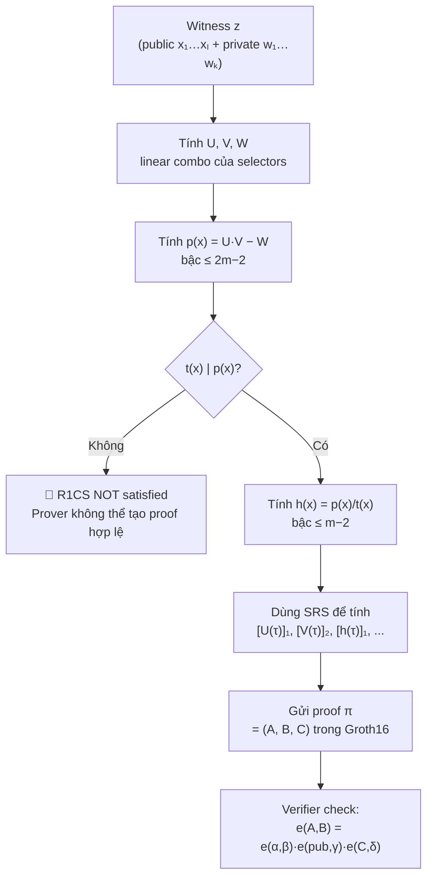
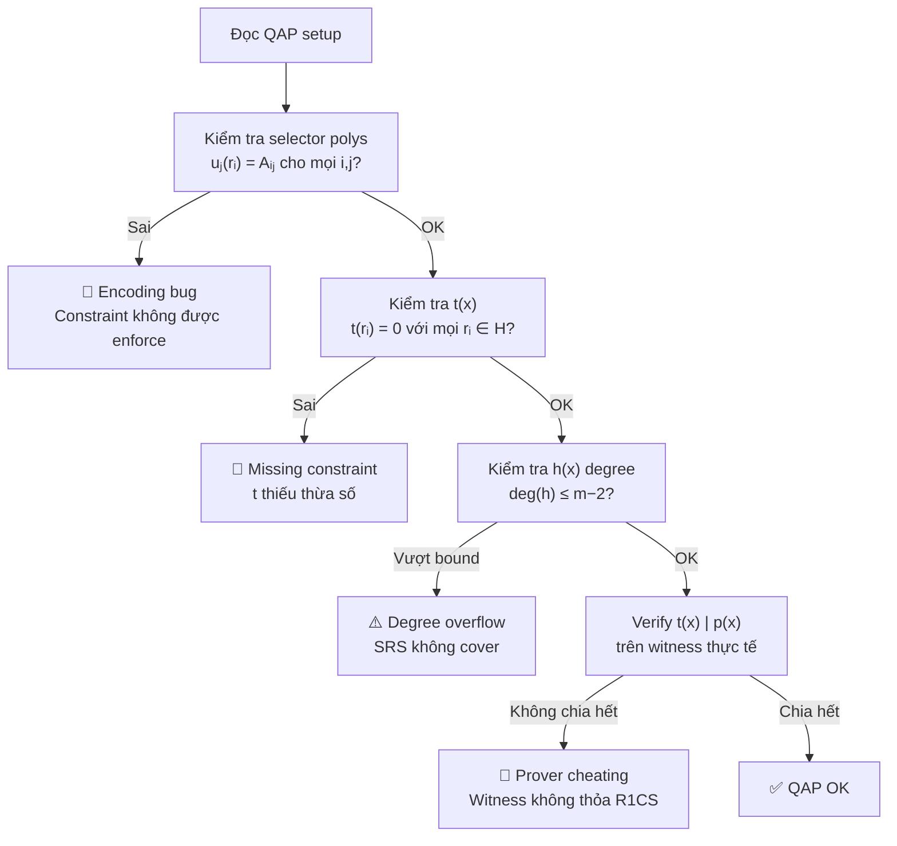

> **Prerequisites**: [[09-qap|09. QAP — Quadratic Arithmetic Programs]] — định nghĩa QAP, selector polynomials, target polynomial; [[08-r1cs-soundness-completeness|08. R1CS — Soundness & Completeness]] — soundness, knowledge soundness
> **Objectives**:
> - Hiểu sâu ý nghĩa của điều kiện $t(x) \mid p(x)$ — tại sao đây là "chứng chỉ" của satisfiability
> - Phân tích soundness của QAP: fake $h(x)$ có bypass được không?
> - Nắm được cách Groth16 sử dụng QAP để tạo succinct proof
> - Nhận diện QAP-level bugs: fake witness, wrong $h(x)$, interpolation sai

---

## Motivation

Lesson 09 đã xây được QAP và kiểm tra $t(x) \mid p(x)$ trực tiếp. Nhưng trong proof system thực tế, verifier **không thể** nhận $p(x)$ và $h(x)$ rồi tự chia — vì $p(x)$ chứa thông tin về witness (phải zero-knowledge), và $p(x)$ có bậc $O(m)$ (quá lớn để truyền).

Bài này đi sâu vào: làm thế nào điều kiện $t(x) \mid p(x)$ được **kiểm tra succinctly** tại một điểm ngẫu nhiên bí mật, và tại sao kẻ gian không thể fake $h(x)$ để bypass kiểm tra này.

---

## 1. Điều kiện Divisibility — Phân tích Hình học

Khi nào $t(x) \mid p(x)$? Điều này xảy ra khi và chỉ khi $p(x)$ có **tất cả nghiệm của $t(x)$** là nghiệm của nó.

> [!theorem] Theorem 10.1 — Divisibility Characterization
> Với $t(x) = \prod_{i=1}^{m}(x - r_i)$ và $p(x) = U(x)V(x) - W(x)$:
>
> $$t(x) \mid p(x) \quad \Longleftrightarrow \quad p(r_i) = 0 \quad \forall i \in \{1, \ldots, m\}$$
>
> $$\Longleftrightarrow \quad U(r_i) \cdot V(r_i) = W(r_i) \quad \forall i$$
>
> $$\Longleftrightarrow \quad \langle A_i, \vec{z} \rangle \cdot \langle B_i, \vec{z} \rangle = \langle C_i, \vec{z} \rangle \quad \forall i$$

Chuỗi tương đương này là định lý then chốt: **QAP satisfied ⟺ R1CS satisfied**. Divisibility không phải một điều kiện thêm vào — nó là cách encode điều kiện R1CS dưới dạng polynomial.

```python
p = 13

def poly_eval(coeffs, x, p):
    """Evaluate polynomial (list hệ số) tại x trong F_p"""
    result = 0
    for coef in reversed(coeffs):
        result = (result * x + coef) % p
    return result

# Từ Lesson 09: QAP cho out = x^2 + 5, x=3
# p(x) = [8, 1, 4] (bậc 2), t(x) = [2, 10, 1] (bậc 2)
# h(x) = [4] (hằng số)
p_poly = [8, 1, 4]
t_poly = [2, 10, 1]
r1, r2 = 1, 2

print("=== Kiểm tra divisibility qua nghiệm ===")
print(f"p(r1=1) = {poly_eval(p_poly, r1, p)}")   # phải = 0
print(f"p(r2=2) = {poly_eval(p_poly, r2, p)}")   # phải = 0
assert poly_eval(p_poly, r1, p) == 0
assert poly_eval(p_poly, r2, p) == 0
print("p(x) = 0 tại mọi rᵢ ∈ H → t(x) | p(x) ✓")

# Nếu R1CS NOT satisfied thì p(ri) ≠ 0 tại ít nhất một rᵢ
# Ví dụ: dùng witness sai (x=3, nhưng fake t1=5 thay vì 9)
z_fake = [1, 3, 1, 5]   # t1 sai: 5 thay vì 9
# Tính lại U, V, W và p với z_fake
# (Dùng helper từ lesson 09)
```

---

## 2. Kiểm tra Succinctly tại Điểm Ngẫu nhiên

Thay vì verify $p(r_i) = 0$ với mọi $i$ (cần $m$ phép kiểm tra), verifier chọn ngẫu nhiên $\tau \in \mathbb{F}_p \setminus H$ và kiểm tra:

$$U(\tau) \cdot V(\tau) - W(\tau) = h(\tau) \cdot t(\tau)$$

Đây là **một phép kiểm tra duy nhất**.

> [!theorem] Theorem 10.2 — Soundness của QAP check tại điểm ngẫu nhiên
> Nếu $U \cdot V - W \neq h \cdot t$ (tức là assignment không satisfying), thì với $\tau$ chọn ngẫu nhiên từ $\mathbb{F}_p$:
>
> $$\Pr_{\tau}\bigl[U(\tau)V(\tau) - W(\tau) = h(\tau) \cdot t(\tau)\bigr] \leq \frac{\deg(U \cdot V)}{p} \leq \frac{2m}{p}$$
>
> Với $p \approx 2^{254}$ và $m \leq 10^6$: xác suất $\leq 2 \cdot 10^6 / 2^{254} \approx 2^{-233}$ — negligible hoàn toàn.

```python
import random

def qap_verify_at_point(U_coeffs, V_coeffs, W_coeffs, h_coeffs, t_coeffs, tau, p):
    """
    Kiểm tra QAP tại điểm τ: U(τ)·V(τ) - W(τ) == h(τ)·t(τ)
    """
    Ut = poly_eval(U_coeffs, tau, p)
    Vt = poly_eval(V_coeffs, tau, p)
    Wt = poly_eval(W_coeffs, tau, p)
    ht = poly_eval(h_coeffs, tau, p)
    tt = poly_eval(t_coeffs, tau, p)

    lhs = (Ut * Vt - Wt) % p
    rhs = (ht * tt) % p
    return lhs == rhs, Ut, Vt, Wt, ht, tt

# Từ lesson 09: U=[5,11], V=[5,11], W=[4,5], h=[4], t=[2,10,1] trong F_13
U_poly = [5, 11]; V_poly = [5, 11]; W_poly = [4, 5]
h_poly = [4]; t_poly = [2, 10, 1]

tau = 7   # điểm ngẫu nhiên ngoài H={1,2}
ok, Ut, Vt, Wt, ht, tt = qap_verify_at_point(U_poly, V_poly, W_poly, h_poly, t_poly, tau, p)
print(f"\nKiểm tra tại τ={tau}:")
print(f"  U(τ)={Ut}, V(τ)={Vt}, W(τ)={Wt}")
print(f"  LHS = U·V - W = {(Ut*Vt - Wt)%p}")
print(f"  h(τ)={ht}, t(τ)={tt}, RHS = h·t = {(ht*tt)%p}")
print(f"  Verify: {ok}")
```

---

## 3. Tại sao Kẻ gian không thể Fake $h(x)$?

Giả sử prover gian lận — dùng witness $\vec{z}^*$ không thỏa mãn R1CS. Khi đó $p^*(x) = U^* V^* - W^*$ có ít nhất một $r_i$ với $p^*(r_i) \neq 0$, nên $t(x) \nmid p^*(x)$.

**Kẻ gian có thể tự bịa $h'(x)$** khác với $p^*(x)/t(x)$ không? Không — vì:

$$h'(\tau) \cdot t(\tau) = U^*(\tau) \cdot V^*(\tau) - W^*(\tau)$$

là một polynomial identity bậc $\leq 2m$ về $\tau$. Nếu identity này sai (vế trái $\neq$ vế phải là đa thức), thì theo Schwartz-Zippel, xác suất trùng tại $\tau$ ngẫu nhiên $\leq 2m/p$.

Hơn nữa, trong Groth16: $\tau$ không được tiết lộ — nó được **"nhúng"** vào SRS (Structured Reference String) từ trusted setup. Prover chỉ có thể tính $[h(\tau)]_1$ từ SRS nếu $h(x)$ có bậc đúng — không thể tự đặt $h'(\tau)$ thành giá trị tùy ý.

```mermaid
flowchart TD
    A["Prover gian lận<br>z&#42; không thỏa R1CS"] --> B["p&#42;(x) = U&#42;V&#42; − W&#42;<br>không chia hết cho t(x)"]
    B --> C["Phải tìm h' sao cho<br>h'·t = p&#42; tại điểm τ"]
    C --> D{"τ được biết không?"}
    D -->|"Không — τ ẩn trong SRS"| E["Không tính được<br>[h'(τ)]₁ từ SRS<br>vì h' sai degree"]
    D -->|"Biết τ (lý thuyết)"| F["Schwartz-Zippel:<br>Pr[trùng] ≤ 2m/p ≈ 0"]
    E & F --> G["Proof bị reject<br>với xác suất ≈ 1"]
```



*Tại sao kẻ gian không thể fake $h(x)$: $\tau$ ẩn trong SRS và Schwartz-Zippel đảm bảo xác suất nhỏ.*

---

## 4. Degree Bound — Constraint quan trọng

Một điểm tinh tế: prover **phải** cung cấp $h(x)$ có bậc đúng.

> [!definition] Definition 10.3 — Degree of $h(x)$
> Vì $\deg(U \cdot V) \leq 2(m-1)$ và $\deg(t) = m$, ta có:
>
> $$\deg(h) = \deg(p) - \deg(t) \leq 2(m-1) - m = m - 2$$
>
> SRS trong Groth16 cung cấp $\{[\tau^i]_1\}_{i=0}^{m-2}$ — đủ để prover tính $[h(\tau)]_1$ nếu $\deg(h) \leq m-2$.
>
> Nếu prover cố gán $h$ bậc cao hơn (để bù đắp $p^*$ không chia hết), SRS không có đủ power để tính — **proof fail tự nhiên**.

```python
def check_qap_degree_bounds(m, U_poly, V_poly, W_poly, h_poly, t_poly):
    """
    Kiểm tra degree bounds của QAP polynomials.
    m: số constraints
    """
    deg_U = len(U_poly) - 1
    deg_V = len(V_poly) - 1
    deg_W = len(W_poly) - 1
    deg_h = len(h_poly) - 1
    deg_t = len(t_poly) - 1

    print(f"m = {m} constraints")
    print(f"deg(U) = {deg_U} ≤ {m-1}? {deg_U <= m-1}")
    print(f"deg(V) = {deg_V} ≤ {m-1}? {deg_V <= m-1}")
    print(f"deg(W) = {deg_W} ≤ {m-1}? {deg_W <= m-1}")
    print(f"deg(t) = {deg_t} = {m}? {deg_t == m}")
    print(f"deg(h) = {deg_h} ≤ {m-2}? {deg_h <= m-2}")

    max_h = m - 2
    if deg_h > max_h:
        print(f"⚠️  h(x) vượt degree bound! {deg_h} > {max_h}")
        return False
    print("Degree bounds OK ✓")
    return True

# Ví dụ m=2: U,V bậc 1, t bậc 2, h phải bậc ≤ 0 (hằng số)
m = 2
check_qap_degree_bounds(m, U_poly, V_poly, W_poly, h_poly, t_poly)
```

---

## 5. Witness Sai — Phân tích Concrete

Giả sử prover dùng witness sai: $x=3$ nhưng $t_1 = 5$ (thay vì $9 = 3^2$). Ta phân tích $p^*(x)$ có chia hết cho $t(x)$ không:

```python
# Setup từ lesson 09
def lagrange_linear(r1, y1, r2, y2, p):
    slope = ((y2-y1)*pow(r2-r1, p-2, p)) % p
    return [(y1-slope*r1)%p, slope]

def combined_poly_from_cols(matrix_cols, z_vec, r_pts, p):
    """Xây U/V/W poly từ cột matrix và witness"""
    polys = []
    for col in matrix_cols:
        # col[i] = giá trị tại r_pts[i]
        poly = lagrange_linear(r_pts[0], col[0], r_pts[1], col[1], p)
        polys.append(poly)
    # Combined: Σ z_j * poly_j
    n_terms = 2
    result = [0] * n_terms
    for j, poly in enumerate(polys):
        for k in range(len(poly)):
            result[k] = (result[k] + z_vec[j] * poly[k]) % p
    return result

p = 13
r1, r2 = 1, 2
A_cols = [[0,5],[1,0],[0,0],[0,1]]
B_cols = [[0,1],[1,0],[0,0],[0,0]]
C_cols = [[0,0],[0,0],[0,1],[1,0]]

# Witness sai: t1=5 thay vì 9
z_fake = [1, 3, 1, 5]   # [1, x=3, out=1, t1=5(FAKE)]

def compute_qap_polys(A_cols, B_cols, C_cols, z, r_pts, p):
    def interpolate_col(col, r_pts, p):
        return lagrange_linear(r_pts[0], col[0], r_pts[1], col[1], p)
    def combine(matrix_cols, z_vec, p):
        polys = [interpolate_col(col, r_pts, p) for col in matrix_cols]
        result = [0, 0]
        for j, poly in enumerate(polys):
            for k in range(2):
                result[k] = (result[k] + z_vec[j] * poly[k]) % p
        return result
    U = combine(A_cols, z, p)
    V = combine(B_cols, z, p)
    W = combine(C_cols, z, p)
    return U, V, W

def poly_mul_2(f, g, p):
    result = [0]*(len(f)+len(g)-1)
    for i,a in enumerate(f):
        for j,b in enumerate(g):
            result[i+j]=(result[i+j]+a*b)%p
    return result

def poly_sub_2(f, g, p):
    n=max(len(f),len(g))
    r=[((f[i] if i<len(f) else 0)-(g[i] if i<len(g) else 0))%p for i in range(n)]
    while len(r)>1 and r[-1]==0: r.pop()
    return r

U_fake, V_fake, W_fake = compute_qap_polys(A_cols, B_cols, C_cols, z_fake, [r1,r2], p)
UV_fake = poly_mul_2(U_fake, V_fake, p)
p_fake = poly_sub_2(UV_fake, W_fake, p)

print("=== Witness sai (t1=5 thay vì 9) ===")
print(f"p*(r1=1) = {poly_eval(p_fake, r1, p)}")   # phải ≠ 0
print(f"p*(r2=2) = {poly_eval(p_fake, r2, p)}")   # phải ≠ 0

# Cố chia t vào p_fake
def poly_divmod_2(f, g, p):
    f=list(f); g=list(g)
    if len(f)<len(g): return [0], f
    q=[]
    while len(f)>=len(g):
        coef=(f[-1]*pow(g[-1],p-2,p))%p
        q.insert(0,coef)
        diff=len(f)-len(g)
        for i in range(len(g)): f[diff+i]=(f[diff+i]-coef*g[i])%p
        f.pop()
    while len(f)>1 and f[-1]==0: f.pop()
    return q, f

t_poly_local = [2, 10, 1]
h_fake, rem_fake = poly_divmod_2(p_fake, t_poly_local, p)
print(f"remainder khi chia t(x): {rem_fake}")
print(f"Divisible: {all(r==0 for r in rem_fake)}")
# → NOT divisible → QAP không thỏa mãn → prover gian lận bị phát hiện
```

---

## 6. Tổng hợp: Pipeline Đầy đủ QAP → Proof



*Pipeline đầy đủ từ witness đến Groth16 proof — QAP là cầu nối then chốt.*

---

## 7. QAP-level Bugs trong Thực tế

Dưới đây là các lỗi có thể xảy ra ở tầng QAP — quan trọng cho bug bounty:

### Bug 1: Evaluation Domain Collision

Nếu evaluation domain $H$ chứa điểm $\tau$ đã được dùng trong SRS:

$$t(\tau) = 0 \implies \text{mọi } h(\tau) \cdot t(\tau) = 0$$

Prover có thể đặt $U(\tau) \cdot V(\tau) - W(\tau) = 0$ với witness sai bằng cách chọn $U, V, W$ sao cho tích bằng $W$ tại $\tau$. Đây là **parameter poisoning bug**.

### Bug 2: Selector Polynomial Sai

Nếu $u_j(r_i) \neq A_{i,j}$ (do lỗi interpolation hoặc index sai), constraint $i$ bị encode sai → prover có thể thỏa mãn QAP với witness không thỏa R1CS.

```python
def verify_selector_polynomials(u_polys, A_matrix, r_pts, p):
    """
    Kiểm tra selector polynomials khớp đúng ma trận A.
    u_polys: list đa thức uⱼ (list hệ số)
    A_matrix: danh sách các hàng
    r_pts: evaluation domain
    """
    m = len(A_matrix)
    n = len(u_polys)
    issues = []
    for i, ri in enumerate(r_pts):
        for j in range(n):
            computed = poly_eval(u_polys[j], ri, p)
            expected = A_matrix[i][j]
            if computed != expected:
                issues.append(
                    f"u_{j}(r_{i+1}) = {computed} ≠ A[{i}][{j}] = {expected}"
                )
    if not issues:
        print("Selector polynomial check OK ✓")
    else:
        for issue in issues:
            print(f"⚠️  {issue}")
    return issues

# Test với QAP đúng
u_polys = [lagrange_linear(r1, A_cols[j][0], r2, A_cols[j][1], p) for j in range(4)]
A_matrix = [[0,1,0,0],[5,0,0,1]]
verify_selector_polynomials(u_polys, A_matrix, [r1,r2], p)

# Giả lập lỗi interpolation: u_1 sai
u_polys_buggy = u_polys.copy()
u_polys_buggy[1] = [0, 2]   # sai: đáng ra [0, -1] mod p = [0, 12] → đường thẳng khác
verify_selector_polynomials(u_polys_buggy, A_matrix, [r1,r2], p)
```

### Bug 3: Wrong Target Polynomial

Nếu $t(x)$ được tính sai (ví dụ thiếu một thừa số $(x - r_i)$), một số constraints không được enforce:

```python
def check_target_polynomial(t_coeffs, domain, p):
    """
    Kiểm tra t(x) = 0 tại mọi điểm trong domain.
    """
    issues = []
    for i, ri in enumerate(domain):
        val = poly_eval(t_coeffs, ri, p)
        if val != 0:
            issues.append(f"t(r_{i+1}={ri}) = {val} ≠ 0 — thiếu thừa số (x − {ri})")
    if not issues:
        print("Target polynomial check OK ✓")
    else:
        for issue in issues:
            print(f"⚠️  {issue}")
    return issues

# Đúng
check_target_polynomial(t_poly_local, [r1, r2], p)

# Sai: thiếu (x-2) — t_wrong(x) = x - 1
t_wrong = [(-1)%p, 1]   # x - 1
check_target_polynomial(t_wrong, [r1, r2], p)
```

---

## 8. Checklist Audit QAP

Khi audit một implementation QAP (ví dụ Groth16 prover):



*Checklist audit QAP — kiểm tra từng tầng từ selector polynomials đến divisibility.*

---

## Summary

- **Điều kiện QAP**: $t(x) \mid U(x)V(x) - W(x)$ ⟺ R1CS satisfied ⟺ $p(r_i) = 0$ với mọi $r_i \in H$.
- **Soundness**: kiểm tra tại $\tau$ ngẫu nhiên duy nhất đủ — xác suất gian lận $\leq 2m/p \approx 2^{-233}$.
- **Không fake được $h(x)$**: $\tau$ ẩn trong SRS; kẻ gian không tính được $[h'(\tau)]_1$ với $h'$ sai bậc.
- **Degree bound**: $\deg(h) \leq m-2$ — SRS chỉ cung cấp đủ powers cho $h$ đúng bậc.
- **QAP bugs**: evaluation domain collision, selector polynomial sai, target polynomial thiếu thừa số.
- **Audit**: verify $u_j(r_i) = A_{i,j}$, $t(r_i) = 0$, $\deg(h) \leq m-2$, $t \mid p$ với witness thực.

---

## References

- Vitalik Buterin — *Quadratic Arithmetic Programs: from Zero to Hero* (medium.com/@VitalikButerin, 2016)
- Jens Groth — *On the Size of Pairing-Based Non-interactive Arguments* (eprint.iacr.org/2016/260)
- Justin Thaler — *Proofs, Arguments, and Zero-Knowledge*, Ch. 5.2–5.4
- ZKProof Community Reference — Section 5.3: QAP Security Analysis
- Gabizon, Williamson, Ciobotaru — *PLONK* (eprint.iacr.org/2019/953) — so sánh QAP với Plonkish
