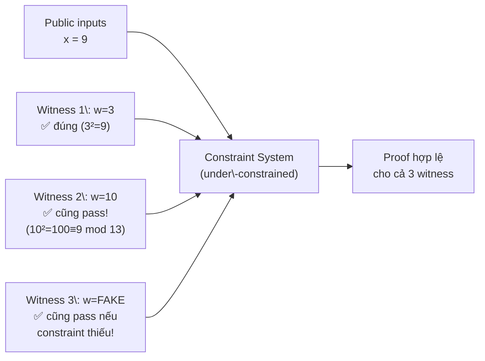
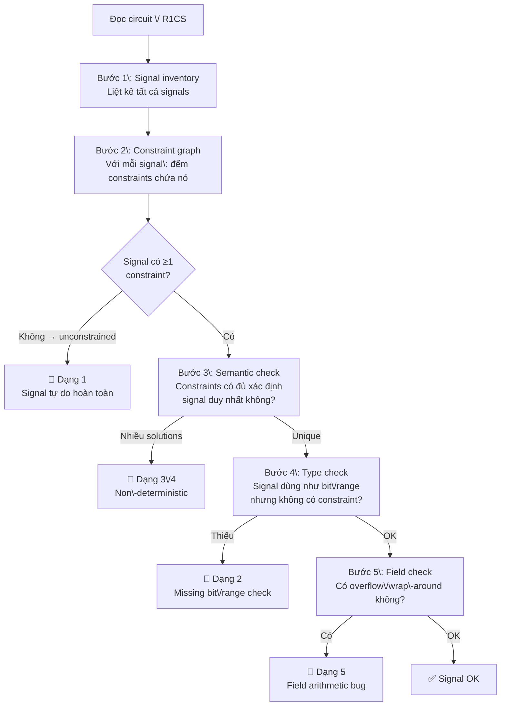
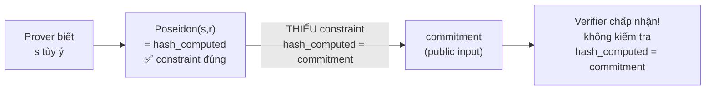

> **Prerequisites**: [[08-r1cs-soundness-completeness|08. R1CS — Soundness & Completeness]] — soundness, knowledge soundness; [[07-circuit-to-r1cs|07. Chuyển đổi Circuit → R1CS]] — quy trình flattening, pinning constraint; [[04-signals-witnesses-visibility|04. Signals, Witnesses & Visibility]] — intermediate signals
> **Objectives**:
> - Định nghĩa chính xác under-constrained circuit và phân biệt các dạng
> - Phân tích attack vector: prover chọn witness tự do để forge proof
> - Nhận diện 5 pattern under-constrained phổ biến nhất trong ZK circuits thực tế
> - Thực hành tìm under-constrained bug qua ví dụ Circom và R1CS cụ thể

---

## Motivation

Under-constrained là lỗi **nguy hiểm nhất** trong ZK circuit — nguy hiểm hơn cả lỗi logic thông thường vì nó **phá vỡ soundness**: prover có thể tạo proof hợp lệ cho statement **sai**. Điều này có nghĩa là hệ thống chấp nhận giao dịch giả, bỏ qua điều kiện quan trọng, hoặc cho phép double-spend.

Theo 0xPARC ZK Bug Tracker, under-constrained là class lỗi chiếm tỷ lệ cao nhất trong các audit ZK circuit thực tế.

---

## 1. Định nghĩa

> [!definition] Definition 11.1 — Under-constrained Circuit
> Một circuit (hoặc R1CS) là **under-constrained** nếu tồn tại **nhiều hơn một** satisfying assignment $\vec{z}$ cho cùng một tập public inputs — trong đó ít nhất một assignment encode computation **sai**.
>
> Hệ quả: prover có thể chọn assignment "xấu" (không phản ánh tính toán đúng) mà vẫn tạo được proof hợp lệ.



*Under-constrained: nhiều witnesses — kể cả sai — đều tạo được proof hợp lệ.*

---

## 2. Dạng 1 — Signal Hoàn toàn Tự do (Unconstrained Signal)

Signal không xuất hiện trong bất kỳ constraint nào → prover đặt giá trị tùy ý.

**Ví dụ Circom**:

```circom
// BUG: signal out không bị constrain
template Broken() {
    signal input x;
    signal output out;

    signal t;
    t <== x * x;     // t = x²  (constraint tồn tại)
    // THIẾU: out <== t + 5;
    // out không có constraint → prover đặt out = bất kỳ giá trị nào
}
```

**R1CS tương đương**:

```python
p = 13

# z = [1, x, out, t]
# Chỉ có 1 constraint: t = x*x
# out KHÔNG bị constrain

A = [[0, 1, 0, 0]]   # x
B = [[0, 1, 0, 0]]   # x
C = [[0, 0, 0, 1]]   # t = x*x

# Prover dùng x=3, t=9 (đúng), nhưng đặt out=999 (giả)
def r1cs_check(A, B, C, z, p):
    def mv(M, v): return [sum(M[i][j]*v[j] for j in range(len(v)))%p for i in range(len(M))]
    Az, Bz, Cz = mv(A,z), mv(B,z), mv(C,z)
    return all((Az[i]*Bz[i]-Cz[i])%p==0 for i in range(len(Az)))

x = 3; t = (x*x)%p
z_fake = [1, x, 999%p, t]   # out = 999 mod 13 = 11 — GIẢ MẠNH
print(f"Fake witness: {z_fake}")
print(f"R1CS satisfied: {r1cs_check(A, B, C, z_fake, p)}")
# → True! Vì out không bị constrain, prover đặt tùy ý
```

**Fix**: Thêm pinning constraint cho `out`:

```circom
template Fixed() {
    signal input x;
    signal output out;
    signal t;
    t <== x * x;
    out <== t + 5;   // ← constraint bắt buộc
}
```

---

## 3. Dạng 2 — Missing Range / Bit Constraint

Signal được dùng như bit ($0$ hoặc $1$) nhưng không có constraint kiểm tra điều đó.

```circom
// BUG: b được dùng như selector nhưng không verify b ∈ {0,1}
template BrokenMux() {
    signal input a;
    signal input b;   // phải là bit, nhưng không constraint!
    signal input c;
    signal output out;

    out <== b * (a - c) + c;   // mux: nếu b=1 → out=a, nếu b=0 → out=c
    // THIẾU: b * (b - 1) === 0;
}
```

**Hậu quả**: Prover đặt `b = 7` (không phải bit), tính `out = 7*(a-c)+c` — một giá trị hoàn toàn khác ý định.

```python
p = 13

# Mux đúng với b ∈ {0,1}
def mux_correct(b, a, c, p):
    assert b in [0, 1], "b phải là bit"
    return (b * (a - c) + c) % p

# Mux bị khai thác với b tùy ý
def mux_exploited(b_fake, a, c, p):
    return (b_fake * (a - c) + c) % p

a, c = 5, 2
print(f"Mux b=1: out = {mux_correct(1, a, c, p)}")   # 5 (đúng)
print(f"Mux b=0: out = {mux_correct(0, a, c, p)}")   # 2 (đúng)
print(f"Mux b=7: out = {mux_exploited(7, a, c, p)}")  # 7*(5-2)+2 = 23%13 = 10 (exploit!)
```

**Fix**: Thêm bit constraint:

```circom
template FixedMux() {
    signal input a; signal input b; signal input c;
    signal output out;

    b * (b - 1) === 0;          // ← bit constraint bắt buộc
    out <== b * (a - c) + c;
}
```

---

## 4. Dạng 3 — Unused Output của Sub-circuit

Khi dùng component/template, output của nó phải được constrain — chỉ instantiate chưa đủ.

```circom
// BUG: instantiate component nhưng không dùng output
template Verifier() {
    signal input x;
    signal input hash;

    component hasher = Poseidon(1);
    hasher.inputs[0] <== x;
    // THIẾU: hasher.out === hash;
    // Prover có thể dùng x tùy ý — hash không được kiểm tra!
}
```

**Pattern này xuất hiện trong**: Tornado Cash (phiên bản cũ), nhiều zkRollup circuits.

```python
# Giả lập: component output không bị constrain
# z = [1, x, hash_pub, hasher_out]
# Constraint: hasher_out = poseidon(x)  ← có
# THIẾU: hasher_out == hash_pub         ← không có

p = 13

def fake_poseidon(x, p):
    """Giả lập hash đơn giản"""
    return (x * x + 7) % p

x_real = 3
x_fake = 5
hash_pub = fake_poseidon(x_real, p)   # hash của x_real = 3

# Prover dùng x_fake=5, tự tính hasher_out = poseidon(5)
# Vì hasher_out không link với hash_pub → prover pass!
hasher_out_fake = fake_poseidon(x_fake, p)

# Constraint chỉ: hasher_out = x*x + 7 (luôn đúng với x bất kỳ)
A = [[0, 1, 0, 0]]; B = [[0, 1, 0, 0]]; C = [[0, 0, 0, 0]]  # simplified

print(f"hash_pub (hash của x=3) = {hash_pub}")
print(f"hasher_out khi dùng x_fake=5 = {hasher_out_fake}")
print(f"Chúng có bằng nhau không? {hash_pub == hasher_out_fake}")
print("→ Prover dùng x=5 nhưng claim biết preimage của hash(3)!")
```

**Fix**:

```circom
hasher.out === hash;   // ← link output với public input
```

---

## 5. Dạng 4 — Non-deterministic Intermediate Signal

Intermediate signal phụ thuộc vào nhiều cách tính khác nhau, không có constraint duy nhất định nó.

```circom
// BUG: quotient q không được constrain đủ
template IntDiv() {
    signal input a;
    signal input b;
    signal output q;   // a / b (integer division)
    signal output r;   // a % b (remainder)

    q * b + r === a;   // đúng: a = q*b + r
    // THIẾU: 0 <= r < b  (range constraint cho r)
    // Prover đặt q=0, r=a → vẫn thỏa q*b+r=a khi q=0, b=anything
}
```

```python
p = 13

# a = q*b + r phải thỏa, nhưng thiếu range constraint 0 <= r < b
a, b = 7, 3   # 7 / 3 = 2 remainder 1

# Đúng
q_correct, r_correct = 2, 1
assert (q_correct * b + r_correct) % p == a % p
print(f"Đúng: q={q_correct}, r={r_correct}")

# Khai thác: q=0, r=a
q_exploit, r_exploit = 0, a
assert (q_exploit * b + r_exploit) % p == a % p
print(f"Exploit: q={q_exploit}, r={r_exploit} — vẫn thỏa constraint!")

# Khai thác khác: q=-1 mod p, r = a+b
q_exploit2 = (-1) % p   # 12
r_exploit2 = (a + b) % p  # 10
assert (q_exploit2 * b + r_exploit2) % p == a % p
print(f"Exploit 2: q={q_exploit2}, r={r_exploit2} — cũng thỏa!")
```

**Fix**: Thêm range constraint cho `r`:

```circom
// r phải nằm trong [0, b)
// Encode bằng range proof hoặc lookup table
component lt = LessThan(n_bits);
lt.in[0] <== r;
lt.in[1] <== b;
lt.out === 1;   // r < b
```

---

## 6. Dạng 5 — Soundness Bug qua Field Arithmetic

Lỗi tinh tế nhất: constraint đúng về mặt logic nhưng sai khi tính trên $\mathbb{F}_p$ do wrap-around.

```python
p = 13

# Muốn prove: x < 10 bằng cách decompose x thành bits
# Nhưng trong F_p, x có thể wrap-around!

# Ví dụ: x = 15 ≡ 2 (mod 13)
# Constraint: x = b0 + 2*b1 + 4*b2 + 8*b3
# Prover dùng x=2 (đúng), nhưng cũng có thể claim x_field=2 = 15 ngoài field!

x_real = 2   # trong F_13
# Bit decomposition của 2: b0=0, b1=1, b2=0, b3=0
bits_correct = [0, 1, 0, 0]
recomposed = sum(bits_correct[i] * (2**i) for i in range(4)) % p
assert recomposed == x_real
print(f"Đúng: {bits_correct} → {recomposed}")

# Nhưng 15 ≡ 2 (mod 13), và bit decomp của 15: b0=1, b1=1, b2=1, b3=1
x_overflow = 15
bits_overflow = [1, 1, 1, 1]   # 15 = 1+2+4+8
recomposed_overflow = sum(bits_overflow[i] * (2**i) for i in range(4)) % p
assert recomposed_overflow == x_real   # cũng ra 2 mod 13!
print(f"Overflow exploit: {bits_overflow} → {recomposed_overflow} ≡ {x_real} mod {p}")
print("→ Circuit nghĩ x=2 < 10, nhưng thực ra prover encode x=15!")
```

**Fix**: Phải thêm constraint `x < p` (range proof trên số bit đủ lớn) **trước khi** dùng x trong logic.

---

## 7. Phương pháp Tìm Under-constrained trong Audit



*Workflow audit under-constrained — kiểm tra 5 dạng theo thứ tự từ dễ đến khó phát hiện.*

```python
def find_unconstrained_signals(A, B, C, n_signals, p):
    """
    Tìm signals không xuất hiện trong bất kỳ constraint nào.
    Trả về list index của unconstrained signals.
    """
    m = len(A)
    unconstrained = []

    for s in range(1, n_signals):   # bỏ z[0]=1
        appears = any(
            A[i][s] != 0 or B[i][s] != 0 or C[i][s] != 0
            for i in range(m)
        )
        if not appears:
            unconstrained.append(s)

    return unconstrained

def find_output_without_pinning(C, output_signal_indices, n_signals):
    """
    Tìm output signals không xuất hiện trong cột C của bất kỳ constraint nào.
    """
    not_pinned = []
    for out_idx in output_signal_indices:
        pinned = any(C[i][out_idx] != 0 for i in range(len(C)))
        if not pinned:
            not_pinned.append(out_idx)
    return not_pinned

# Test: circuit out=x² nhưng thiếu pinning cho out
# z = [1, x, out, t]
A_bug = [[0,1,0,0]]   # chỉ constraint: x*x = t
B_bug = [[0,1,0,0]]
C_bug = [[0,0,0,1]]

unconstrained = find_unconstrained_signals(A_bug, B_bug, C_bug, n_signals=4, p=p)
not_pinned    = find_output_without_pinning(C_bug, output_signal_indices=[2], n_signals=4)

print(f"Unconstrained signals: {unconstrained}")   # [] — out xuất hiện ở... không đâu
print(f"Outputs without pinning: {not_pinned}")    # [2] — out (z[2]) không có trong C
```

---

## 8. Case Study — Tornado Cash Bug (2022)

Một trong những under-constrained bug nổi tiếng nhất:

**Circuit**: Prove "tôi biết secret $s$ sao cho $\text{hash}(s, r) = \text{commitment}$"

**Bug**: Output của Poseidon hash sub-circuit không được constrain bằng `commitment` (public input). Chỉ có constraint "hasher tính đúng" nhưng thiếu "hasher output = commitment".

**Hậu quả**: Attacker prove với `s` tùy ý — không cần biết secret thật — vẫn rút được tiền.



*Tornado Cash bug pattern — missing link giữa sub-circuit output và public input.*

**Fix pattern**:

```circom
// SAI — chỉ tính hash, không link
component h = Poseidon(2);
h.inputs[0] <== secret;
h.inputs[1] <== randomness;

// ĐÚNG — thêm equality constraint
component h = Poseidon(2);
h.inputs[0] <== secret;
h.inputs[1] <== randomness;
h.out === commitment;   // ← constraint bắt buộc
```

---

## Summary

- **Under-constrained** = nhiều witnesses hợp lệ cho cùng public input, bao gồm witnesses encode computation sai → soundness bị phá.
- **5 dạng chính**: (1) signal hoàn toàn tự do, (2) thiếu bit/range check, (3) output sub-circuit không linked, (4) non-deterministic intermediate, (5) field arithmetic overflow.
- **Workflow audit**: signal inventory → constraint graph → semantic check → type check → field check.
- **Rule vàng**: mọi intermediate signal phải xuất hiện trong ít nhất một constraint bên **C** (output side) của R1CS — hoặc được xác định duy nhất bởi constraints phía **A, B**.
- **Case study**: Tornado Cash bug — missing link giữa hash output và commitment public input.

---

## References

- 0xPARC — *ZK Bug Tracker* (github.com/0xPARC/zk-bug-tracker)
- Trail of Bits — *Circomspect: A Multi-Pass Analyzer for Circom* (blog.trailofbits.com)
- Veridise — *Picus: Automating Constraint Sufficiency for ZK Circuits* (eprint.iacr.org/2023/1614)
- Franklyn Wang — *ECNE: An Engine for Cryptographic Non-equivalence* (github.com/franklynwang/EcneProject)
- Iden3 — *Common Vulnerabilities in ZK Circuits* (docs.circom.io/circom-insight)
