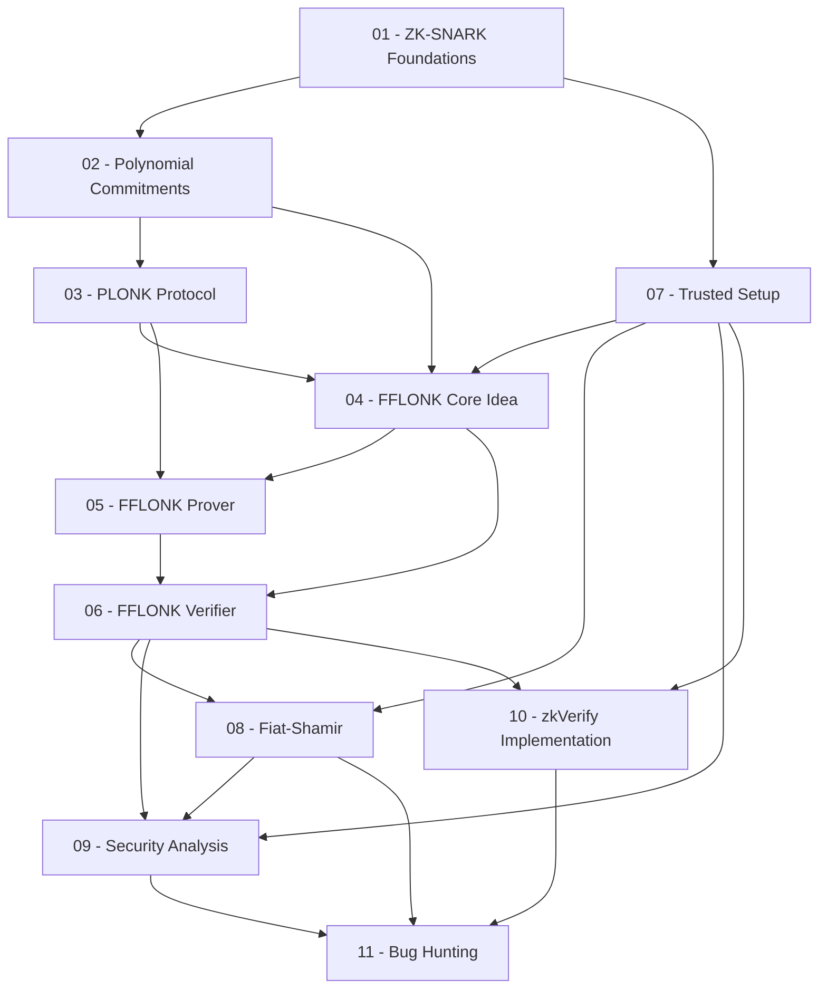

> **Topic**: FFLONK — Fast-Fourier inspired verifier-efficient PlonK
> **Domain**: Cryptography (zk-SNARK)
> **Level**: Advanced + CTF-focused
> **Background**: Modular arithmetic, group theory, polynomial rings, Python
> **Tools / Code**: Python (SageMath, py_ecc), Rust (zkVerify fflonk_verifier)
> **Sources**: Gabizon & Williamson 2021 (IACR 2021/1167), Polygon zkEVM docs, zkVerify GitHub

---

## Lessons

| # | Title | Key Concepts | Prerequisites | Difficulty |
|---|-------|-------------|---------------|------------|
| 01 | ZK-SNARK Foundations | Completeness, Soundness, ZK, bilinear pairing, BN254 | — | ★★★☆☆ |
| 02 | Polynomial Commitment Schemes | KZG commit/open/verify, batch opening, hiding/binding | 01 | ★★★★☆ |
| 03 | PLONK Protocol | Arithmetization, copy constraints, linearization trick | 01, 02 | ★★★★☆ |
| 04 | FFLONK Core Idea | FFT-like identity, polynomial combining, multi-point opening | 02, 03 | ★★★★☆ |
| 05 | FFLONK Prover Algorithm | 5 prover rounds, polynomial computation, proof structure | 03, 04 | ★★★★★ |
| 06 | FFLONK Verifier Algorithm | Verifier steps, pairing checks, 5 scalar muls, VK structure | 04, 05 | ★★★★★ |
| 07 | Trusted Setup & Powers of Tau | Universal SRS, $\tau$ poisoning, ceremony security, MPC | 01, 02 | ★★★☆☆ |
| 08 | Fiat-Shamir Transform in FFLONK | Interactive → NIZK, transcript binding, Last Challenge Attack | 02, 06 | ★★★★☆ |
| 09 | Security Analysis & Threat Model | Soundness proof, AGM, known attack classes, formal defs | 06, 07, 08 | ★★★★★ |
| 10 | zkVerify FFLONK Implementation | Rust code walkthrough, proof deserialization, pallet | 06, 07 | ★★★★☆ |
| 11 | Bug Hunting on FFLONK | 10 bug classes, PoC Python, audit methodology zkVerify | 08, 09, 10 | ★★★★★ |

## Appendix

| ID | Content | Related |
|----|---------|---------|
| A0 | BN254 Curve Reference | 01, 02 |
| A1 | Field Operations Cheatsheet | 01, 02 |
| A2 | FFLONK Proof Structure Reference | 05, 06, 10 |

---

## Dependency Graph

---

## Progress Tracker

- [x] [[00-roadmap|00. Roadmap]]
- [x] [[01-zk-foundations|01. ZK-SNARK Foundations]]
- [x] [[02-polynomial-commitments|02. Polynomial Commitment Schemes]]
- [x] [[03-plonk|03. PLONK Protocol]]
- [x] [[04-fflonk-core|04. FFLONK Core Idea]]
- [x] [[05-fflonk-prover|05. FFLONK Prover Algorithm]]
- [x] [[06-fflonk-verifier|06. FFLONK Verifier Algorithm]]
- [x] [[07-trusted-setup|07. Trusted Setup & Powers of Tau]]
- [x] [[08-fiat-shamir|08. Fiat-Shamir Transform in FFLONK]]
- [x] [[09-security-analysis|09. Security Analysis & Threat Model]]
- [x] [[10-zkverify-implementation|10. zkVerify FFLONK Implementation]]
- [x] [[11-bug-hunting|11. Bug Hunting on FFLONK]]
- [x] [[a0-bn254-reference|A0. BN254 Curve Reference]]
- [x] [[a1-field-ops-cheatsheet|A1. Field Operations Cheatsheet]]
- [x] [[a2-proof-structure|A2. FFLONK Proof Structure Reference]]
