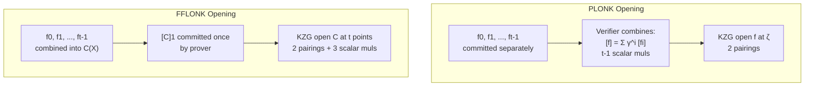

> **Prerequisites**: [[02-polynomial-commitments|02. Polynomial Commitment Schemes]], [[03-plonk|03. PLONK Protocol]]
> **Objectives**:
> - Hiểu đúng vấn đề mà FFLONK giải quyết: tại sao PLONK verifier cần nhiều scalar multiplications
> - Nắm vững FFT-like identity — trái tim của toàn bộ FFLONK
> - Hiểu cơ chế combining $t$ polynomials thành 1 và ý nghĩa của nó
> - Phân tích trade-off prover/verifier trong FFLONK so với PLONK

---

## Motivation

Nhìn lại verifier của PLONK: sau khi nhận evaluations $\bar{a}, \bar{b}, \bar{c}, \bar{s}_1, \bar{s}_2, \bar{z}_\omega$, verifier phải tính:

$$[D]_1 = \bar{a}\bar{b} \cdot [q_M]_1 + \bar{a} \cdot [q_L]_1 + \bar{b} \cdot [q_R]_1 + \bar{c} \cdot [q_O]_1 + [q_C]_1 + \alpha(\ldots)[z]_1 + \ldots$$

Đây là **16–18 scalar multiplications** — mỗi phép tính tốn khoảng $250\,\mu s$ trên phần cứng hiện đại. Tổng cộng: vài ms, nhưng trên Ethereum phải trả gas cho mỗi `ecMul`. Đây chính là chi phí cần tối ưu.

**Câu hỏi căn bản của Gabizon & Williamson (2021):** Có thể thiết kế PCS sao cho verifier *không cần* rebuild commitment từ nhiều phần nhỏ không? Câu trả lời là **có** — bằng FFT-like identity.

---

## 1. Bài toán: mở $t$ polynomials tại 1 điểm

### 1.1 Phát biểu chính xác

Cho $t$ polynomials $f_0, f_1, \ldots, f_{t-1} \in \mathbb{F}_r^{<d}[X]$ đã được commit bởi prover. Verifier muốn xác nhận:

$$f_0(x) = y_0,\quad f_1(x) = y_1,\quad \ldots,\quad f_{t-1}(x) = y_{t-1}$$

tại một điểm chung $x \in \mathbb{F}_r$.

**Cách PLONK/batched-KZG làm** (xem Lesson 02): chọn random $\gamma$, tạo $f(X) = \sum_{i} \gamma^i f_i(X)$, mở $f(X)$ tại $x$. Verifier phải tính $[f]_1 = \sum_i \gamma^i [f_i]_1$ — cần $t-1$ scalar multiplications.

**Mục tiêu của FFLONK**: verifier group operations **không phụ thuộc vào $t$**.

---

## 2. FFT-like Identity — Trái tim của FFLONK

### 2.1 Quan sát từ FFT

Trong FFT truyền thống, một polynomial $f(X)$ được tách thành phần chẵn và lẻ:

$$f(X) = f_0(X^2) + X \cdot f_1(X^2)$$

trong đó $f_0$ chứa các hệ số chẵn, $f_1$ chứa các hệ số lẻ. Đây là bước **butterfly** cơ bản của FFT.

Gabizon & Williamson dùng identity này **theo chiều ngược lại**: thay vì tách $f$ thành $f_0, f_1$, họ **kết hợp** $f_0, f_1$ thành $f$.

### 2.2 Generalization cho $t$ polynomials

> [!definition] Definition 2.1 — FFLONK Combining Identity
> Cho $t$ polynomials $f_0, f_1, \ldots, f_{t-1} \in \mathbb{F}_r^{<d}[X]$. Định nghĩa **combined polynomial**:
>
> $$C_{f_0,\ldots,f_{t-1}}(X) := \sum_{i=0}^{t-1} X^i \cdot f_i(X^t)$$
>
> Đây là một polynomial bậc $< td$ (vì $f_i$ bậc $< d$ và nhân với $X^i$ rồi thay $X \to X^t$).

> [!theorem] Theorem 2.2 — FFT-like Evaluation Identity
> Với $z \in \mathbb{F}_r$ và $\omega_t$ là **primitive $t$-th root of unity** (căn nguyên thủy bậc $t$), ta có:
>
> $$C_{f_0,\ldots,f_{t-1}}(z \cdot \omega_t^k) = \sum_{i=0}^{t-1} z^i \omega_t^{ik} \cdot f_i(z^t) \quad \forall k = 0, 1, \ldots, t-1$$
>
> **Quan trọng**: Từ $t$ giá trị $\{C(\omega_t^k z)\}_{k=0}^{t-1}$, ta có thể recover đủ $\{f_i(z^t)\}_{i=0}^{t-1}$ bằng **inverse DFT** (phép nhân ma trận Vandermonde).

**Tại sao đây là "FFT-like"?** Đây chính xác là bước DFT ngược: từ evaluations của $C$ tại $t$ điểm $\{z\omega_t^k\}$ (tạo thành một "orbit" nhân), ta reconstruct evaluations của $t$ polynomials $f_i$ tại $z^t$.

### 2.3 Minh họa với $t = 2$

Cho $f_0(X), f_1(X)$. Combined polynomial:

$$C(X) = f_0(X^2) + X \cdot f_1(X^2)$$

Với $\omega_2 = -1$ (primitive 2nd root of unity), và $z$ tùy ý:

$$\begin{aligned}
C(z) &= f_0(z^2) + z \cdot f_1(z^2) \\
C(-z) &= f_0(z^2) - z \cdot f_1(z^2)
\end{aligned}$$

Từ $C(z)$ và $C(-z)$, ta recover:

$$f_0(z^2) = \frac{C(z) + C(-z)}{2}, \qquad f_1(z^2) = \frac{C(z) - C(-z)}{2z}$$

Đây chính là butterfly step của FFT! Hai evaluations của $C$ thay cho hai evaluations của $f_0, f_1$.

```python
# Minh họa FFT-like identity với t=2
p = 101  # small prime field

def poly_eval(coeffs, x, mod):
    return sum(c * pow(x, i, mod) for i, c in enumerate(coeffs)) % mod

# f0(X) = 3 + 2X  (degree 1)
# f1(X) = 1 + 5X  (degree 1)
f0 = [3, 2]
f1 = [1, 5]

# Combined: C(X) = f0(X^2) + X * f1(X^2)
# C(X) = 3 + 2X^2 + X*(1 + 5X^2) = 3 + X + 2X^2 + 5X^3
C = [3, 1, 2, 5]  # coefficients of C(X)

# Choose z = 4, so z^2 = 16 mod 101 = 16
z = 4
x = (z * z) % p  # x = z^2 = 16

# Direct evaluations of f0, f1 at x = z^2
y0 = poly_eval(f0, x, p)  # f0(16) = 3 + 32 = 35
y1 = poly_eval(f1, x, p)  # f1(16) = 1 + 80 = 81

print(f"f0(z^2) = f0({x}) = {y0}")
print(f"f1(z^2) = f1({x}) = {y1}")

# Evaluations of C at z and -z
Cz  = poly_eval(C, z, p)       # C(z)
Cnz = poly_eval(C, (-z) % p, p)  # C(-z)
print(f"\nC(z={z})   = {Cz}")
print(f"C(-z={(-z)%p}) = {Cnz}")

# Recover f0(z^2) and f1(z^2) from C(z), C(-z)
inv2 = pow(2, p-2, p)       # 2^-1 mod p
inv2z = pow(2*z, p-2, p)    # (2z)^-1 mod p

rec_y0 = (Cz + Cnz) * inv2 % p
rec_y1 = (Cz - Cnz) * inv2z % p
print(f"\nRecovered f0(z^2) = {rec_y0}  (correct: {y0 == rec_y0})")
print(f"Recovered f1(z^2) = {rec_y1}  (correct: {y1 == rec_y1})")
```

---

## 3. Cách FFLONK khai thác Identity này

### 3.1 Từ "mở nhiều polynomials" → "mở 1 polynomial tại nhiều điểm"

> [!definition] Definition 3.1 — FFLONK Opening Protocol (ý tưởng cốt lõi)
>
> **Input**: Commitments $[f_0]_1, \ldots, [f_{t-1}]_1$ và điểm $x = z^t$.
>
> **Bước 1 (Prover)**:
> - Tính combined polynomial $C(X) = \sum_{i=0}^{t-1} X^i \cdot f_i(X^t)$
> - Commit $[C]_1 = [C(\tau)]_1$
>
> **Bước 2 (Prover)**:
> - Gửi evaluations $C(z\omega_t^k)$ cho $k = 0, \ldots, t-1$ (tức là $t$ evaluation tại $t$ điểm)
> - Tạo **một KZG proof** cho $t$ evaluations này
>
> **Bước 3 (Verifier)**:
> - Nhận $[C]_1$ và $t$ evaluations của $C$
> - Verify KZG multi-point opening với **2 pairings**
> - Recover $\{f_i(x)\}$ từ evaluations của $C$ bằng inverse DFT
> - **Không cần tính $[f]_1$ từ $[f_0]_1, \ldots, [f_{t-1}]_1$** — đây chính là điểm mấu chốt!

### 3.2 Tại sao verifier không cần scalar multiplications?

Trong PLONK batch KZG, verifier phải tính:
$$[f]_1 = [f_0]_1 + \gamma [f_1]_1 + \gamma^2 [f_2]_1 + \ldots$$

→ đây là $t-1$ scalar multiplications vì verifier phải **combine các commitments riêng lẻ**.

Trong FFLONK, $[C]_1$ là **một commitment duy nhất** được commit từ đầu bởi prover. Verifier chỉ cần check $[C]_1$ — không cần rebuild từ các phần.

Verifier vẫn cần một số scalar multiplications để compute KZG multi-point check, nhưng số lượng chỉ phụ thuộc vào **cấu trúc của scheme**, không phụ thuộc vào $t$.

### 3.3 Trade-off: Prover trả giá thay verifier

| | KZG Batched (PLONK) | FFLONK |
|---|---|---|
| Prover commit work | $n \cdot \mathbb{G}_1$ ops | $tn \cdot \mathbb{G}_1$ ops |
| Proof length | 1 $\mathbb{G}_1$ | 2 $\mathbb{G}_1$ |
| Verifier group ops | $t-1$ scalar muls + 2 pairings | **3 scalar muls + 2 pairings** |

Prover phải commit polynomial bậc $td$ thay vì bậc $d$ — tốn gấp $t$ lần. Đây là lý do prover FFLONK tốn **gấp 3 lần PLONK** (trong ứng dụng PlonK, $t \approx 3$).

---

## 4. SRS mở rộng — Hệ quả của combining

### 4.1 Degree tăng gấp $t$ lần

> [!definition] Definition 4.1 — FFLONK SRS Requirements
> Vì combined polynomial $C(X) = \sum_{i=0}^{t-1} X^i f_i(X^t)$ có degree $< td$, SRS phải chứa đủ powers of $\tau$:
>
> $$\text{srs} = \left([\tau^0]_1, [\tau^1]_1, \ldots, [\tau^{td}]_1,\ [1]_2,\ [\tau]_2\right)$$
>
> So với PLONK cần $3n \cdot \mathbb{G}_1$, FFLONK cần $9n \cdot \mathbb{G}_1$ (với $t = 3$).

### 4.2 Lý do $t = 3$ trong FFLONK-PlonK

Trong ứng dụng cụ thể của FFLONK vào PlonK (Section 7 của paper), tác giả nhóm các polynomials cần mở thành 3 nhóm tương ứng với 3 điểm evaluation $\zeta, \zeta\omega, \zeta\omega^2$ (nơi $\omega$ là generator của evaluation domain). Khi đó $t = 3$, và SRS size tăng từ $3n$ lên $9n$.

---

## 5. Tổng quan sơ đồ FFLONK so với PLONK



---

## 6. Liên hệ với SHPLONK

> [!definition] Definition 6.1 — SHPLONK (Scheme #2 của Halo Infinite)
> SHPLONK (Halo Infinite Section 4) là scheme cho phép mở $k$ polynomials tại $k$ điểm **khác nhau** với một proof duy nhất. FFLONK sử dụng SHPLONK làm **inner PCS** để thực hiện multi-point opening của $C(X)$.
>
> Quan hệ:
> - FFLONK combining: $t$ polynomials → 1 combined polynomial $C$
> - SHPLONK: mở $C$ tại $t$ điểm $\{z\omega_t^k\}$ → 1 proof

Trong implementation của zkVerify (`fflonk_verifier` Rust crate), SHPLONK được dùng cho bước final verification.

---

## 7. Ví dụ tổng hợp — từ $t$ polynomials đến 1 proof

```python
# Tổng hợp: combine 3 polynomials, verify bằng FFT-like identity
# t = 3, omega_3 là primitive 3rd root of unity mod p

from sympy import primitive_root, factorint, isprime

p = 109  # prime với 3 | (p-1) để có 3rd root of unity
# Kiểm tra: p-1 = 108 = 4 * 27 = 4 * 3^3 → 3 | (p-1) ✓
assert (p - 1) % 3 == 0

def poly_eval(coeffs, x, mod):
    return sum(c * pow(x, i, mod) for i, c in enumerate(coeffs)) % mod

def find_root_of_unity(order, p):
    """Tìm primitive root of unity bậc order trong F_p"""
    g = primitive_root(p)
    exp = (p - 1) // order
    omega = pow(g, exp, p)
    assert pow(omega, order, p) == 1
    assert pow(omega, order // 3 if order > 1 else 1, p) != 1
    return omega

# Primitive 3rd root of unity mod 109
omega3 = find_root_of_unity(3, p)
print(f"omega_3 = {omega3}, omega_3^3 mod {p} = {pow(omega3, 3, p)}")

# 3 polynomials f0, f1, f2 (degree 1)
f0 = [2, 3]   # f0(X) = 2 + 3X
f1 = [5, 1]   # f1(X) = 5 + X
f2 = [7, 4]   # f2(X) = 7 + 4X

# Combined: C(X) = f0(X^3) + X*f1(X^3) + X^2*f2(X^3)
# Tức là C(X) = 2 + 5X + 7X^2 + 3X^3 + X^4 + 4X^5
C = [2, 5, 7, 3, 1, 4]

# Choose evaluation point z (z^3 = x)
z = 6
x = pow(z, 3, p)
print(f"\nz = {z}, x = z^3 = {x}")

# Direct evaluations
y0 = poly_eval(f0, x, p)
y1 = poly_eval(f1, x, p)
y2 = poly_eval(f2, x, p)
print(f"f0(x) = {y0}, f1(x) = {y1}, f2(x) = {y2}")

# Evaluations of C at z, z*omega3, z*omega3^2
z_pts = [(z * pow(omega3, k, p)) % p for k in range(3)]
C_evals = [poly_eval(C, zk, p) for zk in z_pts]
print(f"\nC evaluation points: {z_pts}")
print(f"C evaluations:       {C_evals}")

# Recover fi(x) using inverse DFT (Vandermonde inverse)
# C(z*omega^k) = sum_{i=0}^{2} z^i * omega^{ik} * fi(z^3)
# Matrix: V[k][i] = z^i * omega^{ik}
# V * [y0, y1, y2]^T = C_evals
# => [y0, y1, y2]^T = V^{-1} * C_evals

# V matrix
V = [[pow(z, i, p) * pow(omega3, i*k, p) % p for i in range(3)] for k in range(3)]
print(f"\nVandermonde V:")
for row in V: print(f"  {row}")

def mat_vec_mod(M, v, mod):
    n = len(v)
    return [sum(M[i][j] * v[j] for j in range(n)) % mod for i in range(n)]

recovered = mat_vec_mod(V, [y0, y1, y2], p)
check = all(recovered[k] == C_evals[k] for k in range(3))
print(f"\nV * [y0,y1,y2] == C_evals: {check}")
print("FFT-like identity verified ✓")
```

---

## 8. Ý nghĩa cho Bug Hunting

> [!warning] Security Implication 8.1 — Khi combining bị sai
> Nếu implementation combine polynomials sai (ví dụ: dùng $f_i(X)$ thay vì $f_i(X^t)$, hoặc sai thứ tự $X^i$), **commitment $[C]_1$ vẫn pass** nhưng evaluations sẽ không tương ứng với $f_i$ nữa.
>
> Attacker có thể craft $C'(X)$ sao cho evaluation tại $\{z\omega_t^k\}$ match với **sai** $f_i$ values — bypass soundness mà không cần biết $\tau$.
>
> **Cần check**: Implementation phải đảm bảo $C(X) = \sum_i X^i f_i(X^t)$ đúng thứ tự và đúng degree.

> [!warning] Security Implication 8.2 — Root of unity sai
> Nếu $z$ được chọn không thỏa $z^t \in H$ (evaluation domain), hoặc $\omega_t$ không phải primitive $t$-th root, inverse DFT sẽ không recover đúng — tạo ra lỗi soundness.

---

## Summary

- **FFLONK giải quyết**: làm cho verifier không phụ thuộc vào số polynomials $t$ cần mở.
- **FFT-like identity**: $C(X) = \sum_{i=0}^{t-1} X^i f_i(X^t)$ — evaluations của $C$ tại $\{z\omega_t^k\}$ encode đủ thông tin về $\{f_i(z^t)\}$.
- **Prover trả giá**: combine $t$ polynomials → 1, commit polynomial bậc $td$ thay vì $d$.
- **Verifier không cần rebuild commitment** từ $t$ phần — chỉ cần verify $[C]_1$ và $t$ evaluations.
- **SHPLONK** được dùng làm inner PCS để mở $C$ tại $t$ điểm với 1 proof.
- **SRS** tăng từ $3n$ lên $9n$ $\mathbb{G}_1$ elements.

---

## References

- Gabizon & Williamson — *fflonk*, IACR 2021/1167, Sections 1–5
- Boneh, Drake, Fisch & Gabizon — *Efficient polynomial commitment schemes for multiple points and polynomials* (BDFG20/SHPLONK), IACR 2020/081
- Cooley & Tukey — *An Algorithm for the Machine Calculation of Complex Fourier Series* (1965) — nguyên bản FFT
