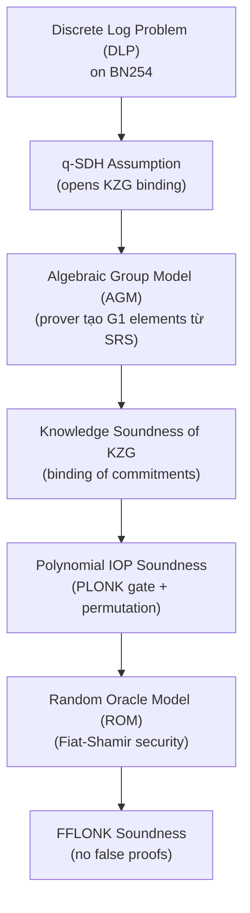

> **Prerequisites**: [[07-trusted-setup|07. Trusted Setup]], [[08-fiat-shamir|08. Fiat-Shamir in FFLONK]]
> **Objectives**:
> - Hiểu đầy đủ security assumptions của FFLONK và khi nào chúng fail
> - Nắm vững Algebraic Group Model (AGM) và tại sao nó cần thiết
> - Phân tích threat model thực tế: ai là attacker, attack surface là gì
> - Biết SoK taxonomy của ZK bugs và áp dụng vào FFLONK

---

## 1. Security Assumptions Stack

FFLONK dựa trên một stack các assumptions — nếu bất kỳ tầng nào bị vi phạm, toàn bộ system mất security.



---

## 2. Các Security Definitions

> [!definition] Definition 2.1 — Completeness
> Với mọi circuit $C$ và witness $w$ thỏa $C(w) = 1$: honest prover luôn tạo được proof mà honest verifier accept với probability 1.
>
> **FFLONK**: completeness theo directly từ KZG completeness và PLONK completeness.

> [!definition] Definition 2.2 — Soundness (Knowledge Soundness)
> Không có PPT adversary nào có thể tạo proof cho statement sai $x \notin L$ mà verifier accept, trừ với probability $\text{negl}(\lambda)$.
>
> **FFLONK basis**: $q$-SDH + AGM → KZG binding → PLONK soundness → FFLONK soundness.
>
> **Điều kiện**: Fiat-Shamir transcript đầy đủ (ROM), SRS từ honest ceremony, subgroup checks pass.

> [!definition] Definition 2.3 — Zero-Knowledge (Honest-Verifier ZK)
> Tồn tại simulator $S$ có thể tạo proof không phân biệt được với real proof, mà không biết witness $w$.
>
> **FFLONK basis**: blinding factors trong wire polynomials → evaluations tại random $\zeta$ không lộ witness trực tiếp.
>
> **Điều kiện**: blinding factors phải được thêm đúng cách (xem Lesson 05).

---

## 3. q-SDH Assumption

> [!definition] Definition 3.1 — q-Strong Diffie-Hellman (q-SDH)
> Cho SRS $= ([1]_1, [\tau]_1, [\tau^2]_1, \ldots, [\tau^q]_1, [\tau]_2)$, không có PPT adversary nào có thể tính:
>
> $$\left(c,\ \left[\frac{1}{\tau + c}\right]_1\right) \quad \text{cho bất kỳ } c \in \mathbb{F}_r \setminus \{-\tau\}$$
>
> **Tương đương**: không thể tạo KZG proof cho polynomial không bậc $\leq q$ mà không biết $\tau$.

> [!definition] Definition 3.2 — Algebraic Group Model (AGM)
> Mọi algorithm $\mathcal{A}$ hoạt động trong AGM phải tạo ra các $\mathbb{G}_1$ elements **chỉ** bằng cách linear-combine SRS elements. Tức là nếu $\mathcal{A}$ output $[P]_1$, nó phải cung cấp $(\alpha_i)$ sao cho $P = \sum_i \alpha_i \tau^i G_1$.
>
> **Ý nghĩa**: AGM cấm attacker dùng "oracle" $\mathbb{G}_1$ elements ngoài SRS — realistic assumption cho cryptographic adversaries.

---

## 4. Threat Model: zkVerify Context

### 4.1 Actors

| Actor | Trust Level | Capability |
|---|---|---|
| Honest prover (Polygon CDK) | Trusted | Biết witness, tạo proof đúng |
| Malicious prover | **Zero trust** | Muốn submit proof cho invalid state |
| zkVerify node | Trusted (majority) | Run verifier, consensus |
| Immunefi hunter | External | Tìm bugs trong verifier code |

### 4.2 Attack Goals

**Goal 1 — Forge proof** (Critical): Submit proof cho invalid Polygon zkEVM state transition → unlock L1 bridge → steal all user funds.

**Goal 2 — Proof rejection** (Medium/High): Craft proof mà verifier rejects dù valid → DoS proof system → L2 liveness failure.

**Goal 3 — Information leak** (Low/Medium): Extract witness information từ proof → deanonymize transactions.

### 4.3 Attack Surface Taxonomy (SoK 2024)

Từ Chaliasos et al. (USENIX Security 2024):

> [!definition] Definition 4.1 — ZK Bug Taxonomy
>
> **Layer 1 — Circuit level**: bugs trong arithmetization (wrong gate equations, missing constraints). Không áp dụng trực tiếp cho zkVerify verifier.
>
> **Layer 2 — PCS level**: bugs trong polynomial commitment (KZG, subgroup checks, SRS validation).
>
> **Layer 3 — Protocol level**: bugs trong proof system protocol (Fiat-Shamir, permutation argument, quotient polynomial).
>
> **Layer 4 — Implementation level**: bugs trong Rust/Solidity code (overflow, deserialization, field arithmetic).
>
> **Layer 5 — Integration level**: bugs trong how zkVerify integrates với Substrate/Polkadot (VK storage, governance, extrinsic validation).

---

## 5. Soundness Analysis per Bug Class

```python
# Phân tích security impact của từng bug class
bug_classes = {
    "BC1_subgroup_check": {
        "layer": "PCS level",
        "broken_property": "KZG binding",
        "assumption_violated": "q-SDH in AGM",
        "impact": "Forge proof for any statement — CRITICAL",
        "detectability": "Silent — proof passes all checks",
    },
    "BC2_last_challenge_attack": {
        "layer": "Protocol level",
        "broken_property": "Fiat-Shamir soundness",
        "assumption_violated": "ROM binding of transcript",
        "impact": "Forge proof for any statement — CRITICAL",
        "detectability": "Silent — needs transcript audit",
    },
    "BC3_tau_leak": {
        "layer": "PCS level",
        "broken_property": "SRS trapdoor secrecy",
        "assumption_violated": "Honest setup ceremony",
        "impact": "Forge any KZG commitment — CRITICAL",
        "detectability": "Requires ceremony analysis",
    },
    "BC4_small_subgroup": {
        "layer": "PCS level",
        "broken_property": "Group order assumption",
        "assumption_violated": "BN254 prime-order subgroup",
        "impact": "Pairing bypass in some configurations",
        "detectability": "Check is_in_subgroup() call",
    },
    "BC5_field_overflow": {
        "layer": "Implementation level",
        "broken_property": "Field arithmetic correctness",
        "assumption_violated": "None — implementation error",
        "impact": "Wrong evaluation / wrong pairing → accept invalid proofs",
        "detectability": "Code review, fuzzing",
    },
    "BC6_combining_error": {
        "layer": "Protocol level",
        "broken_property": "FFT-like identity correctness",
        "assumption_violated": "Correct polynomial combining",
        "impact": "Wrong evaluations recovered → gates unsatisfied → reject valid / accept invalid",
        "detectability": "Test with known-valid proofs",
    },
    "BC7_pub_input_manipulation": {
        "layer": "Integration level",
        "broken_property": "Statement binding",
        "assumption_violated": "Public input in transcript",
        "impact": "Accept proof for different public input → wrong state claim",
        "detectability": "Check pub_input in transcript hash",
    },
    "BC8_vk_misconfiguration": {
        "layer": "Integration level",
        "broken_property": "Circuit specificity",
        "assumption_violated": "VK matches circuit",
        "impact": "Accept proof for different circuit — VK substitution",
        "detectability": "Governance audit of VK storage",
    },
}

print("=== Bug Class Security Analysis ===\n")
for bc, info in bug_classes.items():
    print(f"[{bc}]")
    for k, v in info.items():
        print(f"  {k:25s}: {v}")
    print()
```

---

## 6. Formal Security of FFLONK

> [!theorem] Theorem 6.1 — FFLONK Soundness (informal)
> Under the $q$-SDH assumption in the AGM, and in the ROM:
>
> If the Fiat-Shamir transcript is **binding** (includes all prover messages), then no PPT adversary can produce a valid FFLONK proof for a false statement with more than negligible probability.
>
> **Proof sketch**: 
> 1. ROM → challenges are independent of messages sent after hashing
> 2. AGM → prover's $\mathbb{G}_1$ elements are linear combinations of SRS
> 3. $q$-SDH → KZG commitments are binding for polynomials of degree $\leq q$
> 4. PLONK gate + permutation soundness → arithmetic circuit satisfaction required
> 5. Therefore: valid FFLONK proof → valid PLONK witness → satisfied circuit

> [!warning] Limitation: Concrete Security
> FFLONK security proof là trong **AGM + ROM** — không phải unconditional. Nếu có quantum attacker (Shor's algorithm → break DLP trên BN254), toàn bộ system mất security. **Post-quantum ZK** (như STARKs, không cần trusted setup) là hướng thay thế.

---

## 7. Differential Security Analysis: FFLONK vs PLONK

| Property | PLONK | FFLONK | Notes |
|---|---|---|---|
| Trusted setup | Required | Required | Same PoT ceremony |
| Soundness assumptions | q-SDH + AGM + ROM | q-SDH + AGM + ROM | Identical |
| Attack surface | KZG + FS | KZG + FS + combining | +FFT-like identity step |
| Prover complexity | $O(n\log n)$ | $O(3n\log 3n)$ | ~3× prover cost |
| Verifier security | 2 pairings | 2 pairings | Same crypto primitive |
| Subgroup check needed | Yes | Yes | Same $\mathbb{G}_1$ points |
| LCA risk | Same | Same | Depends on implementation |
| Combining bug | N/A | New attack class | Unique to FFLONK |

**Conclusion**: FFLONK thêm 1 attack class mới (combining error) nhưng không yếu hơn PLONK về mặt cryptographic foundations.

---

## 8. Security in Practice: zkVerify

> [!definition] Definition 8.1 — zkVerify Security Boundaries
>
> **In scope for Immunefi**:
> - `pallet-fflonk-verifier` (Substrate pallet)
> - `fflonk_verifier` Rust crate
> - VK storage và governance
> - Proof deserialization
>
> **Out of scope**:
> - Polygon CDK prover bugs (không ảnh hưởng verifier correctness nếu verifier đúng)
> - BN254 curve security (giả định là secure)
> - Powers of Tau ceremony (đã xong)

**Audit reports đã có** (public):
- Trail of Bits — February 2025 (pre-mainnet, comprehensive)
- SRLabs — September 2025 (post-mainnet, runtime upgrades focus)

**Unaudited surface** (theo dev.to post):
- XCM integration
- ParaVerifier pallet
- EZKL verifier adapter

---

## 9. Phân tích Assumptions Failure

> [!danger] Scenario 9.1 — DLP Break on BN254
> Nếu quantum computer đủ mạnh phá DLP: toàn bộ KZG-based ZK (PLONK, FFLONK, Groth16, ...) mất soundness. **Không có fix** — cần migrate sang post-quantum scheme.
>
> **Thời gian**: NIST ước tính quantum threat với BN254 ≥ 2035.

> [!danger] Scenario 9.2 — AGM Violated
> Nếu attacker tìm $\mathbb{G}_1$ element từ ngoài SRS span (tức là break algebraic group model), có thể forge KZG commitment. **Chưa có known attack** — AGM được coi là reasonable assumption.

> [!danger] Scenario 9.3 — ROM Violated (Hash Collision)
> Nếu SHA256 hoặc Poseidon có collision, Fiat-Shamir transcript không còn random → challenges predictable → attacker can plan commitments để match desired challenge.
>
> **Hiện trạng**: SHA256 không có known collision; Poseidon security được phân tích kỹ.

---

## Summary

- **FFLONK security stack**: DLP → q-SDH → AGM → KZG binding → PLONK soundness → ROM → FFLONK.
- **Threat model**: malicious prover muốn forge proof cho invalid state (Critical), DoS (High), info leak (Low).
- **8 bug classes**: mỗi class ở một layer khác nhau, impact và detectability khác nhau.
- **Formal soundness**: FFLONK sound trong AGM + ROM dưới q-SDH — nhưng không post-quantum.
- **Unique FFLONK risk**: FFT-like combining error — không có trong PLONK.
- **zkVerify audited code** vs **unaudited**: XCM, ParaVerifier, EZKL là điểm còn open.

---

## References

- Chaliasos et al. — *SoK: What Don't We Know? Understanding Security Vulnerabilities in SNARKs*, USENIX Security 2024
- Gabizon & Williamson — *fflonk*, IACR 2021/1167, Section 5 (Security)
- Boneh, Drăgan, Fisch & Gabizon — *Batching Techniques for Accumulators*, includes KZG security
- Trail of Bits — *zkVerify Security Review*, February 2025
- SRLabs — *zkVerify Baseline Assurance*, September 2025
