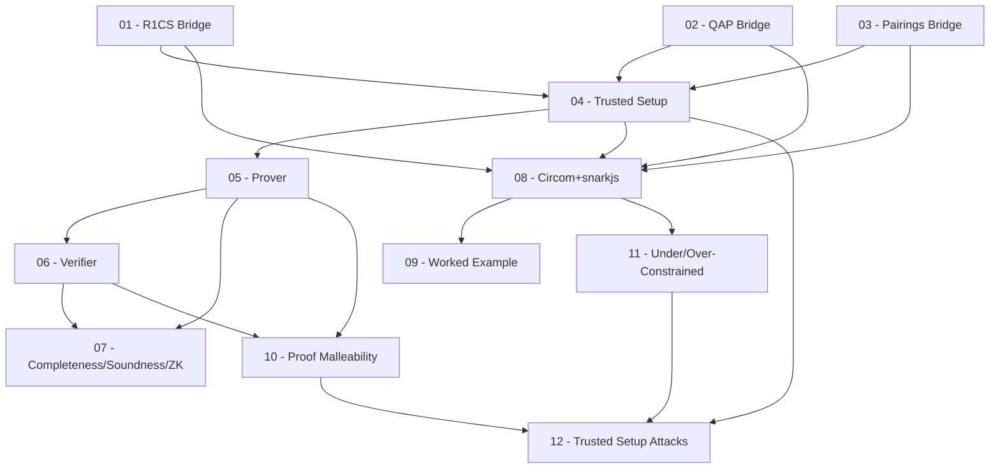

> **Topic**: Groth16 zk-SNARK
> **Domain**: Cryptography — Zero-Knowledge Proofs
> **Level**: Intermediate → Advanced
> **Background**: ZKP tổng quan, elliptic curve basics, modular arithmetic
> **Tools / Code**: Python (py_ecc, sympy), Circom, snarkjs, SageMath
> **Sources**: Groth 2016 paper (ePrint 2016/260), alinush.github.io/groth16, lambdaclass blog, 0xPARC zk-bug-tracker, zksecurity.xyz

---

## Lessons

| # | Title | Key Concepts | Prerequisites | Difficulty |
|---|-------|-------------|---------------|------------|
| 01 | R1CS → Groth16 Bridge | R1CS structure as seen by Groth16; witness split (public/private); homomorphic hiding của R1CS | Biết R1CS cơ bản | ★★★☆☆ |
| 02 | QAP → Groth16 Bridge | QAP polynomials trong CRS; Schwartz-Zippel; tại sao Groth16 evaluate tại τ ẩn | Biết QAP cơ bản | ★★★☆☆ |
| 03 | Bilinear Pairings trong Groth16 | Type III pairing; ký hiệu $[x]_1, [x]_2$; vì sao 3 pairing checks là đủ; BN254 vs BLS12-381 | Biết EC cơ bản | ★★★☆☆ |
| 04 | Trusted Setup & CRS | Powers of Tau (Phase 1); circuit-specific setup (Phase 2); toxic waste $\tau, \alpha, \beta, \gamma, \delta$; MPC ceremony | 01, 02, 03 | ★★★★☆ |
| 05 | Groth16 Prover | Thuật toán prove đầy đủ; tính $[A]_1, [B]_2, [C]_1$; randomness $r, s$ và zero-knowledge | 04 | ★★★★☆ |
| 06 | Groth16 Verifier | Pairing equation; verification key; tại sao 3 pairings là đủ; public input aggregation | 05 | ★★★★☆ |
| 07 | Completeness, Soundness & Zero-Knowledge | Formal definitions; tại sao Groth16 đạt từng property; simulation extractability; Generic Group Model | 05, 06 | ★★★★★ |
| 08 | Circom + snarkjs Workflow | Viết circuit, compile R1CS, witness gen, prove, verify; full CLI walkthrough; file formats | 01–04 | ★★★☆☆ |
| 09 | Worked Example: ZK Proof end-to-end | Bài toán thực tế (age proof / preimage); từ Circom → proof → on-chain verify | 08 | ★★★☆☆ |
| 10 | Proof Malleability & Extensibility Attacks | Non-malleability; forging proof từ proof cũ; double-spending risk; mitigations | 05, 06 | ★★★★☆ |
| 11 | Under/Over-Constrained Circuits | Phân loại lỗi constraint; signal vs constraint; case studies: Tornado Cash, Aztec, Light Protocol | 08 | ★★★★☆ |
| 12 | Trusted Setup Attacks & Audit Methodology | Toxic waste leak; γ = δ exploit (real 2025 exploit); checklist audit Groth16 system | 04, 10, 11 | ★★★★★ |

## Appendix Candidates

| ID | Content | Related Lesson | Notes |
|----|---------|----------------|-------|
| A0 | Math Reference Sheet | 01–07 | BN254/BLS12-381 params, pairing formulas, polynomial ops, Lagrange interpolation |
| A1 | Tool Cheatsheet | 08, 09 | snarkjs / circom / arkworks commands; .r1cs, .zkey, .wtns file formats |
| A2 | Vulnerability & Bug Catalog | 10–12 | Danh sách lỗi đã biết, real exploits, CVE, write-ups, audit patterns |

---

## Dependency Graph

---

## Progress Tracker

- [ ] [[groth16-proof-system/00-roadmap|00. Roadmap]]
- [ ] [[01-r1cs-groth16-bridge|01. R1CS → Groth16 Bridge]]
- [ ] [[02-qap-groth16-bridge|02. QAP → Groth16 Bridge]]
- [ ] [[03-pairings-groth16|03. Bilinear Pairings trong Groth16]]
- [ ] [[04-trusted-setup-crs|04. Trusted Setup & CRS]]
- [ ] [[05-groth16-prover|05. Groth16 Prover]]
- [ ] [[06-groth16-verifier|06. Groth16 Verifier]]
- [ ] [[07-completeness-soundness-zk|07. Completeness, Soundness & Zero-Knowledge]]
- [ ] [[08-circom-snarkjs-workflow|08. Circom + snarkjs Workflow]]
- [ ] [[09-worked-example|09. Worked Example: ZK Proof end-to-end]]
- [ ] [[10-proof-malleability|10. Proof Malleability & Extensibility Attacks]]
- [ ] [[11-under-over-constrained|11. Under/Over-Constrained Circuits]]
- [ ] [[12-trusted-setup-attacks-audit|12. Trusted Setup Attacks & Audit Methodology]]
- [ ] [[a0-math-reference|A0. Math Reference Sheet]]
- [ ] [[a1-tool-cheatsheet|A1. Tool Cheatsheet]]
- [ ] [[a2-vulnerability-catalog|A2. Vulnerability & Bug Catalog]]
