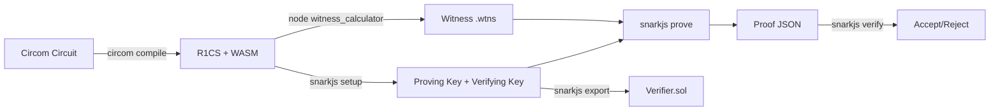

> **Prerequisites**: [[04-trusted-setup-crs|04. Trusted Setup & CRS]], [[01-r1cs-groth16-bridge|01]], [[02-qap-groth16-bridge|02]]
> **Objectives**:
> - Nắm vững toàn bộ workflow: Circuit → R1CS → Setup → Prove → Verify
> - Hiểu file formats: `.circom`, `.r1cs`, `.wasm`, `.zkey`, `.wtns`, `.json`
> - Biết cách debug circuit và đọc constraint count
> - Hiểu sự khác biệt giữa `signal` và `<==` trong Circom

---

## Overview: Groth16 Workflow



---

## Bước 1: Viết Circuit với Circom

### Signal vs Constraint

Đây là khái niệm quan trọng nhất trong Circom:

> [!definition] Definition 8.1 — Signal vs Constraint
> - **`signal`**: Khai báo wire trong circuit. Chỉ lưu giá trị, **không thêm constraint**.
> - **`<==`**: Gán giá trị **VÀ** thêm constraint (syntactic sugar cho `<--` + `===`).
> - **`<--`**: Chỉ gán giá trị (witness assignment), **KHÔNG** thêm constraint.
> - **`===`**: Chỉ thêm constraint (equality check), **KHÔNG** gán giá trị.

```circom
pragma circom 2.0.0;

template Example() {
    signal input x;          // private input
    signal input y;          // private input
    signal output out;       // output

    signal x_squared;        // intermediate signal

    // BAD: chỉ assign, không có constraint → under-constrained!
    x_squared <-- x * x;

    // GOOD: assign + constraint
    x_squared <== x * x;     // tương đương: x_squared <-- x*x; x_squared === x*x;

    out <== x_squared + y;
}

component main {public [y]} = Example();
// y là public input, x là private input
```

### Circom Template phức tạp hơn: Kiểm tra bit decomposition

```circom
pragma circom 2.0.0;

// Chứng minh biết n-bit number mà không lộ nó
template Bits2Num(n) {
    signal input in[n];
    signal output out;
    signal lc;

    var lc1 = 0;
    var e2 = 1;
    for (var i = 0; i < n; i++) {
        // Constraint: mỗi bit phải là 0 hoặc 1
        in[i] * (in[i] - 1) === 0;
        lc1 += in[i] * e2;
        e2 = e2 * 2;
    }
    out <-- lc1;
    out === lc1;
}

component main {public []} = Bits2Num(8);
```

---

## Bước 2: Compile Circuit

```bash
# Cài đặt
npm install -g circom snarkjs

# Compile circuit
circom circuit.circom --r1cs --wasm --sym -o output/

# Output:
# output/circuit.r1cs     — R1CS file (binary)
# output/circuit_js/      — WASM witness calculator
# output/circuit.sym      — Symbol table (debug)

# Kiểm tra stats
snarkjs r1cs info output/circuit.r1cs
# > [INFO]  snarkJS: Curve: bn-128
# > [INFO]  snarkJS: # of Wires: 5
# > [INFO]  snarkJS: # of Constraints: 3
# > [INFO]  snarkJS: # of Private Inputs: 2
# > [INFO]  snarkJS: # of Public Inputs: 1
# > [INFO]  snarkJS: # of Labels: 5
# > [INFO]  snarkJS: # of Outputs: 1

# Print constraints để debug
snarkjs r1cs print output/circuit.r1cs output/circuit.sym
```

---

## Bước 3: Trusted Setup

```bash
# === PHASE 1: Powers of Tau ===
# Tạo mới (cho testing) — production nên dùng ceremony đã có
snarkjs powersoftau new bn128 12 pot12_0000.ptau -v
# Giải thích: 12 = log2(max constraints) → support tối đa 2^12 = 4096 constraints

# Contribute (trong thực tế cần nhiều participants)
snarkjs powersoftau contribute pot12_0000.ptau pot12_0001.ptau \
    --name="First contribution" -v -e="some entropy here"

# Prepare for phase 2
snarkjs powersoftau prepare phase2 pot12_0001.ptau pot12_final.ptau -v

# Verify phase 1
snarkjs powersoftau verify pot12_final.ptau

# === PHASE 2: Circuit-specific ===
snarkjs groth16 setup output/circuit.r1cs pot12_final.ptau circuit_0000.zkey

# Contribute to phase 2
snarkjs zkey contribute circuit_0000.zkey circuit_0001.zkey \
    --name="1st Contributor" -v -e="more entropy"

# Verify zkey
snarkjs zkey verify output/circuit.r1cs pot12_final.ptau circuit_0001.zkey

# Export verification key
snarkjs zkey export verificationkey circuit_0001.zkey verification_key.json
```

---

## Bước 4: Generate Witness

```bash
# Tạo file input
cat > input.json << 'EOF'
{
    "x": "3",
    "y": "5"
}
EOF

# Generate witness
node output/circuit_js/generate_witness.js \
    output/circuit_js/circuit.wasm \
    input.json \
    witness.wtns

# Inspect witness (optional debug)
snarkjs wtns export json witness.wtns witness.json
cat witness.json
# [
#   "1",        // z[0] = 1 (constant)
#   "8",        // z[1] = out = public output
#   "3",        // z[2] = x
#   "5",        // z[3] = y
#   "9"         // z[4] = x_squared
# ]
```

---

## Bước 5: Generate Proof

```bash
snarkjs groth16 prove circuit_0001.zkey witness.wtns proof.json public.json

# proof.json — proof π = {pi_a, pi_b, pi_c}
# public.json — public inputs/outputs

cat proof.json
# {
#   "pi_a": ["...", "...", "1"],        // [A]_1
#   "pi_b": [["...", "..."], ["...", "..."], ["1", "0"]],  // [B]_2
#   "pi_c": ["...", "...", "1"],        // [C]_1
#   "protocol": "groth16",
#   "curve": "bn128"
# }
```

---

## Bước 6: Verify Proof

```bash
# Off-chain verify
snarkjs groth16 verify verification_key.json public.json proof.json
# [INFO]  snarkJS: OK!

# Export Solidity verifier (on-chain)
snarkjs zkey export solidityverifier circuit_0001.zkey verifier.sol

# Generate Solidity call data
snarkjs zkey export soliditycalldata public.json proof.json
# 0x1234...  ← calldata để paste vào Remix hoặc hardhat test
```

---

## File Formats Reference

| File | Format | Nội dung |
|------|--------|---------|
| `.circom` | Text | Circuit source code |
| `.r1cs` | Binary | R1CS matrices, wire info |
| `.wasm` | Binary | Witness calculator (browser/node) |
| `.sym` | Text | Wire names cho debug |
| `.ptau` | Binary | Powers of Tau SRS |
| `.zkey` | Binary | Proving key + verifying key + circuit |
| `.wtns` | Binary | Witness vector $\mathbf{z}$ |
| `proof.json` | JSON | Proof $([A]_1, [B]_2, [C]_1)$ |
| `verification_key.json` | JSON | Verifying key (IC, alpha, beta, gamma, delta) |
| `public.json` | JSON | Public inputs/outputs |

---

## Debug Workflow: Khi Proof Fail

```bash
# 1. Check constraint count
snarkjs r1cs info circuit.r1cs

# 2. Print tất cả constraints
snarkjs r1cs print circuit.r1cs circuit.sym

# 3. Inspect witness
snarkjs wtns export json witness.wtns witness.json

# 4. Check witness thỏa mãn R1CS không
snarkjs wtns check circuit.r1cs witness.wtns
# Nếu có lỗi: báo constraint nào bị violated
```

### Lỗi thường gặp khi compile/prove

| Lỗi | Nguyên nhân |
|-----|------------|
| `Constraint not satisfied` | Witness không thỏa mãn một constraint |
| `Signal not constrained` | Signal được assign `<--` nhưng không có `===` constraint → under-constrained (warning) |
| `Non-quadratic constraints` | Một constraint có degree > 2 → Circom không support |
| `assert failed` | Input violates `assert()` trong circuit |
| `Too many constraints` | Vượt quá 2^k từ ptau phase 1 |

---

## Summary

- Workflow: `.circom` → R1CS/WASM → `.ptau` + `.zkey` → `.wtns` → proof → verify
- **`signal` chỉ khai báo wire, không thêm constraint** — dùng `<==` để vừa assign vừa constrain
- Phase 1 (ptau) là universal; Phase 2 (zkey) là circuit-specific
- `snarkjs r1cs print` là tool debug quan trọng nhất khi circuit sai
- Proof output: `pi_a` ($[A]_1$), `pi_b` ($[B]_2$), `pi_c` ($[C]_1$) — 3 EC points

---

## References

- Circom documentation — https://docs.circom.io
- snarkjs documentation — https://github.com/iden3/snarkjs
- Circom Language Reference — https://docs.circom.io/circom-language/signals/
