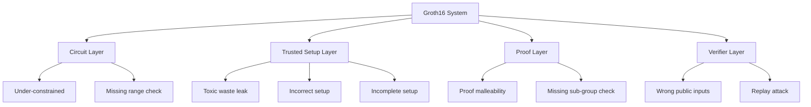

> **Prerequisites**: [[04-trusted-setup-crs|04]], [[10-proof-malleability|10]], [[11-under-over-constrained|11]]
> **Objectives**:
> - Hiểu các attack vectors lên trusted setup
> - Phân tích real exploit: γ = δ bug (2025, $1.5M)
> - Nắm đầy đủ audit checklist cho Groth16 system
> - Biết cách verify ceremony và phát hiện malicious contributions

---

## Attack Surface của Groth16 System



---

## Trusted Setup Attacks

### Attack 1: Toxic Waste Retained

Nếu bất kỳ participant nào giữ lại secret contribution $s_k$, họ biết $\tau = s_1 s_2 \cdots s_N$ (nếu họ là participant duy nhất, hoặc nếu tất cả khác bị compromise).

**Hậu quả**: Với $\tau$ đã biết, attacker có thể:
1. Tính mọi QAP polynomials từ proving key
2. Tạo $h(x)$ giả cho bất kỳ $A(x), B(x), C(x)$ nào
3. Forge proof cho false statement tùy ý

**Mitigation**: MPC ceremony với nhiều participants; verify transcript công khai.

### Attack 2: Malicious Contribution

Participant malicious có thể gửi contribution với $s_k$ đã được "craft" để backdoor system. Tuy nhiên, nếu **ít nhất 1 participant khác** honest và random, $\tau$ vẫn unpredictable.

**Mitigation**: Participants độc lập về địa lý, tổ chức; public ceremony transcript.

---

## Real Exploit: γ = δ Bug (2025)

Đây là exploit thực tế được khai thác vào đầu 2025, gây thiệt hại ~$1.5M.

### Root Cause

Một số Groth16 verifiers được generate bởi snarkjs có lỗi: **verification key có $\gamma = \delta$** — tức là hai toxic waste elements vô tình bị đặt bằng nhau trong quá trình setup.

### Tại sao $\gamma = \delta$ là catastrophic?

Nhìn lại verifying key structure:
- IC elements dùng $\gamma$: $[\ldots/\gamma]_1$ (public inputs)
- Private elements dùng $\delta$: $[\ldots/\delta]_1$ (private witness)

Nếu $\gamma = \delta$, sự phân chia public/private **collapse** — verifier không còn phân biệt được public inputs và private witness. Attacker có thể "move" private elements vào public slot và vice versa.

### Khai thác cụ thể

Verification equation:

$$e([A]_1, [B]_2) = e([\alpha]_1, [\beta]_2) \cdot e([L_\text{pub}]_1, [\gamma]_2) \cdot e([C]_1, [\delta]_2)$$

Nếu $\gamma = \delta$:

$$= e([\alpha]_1, [\beta]_2) \cdot e([L_\text{pub}]_1 + [C]_1, [\gamma]_2)$$

Giờ verifier kiểm tra sum của public và private elements với cùng key $[\gamma]_2$. Attacker có thể manipulate $[C]_1$ để "absorb" bất kỳ public input nào, hoặc thêm bất kỳ private element nào vào public slot.

**Kết quả**: Attacker forge proof không hợp lệ mà verifier accept → rút tiền từ contract.

### Detection

```bash
# Check verification key: gamma_g2 và delta_g2 phải khác nhau
cat verification_key.json | python3 -c "
import json, sys
vk = json.load(sys.stdin)
gamma = vk['vk_gamma_2']
delta = vk['vk_delta_2']
if gamma == delta:
    print('CRITICAL: gamma == delta! Vulnerable verifier!')
else:
    print('OK: gamma != delta')
"
```

---

## Attack 3: Incomplete Setup (Missing Final Beacon)

snarkjs Phase 2 ceremony yêu cầu một bước cuối: `prepare phase2` với random beacon. Nếu bước này bị bỏ qua, SRS chưa finalized.

**Hậu quả**: Người chạy ceremony cuối cùng biết state của SRS trước beacon → có thể forge proof.

Đây là root cause của **cả hai** exploits trong sự cố 2025 — cả hai protocol sử dụng setup **chưa hoàn chỉnh** (thiếu beacon step).

```bash
# WRONG: bỏ qua beacon step
snarkjs zkey contribute circuit_0000.zkey circuit_final.zkey
# Thiếu: snarkjs zkey beacon circuit_final.zkey circuit_beacon.zkey ...

# CORRECT:
snarkjs zkey contribute circuit_0000.zkey circuit_0001.zkey
snarkjs zkey beacon circuit_0001.zkey circuit_final.zkey \
    <beacon_hash> 10  # Add randomness from public beacon
snarkjs zkey verify circuit.r1cs pot_final.ptau circuit_final.zkey
```

---

## Comprehensive Audit Methodology

### Layer 1: Circuit Audit

> [!important] Circuit Audit Checklist
>
> **Constraint completeness**:
> - [ ] Mọi `<--` có corresponding `===` constraint
> - [ ] Không có "signal not constrained" warning từ `circom --inspect`
> - [ ] Range checks cho mọi signal được treat như bounded integer
> - [ ] Bit checks cho mọi signal được treat như bit
>
> **Semantic correctness**:
> - [ ] Circuit logic khớp với specification (đọc spec trước khi đọc code)
> - [ ] Edge cases: input = 0, input = max, equal to threshold
> - [ ] Merkle path indices là bits
> - [ ] Hash function dùng đúng (Poseidon vs MiMC vs SHA — khác nhau về constraints)
>
> **Completeness testing**:
> - [ ] Test với mọi valid borderline input → witness generation phải succeed
> - [ ] Test với invalid input → witness generation phải fail

### Layer 2: Trusted Setup Audit

> [!important] Trusted Setup Audit Checklist
>
> - [ ] Ceremony transcript là public và có thể verify
> - [ ] Verify transcript: `snarkjs powersoftau verify pot_final.ptau`
> - [ ] Verify zkey: `snarkjs zkey verify circuit.r1cs pot_final.ptau circuit_final.zkey`
> - [ ] **Check $\gamma \neq \delta$** trong verification key
> - [ ] Beacon step được thực hiện (timestamp và hash được public)
> - [ ] Đủ số participants (ít nhất 2-3 independent parties)
> - [ ] Circuit hash trong zkey khớp với deployed circuit

### Layer 3: Verifier Audit

> [!important] Verifier Audit Checklist
>
> **Sub-group checks**:
> - [ ] `proof.pi_a[0], proof.pi_a[1] < PRIME_Q`
> - [ ] Tương tự cho `pi_b`, `pi_c`
>
> **Public input validation**:
> - [ ] Contract validate public inputs có expected values không
> - [ ] Public input count khớp với circuit (`vk.IC.length - 1 == expected`)
>
> **Replay protection**:
> - [ ] Có nullifier pattern nếu cần (không dùng proof hash)
> - [ ] Nullifier được stored on-chain
>
> **Context binding**:
> - [ ] Proof bound đến specific recipient/context nếu cần

### Layer 4: Application Logic Audit

> [!important] Application Logic Checklist
>
> - [ ] Contract không dùng proof bytes làm nullifier
> - [ ] Public inputs khớp với on-chain state (ví dụ: Merkle root)
> - [ ] Logic sau verify đúng (không thực thi action trước khi verify pass)
> - [ ] Reentrancy protection nếu có ETH transfer sau verify

---

## Quick Reference: Bug Catalog

| Bug | Severity | Layer | Detection |
|-----|----------|-------|-----------|
| Under-constrained signal | Critical | Circuit | `circom --inspect`, PICUS |
| Missing range check | High | Circuit | Manual review |
| Missing bit check | High | Circuit | Manual review |
| `γ = δ` in VK | Critical | Setup | Check VK json |
| Incomplete setup (no beacon) | Critical | Setup | Verify ceremony |
| Proof hash as nullifier | High | Application | Code review |
| Missing sub-group check | High | Verifier | Code review |
| Wrong public input count | High | Verifier | Compare with circuit |
| Proof replay | Medium | Application | Check nullifier storage |
| Non-fresh randomness | Medium | Prover | Code review |

---

## Summary

- **3 main attack vectors**: circuit bugs, setup bugs, verifier/application bugs
- **$\gamma = \delta$ bug**: catastrophic — phá vỡ public/private separation → forge proof
- **Incomplete setup**: không có beacon → last contributor có advantage
- **Audit phải cover 4 layers**: circuit → setup → verifier → application
- **Verify ceremony transcript**: public, deterministic, reproducible
- **Nullifier pattern**: mọi ZK withdrawal system PHẢI dùng circuit-computed nullifier

---

## References

- ZKSecurity — *The First ZK Exploits: Groth16 Setup Exploit* (blog.zksecurity.xyz, 2025)
- 0xPARC — *zk-bug-tracker* (github.com/0xPARC/zk-bug-tracker)
- Chaliasos et al. — *SoK: What don't we know?* (arXiv 2402.15293, 2024)
- Oxorio — *Common Vulnerabilities in ZK Proof* (blog.oxor.io)
- snarkjs documentation — ceremony guide
