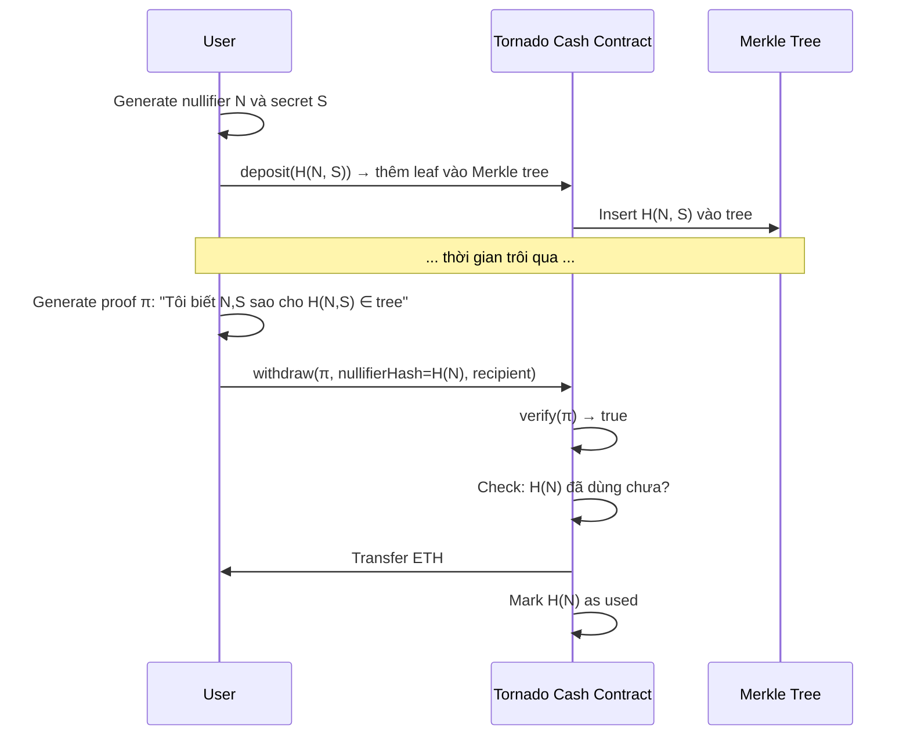

> **Prerequisites**: [[01-zkp-stack-and-integration-layer|01. ZKP Stack & Integration Layer]], [[02-zkp-foundations-for-auditors|02. ZKP Foundations for Auditors]]
> **Objectives**:
> - Hiểu "complementary logic" là gì và tại sao nó cần thiết nhưng dễ sai
> - Phân tích case study Tornado Cash nullifier bug chi tiết
> - Nhận diện 4 loại complementary logic thường gặp và các sai lầm điển hình
> - Phân biệt V7 với các lỗi circuit thuần túy — đây là lỗi *ngoài* circuit

---

## Complementary Logic — Logic "Kèm Theo" ZKP

Khi circuit chứng minh một statement, circuit chỉ cover phần toán học. Nhưng ứng dụng thực tế cần nhiều hơn — nó cần **logic phụ trợ** hoạt động *song song* với ZKP để đảm bảo toàn bộ protocol đúng.

> [!definition] Definition 6.1 — Complementary Logic (Logic bổ trợ)
> Complementary logic là tập hợp các cơ chế **bên ngoài circuit** mà ứng dụng cần để:
> - Ngăn chặn replay attack (nullifier management)
> - Đảm bảo state consistency (Merkle tree updates)
> - Enforce business rules mà circuit không capture
> - Quản lý access control kết hợp với ZKP

> [!definition] Definition 6.2 — V7: ZKP Complementary Logic Error
> V7 xảy ra khi complementary logic **được implement sai hoặc bị thiếu**, dẫn đến hành vi sai của toàn bộ protocol — dù circuit hoàn toàn đúng và proof được verify thành công.
>
> Đây là lỗi KHÔNG phải trong circuit, KHÔNG phải trong proof system — mà là trong **code xung quanh ZKP**.

**Điểm phân biệt quan trọng**:

| | V7 | Circuit bug |
|---|---|---|
| Circuit có đúng không? | **Có** | Không |
| Proof có verify được không? | **Có** | Thường không |
| Nguồn gốc lỗi | Integration Layer (ngoài circuit) | Circuit constraints |
| Khó phát hiện | **Cao** (mọi unit test circuit đều pass) | Thấp hơn |

---

## Case Study Kinh Điển — Tornado Cash Nullifier Bug

Tornado Cash (TC) là ứng dụng privacy điển hình nhất để minh họa V7.

### Cách Tornado Cash Hoạt Động



### Điều Gì Xảy Ra Nếu Thiếu Nullifier Check?

Circuit của TC chứng minh: "Tôi biết (N, S) sao cho H(N, S) nằm trong Merkle tree."

> [!note] Hash function trong TC
> Trong implementation thực của Tornado Cash (Circom), `H()` là **MiMC** hoặc **Pedersen hash** — không phải SHA256/keccak256 vì cần ZK-friendly (chi phí constraint thấp trong circuit). `H(N, S)` là commitment lưu trên chain; `H(N)` là nullifierHash public. Khi audit các protocol tương tự, cần verify hash function được dùng là ZK-friendly và consistent giữa circuit và contract.

Circuit **không** chứng minh: "Đây là lần đầu tiên tôi withdraw với nullifier này."

Đây là **implicit security requirement** — cần được enforce bởi Integration Layer.

```solidity
// ❌ VULNERABLE — Thiếu nullifier check
contract TornadoCashVulnerable {
    IVerifier public verifier;
    bytes32 public merkleRoot;

    function withdraw(
        uint[2] memory a, uint[2][2] memory b, uint[2] memory c,
        bytes32 nullifierHash,   // H(N) — public input
        address recipient
    ) external {
        uint[2] memory inputs = [uint256(nullifierHash), uint256(merkleRoot)];
        require(verifier.verifyProof(a, b, c, inputs), "Invalid proof");
        // ❌ KHÔNG check nullifierHash đã dùng chưa!
        payable(recipient).transfer(1 ether);
    }
}

// Attack: Gọi withdraw() nhiều lần với cùng proof và nullifierHash
// Mỗi lần đều pass verify → drain contract!
```

```solidity
// ✅ CORRECT — Với nullifier check
contract TornadoCashCorrect {
    IVerifier public verifier;
    bytes32 public merkleRoot;
    mapping(bytes32 => bool) public nullifierHashes; // ← Complementary logic

    function withdraw(
        uint[2] memory a, uint[2][2] memory b, uint[2] memory c,
        bytes32 nullifierHash,
        address recipient
    ) external {
        uint[2] memory inputs = [uint256(nullifierHash), uint256(merkleRoot)];
        require(verifier.verifyProof(a, b, c, inputs), "Invalid proof");
        // ✅ Complementary logic: check nullifier uniqueness
        require(!nullifierHashes[nullifierHash], "Nullifier already used");
        nullifierHashes[nullifierHash] = true;
        payable(recipient).transfer(1 ether);
    }
}
```

> [!warning] Lưu ý quan trọng
> Nullifier check phải xảy ra *trước* hoặc *atomically với* state update. Nếu có reentrancy (ETH transfer trước khi mark nullifier), attacker có thể reentrancy exploit kết hợp với V7.

---

## 4 Loại Complementary Logic và Sai Lầm Điển Hình

### 1. Nullifier Management

**Mục đích**: Ngăn replay attack — mỗi proof/action chỉ được thực hiện một lần.

**Sai lầm thường gặp**:

| Sai lầm | Mô tả | Hậu quả |
|---------|-------|---------|
| Missing nullifier check | Không lưu và kiểm tra nullifier đã dùng chưa | Replay attack |
| Wrong nullifier scope | Nullifier chỉ unique trong một epoch, nhưng check cross-epoch | Reuse across epochs |
| Nullifier not in circuit | Nullifier được tạo off-chain, không prove trong circuit | Forge nullifier |
| Race condition | Parallel transactions với cùng nullifier | Double-spend |

**Ví dụ — Wrong Nullifier Scope (Cantina case study)**:

```solidity
// ❌ Nullifier scope sai — chỉ check trong voting epoch hiện tại
contract VotingSystem {
    mapping(uint256 => mapping(bytes32 => bool)) public nullifiersByEpoch;
    uint256 public currentEpoch;

    function vote(bytes32 nullifierHash, ...) external {
        // Check trong epoch hiện tại
        require(!nullifiersByEpoch[currentEpoch][nullifierHash], "Already voted");
        nullifiersByEpoch[currentEpoch][nullifierHash] = true;
        // ... record vote
    }
    // ❌ Khi epoch tăng, nullifier cũ có thể reuse!
    // User vote epoch 1, epoch 2 bắt đầu → vote lại với cùng nullifier!
}

// ✅ Fixed: global nullifier set
contract VotingSystemFixed {
    mapping(bytes32 => bool) public usedNullifiers; // Global, không per-epoch

    function vote(bytes32 nullifierHash, ...) external {
        require(!usedNullifiers[nullifierHash], "Nullifier already used");
        usedNullifiers[nullifierHash] = true;
        // ... record vote
    }
}
```

### 2. Merkle Tree State Management

**Mục đích**: Đảm bảo circuit chứng minh membership trong đúng state của Merkle tree.

**Sai lầm thường gặp**:

| Sai lầm | Mô tả |
|---------|-------|
| Stale root accepted | Cho phép proof với Merkle root cũ → membership có thể invalid |
| Root update race | Root thay đổi giữa khi user tạo proof và submit |
| Incorrect leaf computation | Leaf hash trong contract khác với leaf hash trong circuit |

**Ví dụ — Stale Root**:

```solidity
// ❌ Accept bất kỳ root nào từng hợp lệ
contract StaleRootVulnerable {
    IVerifier public verifier;
    bytes32[] public historicalRoots; // Lưu lịch sử các root

    function isValidRoot(bytes32 root) internal view returns (bool) {
        for (uint i = 0; i < historicalRoots.length; i++) {
            if (historicalRoots[i] == root) return true;
        }
        return false;
    }

    function action(uint[2] memory a, ..., bytes32 root) external {
        require(isValidRoot(root), "Invalid root");
        require(verifier.verifyProof(a, ..., [uint256(root)]), "Invalid proof");
        // ❌ User bị remove khỏi set (leaf deleted) nhưng vẫn dùng old root
        // → Prove membership với root từ khi họ còn là thành viên
        executePrivilegedAction();
    }
}
```

### 3. Access Control Kết Hợp ZKP

**Mục đích**: Chỉ cho phép entity hợp lệ gọi function, nhưng validation dùng ZKP thay vì signature thông thường.

**Sai lầm thường gặp**:

```solidity
// ❌ ZKP verify pass → grant access mà không kiểm tra additional conditions
contract ZkAccessControl {
    IVerifier public verifier;
    bool public paused; // Circuit pause mechanism

    function sensitiveAction(uint[2] memory a, ...) external {
        require(verifier.verifyProof(a, ...), "Invalid proof");
        // ❌ Không check paused! Circuit verify pass nhưng system paused
        // Cantina case: một code path bypass pause check
        executeAction();
    }
}

// ✅ Fixed: ALL auxiliary conditions phải được check
contract ZkAccessControlFixed {
    function sensitiveAction(uint[2] memory a, ...) external {
        require(!paused, "System paused");
        require(verifier.verifyProof(a, ...), "Invalid proof");
        executeAction();
    }
}
```

### 4. Fee-on-Transfer Token Integration

**Mục đích**: Khi ZKP authorize một transfer, số tiền thực nhận có thể khác với số chứng minh trong proof nếu token có fee-on-transfer.

> [!example] Example 6.1 — Fee-on-Transfer Bug (Cantina real case)
> Một hệ thống ZKP batch settlement tích hợp token có fee-on-transfer. Circuit chứng minh: "Transfer X tokens từ A đến B." Nhưng sau khi transfer, B thực nhận X - fee. Logic settlement giả định recipient nhận đúng X tokens → discrepancy trong batch accounting. Không phải circuit bug — là V7 trong Integration Layer.

```solidity
// ❌ VULNERABLE — Không account for fee-on-transfer
contract ZkBatchSettlement {
    IERC20 public feeToken; // Token có fee-on-transfer
    IVerifier public verifier;

    function settle(
        uint[2] memory a, uint[2][2] memory b, uint[2] memory c,
        address recipient,
        uint256 amount   // public input — amount được prove trong circuit
    ) external {
        require(verifier.verifyProof(a, b, c, [uint256(recipient), amount]), "Invalid");
        // ❌ Transfer amount, nhưng recipient chỉ nhận amount - fee
        feeToken.transfer(recipient, amount);
        // Downstream logic dùng `amount` nhưng thực tế chỉ nhận amount - fee
        updateLedger(recipient, amount); // ← WRONG amount!
    }
}

// ✅ Fixed: Đo balance trước và sau transfer
contract ZkBatchSettlementFixed {
    function settle(..., uint256 amount) external {
        require(verifier.verifyProof(a, b, c, [uint256(recipient), amount]), "Invalid");
        uint256 balanceBefore = feeToken.balanceOf(recipient);
        feeToken.transfer(recipient, amount);
        uint256 actualReceived = feeToken.balanceOf(recipient) - balanceBefore;
        updateLedger(recipient, actualReceived); // ✅ Dùng giá trị thực
    }
}
```

---

## V7 trong zkVerify Context

zkVerify không chỉ là verification layer — nó có auxiliary mechanisms của riêng mình:

| Mechanism | V7 Risk |
|-----------|---------|
| **Attestation Merkle tree** | Proof attestation có bị replay không? Attestation có unique không? |
| **Verification key registry** | VK có bị replace bởi malicious VK không? Registry update có authenticated đủ không? |
| **Aggregate pallet state** | Sau aggregate, state update có atomic không? Partial failure xử lý thế nào? |
| **Token-claim pallet** | Claim có nullifier không? Double-claim possible không? |
| **CRL (Certificate Revocation List)** | Revocation có được check trước khi accept proof không? |

**Ví dụ cụ thể — token-claim pallet của zkVerify**:

Pallet này handle claiming tokens từ Merkle distribution. Câu hỏi V7:
- Sau khi claim, nullifier/leaf có được marked là used không?
- Nếu claim transaction reverts partway through, state có bị corrupt không?
- EIP-191 signature validation có đủ để prevent replay không?

---

## Detection Checklist — V7

```text
□ Protocol có sử dụng nullifier không? Nếu có:
  □ Nullifier được lưu và check trước mỗi action?
  □ Nullifier scope có đúng với use case không? (per-epoch vs. global)
  □ Nullifier được generate trong circuit (constrained) hay off-chain (unconstrained)?
  □ Có race condition trong nullifier check không? (reentrancy?)
□ Protocol có Merkle tree không? Nếu có:
  □ Root có được validate là root hiện tại (không phải historical) không?
  □ Leaf computation trong contract có match với circuit không?
  □ Root update có atomic với action không?
□ Protocol có access control kết hợp ZKP không?
  □ Tất cả auxiliary conditions (paused, allowlist, etc.) có được check không?
  □ Có code path nào bypass những check này không?
□ Protocol có tích hợp với external tokens/protocols không?
  □ Fee-on-transfer tokens có được handled đúng không?
  □ Slippage và balance discrepancy có được account không?
□ Protocol có state machine không?
  □ ZKP verify có thể xảy ra ở sai state không?
  □ State transitions có atomic với proof consumption không?
```

---

## Tóm tắt — Key Takeaways

- **V7** là lỗi trong logic *xung quanh* ZKP, không phải trong circuit hay proof system.
- Đây là lý do V7 khó phát hiện nhất — mọi circuit test đều pass, nhưng protocol vẫn bị hack.
- **Nullifier mismanagement** là dạng V7 phổ biến nhất: thiếu check, wrong scope, hoặc race condition.
- **Merkle state mismatch**: accept stale root → bypass membership revocation.
- **Auxiliary logic desync**: business logic (pause, fee, access control) không nhất quán với ZKP outcome.
- zkVerify: attestation replay, VK registry tampering, token-claim double-spend là các attack surfaces cần check.

---

## References

- Chaliasos et al. — *SoK* (arXiv:2402.15293), V7 — ZKP Complementary Logic Error, Tornado Cash example
- Cantina — *ZKP Security Flaws Auditors Commonly Overlook* (cantina.xyz, 2024) — multiple V7 real cases
- Tornado Cash source code — github.com/tornadocash/tornado-core — `Tornado.sol`
- Semaphore source — github.com/semaphore-protocol/semaphore — `semaphore.sol` nullifier management
- DEV Community — *I Spent 2 Sessions Auditing zkVerify* (2026) — token-claim, CRL pallet analysis
