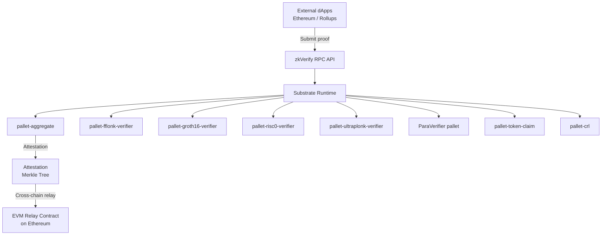

> **Prerequisites**: [[03-v4-passing-unchecked-data|03. V4]], [[04-v5-proof-delegation-error|04. V5]], [[05-v6-proof-composition-error|05. V6]], [[06-v7-zkp-complementary-logic-error|06. V7]]
> **Objectives**:
> - Hiểu kiến trúc và codebase của zkVerify đủ để audit
> - Đọc và áp dụng Immunefi scope/rules đúng cách
> - Có quy trình săn bug có hệ thống cho 4 loại lỗi V4–V7
> - Biết cách viết PoC và bug report chất lượng

---

## zkVerify — Kiến Trúc Cho Auditor

zkVerify là Substrate-based L1 blockchain, viết bằng Rust, chuyên biệt cho ZKP verification. Hiểu kiến trúc giúp xác định attack surface chính xác.

### Stack Tổng Quan



### Các Pallets Quan Trọng

| Pallet | Chức năng | Audit priority |
|--------|-----------|---------------|
| `pallet-aggregate` | Aggregate nhiều proofs vào một batch, sinh attestation | **HIGH** — V6, V7 |
| `pallet-fflonk-verifier` | Verify fflonk proofs | **HIGH** — V4, V6 |
| `pallet-groth16-verifier` | Verify Groth16 proofs | **HIGH** — V4 |
| `pallet-risc0-verifier` | Verify RISC0 zkVM proofs | **MEDIUM** — V4, V6 |
| `pallet-ultraplonk-verifier` | Verify UltraPlonk proofs | **MEDIUM** — V4 |
| `pallet-token-claim` | Token distribution qua Merkle proof | **HIGH** — V7 (double-claim) |
| `pallet-crl` | X.509 Certificate Revocation List cho TEE | **MEDIUM** — V7 |
| `ParaVerifier pallet` | Verify proofs từ Polkadot parachains | **HIGH** — V5, V6, V7 |
| `EZKL verifier adapter` | Adapter cho zkML (EZKL) proofs | **HIGH** — mới, ít audit |
| EVM Relay Contract | Smart contract Ethereum nhận attestations | **HIGH** — V4, V7 |

### Source Code và Công Cụ

```bash
# Clone zkVerify source
git clone https://github.com/zkVerify/zkVerify
cd zkVerify

# Build (cần Rust nightly)
cargo build --release

# Run local node để test
./target/release/zkv-node --dev --tmp

# Test một pallet cụ thể
cargo test -p pallet-aggregate
cargo test -p pallet-groth16-verifier

# Đọc pallet code
ls pallets/
# aggregate/ fflonk/ groth16/ risc0/ ultraplonk/ token-claim/ crl/
```

---

## Immunefi Scope — Đọc Hiểu Đúng

### Reward Structure (tính đến tháng 3/2026)

| Threat Level | Max Reward | Min Reward |
|---|---|---|
| Critical Blockchain/DLT | $50,000 | $15,000 |
| High Blockchain/DLT | $10,000 | $5,000 |
| Critical Web/App | $10,000 | $5,000 |

**Critical reward calculation**: 5% của funds at risk (capped at $50k).

**Non-funds critical**:
- Network không confirm new transactions (total shutdown): $15,000
- Permanent chain split requiring hard fork: $15,000

### Primacy of Impact

zkVerify dùng **Primacy of Impact** — nếu bug có critical/high impact, nó được xem xét dù asset không explicitly trong scope. Điều này quan trọng: nếu bạn tìm bug trong code chưa có trong scope list nhưng có high impact, **hãy submit**.

### Proof of Concept — BẮT BUỘC

> [!warning] PoC required cho tất cả severity
> zkVerify require PoC cho mọi report, kể cả Low severity. Không có PoC → report bị reject. PoC phải chạy được trên local fork.

### Prohibited Actions

- Không test trên mainnet/public testnet — chỉ local fork
- Không DoS attack
- Không social engineering
- Không public disclosure trước khi được phép (Category 3: Approval Required)

---

## Quy Trình Săn Bug — Có Hệ Thống

### Phase 1 — Reconnaissance (Chuẩn bị)

```bash
# 1. Đọc kiến trúc
cat README.md
cat docs/architecture.md  # nếu có

# 2. Kiểm tra audit reports đã có
# Trail of Bits: 2025-02 — đọc để biết gì đã được cover
# SRLabs: 2025-09 — đọc để biết gì đã được fix

# 3. Xác định code mới (chưa được audit)
git log --oneline --since="2025-09-03" -- pallets/  # Sau SRLabs audit
# Focus vào: EZKL adapter, ParaVerifier, XCM integration

# 4. Lập danh sách target pallets
echo "Targets: pallet-aggregate, EZKL adapter, ParaVerifier, EVM relay"
```

### Phase 2 — Static Analysis (Đọc Code)

Với mỗi pallet target, đọc theo thứ tự:

```text
1. lib.rs — hiểu tổng thể, extrinsics (functions) nào available
2. Call struct/enum — inputs của từng extrinsic
3. Core logic — nơi verify proof và update state
4. Events — state changes nào được emit
5. Tests — hiểu expected behavior
```

**Template phân tích V4 (Passing Unchecked Data)**:

```rust
// Tìm trong pallet verify function:
pub fn submit_proof(
    origin: OriginFor<T>,
    vk_hash: H256,       // ← public input — có validation không?
    proof: Vec<u8>,      // ← proof bytes
    pubs: Vec<u8>,       // ← public signals
) -> DispatchResult {
    // Hỏi:
    // 1. vk_hash có được verify là registered VK không?
    // 2. pubs có được validated về length/range không?
    // 3. pubs có được decoded đúng field không?
    // 4. Có implicit assumptions về format nào không?
}
```

**Template phân tích V7 (Complementary Logic)**:

```rust
// Tìm pattern: "verify thành công → action"
// Hỏi: có bước nào giữa verify và action mà có thể fail/bypass không?
let result = verify_proof(&vk, &proof, &pubs);
if result.is_ok() {
    // V7 hunt:
    // 1. Có update state nào atomic với verify không?
    // 2. Attestation có unique không? Có thể replay không?
    // 3. Nếu nhiều proofs trong một call, failure isolation thế nào?
    insert_attestation(&root, &leaf);
}
```

### Phase 3 — Dynamic Analysis (Chạy và Test)

```bash
# Setup local test environment
cargo test -p pallet-aggregate -- --nocapture

# Viết custom test để probe edge cases
# File: pallets/aggregate/src/tests/v4_test.rs
#[test]
fn test_v4_unchecked_public_input() {
    // 1. Register VK
    // 2. Generate valid proof cho input hợp lệ
    // 3. Submit proof với malicious public input
    // 4. Kiểm tra: transaction thành công hay fail?
}
```

### Phase 4 — PoC Writing

Khi tìm được bug, viết PoC hoàn chỉnh:

```rust
// Template PoC cho Substrate/zkVerify
#[test]
fn poc_v7_double_claim() {
    new_test_ext().execute_with(|| {
        // Setup: mint tokens, set merkle root
        let merkle_root = setup_merkle_root();
        
        // Bước 1: Claim lần đầu (hợp lệ)
        let result1 = TokenClaim::claim(
            RuntimeOrigin::signed(ALICE),
            proof_for_alice.clone(),
            AMOUNT,
            merkle_root,
        );
        assert_ok!(result1);
        
        // Bước 2: Claim lần hai với cùng proof (khai thác V7)
        let result2 = TokenClaim::claim(
            RuntimeOrigin::signed(ALICE),
            proof_for_alice.clone(),  // Same proof!
            AMOUNT,
            merkle_root,
        );
        
        // Nếu result2 là Ok → BUG CONFIRMED
        // Nếu result2 là Err → No bug
        assert_ok!(result2);  // ← Đây là assertion cho bug report
        
        // Verify: Alice claim được 2x AMOUNT
        assert_eq!(Balances::free_balance(ALICE), 2 * AMOUNT);
    });
}
```

---

## Bug Report Template

```markdown
## Title
[Severity] V7 — Double-claim vulnerability in pallet-token-claim

## Summary
Mô tả ngắn: attacker có thể claim tokens nhiều lần với cùng Merkle proof do 
thiếu nullifier/leaf tracking.

## Vulnerability Details

### Root Cause
File: `pallets/token-claim/src/lib.rs`, function `claim()`
Line X: Không có check leaf đã được claimed chưa.

### Impact
- Attacker drain toàn bộ token distribution
- Severity: Critical (Direct loss of funds)

### Attack Scenario
1. Attacker có valid Merkle proof cho claim amount A
2. Attacker gọi `claim()` với proof → nhận A tokens
3. Attacker gọi lại `claim()` với cùng proof → nhận thêm A tokens
4. Lặp lại cho đến khi drain pool

## Proof of Concept

```rust
// [Code từ Phase 4]
```

## Recommended Fix
Thêm `claimed_leaves: StorageMap<_, Blake2_128Concat, [u8; 32], bool>` trong pallet storage.
Trước khi transfer, check và set `claimed_leaves[leaf_hash] = true`.

## References
- SoK paper V7 definition
- Tornado Cash nullifier pattern (đúng implementation)
```

---

## Attack Surface Map — Tổng Hợp

| Pallet / Component | V4 | V5 | V6 | V7 | Priority |
|---|---|---|---|---|---|
| `pallet-groth16-verifier` | Public input range/format | — | — | VK registry tampering | HIGH |
| `pallet-fflonk-verifier` | Public input validation | — | — | — | HIGH |
| `pallet-aggregate` | Batch input validation | — | Proof linkage trong batch | Attestation replay | HIGH |
| `ParaVerifier pallet` | Input from parachain | Parachain là untrusted prover | Cross-chain proof consistency | State sync | HIGH |
| `EZKL verifier adapter` | EZKL-specific input format | Model weights as witness | — | Output interpretation | HIGH |
| `pallet-token-claim` | — | — | — | Double-claim, scope của nullifier | HIGH |
| `pallet-crl` | — | — | — | Revocation check trước/sau verify | MEDIUM |
| `EVM Relay Contract` | Attestation format | — | — | Replay cross-chain | HIGH |

---

## Tóm tắt — Key Takeaways

- zkVerify là Substrate L1 Rust, focus vào verification pallets, aggregate pallet, EVM relay, và các components mới (EZKL adapter, ParaVerifier).
- Immunefi scope: Critical Blockchain/DLT up to $50k; **Primacy of Impact** — nếu high impact, submit dù asset không trong list.
- PoC bắt buộc; test trên local fork; không mainnet.
- Quy trình: Recon (đọc audit reports cũ) → Static (đọc code) → Dynamic (test) → PoC → Report.
- Các components chưa được audit (EZKL adapter, ParaVerifier, XCM integration) là attack surface ưu tiên.
- Mỗi loại lỗi (V4–V7) có template analysis riêng — áp dụng từng cái cho từng pallet.

---

## References

- Immunefi zkVerify program — immunefi.com/bug-bounty/zkverify/
- zkVerify GitHub — github.com/zkVerify/zkVerify
- Trail of Bits audit (2025-02) — github.com/trailofbits/publications/blob/master/reviews/2025-02-zkverify-foundation-blockchain-securityreview.pdf
- SRLabs audit (2025-09) — github.com/srlabs/audit-reports/blob/main/Polkadot/SRL-zkVerify_baseline_assurance-report-2025.pdf
- DEV Community — *I Spent 2 Sessions Auditing zkVerify* (2026) — kinh nghiệm thực tế
- Immunefi Vulnerability Severity Classification V2.3 — immunefi.com/immunefi-vulnerability-severity-classification-system-v2-3/
