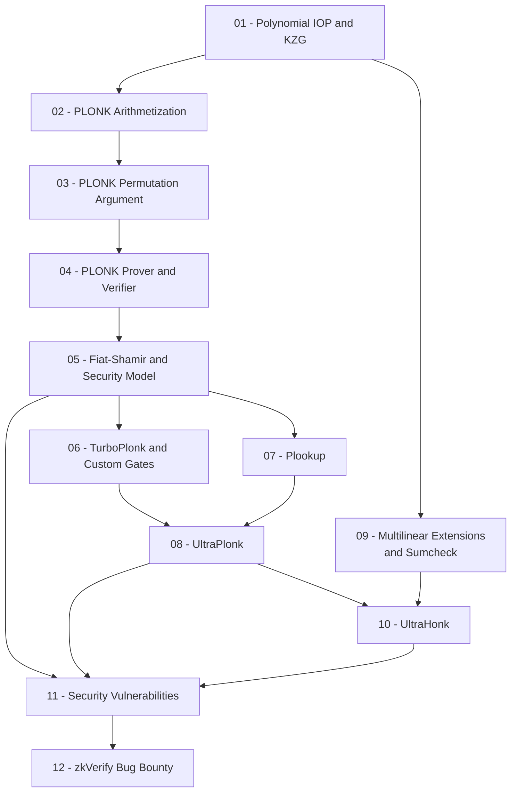

> **Topic**: PLONK, UltraPlonk & UltraHonk
> **Domain**: Cryptography
> **Level**: Advanced + Bug Bounty
> **Background**: Số học modular, group theory, finite fields; Rust/C++/Python
> **Tools / Code**: Python (sympy, sage snippets), Rust (Barretenberg source references)
> **Sources**: IACR ePrint 2019/953, 2020/315, Aztec Barretenberg docs, Trail of Bits, 0xPARC bug tracker, zkVerify

---

## Lessons

| # | Title | Key Concepts | Prerequisites | Difficulty |
|---|-------|-------------|---------------|------------|
| 01 | Polynomial IOP and KZG | Polynomial IOP model, KZG commitment, SRS, trusted setup | — | ★★★☆☆ |
| 02 | PLONK Arithmetization | Gate constraints, selector polynomials, wire polynomials, copy constraints, vanishing polynomial | 01 | ★★★☆☆ |
| 03 | PLONK Permutation Argument | Grand product argument, permutation polynomial z(X), Bayer-Groth, multiset equality | 01, 02 | ★★★★☆ |
| 04 | PLONK Prover and Verifier | 5 rounds, quotient polynomial t(X), linearization r(X), multi-point opening, full verifier | 01–03 | ★★★★☆ |
| 05 | Fiat-Shamir and Security Model | Fiat-Shamir heuristic, Random Oracle Model, AGM, knowledge soundness, ZK definition, transcript | 01–04 | ★★★★☆ |
| 06 | TurboPlonk and Custom Gates | Custom gate arithmetization, selector extensions, EC scalar mul gate, fixed-base mul | 01–05 | ★★★☆☆ |
| 07 | Plookup | Lookup tables trong SNARK, sorted multiset argument, log-derivative lookup, so sánh range checks | 01–05 | ★★★★☆ |
| 08 | UltraPlonk | 4-wire system, Ultra arithmetization, RAM/ROM abstraction, UltraCircuitBuilder | 06, 07 | ★★★★☆ |
| 09 | Multilinear Extensions and Sumcheck | MLE, Boolean hypercube, sumcheck protocol, ZeroMorph multilinear PCS | 01–05 | ★★★★★ |
| 10 | UltraHonk | Honk architecture, sumcheck thay quotient polynomial, Flavor system, UltraProver/UltraVerifier | 08, 09 | ★★★★★ |
| 11 | Security Vulnerabilities | Frozen Heart, Point at Infinity / "0 Bug", under-constrained circuits, soundness vs ZK failures | 05, 08, 10 | ★★★★★ |
| 12 | zkVerify Bug Bounty | zkVerify architecture, ultraplonk_verifier Rust, ultrahonk_verifier, attack surface, PoC template | 11 | ★★★★★ |

## Appendix

| ID | Content | Related Lesson | Notes |
|----|---------|----------------|-------|
| A0 | KZG and ZeroMorph Reference | 01, 09 | KZG equations chi tiết, ZeroMorph protocol, batch opening |
| A1 | Bug Bounty Checklist | 11, 12 | Verifier checks, Fiat-Shamir audit, lookup soundness, edge cases |
| A2 | Math Reference | All | Field/group operations, Lagrange basis, BN254/Grumpkin, pairing refresher |

---

## Dependency Graph

---

## Progress Tracker

- [ ] [[00-roadmap|00. Roadmap]]
- [ ] [[01-polynomial-iop-kzg|01. Polynomial IOP and KZG]]
- [ ] [[02-plonk-arithmetization|02. PLONK Arithmetization]]
- [ ] [[03-plonk-permutation-argument|03. PLONK Permutation Argument]]
- [ ] [[04-plonk-prover-verifier|04. PLONK Prover and Verifier]]
- [ ] [[05-fiat-shamir-security-model|05. Fiat-Shamir and Security Model]]
- [ ] [[06-turboplonk-custom-gates|06. TurboPlonk and Custom Gates]]
- [ ] [[07-plookup|07. Plookup]]
- [ ] [[08-ultraplonk|08. UltraPlonk]]
- [ ] [[09-multilinear-sumcheck|09. Multilinear Extensions and Sumcheck]]
- [ ] [[10-ultrahonk|10. UltraHonk]]
- [ ] [[11-security-vulnerabilities|11. Security Vulnerabilities]]
- [ ] [[12-zkverify-bug-bounty|12. zkVerify Bug Bounty]]
- [ ] [[a0-kzg-zeromorph-reference|A0. KZG and ZeroMorph Reference]]
- [ ] [[a1-bug-bounty-checklist|A1. Bug Bounty Checklist]]
- [ ] [[a2-math-reference|A2. Math Reference]]
