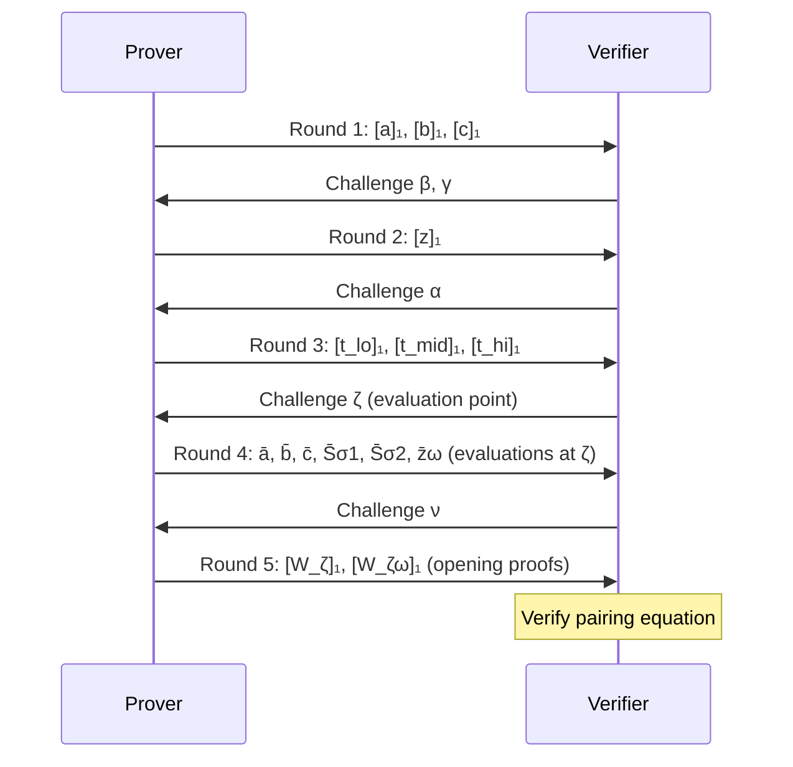

> **Prerequisites**: [[03-plonk-permutation-argument|03. PLONK Permutation Argument]], [[02-plonk-arithmetization|02. PLONK Arithmetization]], [[01-polynomial-iop-kzg|01. Polynomial IOP and KZG]]  
> **Objectives**:  
> - Nắm toàn bộ 5 rounds của PLONK Prover
> - Hiểu quotient polynomial $t(X)$ và cách split để giữ degree thấp
> - Hiểu linearization polynomial $r(X)$ và mục đích giảm số pairing
> - Theo dõi được Verifier algorithm đầy đủ
> - Nhận biết các điểm bug có thể xuất hiện trong round transitions

---

## Motivation

Lesson 02–03 cho thấy PLONK cần chứng minh **ba nhóm polynomial identities** đều đúng trên $H$:

1. **Gate constraints**: $q_L a + q_R b + q_O c + q_M ab + q_C + \text{PI} = 0$ trên $H$
2. **Permutation init**: $(z(X) - 1)L_1(X) = 0$ trên $H$
3. **Permutation accumulation**: một identity liên quan đến $z(\omega X)$ và $z(X)$

Mỗi identity "$f = 0$ trên $H$" $\Leftrightarrow$ $Z_H \mid f$ $\Leftrightarrow$ $f = t \cdot Z_H$ với $t$ nào đó.

PLONK kết hợp tất cả lại thành **một quotient polynomial $t(X)$**, dùng challenges ngẫu nhiên $\alpha$ để tách biệt. Rồi Prover commit $t$ và thuyết phục Verifier rằng $t$ đúng tại một điểm random.

---

## Protocol Overview

---

## Round 1: Commit Wire Polynomials

Prover tính $a(X), b(X), c(X)$ (interpolate witness values trên $H$).

**Zero-knowledge blinding**: thêm random terms để ẩn witness:

$$a(X) = (b_1 X + b_2) Z_H(X) + a_{\text{raw}}(X)$$

(tương tự $b, c$ với $b_3, b_4$ và $b_5, b_6$)

Vì $Z_H(\omega^i) = 0$, blinding không ảnh hưởng evaluations tại $H$, nhưng ẩn $a$ tại điểm khác.

> **Gửi**: $[a]_1, [b]_1, [c]_1$

> [!warning] Bug Pattern 4.1 — Sai số lượng blinding scalars
> Paper PLONK yêu cầu **2 scalars** cho $a, b, c$ và **3 scalars** cho $z$ (vì $z$ được mở tại 2 điểm $\zeta$ và $\zeta\omega$). Nếu dùng ít hơn:
> - Với 1 scalar: Verifier biết commitment, evaluation tại 1 điểm → có thể recover polynomial nếu degree đủ thấp.
> - Đây là nguồn gốc của ZK failure (không ảnh hưởng soundness nhưng ảnh hưởng privacy).

---

## Round 2: Commit Permutation Polynomial

Nhận $\beta, \gamma$ từ Verifier (trong non-interactive: Fiat-Shamir từ $[a]_1, [b]_1, [c]_1$).

Prover tính $z(X)$ như Lesson 03 (với blinding $b_7 X^2 + b_8 X + b_9$).

> **Gửi**: $[z]_1$

---

## Round 3: Commit Quotient Polynomial

Nhận $\alpha$ từ Verifier.

> [!definition] Definition 4.2 — Quotient Polynomial $t(X)$
> Prover tính $t(X)$ sao cho:
>
> $$\begin{aligned}
> t(X) \cdot Z_H(X) = \; &[a(X)b(X)q_M(X) + a(X)q_L(X) + b(X)q_R(X) + c(X)q_O(X) + \text{PI}(X) + q_C(X)] \\
> &+ \alpha \cdot [(a + \beta X + \gamma)(b + \beta k_1 X + \gamma)(c + \beta k_2 X + \gamma) \cdot z(X) \\
> &\quad\quad - (a + \beta S_{\sigma 1} + \gamma)(b + \beta S_{\sigma 2} + \gamma)(c + \beta S_{\sigma 3} + \gamma) \cdot z(\omega X)] \\
> &+ \alpha^2 \cdot (z(X) - 1) \cdot L_1(X)
> \end{aligned}$$

Ba term (với weights $1, \alpha, \alpha^2$) correspond với ba nhóm identities. Challenge $\alpha$ đảm bảo "tách biệt" — nếu polynomial bên phải không chia hết cho $Z_H$, thì tổng weighted cũng không chia hết (với overwhelming probability).

**Bậc của $t(X)$**: Mỗi term có bậc tối đa $3n+5$ (do blinding), nên $t$ có bậc tối đa $3n+5$. Prover **chia $t$ thành 3 phần** để commit hiệu quả:

$$t(X) = t_{lo}(X) + X^n \cdot t_{mid}(X) + X^{2n} \cdot t_{hi}(X)$$

> **Gửi**: $[t_{lo}]_1, [t_{mid}]_1, [t_{hi}]_1$

---

## Round 4: Open Polynomials tại $\zeta$

Nhận $\zeta$ từ Verifier (random evaluation point).

Prover tính và gửi các evaluations:

$$\bar{a} = a(\zeta), \quad \bar{b} = b(\zeta), \quad \bar{c} = c(\zeta)$$
$$\bar{S}_{\sigma 1} = S_{\sigma 1}(\zeta), \quad \bar{S}_{\sigma 2} = S_{\sigma 2}(\zeta), \quad \bar{z}_\omega = z(\zeta \omega)$$

**Tại sao $\bar{z}_\omega = z(\zeta\omega)$ chứ không phải $\bar{z} = z(\zeta)$?**

Nhìn vào accumulation identity: term $z(\omega X)$ cần evaluation tại $\zeta$ → tức là $z(\omega \cdot \zeta)$.

> **Gửi**: 6 field elements $\bar{a}, \bar{b}, \bar{c}, \bar{S}_{\sigma 1}, \bar{S}_{\sigma 2}, \bar{z}_\omega$

---

## Round 5: Opening Proofs

Nhận $\nu$ từ Verifier.

> [!definition] Definition 4.3 — Linearization Polynomial $r(X)$
> Prover tạo **linearization polynomial** $r(X)$ — một polynomial mà Verifier có thể kiểm tra commitment của nó bằng commitments đã có:
>
> $$r(X) = \bar{a}\bar{b} \cdot q_M(X) + \bar{a} \cdot q_L(X) + \bar{b} \cdot q_R(X) + \bar{c} \cdot q_O(X) + q_C(X)$$
> $$+ \alpha \cdot [(\bar{a} + \beta\zeta + \gamma)(\bar{b} + \beta k_1\zeta + \gamma)(\bar{c} + \beta k_2\zeta + \gamma)] \cdot z(X)$$
> $$- \alpha \cdot [(\bar{a} + \beta\bar{S}_{\sigma 1} + \gamma)(\bar{b} + \beta\bar{S}_{\sigma 2} + \gamma)(\bar{c} + \beta\bar{S}_{\sigma 3}(X) + \gamma)] \cdot \bar{z}_\omega$$
> $$+ \alpha^2 \cdot L_1(\zeta) \cdot z(X)$$
>
> **Điểm mấu chốt**: Verifier có thể tính $[r]_1 = r(\tau)G_1$ từ các commitments đã có mà **không cần biết $r(X)$**.

Prover tính hai **batch opening proofs**:

1. $W_\zeta(X)$: batch proof cho tất cả polynomials được mở tại $\zeta$ (với randomness $\nu$)
2. $W_{\zeta\omega}(X)$: proof cho $z$ tại $\zeta\omega$

> **Gửi**: $[W_\zeta]_1, [W_{\zeta\omega}]_1$

---

## Verifier Algorithm

Verifier nhận proof $\pi = \{[a]_1, [b]_1, [c]_1, [z]_1, [t_{lo}]_1, [t_{mid}]_1, [t_{hi}]_1, \bar{a}, \bar{b}, \bar{c}, \bar{S}_{\sigma 1}, \bar{S}_{\sigma 2}, \bar{z}_\omega, [W_\zeta]_1, [W_{\zeta\omega}]_1\}$

**Bước 1**: Tính lại challenges $\beta, \gamma, \alpha, \zeta, \nu, u$ qua Fiat-Shamir.

**Bước 2**: Tính $Z_H(\zeta) = \zeta^n - 1$, $L_1(\zeta) = (\zeta^n - 1) / (n(\zeta - 1))$.

**Bước 3**: Tính $\text{PI}(\zeta)$ từ public inputs.

**Bước 4**: Tính $r_0$ (constant part của $r(\zeta)$):

$$r_0 = \text{PI}(\zeta) - L_1(\zeta)\alpha^2 - \alpha(\bar{a} + \beta\bar{S}_{\sigma 1} + \gamma)(\bar{b} + \beta\bar{S}_{\sigma 2} + \gamma)(\bar{c} + \gamma)\bar{z}_\omega$$

**Bước 5**: Tính commitment $[D]_1 = [r(X) + Z_H(\zeta) \cdot t(X)]_1$ bằng cách kết hợp các commitments.

**Bước 6**: Tính $[F]_1$ (batch commitment cho tất cả polynomials cần mở tại $\zeta$).

**Bước 7**: Kiểm tra **hai pairing equations**:

$$e([W_\zeta]_1 + u[W_{\zeta\omega}]_1, [\tau]_2) = e(\zeta[W_\zeta]_1 + u\zeta\omega[W_{\zeta\omega}]_1 + [F]_1 - \bar{e} G_1, G_2)$$

Trong đó $\bar{e}$ là giá trị expected (batch combination của evaluations).

> [!theorem] Theorem 4.4 — Completeness
> Nếu witness hợp lệ và tất cả rounds tính đúng, Verifier luôn accept với probability 1.

---

## Bug Bounty: Verifier Checks

> [!danger] Vulnerability 4.5 — Missing Evaluation Check
> Nếu Verifier không kiểm tra đủ tất cả evaluations trong batch, Prover có thể gửi sai giá trị $\bar{a}, \bar{b}, \ldots$ mà không bị phát hiện.
>
> Cụ thể: trong "simplified PLONK" (phiên bản Barretenberg), $\bar{r} = r(\zeta)$ được bỏ khỏi transcript để giảm proof size. Nếu implementation tính sai $r_0$ (không bao gồm $\bar{r}$), verification equation sẽ sai.

> [!danger] Vulnerability 4.6 — $t(X)$ Split Error
> Khi split $t = t_{lo} + X^n t_{mid} + X^{2n} t_{hi}$, Verifier cần tính $t(\zeta) = t_{lo}(\zeta) + \zeta^n t_{mid}(\zeta) + \zeta^{2n} t_{hi}(\zeta)$.
>
> Nếu split boundary sai (ví dụ: $t_{lo}$ có bậc $n+1$ thay vì $n-1$), hoặc Verifier dùng sai exponent ($\zeta^{n-1}$ thay vì $\zeta^n$), verification sẽ pass proof sai.

> [!danger] Vulnerability 4.7 — Incorrect Public Input Inclusion
> Nếu $\text{PI}(X)$ không được đưa vào gate constraint equation, hoặc Verifier tính $\text{PI}(\zeta)$ sai (sai index, sai sign), Prover có thể forge proof với public inputs khác.
>
> **Đây là một trong các bug thực tế**: Frozen Heart vulnerability xảy ra vì public inputs không được hash vào Fiat-Shamir challenges — Verifier accept dù public inputs bị thay đổi.

---

## Summary

- **5 rounds**: commit wires → challenges $\beta\gamma$ → commit $z$ → challenge $\alpha$ → commit $t$ → challenge $\zeta$ → send evaluations → challenge $\nu$ → send opening proofs.
- **Quotient $t(X)$**: tổng 3 weighted identities chia cho $Z_H$ — bậc cao nên cần split.
- **Linearization $r(X)$**: giúp Verifier kiểm tra đúng commitment mà chỉ cần 2 pairing checks.
- **Verifier**: tính lại challenges, kiểm tra pairing equation — $O(1)$ pairings không phụ thuộc $n$.
- **Bug bounty**: sai public input handling, sai $t$ split, thiếu evaluation check.

---

## References

- Gabizon, Williamson, Ciobotaru — *PLONK* (ePrint 2019/953), Section 8.4
- Aztec — HackMD: *Notes on Plonk Prover's Algorithm*
- Trail of Bits — *The Frozen Heart Vulnerability in PlonK* (2022)
- Barretenberg HackMD — *Implementation of the Simplified Plonk* (Arijit Dutta)
