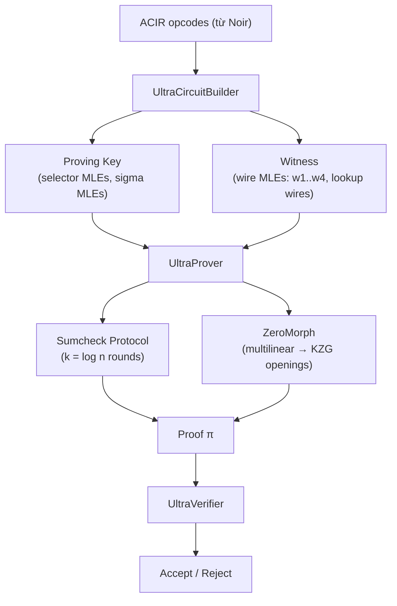
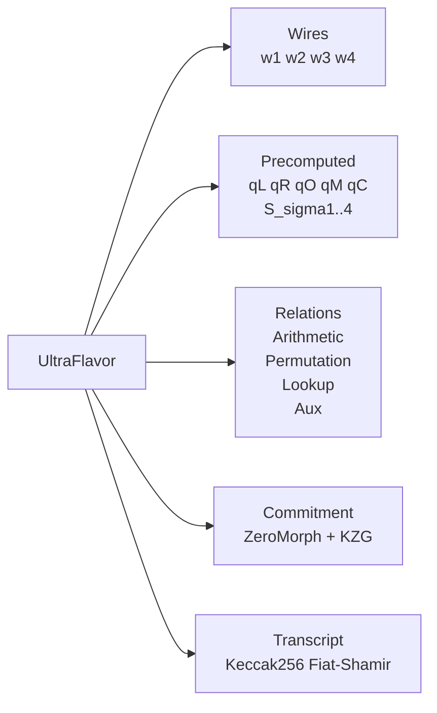

> **Prerequisites**: [[08-ultraplonk|08. UltraPlonk]] — Ultra arithmetization, 4-wire system, plookup; [[09-multilinear-sumcheck|09. Multilinear Extensions and Sumcheck]] — MLE, sumcheck protocol, ZeroMorph
> **Objectives**:
> - Hiểu kiến trúc tổng thể của UltraHonk và điểm khác biệt căn bản so với UltraPlonk
> - Nắm cách Honk encode Ultra arithmetization vào multilinear polynomials
> - Hiểu Flavor system trong Barretenberg: cách tham số hóa proving scheme
> - Theo dõi UltraProver và UltraVerifier từ circuit đến proof
> - Nhận biết attack surface đặc thù của Honk (sumcheck fail, ZeroMorph bugs)

---

## Motivation

UltraPlonk (Lesson 08) dùng KZG univariate: encode witness thành univariate polynomials, chia bởi $Z_H$, commit quotient $t(X)$. Mỗi lần circuit thay đổi kích thước, bậc của $t$ thay đổi → split khác nhau → logic phức tạp.

**UltraHonk** thay thế toàn bộ "chia bởi $Z_H$" bằng **sumcheck trên Boolean hypercube**. Thay vì univariate KZG, dùng **ZeroMorph multilinear PCS**. Kết quả:

- Không cần FFT/NTT để interpolate witness polynomials
- Prover work: $O(n)$ thay vì $O(n \log n)$
- Proof size gần như tương đương UltraPlonk
- Verifier vẫn chỉ cần $O(1)$ pairings (qua ZeroMorph → KZG)

UltraHonk là backend mặc định của **Noir** (2024–nay) và là target chính của **zkVerify bug bounty**.

---

## Kiến trúc Tổng Quan



---

## Từ Ultra Arithmetization sang Multilinear

### Wire MLEs

UltraPlonk có 4 wires $(w_1, w_2, w_3, w_4)$ với $n$ rows mỗi wire. Trong UltraHonk, mỗi wire được encode thành **MLE**:

$$\tilde{w}_j : \{0,1\}^k \to \mathbb{F}, \quad k = \log_2 n$$

$$\tilde{w}_j(\mathbf{b}) = w_{j, \text{bits}^{-1}(\mathbf{b})} \quad \forall \mathbf{b} \in \{0,1\}^k$$

Tương tự, selector polynomials $q_L, q_R, q_O, q_M, q_C, q_{\text{lookup}}, \ldots$ và permutation polynomials $S_{\sigma 1}, \ldots, S_{\sigma 4}$ đều được encode thành MLEs.

### Honk Relation

Thay vì "$q_L a + q_R b + \ldots = 0$ trên $H$", Honk kiểm tra:

$$\sum_{\mathbf{b} \in \{0,1\}^k} \text{RelationSum}(\mathbf{b}) = 0$$

trong đó $\text{RelationSum}(\mathbf{b})$ là **tổng có trọng số** của tất cả gate/lookup/permutation relations tại row $\mathbf{b}$, kết hợp với random challenges $\alpha$ để "separate" các relation.

> [!definition] Definition 10.1 — Honk Full Relation
> Honk define **một polynomial** $F: \mathbb{F}^k \to \mathbb{F}$ là:
>
> $$F(\mathbf{X}) = \sum_{i} \alpha^i \cdot \text{Relation}_i(\tilde{w}_1(\mathbf{X}), \ldots, \tilde{w}_4(\mathbf{X}), \tilde{q}_{\ldots}(\mathbf{X}), \ldots)$$
>
> Prover chứng minh: $\sum_{\mathbf{b} \in \{0,1\}^k} F(\mathbf{b}) = 0$ — đây là một **sumcheck instance**.

### Permutation Argument trong Honk

UltraPlonk dùng grand product polynomial $z(X)$ (univariate). UltraHonk dùng **log-derivative permutation** (Haböck 2022):

> [!definition] Definition 10.2 — Log-Derivative Permutation
> Thay vì accumulate một grand product, Honk chứng minh:
>
> $$\sum_{i=0}^{n-1} \frac{1}{\tilde{w}_1(\mathbf{b}_i) + \beta \cdot \text{id}_1(\mathbf{b}_i) + \gamma} + \ldots = \sum_{i=0}^{n-1} \frac{1}{\tilde{w}_1(\mathbf{b}_i) + \beta \cdot S_{\sigma 1}(\mathbf{b}_i) + \gamma} + \ldots$$
>
> Đây là tổng rational functions — được encode thành polynomial identity dùng **inverse polynomial** $\tilde{p}_{\text{inv}}$.
>
> Ưu điểm: không cần accumulator polynomial $z$ → loại bỏ một polynomial commitment.

---

## Flavor System (Barretenberg)

Barretenberg dùng **Flavor** — một C++ template class — để tham số hóa proving scheme. Mỗi Flavor định nghĩa:

> [!definition] Definition 10.3 — UltraFlavor
> `UltraFlavor` (file `flavor/ultra_flavor.hpp`) định nghĩa:
> - **Wires**: $w_1, w_2, w_3, w_4$ (4 witness columns)
> - **Precomputed polynomials**: $q_L, q_R, q_O, q_M, q_C, q_{\text{lookup}}, q_{\text{sort}}, S_{\sigma 1..4}$, Lagrange polynomials
> - **Shifted polynomials**: $w_{4\text{\_shift}}, z_{\text{perm\_shift}}, \ldots$ (giá trị tại row kề)
> - **Relations**: `UltraArithmeticRelation`, `UltraPermutationRelation`, `LookupRelation`, `GenPermSortRelation`, `AuxRelation`
> - **Commitment scheme**: ZeroMorph với KZG trên BN254



**Tại sao Flavor quan trọng cho bug bounty?** Mỗi field trong Flavor là một attack surface: nếu một polynomial không được commit, hoặc một relation bị bỏ qua, soundness có thể bị break mà không ai hay biết.

---

## UltraProver — Các Bước Chính

> [!definition] Definition 10.4 — UltraProver Protocol
>
> **Bước 1 — Commit wires**: Commit tất cả wire MLEs $\tilde{w}_1, \ldots, \tilde{w}_4$ và lookup wires.
>
> **Bước 2 — Compute auxiliary polynomials**: Tính và commit các polynomials phụ trợ: sorted table, lookup inverse, permutation inverse $\tilde{p}_{\text{inv}}$.
>
> **Bước 3 — Fiat-Shamir**: Hash transcript → lấy challenges $\beta, \gamma$ (permutation + lookup), $\alpha$ (relation combination).
>
> **Bước 4 — Sumcheck**: Thực hiện $k$ rounds sumcheck cho $F(\mathbf{b})$. Mỗi round Prover tính $s_i(X_i)$ (univariate degree $\leq d_{\text{relation}}$). Kết thúc với một claim $F(\mathbf{u}) = e$ tại random point $\mathbf{u} = (u_1, \ldots, u_k)$.
>
> **Bước 5 — ZeroMorph opening**: Prove tất cả MLE evaluations tại $\mathbf{u}$: mỗi wire, selector, permutation polynomial phải gửi $\tilde{f}(\mathbf{u})$ kèm proof.
>
> **Bước 6 — KZG batch check**: ZeroMorph reduces multilinear openings thành univariate KZG → 1–2 pairing checks.

### Proof Structure

```text
π = {
  [w1]₁, [w2]₁, [w3]₁, [w4]₁,          # wire commitments
  [lookup_inv]₁, [perm_inv]₁,             # auxiliary commitments
  (s1, s2, ..., sk),                       # sumcheck messages (k univariates)
  sumcheck_target e,                       # claimed sum at u
  w1(u), w2(u), ..., q_L(u), ...,         # MLE evaluations at u
  [ZeroMorph_q0]₁, ..., [ZeroMorph_qk]₁, # ZeroMorph quotients
  [KZG_batch_proof]₁                       # final KZG opening
}
```

---

## UltraVerifier — Các Bước Chính

> [!definition] Definition 10.5 — UltraVerifier Algorithm
>
> 1. **Reconstruct challenges**: Fiat-Shamir từ transcript → $\beta, \gamma, \alpha, u_1, \ldots, u_k, \rho$.
>
> 2. **Verify sumcheck**: Kiểm tra từng round: $s_i(0) + s_i(1) \stackrel{?}{=} \text{prev\_claim}$; tính $\text{prev\_claim} \leftarrow s_i(u_i)$.
>
> 3. **Verify final claim**: Tại $\mathbf{u}$, tính $F(\mathbf{u})$ từ các MLE evaluations được gửi (wire + selector + permutation evals) và kiểm tra $F(\mathbf{u}) \stackrel{?}{=} e$.
>
> 4. **Verify ZeroMorph**: Kiểm tra mỗi MLE evaluation $\tilde{f}(\mathbf{u}) = v$ bằng ZeroMorph protocol (batch KZG).
>
> 5. **Final pairing**: 1–2 pairing equations trên BN254.

**Tổng Verifier work**: $O(k)$ field ops + $O(P)$ scalar muls (P = số polynomials) + 2 pairings — không phụ thuộc vào $n$ (circuit size).

---

## So sánh chi tiết UltraPlonk vs UltraHonk

| Thành phần | UltraPlonk | UltraHonk |
|-----------|------------|-----------|
| Wire encoding | Univariate $a(X), b(X), c(X), d(X)$ | MLE $\tilde{w}_1(\mathbf{b}), \ldots, \tilde{w}_4(\mathbf{b})$ |
| Domain | Subgroup $H$, size $n$ | Hypercube $\{0,1\}^k$, $k=\log n$ |
| Identity check | Divide by $Z_H$, commit $t$ | Sumcheck $k$ rounds |
| Permutation | Grand product $z(X)$ (univariate) | Log-derivative inverse polynomial |
| Lookup | Plookup grand product | Log-derivative (Haböck) |
| Commitment | KZG univariate | ZeroMorph → KZG |
| Prover FFT | $O(n \log n)$ | Không cần — $O(n)$ folds |
| Prover polynomials | ~10–15 commits | ~20–25 commits (nhưng nhỏ hơn) |
| Verifier pairings | 2 | 2 |
| Proof size (BN254) | ~2.5 KB | ~4 KB (thêm sumcheck messages) |
| Backend (Barretenberg) | `ultra_plonk` (legacy) | `ultra_honk` (current default) |

---

## Implementation: Verify Sumcheck Claim từ Honk Relation

```python
def honk_relation_eval(w1, w2, w3, w4, qL, qR, qO, qM, qC, p):
    """
    UltraArithmetic relation tại một row.
    Trả về giá trị relation (phải bằng 0 nếu circuit thỏa mãn).
    """
    return (qM * w1 * w2 + qL * w1 + qR * w2 + qO * w3 + qC) % p


def honk_sumcheck_verify(
    wire_tables,   # dict: 'w1'..'w4' -> list of n values
    sel_tables,    # dict: 'qL','qR','qO','qM','qC' -> list of n values
    challenges,    # [u1..uk] verifier challenges
    claimed_e,     # claimed F(u1..uk)
    p
):
    """
    Simulate Honk sumcheck verification:
    1. Kiểm tra sum_{b} F(b) = 0 (claimed_sum phải = 0 nếu circuit valid)
    2. Dùng sumcheck để reduce đến single evaluation F(u)
    3. Verify F(u) == claimed_e bằng cách evaluate trực tiếp
    """
    n = len(wire_tables['w1'])
    k = len(challenges)
    assert n == 2**k

    # Build F table: F(b) = relation(w1[b], w2[b], w3[b], w4[b], selectors[b])
    F_table = []
    for i in range(n):
        val = honk_relation_eval(
            wire_tables['w1'][i], wire_tables['w2'][i],
            wire_tables['w3'][i], wire_tables['w4'][i],
            sel_tables['qL'][i], sel_tables['qR'][i],
            sel_tables['qO'][i], sel_tables['qM'][i],
            sel_tables['qC'][i], p
        )
        F_table.append(val)

    # Verify sum = 0 (circuit validity)
    total_sum = sum(F_table) % p
    if total_sum != 0:
        return False, f"Circuit invalid: sum = {total_sum}"

    # Simulate sumcheck reduce to single point
    current = list(F_table)
    for r in challenges:
        half = len(current) // 2
        current = [((1 - r) * current[i] + r * current[half + i]) % p
                   for i in range(half)]
    final_eval = current[0]

    if final_eval % p != claimed_e % p:
        return False, f"Final eval mismatch: {final_eval} != {claimed_e}"

    return True, "Sumcheck OK"


# --- Demo ---
p = 337

# Circuit: 4 gates (n=4, k=2)
# Gate 0: w1*w2 = w3  (qM=1, qO=-1)
# Gate 1: w1+w2 = w3  (qL=1, qR=1, qO=-1)
# Gate 2: w1 = 5 (constant gate: qL=1, qC=5, qO=0 — w3 unused)
# Gate 3: padding (all zero selectors)

wire_tables = {
    'w1': [3, 4, 5, 0],
    'w2': [4, 2, 0, 0],
    'w3': [12, 6, 0, 0],  # 3*4=12, 4+2=6
    'w4': [0, 0, 0, 0],
}
sel_tables = {
    'qM': [1,  0, 0, 0],
    'qL': [0,  1, 1, 0],
    'qR': [0,  1, 0, 0],
    'qO': [-1 % p, -1 % p, 0, 0],
    'qC': [0,  0, -5 % p, 0],
}

challenges = [17, 83]  # k=2 challenges

# Tính claimed_e: F evaluated tại (u1,u2) = (17,83)
# Dùng MLE fold trực tiếp
F_table = [
    (sel_tables['qM'][i] * wire_tables['w1'][i] * wire_tables['w2'][i]
     + sel_tables['qL'][i] * wire_tables['w1'][i]
     + sel_tables['qR'][i] * wire_tables['w2'][i]
     + sel_tables['qO'][i] * wire_tables['w3'][i]
     + sel_tables['qC'][i]) % p
    for i in range(4)
]

def mle_eval(table, rs, p):
    cur = list(table)
    for r in rs:
        half = len(cur) // 2
        cur = [((1-r)*cur[i] + r*cur[half+i]) % p for i in range(half)]
    return cur[0]

claimed_e = mle_eval(F_table, challenges, p)
ok, msg = honk_sumcheck_verify(wire_tables, sel_tables, challenges, claimed_e, p)
print(f"Honk sumcheck verify: {ok} ({msg})")

# Test với circuit vi phạm: w3[0] sai (không phải 3*4=12)
wire_bad = dict(wire_tables)
wire_bad['w3'] = [11, 6, 0, 0]  # 11 != 12
ok_bad, msg_bad = honk_sumcheck_verify(wire_bad, sel_tables, challenges, claimed_e, p)
print(f"Invalid circuit: {ok_bad} ({msg_bad})")
```

---

## Bug Bounty: UltraHonk Attack Surface

> [!danger] Vulnerability 10.6 — Sumcheck Round Skip
> Nếu Verifier không check đủ $k$ rounds (ví dụ: loop `for i in range(k-1)` thay vì `range(k)`), round cuối không được verify → Prover có thể gian lận tại round cuối mà không bị phát hiện.

> [!danger] Vulnerability 10.7 — Missing Polynomial trong Flavor
> Nếu một polynomial (ví dụ: `lookup_read_counts`) không được commit hoặc không được đưa vào ZeroMorph batch, Prover có thể dùng giá trị bất kỳ cho polynomial đó tại evaluation point mà Verifier không biết.
>
> **Cách kiểm tra**: Đếm số polynomials trong `WITNESS_ENTITIES` và `PRECOMPUTED_ENTITIES` của Flavor, so sánh với số evaluation claims trong proof.

> [!danger] Vulnerability 10.8 — ZeroMorph Shift Polynomial Bug
> ZeroMorph cần commit "shift polynomials" $\tilde{f}^{<i}$ cho từng biến. Nếu commitment computation sai (sai degree, sai ordering), opening proof accept cả khi evaluation sai.
>
> **Nguồn**: `zeromorph.hpp` trong Barretenberg — đây là file phức tạp nhất, hay có bug.

> [!danger] Vulnerability 10.9 — Transcript Domain Separator
> UltraHonk dùng Keccak-256 Fiat-Shamir. Nếu domain separator giữa challenges ($\beta$, $\gamma$, $\alpha$, $u_i$) không unique, có thể có **challenge collision** — Prover biết trước một challenge và tweak witness để pass.

> [!warning] Warning 10.10 — Proof Format mismatch (zkVerify)
> zkVerify's `ultrahonk_verifier` (Rust) cần parse proof đúng format của Barretenberg. Nếu serialization byte order, field encoding, hoặc proof element ordering sai một byte → verification fail hoặc (nguy hiểm hơn) **pass proof sai**.

---

## Summary

- **UltraHonk** = Ultra arithmetization (4 wires + custom gates + lookup + permutation) + sumcheck + ZeroMorph + KZG.
- Wire/selector/permutation polynomials → **MLEs** trên $\{0,1\}^k$.
- **Sumcheck** thay thế "chia bởi $Z_H$" → prover $O(n)$, không FFT.
- **Log-derivative** thay grand product cho permutation và lookup.
- **Flavor system**: tham số hóa toàn bộ scheme — mỗi field là attack surface.
- **UltraVerifier**: $O(k)$ field ops + 2 pairings.
- **Bug bounty**: missing polynomial, round skip, ZeroMorph shift, transcript separator.

---

## References

- Aztec — *Proving System Components* (rknhr-uec.github.io/aztec-protocol-spec)
- Barretenberg — `ultra_honk/`, `flavor/ultra_flavor.hpp`, `zeromorph/zeromorph.hpp` (AztecProtocol/aztec-packages)
- Deepwiki — *Barretenberg Proving Engine* (deepwiki.com/AztecProtocol/aztec-packages)
- Haböck — *A Logarithmic Derivative Lookup Argument* (ePrint 2022/1530)
- Kohrita, Towa — *ZeroMorph* (ePrint 2023/1284)
