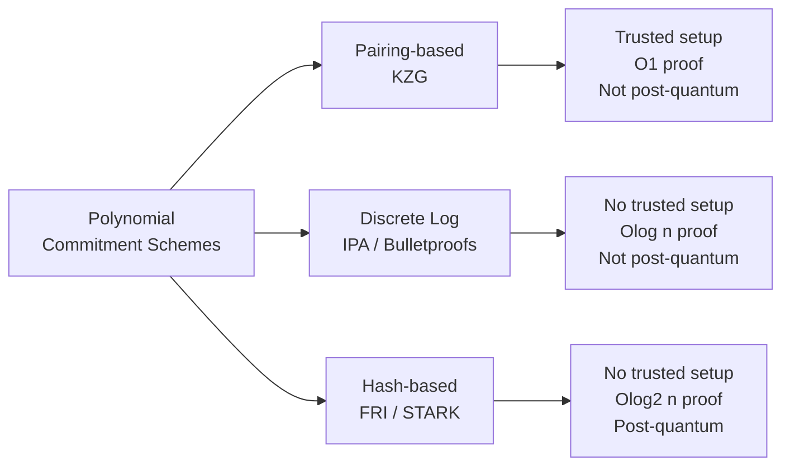
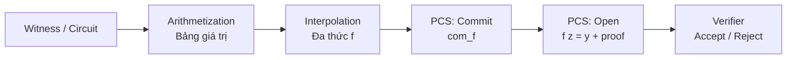

> **Prerequisites**: [[01-polynomials-over-finite-fields|01. Polynomials over Finite Fields]], group theory, discrete logarithm
> **Objectives**:
> - Định nghĩa chính xác commitment scheme và ba tính chất: binding, hiding, correctness
> - Phân biệt các loại: perfectly hiding vs computationally hiding, perfectly binding vs computationally binding
> - Hiểu Pedersen commitment và vector Pedersen commitment
> - Hiểu polynomial commitment scheme là gì và nó nằm ở đâu trong ZK pipeline

---

## Motivation

Hãy tưởng tượng bạn muốn chứng minh cho người khác biết rằng bạn đã tính đúng một kết quả *mà không tiết lộ dữ liệu đầu vào*. Ví dụ: chứng minh bạn biết một số $x$ thỏa $x^3 + x + 5 = 35$ mà không tiết lộ $x = 3$.

Bước đầu tiên: **commit** (cam kết) với $x$ trước khi tính toán, để sau đó không thể thay đổi. Đây là trực giác của commitment scheme — một "hộp khóa kín": bạn bỏ thông tin vào, khóa lại, đưa cho verifier giữ; sau đó mở hộp để prove.

---

## Commitment Scheme

> [!definition] Definition 2.1 — Commitment Scheme
> Một **commitment scheme** là bộ ba thuật toán $\Gamma = (\text{Setup}, \text{Commit}, \text{Open})$:
>
> - $\text{Setup}(1^\lambda) \to \text{pp}$: Sinh ra public parameters (hay commitment key).
> - $\text{Commit}(\text{pp}, m; r) \to c$: Commit message $m$ với randomness $r$, trả về commitment $c$.
> - $\text{Open}(\text{pp}, c, m, r) \to \{0,1\}$: Verify xem $c$ có phải là commitment hợp lệ của $m$ với $r$ không.

### Ba tính chất cốt lõi

> [!definition] Definition 2.2 — Correctness (Đúng đắn)
> Nếu prover làm đúng: $\text{Open}(\text{pp}, \text{Commit}(\text{pp}, m; r), m, r) = 1$ với xác suất 1.

> [!definition] Definition 2.3 — Binding (Ràng buộc)
> **Computationally binding**: Không có PPT adversary nào có thể tìm $(m, r, m', r')$ với $m \neq m'$ sao cho:
>
> $$\text{Commit}(\text{pp}, m; r) = \text{Commit}(\text{pp}, m'; r')$$
>
> với xác suất không negligible.

> [!definition] Definition 2.4 — Hiding (Ẩn giấu)
> **Computationally hiding**: Không có PPT adversary nào có thể phân biệt $\text{Commit}(\text{pp}, m_0; r)$ với $\text{Commit}(\text{pp}, m_1; r')$ với xác suất tốt hơn $1/2 + \text{negl}(\lambda)$.

### Trade-off nền tảng

> [!warning] Trade-off 2.5 — Không thể đồng thời perfectly binding VÀ perfectly hiding
> Nếu một scheme là **perfectly binding** (binding đối với adversary vô hạn tính toán), nó **không thể** perfectly hiding, và ngược lại. Đây là kết quả lý thuyết cơ bản.
>
> - **Perfectly hiding, computationally binding**: Pedersen commitment (bảo vệ tuyệt đối privacy, binding dựa trên DL hardness).
> - **Computationally hiding, perfectly binding**: Hash-based commitment như $H(m \| r)$ (binding tuyệt đối, hiding dựa trên preimage resistance).

---

## Pedersen Commitment

### Cấu trúc

> [!definition] Definition 2.6 — Pedersen Commitment
> Cho cyclic group $\mathbb{G}$ bậc nguyên tố $p$ với generator $G$, chọn ngẫu nhiên $H = h \cdot G$ (giữ bí mật $h$).
>
> - **Commit**: $c = m \cdot G + r \cdot H$ với $r \xleftarrow{\$} \mathbb{F}_p$
> - **Open**: Reveal $(m, r)$, verifier kiểm tra $c = m \cdot G + r \cdot H$

**Tính chất**:
- *Perfectly hiding*: Vì $r$ random, mọi $m$ đều cho cùng phân phối của $c$.
- *Computationally binding*: Nếu prover có thể open $(m, r)$ và $(m', r')$, suy ra $m G + r H = m' G + r' H$, tức $(m - m') G = (r' - r) H = (r' - r) h G$, suy ra $h = (m-m')/(r'-r)$ — prover đã giải được DL của $H$.

### Homomorphic property

> [!theorem] Theorem 2.7 — Tính chất cộng tính (Additive Homomorphism)
> Pedersen commitment là **additively homomorphic**:
>
> $$\text{Com}(m_1; r_1) + \text{Com}(m_2; r_2) = \text{Com}(m_1 + m_2;\; r_1 + r_2)$$

Đây là tính chất cực kỳ quan trọng: cho phép **batch** nhiều commitments và kết hợp trong các proof phức tạp.

---

## Vector Pedersen Commitment

Khi cần commit một **vector** $\mathbf{v} = (v_0, v_1, \ldots, v_{n-1})$:

> [!definition] Definition 2.8 — Pedersen Vector Commitment
> Cho generators $G_0, G_1, \ldots, G_{n-1}, H \in \mathbb{G}$ (chọn ngẫu nhiên, không biết quan hệ DL giữa chúng):
>
> $$\text{Com}(\mathbf{v}; r) = r \cdot H + \sum_{i=0}^{n-1} v_i \cdot G_i$$

**Ứng dụng trong IPA**: Đây là commitment scheme được dùng trong Inner Product Argument (Bulletproofs). $G_i$ tương ứng với $[x^i]$ — commit to coefficients của đa thức.

**Vấn đề**: Commitment size là $O(1)$ (một group element), nhưng để prove evaluation $f(z) = y$, naive approach cần gửi tất cả $n$ hệ số $v_i$ — proof size $O(n)$. IPA giải quyết bằng cách reduce về $O(\log n)$.

---

## Polynomial Commitment Scheme

> [!definition] Definition 2.9 — Polynomial Commitment Scheme (PCS)
> Một **polynomial commitment scheme** là bộ bốn thuật toán $(\text{Setup}, \text{Commit}, \text{Open}, \text{Verify})$:
>
> - $\text{Setup}(1^\lambda, d) \to \text{pp}$: Sinh ra parameters cho đa thức bậc tối đa $d$.
> - $\text{Commit}(\text{pp}, f) \to \text{com}_f$: Commit to $f \in \mathbb{F}_p[X]^{\leq d}$.
> - $\text{Open}(\text{pp}, f, z) \to (y, \pi)$: Claim $f(z) = y$ kèm proof $\pi$.
> - $\text{Verify}(\text{pp}, \text{com}_f, z, y, \pi) \to \{0,1\}$: Verify claim.

### Tính chất bổ sung cho PCS

Ngoài binding và hiding, PCS cần:

> [!definition] Definition 2.10 — Evaluation Binding
> **Evaluation binding**: Không có PPT adversary nào, sau khi đã publish $\text{com}_f$, có thể tạo ra hai proof hợp lệ $(y, \pi)$ và $(y', \pi')$ với $y \neq y'$ cho cùng một điểm $z$.

> [!definition] Definition 2.11 — Knowledge Soundness (Extractability)
> **Knowledge soundness**: Tồn tại một extractor $\mathcal{E}$ sao cho nếu một prover có thể tạo proof hợp lệ cho $\text{com}_f$, thì $\mathcal{E}$ có thể extract đa thức $f$ thực sự.

---

## Ba họ PCS và So sánh

Ba cách tiếp cận chính để xây PCS, mỗi cách có trade-offs khác nhau:

| Tính chất | KZG | IPA | FRI |
|-----------|-----|-----|-----|
| Trusted setup | ✅ Cần | ❌ Không | ❌ Không |
| Proof size | $O(1)$ — 1 group element | $O(\log n)$ | $O(\log^2 n)$ |
| Verifier time | $O(1)$ — 2 pairings | $O(n)$ | $O(\log^2 n)$ |
| Post-quantum | ❌ | ❌ | ✅ |
| Homomorphic | ✅ | ✅ | ❌ |

---

## Vị trí trong ZK Pipeline

Arithmetic circuits (PLONK, Groth16) → encode thành đa thức → PCS commit → interactive proof protocol → Fiat-Shamir → SNARK.

---

## Tóm tắt

- Commitment scheme = "hộp khóa": **hiding** (ẩn nội dung), **binding** (không thể thay đổi sau khi commit).
- **Pedersen commitment** là perfectly hiding, computationally binding; có tính homomorphic quan trọng.
- **Polynomial commitment scheme** mở rộng thêm: commit to đa thức, prove evaluation tại điểm bất kỳ.
- Ba họ PCS (KZG, IPA, FRI) có trade-offs về proof size, trusted setup, và post-quantum security.

---

## References

- Kate, Zaverucha & Goldberg — *Constant-Size Commitments to Polynomials and Their Applications* (ASIACRYPT 2010)
- MIT IAP 2023 — *Modern Zero Knowledge Cryptography* lecture notes
- ZKDocs (Trail of Bits) — https://www.zkdocs.com/docs/zkdocs/commitments/
