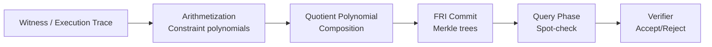

> **Prerequisites**: [[01-polynomials-over-finite-fields|01. Polynomials over Finite Fields]], Reed-Solomon codes, Merkle trees, hash functions
> **Objectives**:
> - Hiểu FRI là IOP of Proximity — không phải commitment scheme trực tiếp
> - Follow được commit phase (folding) và query phase (spot-check)
> - Hiểu soundness bound và cách chọn parameters
> - Biết FRI được dùng trong STARK như thế nào

---

## Motivation

KZG và IPA dựa vào discrete log — không post-quantum. FRI (Fast Reed-Solomon IOP of Proximity) là cách tiếp cận khác: chỉ dùng **hash functions** (coi như random oracles). Không trusted setup, post-quantum secure.

Trade-off: proof size là $O(\log^2 d)$ thay vì $O(1)$ hay $O(\log d)$.

FRI được phát triển bởi Ben-Sasson, Bentov, Horesh, Riabzev (2018) và là nền tảng của STARKs, Plonky2, và nhiều hệ thống ZK không cần pairing.

---

## FRI là gì?

FRI không phải là polynomial commitment scheme theo nghĩa truyền thống. Nó là một **IOP of Proximity** (Interactive Oracle Proof of Proximity):

> [!definition] Definition 6.1 — FRI: IOP of Proximity cho Reed-Solomon Code
> FRI là protocol cho phép verifier kiểm tra rằng một function $f: D \to \mathbb{F}_p$ (được commit via Merkle tree) có **khoảng cách tương đối nhỏ** đến codeword Reed-Solomon bậc $< d$, chỉ với $O(\log d)$ queries.
>
> Nói cách khác: FRI prove "tôi commit một đa thức bậc gần $< d$" — không phải evaluate cụ thể.

**Tại sao "Proximity"?** Nếu $f$ gần (in Hamming distance) với một codeword RS bậc $d$, verifier có thể tin $f$ là "xấp xỉ" đa thức bậc $d$.

Để build polynomial evaluation proof đầy đủ từ FRI, cần kết hợp với sumcheck hoặc quotient trick bên ngoài.

---

## Domain Setup

Dùng multiplicative subgroup $D_0 \subset \mathbb{F}_p^*$ bậc $n = 2^k$:

$$D_0 = \{\omega^0, \omega^1, \ldots, \omega^{n-1}\}$$

Tại mỗi bước folding, domain được **halved**:

$$D_i = \{x^2 : x \in D_{i-1}\} = \{\omega^{2^i \cdot j} : 0 \leq j < n/2^i\}$$

sau $\log n$ bước, domain còn 1 phần tử.

---

## Commit Phase — Polynomial Folding

### Ý tưởng Folding

Cho đa thức $f_0(X)$ bậc $< d$ trên $D_0$. Tách thành phần chẵn/lẻ:

$$f_0(X) = f_0^{\text{even}}(X^2) + X \cdot f_0^{\text{odd}}(X^2)$$

trong đó:

$$f_0^{\text{even}}(Y) = \frac{f_0(\sqrt{Y}) + f_0(-\sqrt{Y})}{2}, \quad f_0^{\text{odd}}(Y) = \frac{f_0(\sqrt{Y}) - f_0(-\sqrt{Y})}{2\sqrt{Y}}$$

**Verifier gửi** challenge $\beta_0 \xleftarrow{\$} \mathbb{F}_p$.

**Prover tạo đa thức folded**:

$$f_1(Y) = f_0^{\text{even}}(Y) + \beta_0 \cdot f_0^{\text{odd}}(Y)$$

$f_1$ có bậc $< d/2$ trên domain $D_1 = D_0^2$!

> [!definition] Definition 6.2 — FRI Commit Phase
> Lặp lại $k = \log_2(d/d_0)$ lần:
>
> 1. Prover gửi Merkle commitment của $f_i$ trên $D_i$.
> 2. Verifier gửi $\beta_i$.
> 3. Prover tính $f_{i+1}$ bằng folding với $\beta_i$.
>
> Tại cuối: $f_k$ là đa thức bậc $< d_0$ (constant hoặc degree nhỏ) — prover gửi trực tiếp.

**Commit = chuỗi Merkle roots** $\text{mt}_0, \text{mt}_1, \ldots, \text{mt}_{k-1}$ plus final polynomial.

---

## Query Phase — Spot-Check Soundness

Sau commit phase, verifier thực hiện $t$ **queries** để kiểm tra consistency:

> [!definition] Definition 6.3 — FRI Query Phase
> Với mỗi query $j \in [t]$:
>
> 1. Verifier chọn ngẫu nhiên $x_0 \xleftarrow{\$} D_0$.
> 2. Verifier yêu cầu:
>    - $f_0(x_0)$ và $f_0(-x_0)$ với Merkle proof từ $\text{mt}_0$.
>    - $f_1(x_0^2)$ với Merkle proof từ $\text{mt}_1$.
>    - ...tiếp tục mỗi round.
> 3. Verifier kiểm tra folding consistency:
>    $$f_1(x_0^2) \stackrel{?}{=} \frac{f_0(x_0) + f_0(-x_0)}{2} + \beta_0 \cdot \frac{f_0(x_0) - f_0(-x_0)}{2x_0}$$

Nếu $f_0$ thực sự gần một đa thức bậc $< d$, các checks này pass với xác suất cao. Nếu không, ít nhất một check fail với xác suất đáng kể.

---

## Soundness Analysis

> [!theorem] Theorem 6.4 — FRI Soundness Bound
> Nếu $f_0$ có khoảng cách tương đối $\delta > 0$ từ codeword RS bậc $< d$ (tức là $f_0$ sai tại $\delta$ fraction domain), thì FRI verifier từ chối với xác suất:
>
> $$\Pr[\text{Accept}] \leq \left(1 - \delta\right)^t + \text{negligible}$$
>
> Mỗi query giảm error probability khoảng $\times (1 - \delta)$.

**Tham số hóa**: Để đạt $\lambda$ bits security, cần $t \approx \lambda / \log_2(1/(1-\delta))$ queries. Với $\delta \approx 1/2$ (rate $\rho = 1/2$), cần $t \approx \lambda$ queries.

**Proof size**: Mỗi query cần $\log_2(n)$ hash values (Merkle path) × $k$ rounds = $O(\log^2 n)$ hashes.

---

## FRI trong STARK Pipeline

FRI không đứng một mình — nó là building block:

**Chi tiết**:
1. Execution trace encode thành đa thức $T(X)$.
2. Constraints tạo **composition polynomial** $C(X)$ — zero trên execution trace nếu trace valid.
3. $C(X) / Z_H(X) = Q(X)$ là đa thức nếu constraints thỏa.
4. FRI commit to $Q(X)$ (và $T(X)$), prove low-degree.

---

## Lỗi Thường Gặp trong FRI

> [!danger] Bug 6.5 — Thiếu Extra Evaluation Points (Redshift Attack)
> Nếu không có đủ "extra evaluation points" ngoài domain chính, adversary có thể tìm đa thức giả $f_\text{attack}(X) = f(X) + h(X)$ trong đó $h$ vanishes trên domain nhưng encode witness sai.
>
> **Fix**: Thêm random evaluation points bên ngoài domain, hoặc dùng random shift như Plonky2.

> [!danger] Bug 6.6 — Parameter Selection Yếu (Insufficient Query Count)
> Nếu số queries $t$ không đủ so với security parameter $\lambda$ và rate $\rho$:
>
> $$t < \frac{\lambda}{\log_2(1/(1 - \delta))}$$
>
> soundness error không đạt $2^{-\lambda}$.

> [!danger] Bug 6.7 — Non-Interactive via Weak Fiat-Shamir
> Các challenges $\beta_i$ trong commit phase phải hash đầy đủ transcript. Nếu hash bỏ sót một trong các Merkle roots, adversary có thể chọn tree sau khi biết challenge.

---

## Tóm tắt

- FRI là **IOP of Proximity** — prove một function gần Reed-Solomon codeword bậc $< d$ với $O(\log d)$ rounds và $O(\log^2 d)$ proof size.
- **Commit phase**: polynomial folding $k = \log d$ rounds, mỗi round halve degree và domain, commit bằng Merkle tree.
- **Query phase**: $t$ spot-checks kiểm tra folding consistency tại random points.
- Soundness: mỗi query reject với prob $\geq \delta$ nếu function xa RS code.
- **Bugs thường gặp**: thiếu extra points, parameter yếu, Fiat-Shamir không đầy đủ.

---

## References

- Ben-Sasson, Bentov, Horesh, Riabzev — *Fast Reed-Solomon Interactive Oracle Proofs of Proximity* (ICALP 2018)
- Alan Szepieniec — *Anatomy of a STARK, Part 3: FRI* (https://aszepieniec.github.io)
- ZKP MOOC Berkeley — Lecture 8: FRI-based polynomial commitments
- Medium — *On FRI-based commitments* (Redshift attack analysis)
