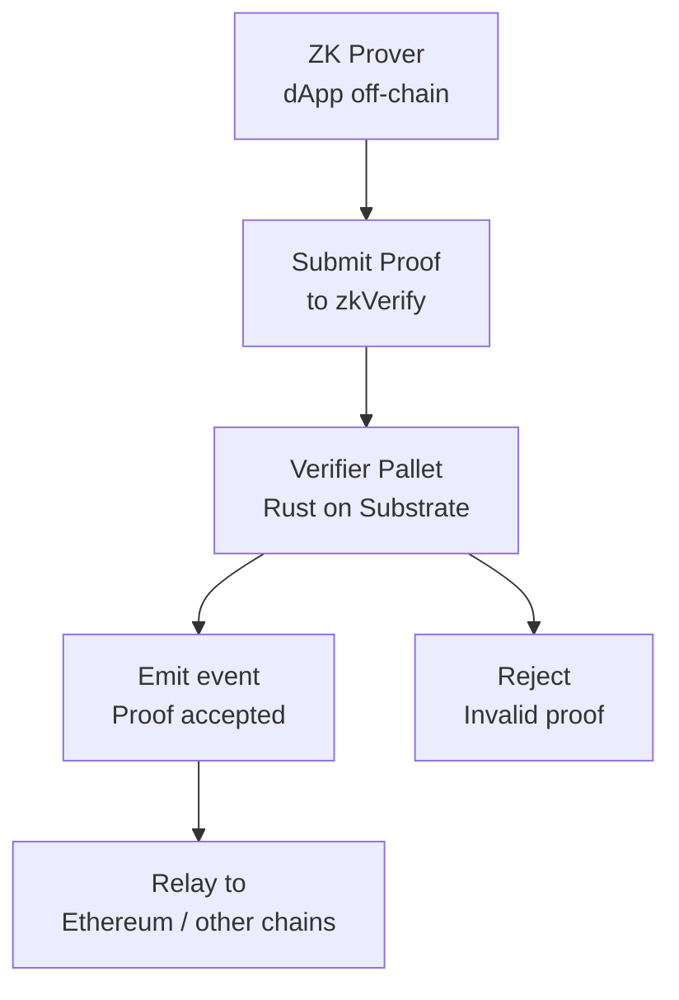

> **Prerequisites**: Toàn bộ bài 01–09
> **Objectives**:
> - Nắm kiến trúc zkVerify và attack surface của nó
> - Biết cách map lỗi PCS vào codebase zkVerify cụ thể
> - Hiểu threat model của bug bounty program
> - Có approach cụ thể để bắt đầu audit

---

## zkVerify là gì?

zkVerify là **Substrate-based blockchain** chuyên biệt để verify ZK proofs on-chain. Thay vì mỗi dApp tự deploy verifier tốn kém, zkVerify cung cấp shared verification layer.

**Architecture**:



**Các verifier pallets chính** (mỗi pallet verify một proof type):
- Groth16 verifier (BN254 pairing)
- PLONK/Fflonk verifier
- RISC0 verifier
- Ultraplonk verifier
- TEE (Trusted Execution Environment) verifier
- EZKL verifier adapter (newer, less audited)

---

## Threat Model — Bug Bounty Perspective

**Mục tiêu tấn công cao giá trị**:

> [!definition] Definition 10.1 — Critical Impact trong zkVerify
> Theo Immunefi program:
> - **Critical**: Proof forging — submit invalid ZK proof, zkVerify accept. Cho phép chứng minh invalid state transitions.
> - **High**: DoS — valid proof bị reject, network halt, hoặc stuck.
> - **Medium/Low**: Logic errors, gas griefing, informational leaks.

**Tại sao forging nguy hiểm?** Downstream dApps dùng zkVerify attestation để release funds, update state. Proof forgery = forge bất kỳ computation result nào.

---

## Attack Surface 1: Verifier Pallet — Pairing Checks

Mỗi Groth16/Plonk verifier pallet thực hiện pairing verification trong Rust. Các điểm cần check:

### Checklist cho Groth16/Plonk Pallet

```rust
// Pattern cần tìm trong zkVerify pallet code:

// 1. SUBGROUP CHECK - phải có trước khi dùng proof elements
fn verify(proof: &Proof, public_inputs: &[Fr]) -> bool {
    // ⚠️  Có check này không?
    assert!(proof.a.is_on_curve());
    assert!(proof.a.is_in_correct_subgroup());
    // ...
}

// 2. PAIRING RESULT CHECK - phải check return value
let pairing_result = Bls12_381::multi_miller_loop(...).final_exponentiation();
// ⚠️  Có check .is_one() không?
assert!(pairing_result.is_one(), "Pairing check failed");

// 3. PUBLIC INPUT VALIDATION - length check
assert_eq!(public_inputs.len(), EXPECTED_PUBLIC_INPUTS, "Wrong input count");
```

> [!warning] Audit Point 10.2 — Kiểm tra Subgroup trong Rust arkworks
> Trong arkworks (thư viện Rust phổ biến), `is_on_curve()` và `is_in_correct_subgroup_assuming_on_curve()` là **hai checks khác nhau**. Chỉ check on-curve là chưa đủ.
>
> ```rust
> // Đủ:
> let ok = point.is_on_curve() && point.is_in_correct_subgroup_assuming_on_curve();
> // Thiếu (chỉ on-curve):
> let ok = point.is_on_curve();  // Không đủ!
> ```

---

## Attack Surface 2: Fiat-Shamir Transcript

Các verifiers non-interactive phải implement Fiat-Shamir đúng cách.

### Pattern Tìm trong Code

```rust
// Tìm transcript/challenge generation
let mut transcript = Transcript::new(b"zkVerify");
// ⚠️  Những gì được absorb vào transcript?
transcript.append_message(b"commitment", &commitment.to_bytes());
// Phải bao gồm TẤT CẢ: public inputs, commitments, domain info
let challenge = transcript.challenge_scalar(b"challenge");
```

**Câu hỏi audit**:
- Có domain separator không? (`b"zkVerify"` hay không?)
- Public inputs có được hash vào không?
- Tất cả intermediate commitments có trong transcript không?
- Có phải implementation theo spec của scheme (PLONK paper, etc.) không?

---

## Attack Surface 3: EZKL Verifier Adapter

EZKL là tool để convert ML models thành ZK circuits. zkVerify có EZKL verifier adapter — **ít được audit nhất** theo community reports.

**Điểm cần focus**:

1. **Input validation**: EZKL input format có được validate đầy đủ không?
2. **Quantization artifacts**: ML quantization có tạo ra edge cases trong field arithmetic không?
3. **Circuit-specific bugs**: EZKL-generated circuits có under-constrained components không?

---

## Attack Surface 4: ParaVerifier Pallet

ParaVerifier cho phép verify proofs from parachains — **permissionless submission** của proof types mới.

> [!warning] Audit Point 10.3 — Permissionless Verifier Registration
> Nếu ai cũng có thể register verifier type mới:
> - Adversary register verifier với logic "accept everything"
> - Submit malicious circuit definition
> - DoS bằng cách register nhiều entries
>
> **Check**: Có access control? Governance? Rate limiting?

---

## Attack Surface 5: XCM Integration

Cross-Chain Message (XCM) integration cho phép relay proof results sang chains khác.

**Bugs có thể xảy ra**:
- Message ordering: proof từ epoch cũ được relay muộn → state mismatch
- Replay attack: cùng proof result được relay nhiều lần
- Decoding errors trong XCM message parser

---

## Methodology Audit zkVerify Step-by-Step

### Bước 1: Setup môi trường

```bash
# Clone zkVerify
git clone https://github.com/HorizenLabs/zkVerify
cd zkVerify

# Build
cargo build --release

# Chạy tests
cargo test --all

# Tìm verifier pallets
find . -name "*.rs" | xargs grep -l "fn verify" | grep pallet
```

### Bước 2: Identify Verifier Logic

```bash
# Tìm pairing calls
grep -r "miller_loop\|final_exp\|pairing\|multi_pairing" --include="*.rs" .

# Tìm subgroup checks
grep -r "is_in_correct_subgroup\|is_on_curve\|subgroup_check" --include="*.rs" .

# Tìm Fiat-Shamir transcript
grep -r "Transcript\|challenge\|squeeze\|absorb" --include="*.rs" .
```

### Bước 3: Verify từng Bug Pattern từ Bài 09

Với mỗi verifier pallet, kiểm tra:

```
[ ] Subgroup check cho tất cả proof elements
[ ] Pairing kết quả được check (.is_one())
[ ] Proof length/format validation
[ ] Transcript đầy đủ trong Fiat-Shamir
[ ] Public input count check
[ ] Arithmetic trong đúng field (Fr vs Fq)
[ ] SRS degree check (nếu có KZG)
```

### Bước 4: PoC Template

```rust
// Template để test proof forgery
#[test]
fn test_forged_proof() {
    // Tạo proof INVALID
    let fake_proof = Proof {
        a: G1::generator(),  // Điểm generator — không phải proof thực
        b: G2::generator(),
        c: G1::generator(),
    };
    
    let public_inputs = vec![Fr::zero()];  // Input bất kỳ
    
    // Nếu verify() return true với proof giả → BUG CRITICAL
    let result = verify(&fake_proof, &public_inputs);
    
    // Should be false:
    assert!(!result, "CRITICAL: Forged proof accepted!");
}

#[test]  
fn test_small_order_point() {
    // Tạo small-order point (nếu curve có cofactor)
    // ...
    let small_order_proof = create_small_order_proof();
    assert!(!verify(&small_order_proof, &[]), "Subgroup check missing!");
}
```

---

## Real Bugs Đã Tìm thấy trong zkVerify-like Systems

Từ các audit reports tương tự:

| Bug | Severity | Pattern |
|-----|----------|---------|
| Missing subgroup check in Groth16 | Critical | `is_on_curve()` only |
| Incomplete transcript in Fflonk | High | Fiat-Shamir missing commitments |
| Wrong field arithmetic in IPA | High | Confusion Fr vs Fq |
| Pairing call not checked | Medium | `staticcall` without `require(success)` |
| Proof length not validated | Medium | Array index OOB |
| Missing blinding in PLONK prover | Medium | Zero-knowledge break |

---

## Tóm tắt

- zkVerify là shared ZK verifier blockchain — proof forgery = critical impact.
- **Attack surfaces chính**: verifier pallet pairing logic, Fiat-Shamir transcript, EZKL adapter (ít audit nhất), ParaVerifier (permissionless).
- **Approach**: clone repo → find verify functions → apply Bug Checklist từ bài 09.
- **PoC**: submit invalid proof, check verifier reject. Nếu accept → critical report.

---

## References

- zkVerify GitHub — https://github.com/HorizenLabs/zkVerify
- zkVerify Bug Bounty (Immunefi) — https://immunefi.com/bug-bounty/zkverify/
- DEV Community — *I Spent 2 Sessions Auditing zkVerify's Substrate Code* (March 2026)
- 0xPARC — *ZK Bug Tracker* — https://github.com/0xPARC/zk-bug-tracker
- ZKSecurity — *zkbugs PoC repo* — https://github.com/zksecurity/zkbugs
