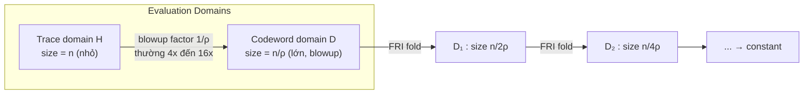
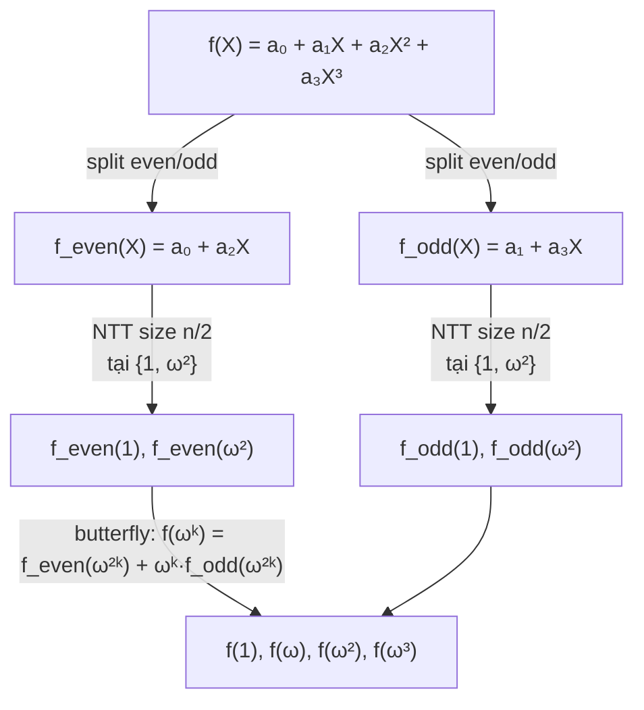
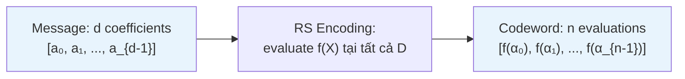
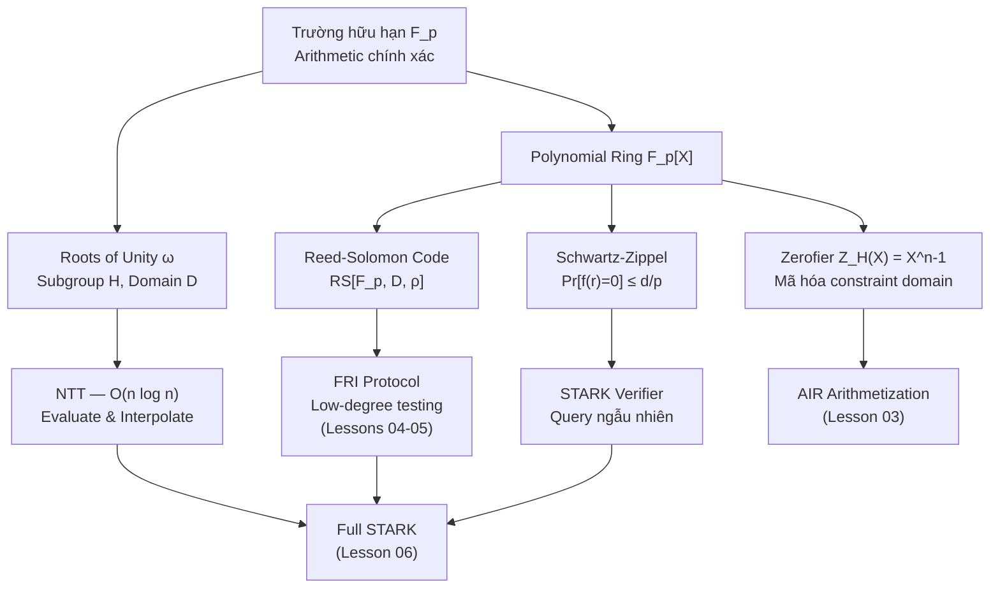

> **Prerequisites**: Số học modular (modular arithmetic) — phép cộng/nhân mod $p$, nghịch đảo modular; khái niệm đa thức (polynomial) cơ bản  
> **Objectives**:  
> - Nắm vững cấu trúc của trường hữu hạn (finite field) $\mathbb{F}_p$ và tại sao STARK/FRI yêu cầu nó
> - Hiểu roots of unity và subgroup cấu trúc quan trọng cho evaluation domain
> - Nắm NTT/FFT như công cụ tính toán polynomial hiệu quả
> - Hiểu Reed-Solomon code và tại sao low-degree testing là cốt lõi của FRI
> - Nắm bổ đề Schwartz-Zippel — nền tảng của toàn bộ lập luận xác suất trong ZK proof

---

## Motivation

Trước khi đi vào STARK hay FRI, cần hỏi: *tại sao hệ thống này lại hoạt động được?* Câu trả lời nằm ở một quan sát toán học đơn giản nhưng mạnh mẽ:

> **Hai đa thức bậc thấp khác nhau thì gần như không thể trùng nhau tại một điểm ngẫu nhiên.**

Đây chính là trực giác đằng sau Schwartz-Zippel lemma, và nó cho phép chúng ta *kiểm tra sự đúng đắn của một tính toán cực kỳ phức tạp chỉ bằng vài phép kiểm tra ngẫu nhiên*.

Tuy nhiên, để điều này hoạt động trong thực tế (với máy tính), ta cần số học *chính xác* — không có sai số làm tròn như số thực. Đó là lý do tại sao toàn bộ hệ thống STARK hoạt động trên **trường hữu hạn** (finite field) $\mathbb{F}_p$.

---

## 1. Trường Hữu Hạn (Finite Field) $\mathbb{F}_p$

### Định nghĩa và cấu trúc

> [!definition] Definition 1.1 — Trường Hữu Hạn (Finite Field) $\mathbb{F}_p$
> Cho $p$ là một số nguyên tố. **Trường hữu hạn** $\mathbb{F}_p$ (hay $\text{GF}(p)$) là tập
> $$\mathbb{F}_p = \{0, 1, 2, \ldots, p-1\}$$
> với hai phép toán:
> - **Cộng**: $(a + b) \bmod p$
> - **Nhân**: $(a \cdot b) \bmod p$
>
> Mọi phần tử khác 0 đều có **nghịch đảo nhân** (multiplicative inverse) $a^{-1}$ thỏa $a \cdot a^{-1} \equiv 1 \pmod{p}$.

**Tại sao STARK cần trường hữu hạn?** Vì:
1. Arithmetic (cộng, nhân, chia) *chính xác tuyệt đối* — không có floating-point error
2. Tập số *hữu hạn* — có thể enumerate hết, quan trọng cho FRI's evaluation domain
3. Tồn tại roots of unity — cho phép dùng FFT/NTT

> [!example] Example 1.2 — Các phép toán trong $\mathbb{F}_7$
> - $5 + 4 = 9 \equiv 2 \pmod{7}$
> - $3 \times 5 = 15 \equiv 1 \pmod{7}$ $\Rightarrow$ $3^{-1} = 5$ trong $\mathbb{F}_7$
> - $6 / 3 = 6 \times 3^{-1} = 6 \times 5 = 30 \equiv 2 \pmod{7}$

### Nhóm nhân $\mathbb{F}_p^*$ và Generator

> [!definition] Definition 1.3 — Nhóm nhân và Primitive Root
> Tập $\mathbb{F}_p^* = \mathbb{F}_p \setminus \{0\}$ cùng phép nhân tạo thành một **nhóm cyclic** (cyclic group) bậc $p-1$.
>
> Một phần tử $g \in \mathbb{F}_p^*$ được gọi là **primitive root** (hay generator) nếu:
> $$\{g^0, g^1, g^2, \ldots, g^{p-2}\} = \mathbb{F}_p^*$$

```python
def find_primitive_root(p):
    """Tìm primitive root nhỏ nhất của F_p"""
    # Tìm các nhân tử nguyên tố của p-1
    def prime_factors(n):
        factors = []
        d = 2
        while d * d <= n:
            if n % d == 0:
                factors.append(d)
                while n % d == 0:
                    n //= d
            d += 1
        if n > 1:
            factors.append(n)
        return factors

    factors = prime_factors(p - 1)
    for g in range(2, p):
        # g là primitive root khi g^((p-1)/q) != 1 với mọi nhân tử nguyên tố q
        if all(pow(g, (p - 1) // q, p) != 1 for q in factors):
            return g
    return None

# Kiểm tra
p = 17
g = find_primitive_root(p)
powers = sorted([pow(g, i, p) for i in range(p - 1)])
print(f"Primitive root of F_{p}: g = {g}")
print(f"Generates all of F_p*: {powers == list(range(1, p))}")
```

```bash
$ python3 verify_primitive_root.py
Primitive root of F_17: g = 3
Generates all of F_p*: True
```

### Các NTT-friendly prime phổ biến trong STARK

| Prime | Giá trị | Dùng trong |
|-------|---------|-----------|
| BabyBear | $2^{31} - 2^{27} + 1 = 2013265921$ | RISC Zero, SP1, Polygon Miden |
| Goldilocks | $2^{64} - 2^{32} + 1$ | Plonky2, zkVM |
| Mersenne31 | $2^{31} - 1$ | Starkware's Circle STARK |

"NTT-friendly" nghĩa là $p - 1$ có nhiều nhân tử 2: BabyBear $p-1 = 2^{27} \times 15$, cho phép NTT với domain lên đến $2^{27}$ phần tử.

> [!danger] Bug Hunter Note 1.A — Chọn sai prime làm NTT không tồn tại
> Nếu $p - 1$ không chia hết cho $n$ (kích thước domain), primitive $n$-th root of unity không tồn tại trong $\mathbb{F}_p$. Một implementation sử dụng prime tùy tiện sẽ bị lỗi runtime hoặc tệ hơn — dùng "root of unity" giả, dẫn đến proof không đúng hoàn toàn mà không có error rõ ràng.

---

## 2. Roots of Unity và Evaluation Domain

### Primitive $n$-th Root of Unity

> [!definition] Definition 1.4 — Primitive $n$-th Root of Unity
> $\omega \in \mathbb{F}_p^*$ là **primitive $n$-th root of unity** nếu:
> $$\omega^n \equiv 1 \pmod{p} \quad \text{và} \quad \omega^k \not\equiv 1 \pmod{p} \; \forall\, 0 < k < n$$
>
> **Điều kiện tồn tại**: $n \mid (p-1)$.
>
> **Cách tính**: nếu $g$ là primitive root thì $\omega = g^{(p-1)/n}$.

> [!example] Example 1.5 — Root of Unity trong $\mathbb{F}_{17}$
> $p = 17$, $p-1 = 16 = 2^4$. Primitive root $g = 3$.
>
> Primitive $4$-th root of unity: $\omega = 3^{16/4} = 3^4 = 81 \equiv 13 \pmod{17}$
>
> Kiểm tra: $13^1 = 13$, $\; 13^2 = 169 \equiv 16 \equiv -1$, $\; 13^3 \equiv 13 \cdot 16 = 208 \equiv 4$, $\; 13^4 \equiv 13 \cdot 4 = 52 \equiv 1$ ✓

### Evaluation Domain trong STARK

Trong STARK, hai domain quan trọng:

- **Trace domain $H$**: subgroup bậc $n$, $H = \{1, \omega, \omega^2, \ldots, \omega^{n-1}\}$, nơi execution trace được định nghĩa
- **Evaluation domain $D$**: domain lớn hơn, thường là **coset** $D = g_{\text{offset}} \cdot H'$ với $|H'| = n/\rho$



*Trace domain H nhỏ chứa execution trace. Evaluation domain D lớn hơn theo blowup factor, là nơi FRI hoạt động.*

> [!note] Remark 1.6 — Coset để tránh chia cho 0
> Nếu dùng $D = H$ trực tiếp, zerofier $Z_H(X) = X^n - 1$ bằng 0 tại mọi điểm $D$, gây chia cho 0 khi tính quotient polynomial. Dùng coset $D = g_{\text{offset}} \cdot H'$ với $g_{\text{offset}} \notin H'$ giải quyết vấn đề này một cách sạch sẽ.

---

## 3. Đa Thức và Biểu Diễn

### Coefficient Form vs Evaluation Form

> [!definition] Definition 1.7 — Polynomial Ring $\mathbb{F}_p[X]$
> Đa thức $f(X) = a_0 + a_1 X + \cdots + a_d X^d$ có hai dạng biểu diễn hoàn toàn tương đương (nếu có đủ điểm):
>
> - **Coefficient form**: $[a_0, a_1, \ldots, a_d]$ — $d+1$ hệ số
> - **Evaluation form**: $[f(x_0), f(x_1), \ldots, f(x_n)]$ tại $n > d$ điểm phân biệt

**Lagrange interpolation** chuyển từ evaluation form → coefficient form (unique với $n = d+1$ điểm):

$$f(X) = \sum_{i=0}^{n-1} y_i \prod_{j \neq i} \frac{X - x_j}{x_i - x_j}$$

```python
def poly_eval(coeffs, x, p):
    """Horner's method: evaluate polynomial tại x trong F_p"""
    result = 0
    for c in reversed(coeffs):
        result = (result * x + c) % p
    return result

def poly_mul(a, b, p):
    """Nhân hai polynomial trong F_p (schoolbook O(n^2))"""
    result = [0] * (len(a) + len(b) - 1)
    for i, ai in enumerate(a):
        for j, bj in enumerate(b):
            result[i + j] = (result[i + j] + ai * bj) % p
    return result

# Ví dụ: f(X) = X^2 + 3X + 2 trong F_17
p = 17
f = [2, 3, 1]   # coefficients: [a0, a1, a2]
print(poly_eval(f, 5, p))   # 5^2 + 3*5 + 2 = 42 ≡ 8 mod 17
```

---

## 4. NTT — Polynomial Evaluation/Interpolation Nhanh

### Tại sao cần NTT?

Evaluation và interpolation theo cách schoolbook tốn $O(n^2)$. Với execution trace $n = 2^{20}$ bước, điều này hoàn toàn không khả thi. NTT đưa xuống $O(n \log n)$.

> [!definition] Definition 1.8 — Number Theoretic Transform (NTT)
> Cho $\omega$ là primitive $n$-th root of unity trong $\mathbb{F}_p$ ($n$ là lũy thừa 2).
> **NTT** của $\mathbf{a} = (a_0, \ldots, a_{n-1})$:
>
> $$\hat{a}_k = \sum_{j=0}^{n-1} a_j \cdot \omega^{jk} \pmod{p}, \quad k = 0, \ldots, n-1$$
>
> Đây chính là evaluate $f(X) = \sum_j a_j X^j$ tại tất cả điểm $\{1, \omega, \omega^2, \ldots, \omega^{n-1}\}$ cùng một lúc.



*Butterfly structure của NTT với n=4. Chia đôi bài toán đệ quy, mỗi level O(n), tổng $O(n \log n)$.*

```python
def ntt(a, omega, p):
    """
    NTT iterative (Cooley-Tukey butterfly).
    a     : list coefficients in F_p, length = power of 2
    omega : primitive n-th root of unity trong F_p
    p     : NTT-friendly prime
    Returns: evaluations of f at {1, omega, omega^2, ...}
    """
    n = len(a)
    a = a[:]  # không modify in-place

    # Bit-reversal permutation
    j = 0
    for i in range(1, n):
        bit = n >> 1
        while j & bit:
            j ^= bit
            bit >>= 1
        j ^= bit
        if i < j:
            a[i], a[j] = a[j], a[i]

    # Butterfly stages: O(n log n) tổng
    length = 2
    while length <= n:
        w = pow(omega, n // length, p)   # primitive (length)-th ROU
        for i in range(0, n, length):
            wn = 1
            for k in range(length // 2):
                u = a[i + k]
                v = (a[i + k + length // 2] * wn) % p
                a[i + k]               = (u + v) % p
                a[i + k + length // 2] = (u - v) % p
                wn = (wn * w) % p
        length <<= 1
    return a


def intt(a, omega, p):
    """Inverse NTT: evaluations -> coefficients"""
    n = len(a)
    omega_inv = pow(omega, p - 2, p)   # Fermat: a^(-1) = a^(p-2) mod p
    result = ntt(a[:], omega_inv, p)
    n_inv = pow(n, p - 2, p)
    return [(x * n_inv) % p for x in result]
```

```python
# --- Verify NTT correctness ---
p = 17
# primitive 4th root of unity trong F_17: omega = 3^((17-1)/4) = 3^4 = 81 mod 17 = 13
omega = pow(3, (p - 1) // 4, p)
assert pow(omega, 4, p) == 1 and pow(omega, 2, p) != 1

# f(X) = 1 + 2X + 3X^2 + 4X^3
f_coeffs = [1, 2, 3, 4]

# NTT: evaluate f tại {1, 13, 13^2 mod 17, 13^3 mod 17} = {1, 13, 16, 4}
f_evals = ntt(f_coeffs[:], omega, p)
domain = [pow(omega, i, p) for i in range(4)]

for i, (x, y) in enumerate(zip(domain, f_evals)):
    expected = (1 + 2*x + 3*x*x + 4*x*x*x) % p
    assert y == expected, f"NTT mismatch at i={i}"

# INTT: recover coefficients
recovered = intt(f_evals[:], omega, p)
assert recovered == f_coeffs, "INTT failed"
print("NTT/INTT verified ✓")
```

**Kết quả chạy:**

```bash
$ python3 verify_ntt.py
NTT/INTT verified ✓
```

> [!note] Remark 1.9 — NTT và phép nhân polynomial
> Nhân hai polynomial $f$ và $g$ bậc $n$:
> - Schoolbook: $O(n^2)$
> - Dùng NTT: `intt(pointwise_mul(ntt(f), ntt(g)))` — chỉ $O(n \log n)$
>
> Đây là công cụ quan trọng trong prover của STARK khi cần nhân nhiều polynomial lớn.

---

## 5. Reed-Solomon Code và Low-Degree Testing

### Reed-Solomon Code

> [!definition] Definition 1.10 — Reed-Solomon Code $\text{RS}[\mathbb{F}_p, D, \rho]$
> Cho domain $D \subseteq \mathbb{F}_p$ với $|D| = n$ và **code rate** $\rho \in (0, 1)$.
> **Reed-Solomon codeword** là evaluation của một đa thức bậc $< \rho \cdot n$:
>
> $$\text{RS}[\mathbb{F}_p, D, \rho] = \bigl\{\bigl(f(\alpha)\bigr)_{\alpha \in D} \;\Big|\; f \in \mathbb{F}_p[X],\; \deg f < \rho \cdot n\bigr\}$$
>
> - **Message length**: $k = \rho \cdot n$ coefficients
> - **Codeword length**: $n = |D|$ evaluations
> - **Minimum distance**: $n - k + 1 = n(1 - \rho) + 1$ (đạt Singleton bound!)



*RS encoding: từ $d$ coefficients tạo ra $n >> d$ evaluations. Hai codeword khác nhau cách nhau ít nhất $n(1-\rho)+1$ vị trí.*

### Low-Degree Testing — Trái tim của FRI

Câu hỏi cốt lõi mà FRI trả lời:

> **"Cho một oracle (bảng tra cứu) $f: D \to \mathbb{F}_p$, liệu $f$ có phải là evaluation của đa thức bậc $\leq d$ không?"**

Đây là bài toán **proximity testing**: verifier không đọc toàn bộ $f$ (quá lớn), mà chỉ query $O(\log n)$ điểm ngẫu nhiên và kết luận với soundness error nhỏ.

**Ý nghĩa**: nếu $f$ "gần" với một RS codeword (cách không quá $\delta$ vị trí), thì FRI sẽ accept với xác suất cao. Nếu $f$ "xa" mọi RS codeword, FRI sẽ reject với xác suất cao.

> [!note] Remark 1.11 — Code rate $\rho$ ảnh hưởng thế nào?
>
> | Code rate $\rho$ | Blowup factor $1/\rho$ | Proof size | Soundness |
> |-----------------|----------------------|-----------|-----------|
> | $1/2$ | $2\times$ | Nhỏ | Yếu hơn |
> | $1/4$ | $4\times$ | Trung bình | Tốt |
> | $1/8$ | $8\times$ | Lớn | Mạnh |
>
> Đây là trade-off cốt lõi khi tuning một STARK system.

---

## 6. Schwartz-Zippel Lemma

> [!theorem] Theorem 1.12 — Schwartz-Zippel Lemma
> Cho $f \in \mathbb{F}_p[X]$ là đa thức **không bằng 0 (identically)** bậc $d$.
> Nếu chọn ngẫu nhiên $r \xleftarrow{\$} S$ với $S \subseteq \mathbb{F}_p$:
>
> $$\Pr[f(r) = 0] \leq \frac{d}{|S|}$$

> [!proof] Proof
> Vì $f \not\equiv 0$ có bậc $d$, theo định lý cơ bản đại số trên trường, $f$ có nhiều nhất $d$ nghiệm trong $\mathbb{F}_p$. Xác suất $r$ ngẫu nhiên từ $S$ trúng một trong $d$ nghiệm đó là $\leq d / |S|$. $\blacksquare$

### Ứng dụng trong STARK Verifier

```python
def demo_schwartz_zippel():
    """
    Minh họa: hai polynomial bậc thấp khác nhau gần như không bao giờ 
    trùng nhau tại điểm ngẫu nhiên trong field lớn.
    """
    p = 2013265921  # BabyBear prime

    # f(X) = X^3 + 2X + 1
    # g(X) = X^3 + 2X + 2
    # h(X) = f(X) - g(X) = -1 (constant non-zero!) -> 0 nghiệm
    # => Pr[f(r) == g(r)] = Pr[h(r) == 0] = 0/p = 0

    # Nhưng nếu f và g chỉ khác nhau ở 1 hệ số với degree cao:
    # f(X) = X^100 + X + 1
    # g(X) = X^100 + X + 2
    # h = f - g = -1, vẫn 0 nghiệm!

    # Trường hợp thực tế hơn: hai polynomial degree 100 khác nhau 
    # có thể có tối đa 100 nghiệm chung trong F_p
    
    trials = 100000
    collisions = 0
    import random
    random.seed(42)

    for _ in range(trials):
        r = random.randint(0, p - 1)
        # f(X) = X^3 + 2X + 1, g(X) = X^3 + X + 1 (khác hệ số bậc 1)
        f_r = (pow(r, 3, p) + 2 * r + 1) % p
        g_r = (pow(r, 3, p) +     r + 1) % p
        if f_r == g_r:
            collisions += 1

    print(f"p = {p} (BabyBear)")
    print(f"Trials = {trials}, Collisions = {collisions}")
    print(f"Observed Pr[f(r)==g(r)] = {collisions/trials:.8f}")
    print(f"S-Z bound = deg(f-g)/p = 1/{p} ≈ {1/p:.2e}")
    # f - g = X (degree 1), có đúng 1 nghiệm r=0
    # Pr[collision] ≈ 1/p ≈ 4.97e-10

demo_schwartz_zippel()
```

```bash
$ python3 verify_schwartz_zippel.py
p = 2013265921 (BabyBear)
Trials = 100000, Collisions = 0
Observed Pr[f(r)==g(r)] = 0.00000000
S-Z bound = deg(f-g)/p = 1/2013265921 ≈ 4.97e-10
```

> [!danger] Bug Hunter Note 1.B — Soundness error không đủ nhỏ
> Nếu field nhỏ và polynomial degree cao, $d/p$ có thể không đủ nhỏ:
> - Ví dụ: $p = 65537$ (Fermat prime), $d = 1000$ → soundness error $= 1000/65537 \approx 2^{-6}$
> - Điều này cần **nhiều round** để đạt 128-bit security: $128/6 \approx 22$ rounds
> - Nếu implementation không kiểm tra điều này, security sẽ bị underestimate nghiêm trọng.

---

## 7. Zerofier Polynomial

> [!definition] Definition 1.13 — Zerofier (Vanishing Polynomial)
> Cho tập $H \subseteq \mathbb{F}_p$. **Zerofier** của $H$ là:
> $$Z_H(X) = \prod_{h \in H} (X - h)$$
>
> **Trường hợp đặc biệt** — khi $H$ là subgroup cyclic bậc $n$:
> $$Z_H(X) = X^n - 1$$
>
> Vì $\omega^n = 1$, mọi $\omega^i \in H$ đều là nghiệm của $X^n - 1$, và đây là đa thức bậc $n$ duy nhất với tính chất đó.

**Ý nghĩa trong STARK**: nói "$f(x) = 0$ với mọi $x \in H$" tương đương "$Z_H(X)$ chia hết $f(X)$". Điều này cho phép biến một **câu lệnh về tập vô hạn điểm** thành một **phép chia polynomial** — kiểm tra được bằng cách evaluate tại điểm ngẫu nhiên!

```python
def zerofier_subgroup(n, p):
    """
    Zerofier của subgroup bậc n trong F_p.
    Trả về coefficients của X^n - 1.
    """
    coeffs = [0] * (n + 1)
    coeffs[0] = p - 1   # hệ số tự do: -1 mod p
    coeffs[n] = 1       # hệ số bậc n: 1
    return coeffs

# Kiểm tra: zerofier của H = {1, 13, 16, 4} trong F_17 là X^4 - 1
p = 17
omega = pow(3, (p-1)//4, p)   # = 13
H = [pow(omega, i, p) for i in range(4)]  # [1, 13, 16, 4]
Z = zerofier_subgroup(4, p)   # [16, 0, 0, 0, 1] = X^4 - 1

for h in H:
    val = (pow(h, 4, p) - 1) % p
    assert val == 0, f"Z_H({h}) != 0"
print("Zerofier verified ✓")
```

```bash
$ python3 verify_zerofier.py
Zerofier verified ✓
```

---

## 8. Kết Nối Tổng Thể



*Bức tranh tổng thể: mọi khái niệm trong Lesson 01 đều có vai trò cụ thể trong STARK/FRI.*

## Key Takeaways

- **$\mathbb{F}_p$**: mọi arithmetic trong STARK xảy ra trong trường hữu hạn. Cần $2^k \mid (p-1)$ để NTT hoạt động.
- **Roots of Unity $\Omega$**: evaluation domain chuẩn của STARK. Halving property ($x \to x^2$) là nền tảng của FRI folding.
- **NTT**: FFT trên $\mathbb{F}_p$, chuyển đổi coefficient ↔ evaluation trong $O(n \log n)$.
- **Reed-Solomon Code**: encode polynomial thành codeword. Code rate $\rho = k/n$ quyết định tradeoff proof size vs security.
- **Schwartz-Zippel**: hai polynomial khác nhau bậc $d$ "trùng" tại $\leq d/p$ điểm ngẫu nhiên — nền tảng mọi probabilistic check trong ZK.
- **Zerofier $Z(X) = X^n - 1$**: vanish trên toàn domain $\Omega$, dùng để encode "constraint đúng tại mọi bước".

---

## Self-Check

1. Trong $\mathbb{F}_{17}$, tính $7^{-1} \pmod{17}$ bằng Fermat's little theorem.
2. Tại sao BabyBear prime $p = 2^{31} - 2^{27} + 1$ được gọi là "NTT-friendly"? Kích thước domain tối đa có thể dùng với NTT là bao nhiêu?
3. Cho $|D| = 1024$ và code rate $\rho = 1/4$. Degree tối đa của polynomial là bao nhiêu? Số bước "blowup" là bao nhiêu?
4. Tại sao zerofier của subgroup cyclic bậc $n$ là $X^n - 1$ thay vì tích $\prod_{i=0}^{n-1}(X - \omega^i)$? (Hint: expand và so sánh degree.)
5. **Bug hunting**: Một ZK system dùng $p = 2^{16} + 1 = 65537$ và polynomial degree $d = 5000$. Soundness error mỗi query là bao nhiêu? Cần bao nhiêu rounds để đạt 128-bit security?

---

## References

- aszepieniec — *Anatomy of a STARK* — aszepieniec.github.io/stark-anatomy (nguồn chính của series)
- Boneh & Shoup — *A Graduate Course in Applied Cryptography*, Ch. 7 — toc.cryptobook.us
- StarkWare — *STARK Math* blog series — medium.com/starkware
- eprint.iacr.org/2018/046 — Ben-Sasson et al., *Scalable, transparent, and post-quantum secure computational integrity*
- eprint.iacr.org/2024/585.pdf — *A Complete Beginner Guide to the Number Theoretic Transform*
