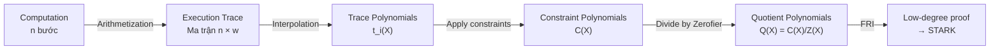
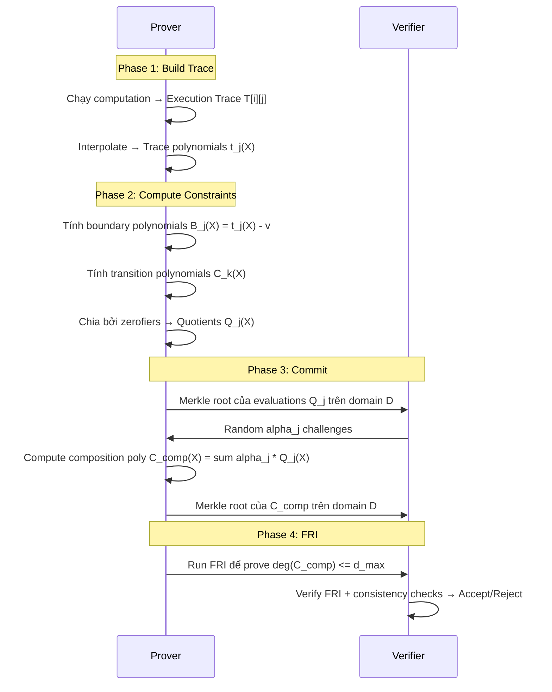

> **Prerequisites**: [[01-mathematical-foundations|L01]] — Polynomial, zerofier, Schwartz-Zippel; [[02-zero-knowledge-proof-systems|L02]] — IOP model, soundness
> **Objectives**:
> - Hiểu Arithmetization là gì và tại sao cần nó
> - Xây dựng Execution Trace từ computation cụ thể (Fibonacci)
> - Phân biệt Boundary Constraints vs Transition Constraints
> - Hiểu AIR = Algebraic Intermediate Representation
> - Chuyển constraints thành Quotient Polynomials
> - Nhận diện bug classes: under/over-constrained AIR

---

## Motivation

Đến đây chúng ta đã có:
- **Toán học** (L01): polynomial, NTT, Reed-Solomon, Schwartz-Zippel
- **Framework** (L02): IOP model, Fiat-Shamir, soundness

Câu hỏi còn lại: **Làm thế nào để encode một computation bất kỳ (Fibonacci, SHA-256, smart contract) thành polynomial?**

Đây chính là bước **Arithmetization** — và nó là nơi phần lớn bug được tìm thấy trong các ZK system.

---

## Từ Computation đến Polynomial: Ý Tưởng Tổng Quan



*Bước quan trọng nhất là từ Execution Trace → Quotient Polynomials. Nếu computation đúng, Q(X) là polynomial nguyên (không có remainder). Nếu sai, phép chia có remainder → FRI phát hiện.*

---

## Execution Trace

> [!definition] Definition 3.1 — Execution Trace (AET)
> **Algebraic Execution Trace (AET)** là một ma trận $T \in \mathbb{F}_p^{T \times w}$ trong đó:
> - **$T$ hàng**: mỗi hàng = state của computation sau một "clock cycle"
> - **$w$ cột** (registers): mỗi cột là một register/variable được track qua toàn bộ computation
>
> Ký hiệu: $T[i][j]$ = giá trị của register $j$ tại step $i$.

### Ví dụ: Fibonacci Sequence

Tính $F_0, F_1, F_2, \ldots, F_{n-1}$ với $F_0 = 1, F_1 = 1, F_i = F_{i-1} + F_{i-2}$:

| Step $i$ | Register $a$ ($F_i$) | Register $b$ ($F_{i+1}$) |
|----------|----------------------|--------------------------|
| 0        | 1                    | 1                        |
| 1        | 1                    | 2                        |
| 2        | 2                    | 3                        |
| 3        | 3                    | 5                        |
| 4        | 5                    | 8                        |
| 5        | 8                    | 13                       |
| 6        | 13                   | 21                       |
| 7        | 21                   | 34                       |

*Execution trace với $w = 2$ registers: cột $a$ chứa $F_i$, cột $b$ chứa $F_{i+1}$.*

---

## AIR — Algebraic Intermediate Representation

AIR là ngôn ngữ mô tả computation bằng hai loại constraints:

> [!definition] Definition 3.2 — Boundary Constraints
> **Boundary constraints** là điều kiện trên giá trị của các register tại các step cụ thể (thường step 0 và step cuối):
>
> $$\{(r, c, v) : T[r][c] = v\}$$
>
> *Ý nghĩa*: "Tại step $r$, register $c$ phải có giá trị $v$."

> [!definition] Definition 3.3 — Transition Constraints
> **Transition constraints** là điều kiện bất biến giữa các hàng liên tiếp của trace — phải đúng ở **mọi step**:
>
> $$C_j(T[i][0], T[i][1], \ldots, T[i][w-1], T[i+1][0], \ldots, T[i+1][w-1]) = 0 \quad \forall i$$

### AIR cho Fibonacci

**Boundary constraints**:
- $T[0][a] = 1$ (tức $F_0 = 1$)
- $T[0][b] = 1$ (tức $F_1 = 1$)

**Transition constraints** (phải đúng tại mọi step $i = 0, \ldots, n-2$):
- $T[i+1][a] = T[i][b]$ (a tiếp theo = b hiện tại)
- $T[i+1][b] = T[i][a] + T[i][b]$ (b tiếp theo = tổng)

Viết lại dưới dạng polynomial phải bằng 0:

$$C_1(a, b, a', b') = a' - b = 0$$
$$C_2(a, b, a', b') = b' - a - b = 0$$

---

## Từ Trace sang Trace Polynomials

Cho evaluation domain $H = \{1, \omega, \omega^2, \ldots, \omega^{n-1}\}$ (subgroup bậc $n$).

> [!definition] Definition 3.4 — Trace Polynomials
> Với mỗi register $j$, **trace polynomial** $t_j(X)$ là polynomial bậc $< n$ sao cho:
>
> $$t_j(\omega^i) = T[i][j] \quad \forall i = 0, 1, \ldots, n-1$$
>
> Tức là $t_j$ interpolate toàn bộ cột $j$ của trace trên domain $H$.

```python
# =============================================================
# AIR Arithmetization — Fibonacci Example
# =============================================================
from sympy import factorint
import random

# ---- Field & Domain Setup ----
p = 2013265921  # BabyBear: p = 15 * 2^27 + 1 (NTT-friendly)

def mod_inv(a, p): return pow(a, p-2, p)

def find_primitive_root(p):
    factors = list(factorint(p-1).keys())
    for g in range(2, p):
        if all(pow(g, (p-1)//q, p) != 1 for q in factors):
            return g
    raise ValueError(f"Generator not found for p={p}")

def get_omega(n, p):
    assert (p-1) % n == 0
    g = find_primitive_root(p)
    return pow(g, (p-1)//n, p)

def poly_eval(coeffs, x, p):
    result = 0
    for c in reversed(coeffs):
        result = (result * x + c) % p
    return result

def lagrange_interpolate(ys, domain, p):
    """Interpolate polynomial from evaluations on domain"""
    n = len(ys)
    assert len(domain) == n
    result = [0] * n
    for i in range(n):
        # Compute L_i: numerator và denominator
        num = [1]
        den = 1
        for j in range(n):
            if i == j: continue
            # num *= (X - domain[j])
            new_num = [0] * (len(num) + 1)
            for k, c in enumerate(num):
                new_num[k+1] = (new_num[k+1] + c) % p
                new_num[k] = (new_num[k] - c * domain[j]) % p
            num = new_num
            den = den * ((domain[i] - domain[j]) % p) % p
        scale = ys[i] * mod_inv(den, p) % p
        while len(result) < len(num):
            result.append(0)
        for k, c in enumerate(num):
            result[k] = (result[k] + scale * c) % p
    return result

# ---- Build Fibonacci Execution Trace ----
n_steps = 8  # trace length (lũy thừa 2 để dùng NTT)
trace_a = [0] * n_steps
trace_b = [0] * n_steps

trace_a[0], trace_b[0] = 1, 1
for i in range(1, n_steps):
    trace_a[i] = trace_b[i-1] % p
    trace_b[i] = (trace_a[i-1] + trace_b[i-1]) % p

print("=== Fibonacci Execution Trace ===")
print(f"{'Step':>4}  {'a (F_i)':>10}  {'b (F_{i+1})':>12}")
for i in range(n_steps):
    print(f"{i:>4}  {trace_a[i]:>10}  {trace_b[i]:>12}")

# ---- Interpolate Trace Polynomials ----
omega = get_omega(n_steps, p)
domain_H = [pow(omega, i, p) for i in range(n_steps)]

t_a = lagrange_interpolate(trace_a, domain_H, p)
t_b = lagrange_interpolate(trace_b, domain_H, p)

print("\n=== Trace Polynomial Sanity Check ===")
for i in range(n_steps):
    assert poly_eval(t_a, domain_H[i], p) == trace_a[i], f"t_a wrong at step {i}"
    assert poly_eval(t_b, domain_H[i], p) == trace_b[i], f"t_b wrong at step {i}"
print("t_a và t_b interpolation: PASS ✅")
```

---

## Boundary Constraints → Boundary Quotients

Boundary constraint $(r, c, v)$ nghĩa là: $t_c(\omega^r) = v$, tức là $t_c(\omega^r) - v = 0$.

> [!definition] Definition 3.5 — Boundary Quotient
> Với boundary constraint tại $x_r = \omega^r$ giá trị $v$, ta tạo:
>
> $$B_c(X) = t_c(X) - v$$
>
> Polynomial $B_c$ có nghiệm tại $x_r$, nên:
>
> $$Q^{(B)}_c(X) = \frac{B_c(X)}{X - x_r} = \frac{t_c(X) - v}{X - \omega^r}$$
>
> **$Q^{(B)}_c$ là polynomial iff constraint đúng** (tức $t_c(\omega^r) = v$).

```python
def poly_sub(a, b, p):
    """a(X) - b(X)"""
    n = max(len(a), len(b))
    result = [0] * n
    for i, c in enumerate(a): result[i] = (result[i] + c) % p
    for i, c in enumerate(b): result[i] = (result[i] - c) % p
    return result

def poly_div_linear(f, root, p):
    """
    Chia polynomial f(X) cho (X - root) bằng synthetic division.
    Trả về (quotient, remainder).
    remainder phải = 0 nếu root là nghiệm của f.
    """
    coeffs = list(f)
    n = len(coeffs)
    quotient = [0] * (n - 1)
    remainder = coeffs[-1]
    for i in range(n-2, -1, -1):
        quotient[i] if i < n-1 else None
        pass
    # Horner method for synthetic division
    q = [0] * (n - 1)
    q[-1] = coeffs[-1]
    for i in range(n-2, 0, -1):
        q[i-1] = (coeffs[i] + root * q[i]) % p
    remainder = (coeffs[0] + root * q[0]) % p
    return q, remainder

# Boundary constraint: t_a(omega^0) = 1 (tức F_0 = 1)
x_r = domain_H[0]  # omega^0 = 1
v = 1

# B(X) = t_a(X) - v  (shift constant term)
B = list(t_a)
B[0] = (B[0] - v) % p

# Verify: B(x_r) = 0
B_val = poly_eval(B, x_r, p)
print(f"\n=== Boundary Constraint Demo ===")
print(f"B(omega^0) = t_a(1) - 1 = {B_val} (phải = 0)")

# Q_B(X) = B(X) / (X - x_r)
Q_B, rem = poly_div_linear(B, x_r, p)
print(f"Remainder khi chia cho (X - omega^0): {rem} (phải = 0)")
assert rem == 0, "Boundary constraint violated!"
print("Boundary quotient Q_B: polynomial hợp lệ ✅")
```

---

## Transition Constraints → Transition Quotients

Đây là phần **quan trọng nhất** của AIR.

> [!definition] Definition 3.6 — Transition Polynomial
> Với transition constraint $C(a, b, a', b') = 0$ (phải đúng tại mọi step), ta evaluate constraint trên trace polynomial:
>
> $$C_{\text{trans}}(X) = C(t_a(X), t_b(X), t_a(\omega \cdot X), t_b(\omega \cdot X))$$
>
> Polynomial $C_{\text{trans}}$ phải **bằng 0 tại mọi điểm** $\omega^i \in H \setminus \{\omega^{n-1}\}$ — tức là tại mọi step ngoại trừ step cuối cùng.

**Transition Zerofier** cho tập $H' = H \setminus \{\omega^{n-1}\}$:

$$Z_{\text{trans}}(X) = \frac{X^n - 1}{X - \omega^{n-1}}$$

Đây là polynomial bậc $n-1$, bằng 0 tại tất cả $\omega^0, \ldots, \omega^{n-2}$ nhưng không bằng 0 tại $\omega^{n-1}$.

> [!definition] Definition 3.7 — Transition Quotient
> $$Q^{(T)}_j(X) = \frac{C_j(t_a(X),\ t_b(X),\ t_a(\omega X),\ t_b(\omega X))}{Z_{\text{trans}}(X)}$$
>
> **$Q^{(T)}_j$ là polynomial iff $C_j$ bằng 0 tại mọi step** — tức là transition constraint được thỏa mãn.

```python
# ---- Transition Quotient Demo ----
# C1(a, b, a', b') = a' - b = 0
# C1_poly(X) = t_a(omega*X) - t_b(X)

def poly_scale(poly, scalar, p):
    """Scale X -> scalar*X in polynomial"""
    result = list(poly)
    for i in range(1, len(result)):
        result[i] = result[i] * pow(scalar, i, p) % p
    return result

# t_a(omega*X): substitute X → omega*X trong t_a
t_a_shifted = poly_scale(t_a, omega, p)  # t_a(omega * X)
t_b_shifted = poly_scale(t_b, omega, p)

# C1_poly = t_a(omega*X) - t_b(X)
C1_poly = poly_sub(t_a_shifted, t_b, p)

# Kiểm tra: C1_poly phải bằng 0 tại mọi omega^i với i = 0..n-2
print("\n=== Transition Constraint Demo ===")
print("C1(X) = t_a(omega*X) - t_b(X)")
violations = 0
for i in range(n_steps - 1):
    val = poly_eval(C1_poly, domain_H[i], p)
    if val != 0:
        violations += 1
        print(f"  C1(omega^{i}) = {val} ≠ 0  ← VIOLATION!")
    else:
        print(f"  C1(omega^{i}) = 0 ✓")

if violations == 0:
    print("C1 bằng 0 tại mọi step 0..n-2: PASS ✅")
else:
    print(f"FAIL: {violations} violations!")

# ---- Transition Zerofier: Z(X) = (X^n - 1) / (X - omega^(n-1)) ----
# Tính bằng synthetic division
last_root = domain_H[-1]  # omega^(n-1)
xn_minus_1 = [p - 1] + [0] * (n_steps - 1) + [1]  # X^n - 1
Z_trans, r_z = poly_div_linear(xn_minus_1, last_root, p)
assert r_z == 0, "Zerofier construction failed"
print(f"\nTransition zerofier Z(X): bậc {len(Z_trans)-1} (phải = {n_steps-1})")

# Verify Z vanishes on H' but not at omega^(n-1)
for i in range(n_steps - 1):
    assert poly_eval(Z_trans, domain_H[i], p) == 0
assert poly_eval(Z_trans, domain_H[-1], p) != 0
print("Z_trans kiểm tra: PASS ✅")
```

---

## Composition Polynomial (ALI Step)

Sau khi có tất cả quotient polynomials, STARK cần kết hợp chúng thành một polynomial duy nhất để FRI kiểm tra.

> [!definition] Definition 3.8 — Composition Polynomial
> Verifier gửi random coefficients $\alpha_0, \alpha_1, \ldots \in \mathbb{F}_p$. Prover tính:
>
> $$C_{\text{comp}}(X) = \sum_j \alpha_j \cdot Q_j(X)$$
>
> Nếu mọi $Q_j$ đều là polynomial bậc thấp (đúng), thì $C_{\text{comp}}$ cũng là polynomial bậc thấp. FRI kiểm tra điều này.

**Degree correction**: Các $Q_j$ có thể có bậc khác nhau. Để FRI hoạt động, chúng cần được "normalize" về cùng bậc tối đa:

$$C_{\text{comp}}(X) = \sum_j \alpha_j \cdot X^{d_{\max} - \deg(Q_j)} \cdot Q_j(X)$$

---

## Bug Classes trong AIR

### Bug 1: Under-constrained AIR

> [!danger] Bug Class: Under-Constrained AIR
> **Vấn đề**: AIR thiếu constraints — prover có thể điền trace với giá trị không hợp lệ mà vẫn pass.
>
> **Ví dụ Fibonacci**: Nếu ta chỉ có constraint $C_1: a' = b$ nhưng quên $C_2: b' = a + b$, prover có thể đặt $b' = 0$ tại mỗi step mà vẫn pass $C_1$.
>
> **Kết quả**: Soundness vi phạm — prover tạo proof giả cho computation sai.
>
> **Cách phát hiện khi audit**: Viết lại tất cả transition constraints, verify từng cột của trace bị ràng buộc hoàn toàn. Kiểm tra "degrees of freedom" còn lại sau constraints.

### Bug 2: Over-constrained AIR

> [!danger] Bug Class: Over-Constrained AIR
> **Vấn đề**: AIR có constraints quá chặt — valid computation bị reject.
>
> **Ví dụ**: Transition zerofier được apply sai (áp dụng cho cả step cuối, không ngoại trừ).
>
> **Kết quả**: Completeness vi phạm — honest prover không tạo được proof.
>
> **Kết quả thực tế**: DoS attack có thể exploit over-constrained AIR để ngăn chain process valid transactions.

### Bug 3: Degree Miscalculation

> [!danger] Bug Class: Wrong Degree Bound cho Quotient
> **Vấn đề**: Degree của $Q_j(X)$ được tính sai, khiến composition polynomial có bậc cao hơn FRI đang prove.
>
> **Kết quả**: FRI "passes" nhưng thực ra không prove điều ta muốn (constraint polynomial không đúng bậc). Soundness lỗ hổng.
>
> **Công thức đúng**: $\deg(Q^{(T)}) = \deg(C_{\text{trans}}) - \deg(Z_{\text{trans}})$
>
> Nếu transition constraint là bậc 2 trên trace polynomials bậc $n-1$: $\deg(C_{\text{trans}}) = 2(n-1)$, $\deg(Z_{\text{trans}}) = n-1$, nên $\deg(Q^{(T)}) = n-1$.

---

## Full AIR Pipeline (Prover View)



---

## Implementation: Kiểm tra Under-Constrained AIR

```python
def check_air_completeness(trace_a, trace_b, n_steps, omega, p, verbose=True):
    """
    Kiểm tra AIR completeness: tất cả transition constraints phải pass
    cho honest trace.
    Trả về (all_pass, details)
    """
    domain = [pow(omega, i, p) for i in range(n_steps)]
    results = {}

    # C1: a'[i] == b[i]  (a tiếp theo = b hiện tại)
    c1_violations = []
    for i in range(n_steps - 1):
        if trace_a[i+1] != trace_b[i]:
            c1_violations.append(i)
    results["C1 (a'=b)"] = c1_violations

    # C2: b'[i] == a[i] + b[i]  (b tiếp theo = tổng)
    c2_violations = []
    for i in range(n_steps - 1):
        expected = (trace_a[i] + trace_b[i]) % p
        if trace_b[i+1] != expected:
            c2_violations.append(i)
    results["C2 (b'=a+b)"] = c2_violations

    # Boundary: a[0] == 1
    bc_violations = []
    if trace_a[0] != 1: bc_violations.append("a[0] != 1")
    if trace_b[0] != 1: bc_violations.append("b[0] != 1")
    results["Boundary"] = bc_violations

    all_pass = all(len(v) == 0 for v in results.values())
    if verbose:
        for name, violations in results.items():
            status = "✅ PASS" if not violations else f"❌ FAIL ({len(violations)} violations)"
            print(f"  {name}: {status}")
    return all_pass, results

print("\n=== AIR Completeness Check (Honest Trace) ===")
ok, _ = check_air_completeness(trace_a, trace_b, n_steps, omega, p)
print(f"AIR fully satisfied: {ok}")

# --- Demo: Under-constrained — trace với C2 bị vi phạm ---
print("\n=== Under-constrained: malicious trace (b' = 0 luôn) ===")
bad_trace_b = [trace_b[0]] + [0] * (n_steps - 1)  # b' = 0 từ step 1
ok_bad, _ = check_air_completeness(trace_a, bad_trace_b, n_steps, omega, p)
print(f"AIR fully satisfied: {ok_bad} (phải False — malicious trace bị detect)")

# --- Demo: Nếu chỉ check C1 (under-constrained AIR) ---
print("\n=== BUG: Nếu chỉ enforce C1 (quên C2) ===")
c1_only_pass = all(trace_a[i+1] == bad_trace_b[i] for i in range(n_steps-1))
print(f"Malicious trace pass C1 only: {c1_only_pass}")
print("→ Under-constrained AIR: prover có thể forge proof! 🚨")
```

---

## Key Takeaways

- **Arithmetization = computation → polynomial**. Đây là bước đầu tiên trong STARK pipeline.
- **Execution Trace** $T[i][j]$: ma trận state của computation. $n$ hàng = $n$ clock cycles. $w$ cột = $w$ registers.
- **AIR**: Algebraic Intermediate Representation = Boundary Constraints + Transition Constraints.
- **Trace Polynomials** $t_j(X)$: interpolate mỗi cột của trace trên roots-of-unity domain.
- **Quotient Polynomials** $Q_j = C_j / Z_j$: polynomial iff constraint đúng. FRI prove low-degree của chúng.
- **Zerofier** $Z_{\text{trans}}(X) = (X^n - 1)/(X - \omega^{n-1})$: vanish trên mọi step ngoại trừ bước cuối.
- **Bug Classes**: Under-constrained (soundness lỗ hổng), Over-constrained (completeness bị phá), Degree miscalculation (FRI prove sai điều kiện).

---

## Self-Check

1. Fibonacci AIR có $w = 2$ registers và $n = 8$ steps. Trace polynomial $t_a$ có bậc bao nhiêu? Tại sao?
2. Tại sao transition zerofier là $(X^n - 1) / (X - \omega^{n-1})$ chứ không phải $X^n - 1$? Bước $\omega^{n-1}$ (step cuối) cần được loại trừ vì sao?
3. Nếu transition constraint có bậc 3 trên trace polynomials bậc $n-1 = 7$, thì quotient polynomial $Q^{(T)}$ có bậc bao nhiêu?
4. *(Bug Bounty)* Đọc một AIR implementation: làm sao bạn kiểm tra nhanh xem AIR có bị under-constrained không? Hãy mô tả method cụ thể.
5. *(Bug Bounty)* Trong composition polynomial $C_{\text{comp}} = \sum \alpha_j Q_j$, nếu prover bỏ qua degree correction ($X^{d_{max}-\deg(Q_j)}$), soundness bị ảnh hưởng như thế nào?

---

## References

- aszepieniec — *Anatomy of a STARK, Part 4: The STARK IOP*: https://aszepieniec.github.io/stark-anatomy/stark.html
- StarkWare — *Arithmetization I* (Medium): https://medium.com/starkware/arithmetization-i-15c046390862
- LambdaClass — *Arithmetization Schemes for ZK-SNARKs*: https://blog.lambdaclass.com/arithmetization-schemes-for-zk-snarks/
- Three Sigma — *Arithmetization in STARKs, an Intro to AIR*: https://threesigma.xyz/blog/zk/arithmetization-starks-algebraic-intermediate-representation
- Facebook/winterfell — AIR trait documentation: https://github.com/facebook/winterfell
