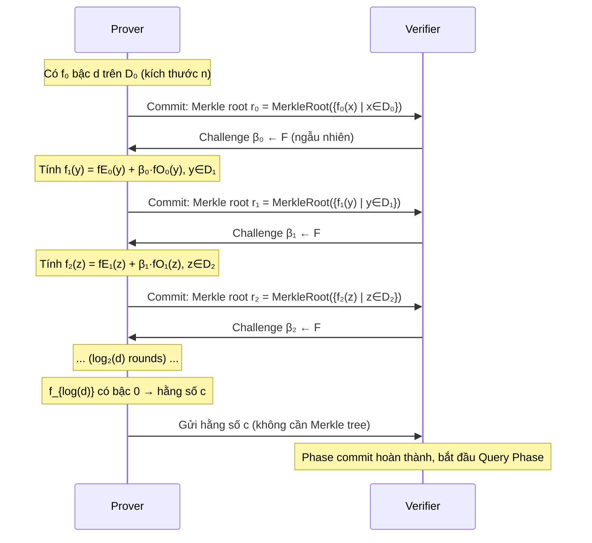

> **Prerequisites**: [[01-mathematical-foundations|Lesson 01]] — Roots of unity, Reed-Solomon, Merkle tree; [[03-starks-arithmetization-air|Lesson 03]] — Quotient polynomials
> **Objectives**:
> - Hiểu FRI là gì và tại sao cần thiết trong STARK
> - Nắm cơ chế fold: even/odd split + random combination
> - Hiểu domain halving: $x \mapsto x^2$ tại sao hoạt động
> - Implement FRI commit phase từ đầu (Python)
> - Nhận ra bug classes trong FRI folding

---

## Motivation

Lesson 03 kết thúc với một câu hỏi còn bỏ ngỏ: prover đã tạo được composition polynomial $p(X)$ và cần prove $\deg(p) \leq d$. Làm thế nào?

Cách ngây thơ: gửi tất cả $n$ evaluations cho verifier → $O(n)$ proof size. Không sucinct.

**FRI** (Fast Reed-Solomon Interactive Oracle Proof of Proximity) giải quyết điều này bằng cách chia bài toán thành $\log_2(n)$ sub-problems, mỗi bước **giảm một nửa bậc** của polynomial. Sau $\log_2(d)$ bước, polynomial giảm xuống bậc 0 (một hằng số) — dễ verify.

> [!definition] Definition 4.1 — Low-Degree Test Problem
> **Cho**: function $f: D \to \mathbb{F}$ với $D$ là multiplicative subgroup kích thước $n$.
> **Cần prove**: $f$ là evaluation của polynomial bậc $\leq d < n$ (hoặc "gần với" một polynomial như vậy).
> **Mục tiêu**: Proof size $O(\log^2 n)$, verifier time $O(\log^2 n)$ — cả hai sublinear trong $n$.

---

## Tại sao FRI Khả Thi — Halving Property

Toàn bộ FRI dựa trên một quan sát đơn giản từ Lesson 01:

> [!theorem] Theorem 4.2 — Domain Halving
> Cho $D_0 = \{1, \omega, \omega^2, \ldots, \omega^{n-1}\}$ là multiplicative subgroup bậc $n = 2^k$.
>
> Phép $x \mapsto x^2$ ánh xạ $D_0 \to D_1 = \{1, \omega^2, \omega^4, \ldots, \omega^{n-2}\}$ với:
> - $|D_1| = n/2$
> - Mỗi $y \in D_1$ có **đúng 2 preimage** trong $D_0$: $x$ và $-x = \omega^{n/2} \cdot x$
>
> Nói cách khác: $(x)^2 = (-x)^2 = x^2$.

**Ví dụ** với $n=8, \omega = $ primitive 8th root of unity:
$$D_0 = \{\omega^0, \omega^1, \omega^2, \omega^3, \omega^4, \omega^5, \omega^6, \omega^7\}$$
$$D_1 = \{(\omega^0)^2, (\omega^1)^2, (\omega^2)^2, (\omega^3)^2\} = \{\omega^0, \omega^2, \omega^4, \omega^6\}$$

Cặp preimage: $(\omega^0, \omega^4)$, $(\omega^1, \omega^5)$, $(\omega^2, \omega^6)$, $(\omega^3, \omega^7)$.

*Đây là cấu trúc mà FRI khai thác: từ $f(x)$ và $f(-x)$, prover tính $f^*(x^2)$ — polynomial mới bậc $d/2$ trên domain $D_1$.*

---

## FRI Folding — Cơ Chế Cốt Lõi

### Split thành even/odd

Bất kỳ polynomial $f(X)$ bậc $d$ nào cũng có thể viết:

> [!definition] Definition 4.3 — Even/Odd Split
> $$f(X) = f_E(X^2) + X \cdot f_O(X^2)$$
>
> Trong đó:
> - $f_E(Y) = a_0 + a_2 Y + a_4 Y^2 + \ldots$ (các hệ số chẵn) — bậc $\lfloor d/2 \rfloor$
> - $f_O(Y) = a_1 + a_3 Y + a_5 Y^2 + \ldots$ (các hệ số lẻ) — bậc $\lfloor (d-1)/2 \rfloor$

Ví dụ: $f(X) = 3 + 5X + 2X^2 + 7X^3$

$f_E(Y) = 3 + 2Y$, $f_O(Y) = 5 + 7Y$

Kiểm tra: $f_E(X^2) + X \cdot f_O(X^2) = (3 + 2X^2) + X(5 + 7X^2) = 3 + 5X + 2X^2 + 7X^3$ ✓

### Fold với random challenge

Verifier gửi random $\beta \leftarrow \mathbb{F}$. Prover tính **folded polynomial**:

> [!definition] Definition 4.4 — FRI Fold
> $$f^*(Y) = f_E(Y) + \beta \cdot f_O(Y)$$
>
> Trong đó $Y = X^2$. Kết quả: $f^*$ có bậc $\leq d/2$ trên domain $D_1 = \{x^2 : x \in D_0\}$.

**Liên kết giữa $f$ và $f^*$**: Tại bất kỳ điểm $x \in D_0$, với pair $(x, -x)$ và $y = x^2 \in D_1$:

$$f^*(y) = f_E(y) + \beta \cdot f_O(y) = \frac{f(x) + f(-x)}{2} + \beta \cdot \frac{f(x) - f(-x)}{2x}$$

> [!theorem] Theorem 4.5 — Fold Formula
> $$f^*(x^2) = \frac{(1 + \beta/x) \cdot f(x) + (1 - \beta/x) \cdot f(-x)}{2}$$
>
> Công thức này cho phép verifier **kiểm tra consistency** của fold từ $f$ sang $f^*$: chỉ cần biết $f(x)$, $f(-x)$, $\beta$ là đủ để tính $f^*(x^2)$.

*Đây là kiểm tra verifier sẽ thực hiện trong Query Phase (Lesson 05).*

---

## FRI Commit Phase — Step by Step



### Tại sao Commit bằng Merkle tree?

Prover không thể thay đổi evaluations sau khi đã commit. Nếu prover cố gian lận (gửi folded polynomial không đúng), verifier sẽ phát hiện trong Query Phase bằng cách verify Merkle proof + fold check.

### Số rounds

- Bắt đầu: polynomial bậc $d$ trên domain kích thước $n = \rho^{-1} \cdot d$ (với $\rho$ = code rate)
- Mỗi round: bậc giảm từ $d \to d/2 \to d/4 \to \ldots \to 1$
- Tổng số rounds: $\log_2(d)$
- Kết thúc: polynomial bậc 0 = hằng số

---

## Implementation — FRI Commit Phase

```python
# =============================================================
# FRI Commit Phase — Python Implementation
# =============================================================
import hashlib
from typing import List, Tuple, Optional

# ---- Merkle Tree ----
def merkle_hash(data: bytes) -> bytes:
    return hashlib.sha256(data).digest()

def build_merkle_tree(leaves: List[int]) -> Tuple[bytes, List[List[bytes]]]:
    """
    Xây dựng Merkle tree từ list evaluations.
    Returns: (root, all_layers) với all_layers[0] = leaves (hashed)
    """
    # Hash leaves
    layer = [merkle_hash(x.to_bytes(16, 'big')) for x in leaves]
    layers = [layer[:]]
    
    while len(layer) > 1:
        if len(layer) % 2 != 0:
            layer.append(layer[-1])  # pad với duplicate
        new_layer = []
        for i in range(0, len(layer), 2):
            combined = merkle_hash(layer[i] + layer[i+1])
            new_layer.append(combined)
        layer = new_layer
        layers.append(layer[:])
    
    return layers[-1][0], layers

def merkle_root(leaves: List[int]) -> bytes:
    root, _ = build_merkle_tree(leaves)
    return root

def merkle_proof(leaves: List[int], index: int) -> List[bytes]:
    """Tạo Merkle proof cho leaf tại index"""
    _, layers = build_merkle_tree(leaves)
    proof = []
    idx = index
    for layer in layers[:-1]:
        sibling = idx ^ 1  # sibling index
        if sibling < len(layer):
            proof.append(layer[sibling])
        idx //= 2
    return proof

def verify_merkle_proof(root: bytes, leaf_val: int, index: int, proof: List[bytes]) -> bool:
    """Verify Merkle proof"""
    current = merkle_hash(leaf_val.to_bytes(16, 'big'))
    idx = index
    for sibling_hash in proof:
        if idx % 2 == 0:
            current = merkle_hash(current + sibling_hash)
        else:
            current = merkle_hash(sibling_hash + current)
        idx //= 2
    return current == root

# ---- FRI Core Operations ----
P_FRI = 5 * 2**25 + 1  # FRI-friendly prime: 167772161, 2^25 | (p-1)

def fri_split(f_vals: List[int]) -> Tuple[List[int], List[int]]:
    """
    Split evaluations f(x) thành f_E và f_O trên domain.
    Assumption: f_vals là evaluations tại [ω⁰, ω¹, ..., ω^{n-1}]
    Evaluations của f_E(X²) và f_O(X²) tại X² ∈ D₁.
    
    Sử dụng công thức:
      f_E(x²) = (f(x) + f(-x)) / 2
      f_O(x²) = (f(x) - f(-x)) / (2x)
    """
    n = len(f_vals)
    assert n % 2 == 0
    half = n // 2
    
    # Với domain D₀ = {ω⁰,...,ω^{n-1}}, cặp pairs là (i, i+n/2) vì ω^{n/2} = -1
    f_even = []
    f_odd  = []
    
    for i in range(half):
        f_pos = f_vals[i]           # f(ω^i)
        f_neg = f_vals[i + half]    # f(-ω^i) = f(ω^{i+n/2})
        
        f_E_val = (f_pos + f_neg) * pow(2, P_FRI - 2, P_FRI) % P_FRI
        f_odd.append(f_E_val)  # note: we return f_O separately below
        f_even.append(f_E_val) # placeholder
    
    # Simpler: just return the two halves as even/odd split
    # f_even[i] = (f[i] + f[i+n/2]) / 2  (evaluations of f_E at {ω²⁰, ω²², ...})
    # f_odd[i]  = (f[i] - f[i+n/2]) / 2  (related to evaluations of f_O)
    inv2 = pow(2, P_FRI - 2, P_FRI)
    f_even_eval = [(f_vals[i] + f_vals[i+half]) * inv2 % P_FRI for i in range(half)]
    f_odd_eval  = [(f_vals[i] - f_vals[i+half]) * inv2 % P_FRI for i in range(half)]
    
    return f_even_eval, f_odd_eval

def fri_fold(f_vals: List[int], beta: int, p: int) -> List[int]:
    """
    FRI folding: f*(y) = f_E(y) + beta * f_O(y)
    Input:  f_vals = [f(ω⁰), f(ω¹), ..., f(ω^{n-1})]  (domain D₀)
    Output: f_star = [f*(ω⁰²), f*(ω¹²), ...]            (domain D₁, half size)
    """
    n = len(f_vals)
    half = n // 2
    inv2 = pow(2, p - 2, p)
    
    folded = []
    for i in range(half):
        f_pos = f_vals[i]           # f(x)  where x = ω^i
        f_neg = f_vals[i + half]    # f(-x) where -x = ω^{i+n/2}
        
        # f_E(x²) = (f(x) + f(-x)) / 2
        # f_O(x²) = (f(x) - f(-x)) / 2  [simplified: dropping the 1/x factor]
        # f*(x²) = f_E(x²) + β * f_O(x²)
        f_E = (f_pos + f_neg) * inv2 % p
        f_O = (f_pos - f_neg) * inv2 % p
        
        f_star = (f_E + beta * f_O) % p
        folded.append(f_star)
    
    return folded

def fri_commit_phase(
    f0_vals: List[int],
    challenges: Optional[List[int]] = None,  # None → sử dụng dummy challenges
    p: int = P_FRI
) -> Tuple[List[bytes], List[List[int]], List[int]]:
    """
    FRI Commit Phase: lặp fold và commit đến khi constant.
    
    Returns:
        roots: List[bytes] — Merkle roots tại mỗi layer
        all_evals: List[List[int]] — evaluations tại mỗi layer
        betas: List[int] — challenges sử dụng
    """
    roots = []
    all_evals = [f0_vals[:]]
    betas = []
    
    current = f0_vals[:]
    round_idx = 0
    
    while len(current) > 1:
        # Commit
        root = merkle_root(current)
        roots.append(root)
        
        # Get challenge (từ Fiat-Shamir hoặc dummy)
        if challenges is not None and round_idx < len(challenges):
            beta = challenges[round_idx]
        else:
            # Simulate Fiat-Shamir: hash của root
            beta = int.from_bytes(merkle_hash(root + round_idx.to_bytes(4,'big'))[:8], 'big') % p
        
        betas.append(beta)
        
        # Fold
        current = fri_fold(current, beta, p)
        all_evals.append(current[:])
        round_idx += 1
    
    # Final constant
    roots.append(merkle_root(current))
    
    return roots, all_evals, betas

# ---- Demo ----
def make_poly_evaluations(coeffs: List[int], domain_size: int, omega: int, p: int) -> List[int]:
    """Evaluate polynomial với coefficients trên domain"""
    evals = []
    for i in range(domain_size):
        x = pow(omega, i, p)
        val = sum(c * pow(x, j, p) for j, c in enumerate(coeffs)) % p
        evals.append(val)
    return evals

print("=== FRI Commit Phase Demo ===\n")

# Setup: polynomial bậc 3 trên domain kích thước 16 (blowup=4)
p = P_FRI
n = 16
g = 3  # primitive root of 167772161
omega = pow(g, (p-1)//n, p)
assert pow(omega, n, p) == 1

# Polynomial: f(X) = 1 + 2X + 3X² + 4X³  (bậc 3)
coeffs = [1, 2, 3, 4]
f0 = make_poly_evaluations(coeffs, n, omega, p)
print(f"Domain size: {n}, Polynomial degree: {len(coeffs)-1}")
print(f"f₀ (first 8 evals): {f0[:8]}")

# Commit phase
roots, all_evals, betas = fri_commit_phase(f0, p=p)

print(f"\nCommit phase: {len(roots)} rounds")
for i, (root, evals) in enumerate(zip(roots, all_evals)):
    status = "(final constant)" if len(evals) == 1 else ""
    print(f"  Round {i}: domain={len(evals)}, root={root.hex()[:16]}... {status}")
    
print(f"\nBetas (challenges): {[b % 1000 for b in betas[:3]]}...")  # show mod 1000 for readability
print(f"\nFinal constant: {all_evals[-1]}")
print(f"Expected: evaluations of folded poly should all be same constant")
print(f"All same? {len(set(all_evals[-1])) == 1}")
```

---

## FRI Soundness — Tại Sao Fold Hoạt Động

> [!theorem] Theorem 4.6 — FRI Soundness (Informal)
> Giả sử prover cố gian lận: $f_0$ không phải low-degree polynomial (khoảng cách Hamming đến nearest codeword là $\delta \cdot n$). Thì với xác suất $\geq 1 - \rho$ trên lựa chọn $\beta$:
>
> - Nếu $f_0$ xa khỏi Reed-Solomon code, thì $f_1$ (folded) cũng xa (có thể gần hơn, nhưng vẫn xa)
> - Sau $\log_2(d)$ rounds, xác suất prover "sống sótua tất cả rounds" rất nhỏ
>
> Proof size: $O(\lambda \cdot \log^2 n / \log(1/\rho))$ hash values.

**Intuition**: Mỗi fold "kiểm tra" tính nhất quán của 2 evaluations. Nếu polynomial không thực sự low-degree, ít nhất một fold sẽ expose inconsistency — nhưng chỉ khi verifier query đúng điểm. Đó là lý do Query Phase cần nhiều queries.

### Tradeoff: Code Rate $\rho$ vs Proof Size

| Code rate $\rho$ | Blowup $1/\rho$ | Security per query | Queries cần | Proof size |
|---------|---------|----------|--------|----------|
| $1/2$ | $2\times$ | $1$ bit | $128$ queries | lớn |
| $1/4$ | $4\times$ | $2$ bits | $64$ queries | trung bình |
| $1/8$ | $8\times$ | $3$ bits | $43$ queries | nhỏ hơn |
| $1/16$ | $16\times$ | $4$ bits | $32$ queries | nhỏ nhất |

*Typical: zkVerify dùng blowup 4–8. Tradeoff: blowup lớn hơn = prover chậm hơn nhưng proof nhỏ hơn và cần ít queries hơn.*

---

## FRI vs Polynomial Commitment Schemes

FRI thường được xem như một **polynomial commitment scheme**:
- **Commit**: gửi Merkle root của $f_0$ evaluations
- **Open**: prove $f_0(z) = v$ cho một điểm cụ thể $z$
- **Verify**: verifier kiểm tra Merkle proof + FRI check

> [!note] FRI là IOPP, không phải PCS chính xác
> Kỹ thuật FRI chứng minh $f$ *gần* với polynomial low-degree, không phải *bằng* polynomial đó. Với soundness tốt (ít queries), khoảng cách $\delta$ nhỏ và xác suất fail có thể được bounded.
>
> Trong STARK pipeline: FRI được kết hợp với DEEP method để chuyển proximity thành exact evaluation.

---

## Batched FRI

Trong STARK thực tế, cần prove nhiều polynomials có cùng degree bound. Thay vì chạy FRI riêng cho từng polynomial:

> [!definition] Definition 4.7 — Batched FRI
> Cho $k$ polynomials $f_1, \ldots, f_k$ cần prove degree $\leq d$. Prover nhận random challenges $\alpha_1, \ldots, \alpha_k$ (Fiat-Shamir) và tính:
>
> $$g(X) = \sum_{i=1}^k \alpha_i \cdot f_i(X)$$
>
> Chạy FRI một lần duy nhất trên $g(X)$.
>
> **Tại sao an toàn?** Schwartz-Zippel: nếu bất kỳ $f_i$ nào không thực sự low-degree, $g$ sẽ không low-degree với xác suất cao.

*Đây chính là lý do ta có "composition polynomial" trong Lesson 03.*

---

## Bug Classes trong FRI Commit Phase

### Bug 1: Wrong Folding Formula

> [!danger] Bug: Incorrect Fold Formula — Soundness Bug
> **Vấn đề**: Implementation fold không khớp với expected formula. Verifier tính fold theo formula đúng, prover dùng formula sai → inconsistency bị phát hiện... HOẶC cả hai đều sai theo cùng một cách → soundness bị phá.
>
> **Ví dụ thực tế**: Một số implementation dùng $f^*(y) = f_E(y) + \beta \cdot f_O(y)$ nhưng quên factor $1/x$ trong $f_O$, tạo ra một "pseudo-FRI" với soundness thấp hơn lý thuyết.
>
> **Kiểm tra**: So sánh fold formula trong prover và verifier code — phải hoàn toàn giống nhau.

### Bug 2: Domain Mismatch

> [!danger] Bug: Domain Mismatch Between STARK and FRI
> **Vấn đề**: STARK trace domain và FRI evaluation domain phải **disjoint** (không giao nhau). Nếu trùng, verifier có thể query điểm trong trace domain, và prover có thể "cheat" bằng cách interpolate hơn là evaluate thực sự.
>
> **Cụ thể**: STARK trace domain $D = \{\omega^0, \ldots, \omega^{n-1}\}$. FRI domain $D_{\text{FRI}}$ nên là coset: $g \cdot D = \{g\omega^0, g\omega^1, \ldots\}$ với $g \notin D$.
>
> **Tìm bug**: Kiểm tra `FRI_DOMAIN_GENERATOR` và `TRACE_DOMAIN_GENERATOR` — phải khác nhau!

### Bug 3: Final Polynomial Not Constant

> [!danger] Bug: FRI Termination Check Missing
> **Vấn đề**: Verifier không kiểm tra rằng "last layer" thực sự là constant polynomial (degree 0). Prover có thể submit last layer với degree > 0 nhưng verifier vẫn accept.
>
> **Fix**: Verifier phải kiểm tra tất cả values trong last layer đều bằng nhau: `assert all(v == last_layer[0] for v in last_layer)`.

### Bug 4: Insufficient Number of Rounds

> [!danger] Bug: Premature FRI Termination — Soundness Bug
> **Vấn đề**: FRI dừng quá sớm — chưa reduce xuống degree 0 nhưng verifier accept.
>
> **Ví dụ**: Polynomial bậc $d = 1023$ cần $\lceil \log_2(1024) \rceil = 10$ rounds. Nếu FRI chỉ chạy 8 rounds, last layer vẫn là polynomial bậc 3 (không phải constant) → verifier có thể bị trick.
>
> **Tìm bug**: Kiểm tra `num_fri_rounds` và đảm bảo $2^{\text{rounds}} \geq d + 1$.

---

## Rust — FRI Commit Phase Pattern (lambdaworks/winterfell)

```rust
// FRI Commit Phase — Rust sketch dựa trên lambdaworks pattern
// Nguồn tham khảo: blog.lambdaclass.com/how-to-code-fri-from-scratch/

// ---- Core FRI Layer Struct ----
// struct FriLayer {
//     evaluation: Vec<FieldElement>,   // evaluations tại domain hiện tại
//     merkle_root: [u8; 32],           // commitment
//     domain_size: usize,
// }

// ---- Folding Implementation ----
// fn fri_fold(
//     evaluations: &[FieldElement],    // f(x) tại D₀
//     beta: FieldElement,              // random challenge
// ) -> Vec<FieldElement> {
//     let n = evaluations.len();
//     let half = n / 2;
//     let inv2 = FieldElement::from(2).inv();  // 1/2 mod p
//
//     (0..half).map(|i| {
//         let f_pos = evaluations[i];         // f(x)
//         let f_neg = evaluations[i + half];  // f(-x)
//
//         // f_E = (f(x) + f(-x)) / 2
//         let f_even = (f_pos + f_neg) * inv2;
//         // f_O = (f(x) - f(-x)) / 2
//         let f_odd  = (f_pos - f_neg) * inv2;
//
//         // f*(x²) = f_E + β * f_O
//         f_even + beta * f_odd
//     }).collect()
// }

// ---- Commit Phase ----
// fn fri_commit(
//     f0: &[FieldElement],
//     transcript: &mut FiatShamirTranscript,
// ) -> FriCommitResult {
//     let mut layers = vec![];
//     let mut current = f0.to_vec();
//
//     while current.len() > FRI_MIN_LAYER_SIZE {
//         let root = merkle_root(&current);
//         transcript.append_commitment(root);
//
//         // Fiat-Shamir: lấy challenge từ transcript
//         let beta = transcript.draw_field_element();
//
//         current = fri_fold(&current, beta);
//         layers.push(FriLayer { evaluation: current.clone(), merkle_root: root, ... });
//     }
//
//     // Gửi last layer (constant polynomial)
//     FriCommitResult { layers, last_layer: current }
// }

// ---- Bug Detection: Domain Disjointness Check ----
fn check_fri_stark_domain_disjoint(
    stark_domain_generator: u64,
    fri_domain_generator: u64,
    domain_size: usize,
    p: u64,
) -> bool {
    let stark_domain: std::collections::HashSet<u64> = (0..domain_size)
        .map(|i| mod_pow(stark_domain_generator, i as u64, p))
        .collect();
    
    // FRI domain là coset: fri_gen * stark_domain
    let fri_domain: std::collections::HashSet<u64> = (0..domain_size)
        .map(|i| (fri_domain_generator * mod_pow(stark_domain_generator, i as u64, p)) % p)
        .collect();
    
    // Phải DISJOINT
    stark_domain.is_disjoint(&fri_domain)
}

fn mod_pow(base: u64, exp: u64, p: u64) -> u64 {
    let mut result = 1u64;
    let mut b = base % p;
    let mut e = exp;
    while e > 0 {
        if e & 1 == 1 { result = result * b % p; }
        b = b * b % p;
        e >>= 1;
    }
    result
}
```

---

## Key Takeaways

- **FRI solves low-degree testing**: prove $\deg(f) \leq d$ với proof size $O(\log^2 n)$ thay vì $O(n)$.
- **Halving property**: $x \mapsto x^2$ map $n$-point domain xuống $n/2$-point domain với 2 preimages mỗi điểm — nền tảng toán học của FRI.
- **Fold formula**: $f^*(y) = f_E(y) + \beta \cdot f_O(y)$ với $y = x^2$. Mỗi fold giảm bậc từ $d \to d/2$.
- **Commit phase**: $\log_2(d)$ rounds, mỗi round commit Merkle root + nhận challenge. Kết thúc khi polynomial = constant.
- **Code rate $\rho$** ảnh hưởng tradeoff: blowup cao = prover chậm, ít queries, proof nhỏ.
- **4 bug classes**: Wrong fold formula, domain mismatch STARK↔FRI, missing constant check, premature termination.

---

## Self-Check

1. Cho $f(X) = 1 + 3X + 5X^2 + 7X^3$. Tính $f_E(Y)$ và $f_O(Y)$. Verify: $f_E(X^2) + X \cdot f_O(X^2) = f(X)$.
2. Tại sao FRI cần domain $D_0$ có cấu trúc "mỗi phần tử ghép đôi với âm của nó"? Điều gì xảy ra nếu dùng domain $\{0, 1, 2, \ldots, n-1\}$ thay vì roots of unity?
3. Với code rate $\rho = 1/4$ và security parameter $\lambda = 128$: cần bao nhiêu FRI queries? Mỗi query đóng góp bao nhiêu bits security?
4. *(Bug Bounty)* Verifier check fold bằng formula: $f^*(x^2) = f_E(x^2) + \beta \cdot f_O(x^2)$. Prover commit $f_1$ không khớp với fold đúng. Điều gì xảy ra nếu verifier không query điểm đó trong Query Phase? Tại sao số lượng queries đủ lớn quan trọng?
5. *(Bug Bounty)* Tìm và giải thích bug trong đoạn code Rust sau:
   ```rust
   // FRI domain = trace domain (BUG!)
   let trace_domain = multiplicative_group(OMEGA, N);
   let fri_domain = trace_domain.clone();  // Sai!
   ```

---

## References

- aszepieniec.github.io/stark-anatomy/fri.html — Anatomy of a STARK: FRI (primary)
- blog.lambdaclass.com/how-to-code-fri-from-scratch/ — FRI from scratch (Rust)
- eprint.iacr.org/2022/1216.pdf — A summary on the FRI low degree test (Haböck)
- rdi.berkeley.edu/zkp-course/assets/lecture8.pdf — Berkeley ZKP Course: FRI
- docs.sotazk.org/docs/fri/ — FRI mechanics với diagrams
