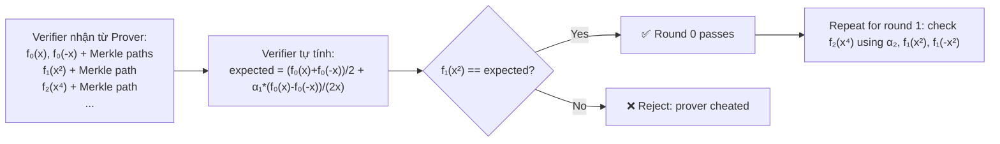
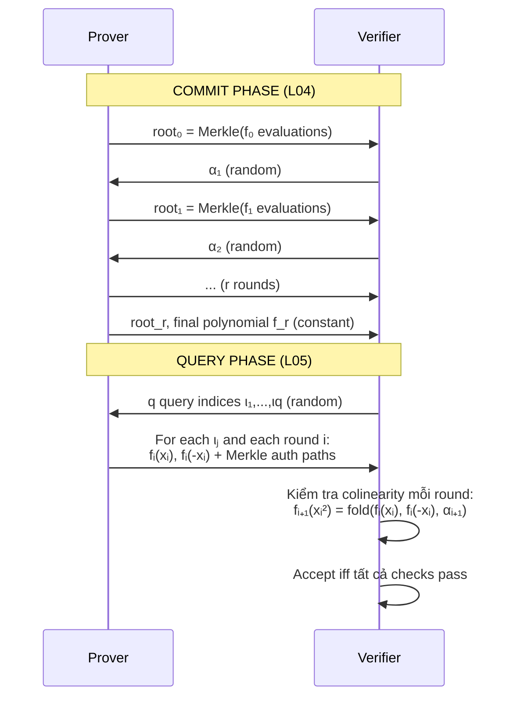

> **Prerequisites**: [[04-fri-commit-fold|L04]] — FRI commit phase, folding, Merkle trees
> **Objectives**:
> - Hiểu query phase: verifier spot-check consistency
> - Nắm colinearity check và tại sao nó đủ để verify folding
> - Tính soundness error tổng thể của FRI
> - Hiểu DEEP-FRI và batched FRI query
> - Nhận diện attack vectors trong query phase

---

## Nhắc Lại: Sau Commit Phase

Sau commit phase (L04), ta có:
- **$r+1$ Merkle roots** $\text{root}_0, \ldots, \text{root}_r$
- **Challenges** $\alpha_1, \ldots, \alpha_r$ (Fiat-Shamir từ roots)
- **Final polynomial** $f_r$ (constant hoặc rất low-degree)

Verifier tin rằng prover đã fold đúng, nhưng **chưa verify**. Query phase là nơi verifier **spot-check** một số random positions để đảm bảo prover không gian lận.

---

## Query Phase: Cơ Chế

> [!definition] Definition 5.1 — FRI Query
> Verifier chọn một random index $\iota \in \{0, \ldots, n/2 - 1\}$ và yêu cầu prover **mở** (decommit) các giá trị tương ứng trong **mọi layer**:
>
> - Layer 0: $f_0(x_\iota)$ và $f_0(-x_\iota)$ (hai tiền ảnh trong D₀)
> - Layer 1: $f_1(x_\iota^2)$ (image trong D₁)
> - Layer 2: $f_2(x_\iota^4)$ (image trong D₂)
> - ...
> - Layer r: $f_r(x_\iota^{2^r})$
>
> Kèm theo: Merkle authentication paths cho mỗi giá trị.

---

## Colinearity Check

Đây là phép kiểm tra cốt lõi: verifier **tự tính** $f_1(x^2)$ từ $f_0(x)$, $f_0(-x)$, và challenge $\alpha_1$, rồi so sánh với giá trị prover cung cấp.

> [!definition] Definition 5.2 — Colinearity Check
> Với query index $\iota$, verifier kiểm tra:
>
> $$f_{i+1}(x^2) \stackrel{?}{=} \frac{f_i(x) + f_i(-x)}{2} + \alpha_{i+1} \cdot \frac{f_i(x) - f_i(-x)}{2x}$$
>
> tại mỗi layer $i = 0, 1, \ldots, r-1$.

**Tại sao gọi là "colinearity"?** Ba điểm $(x, f_0(x))$, $(-x, f_0(-x))$, và $(x^2, f_1(x^2))$ phải nằm trên một đường thẳng (linear function) với đúng slope được xác định bởi $\alpha$.



---

## Full Query Phase Implementation

```python
# =============================================================
# FRI Query Phase — Python Implementation
# (Continues từ L04 với fri_commit kết quả)
# =============================================================
import hashlib
from sympy import factorint

p = 2013265921  # BabyBear

def mod_inv(a, p): return pow(a, p-2, p)

def get_omega(n, p):
    factors = list(factorint(p-1).keys())
    for g in range(2, p):
        if all(pow(g, (p-1)//q, p) != 1 for q in factors):
            return pow(g, (p-1)//n, p)

def poly_eval(coeffs, x, p):
    result = 0
    for c in reversed(coeffs):
        result = (result * x + c) % p
    return result

def merkle_hash(data: bytes) -> bytes:
    return hashlib.sha256(data).digest()

def build_merkle_tree(leaves):
    layer = [merkle_hash(v.to_bytes(8, 'big')) for v in leaves]
    tree = [layer]
    while len(layer) > 1:
        layer = [merkle_hash(layer[i] + layer[i+1])
                 for i in range(0, len(layer), 2)]
        tree.append(layer)
    return tree[-1][0], tree

def get_auth_path(tree, index):
    path = []
    for layer in tree[:-1]:
        sibling = index ^ 1
        if sibling < len(layer):
            path.append(layer[sibling])
        index >>= 1
    return path

def verify_auth_path(root, index, leaf_hash, path):
    current = leaf_hash
    for sibling in path:
        if index & 1:
            current = merkle_hash(sibling + current)
        else:
            current = merkle_hash(current + sibling)
        index >>= 1
    return current == root

def fri_fold_single(f_pos, f_neg, x, alpha, p):
    """Tính g(x^2) = folded value từ f(x) và f(-x)"""
    inv2 = mod_inv(2, p)
    f_E = (f_pos + f_neg) * inv2 % p
    f_O = (f_pos - f_neg) * mod_inv(2 * x % p, p) % p
    return (f_E + alpha * f_O) % p

# ---- Rebuild FRI proof để có đủ data ----
def fri_prove(poly_coeffs, n, p, num_queries=3):
    """Full FRI prover: returns proof data."""
    omega = get_omega(n, p)
    domain = [pow(omega, i, p) for i in range(n)]
    evals = [poly_eval(poly_coeffs, x, p) for x in domain]

    roots, layers, alphas = [], [], []
    current_evals = evals
    current_domain = domain
    state = b"fri_v1"
    inv2 = mod_inv(2, p)

    while len(current_evals) > 4:
        root, tree = build_merkle_tree(current_evals)
        roots.append(root)
        layers.append((current_evals[:], tree))
        state = hashlib.sha256(state + root).digest()
        alpha = int.from_bytes(state[:8], 'big') % p
        alphas.append(alpha)
        half = len(current_evals) // 2
        new_evals = [
            fri_fold_single(current_evals[i], current_evals[i+half],
                           current_domain[i], alpha, p)
            for i in range(half)
        ]
        current_domain = [pow(x, 2, p) for x in current_domain[:half]]
        current_evals = new_evals

    root, tree = build_merkle_tree(current_evals)
    roots.append(root)
    layers.append((current_evals[:], tree))

    # Generate query positions (Fiat-Shamir)
    query_positions = []
    q_state = hashlib.sha256(state + b"queries").digest()
    for q in range(num_queries):
        q_state = hashlib.sha256(q_state + q.to_bytes(4, 'big')).digest()
        pos = int.from_bytes(q_state[:4], 'big') % (n // 2)
        query_positions.append(pos)

    return {
        "roots": roots,
        "layers": layers,
        "alphas": alphas,
        "final_evals": current_evals,
        "initial_domain": domain,
        "query_positions": query_positions,
        "initial_evals": evals
    }

def fri_verify(proof, expected_degree: int, p: int) -> bool:
    """
    FRI Verifier: kiểm tra mọi queries.
    Returns True iff proof valid.
    """
    roots = proof["roots"]
    layers = proof["layers"]
    alphas = proof["alphas"]
    query_positions = proof["query_positions"]
    initial_domain = proof["initial_domain"]

    print(f"\n=== FRI Verify: {len(query_positions)} queries ===")
    inv2 = mod_inv(2, p)

    for q_idx, query_pos in enumerate(query_positions):
        print(f"\nQuery #{q_idx+1}: initial index {query_pos}")
        current_pos = query_pos
        current_domain_size = len(initial_domain)
        all_layers_ok = True

        for round_idx in range(len(alphas)):
            evals_r, tree_r = layers[round_idx]
            evals_next, tree_next = layers[round_idx + 1]
            alpha = alphas[round_idx]

            # Lấy f(x) và f(-x) từ layer hiện tại
            pos_x = current_pos
            pos_neg_x = current_pos + current_domain_size // 2

            f_pos = evals_r[pos_x]
            f_neg = evals_r[pos_neg_x]
            x = initial_domain[pos_x] if round_idx == 0 else pow(initial_domain[query_pos], 2**round_idx, p)

            # Lấy domain point x cho round này
            d_omega = get_omega(current_domain_size, p)
            x_actual = pow(d_omega, current_pos, p)

            # Tính expected folded value
            expected_next = fri_fold_single(f_pos, f_neg, x_actual, alpha, p)

            # Lấy actual folded value từ next layer
            actual_next = evals_next[current_pos]

            # Verify Merkle paths cho f_pos và f_neg
            lh_pos = merkle_hash(f_pos.to_bytes(8, 'big'))
            lh_neg = merkle_hash(f_neg.to_bytes(8, 'big'))
            path_pos = get_auth_path(tree_r, pos_x)
            path_neg = get_auth_path(tree_r, pos_neg_x)

            merkle_ok_pos = verify_auth_path(roots[round_idx], pos_x, lh_pos, path_pos)
            merkle_ok_neg = verify_auth_path(roots[round_idx], pos_neg_x, lh_neg, path_neg)
            colinear_ok = expected_next == actual_next

            status = "✅" if (merkle_ok_pos and merkle_ok_neg and colinear_ok) else "❌"
            print(f"  Round {round_idx}: f(x)={f_pos%1000}, f(-x)={f_neg%1000}, "
                  f"expected_next={expected_next%1000}, actual={actual_next%1000} "
                  f"| merkle:{merkle_ok_pos}/{merkle_ok_neg} colinear:{colinear_ok} {status}")

            if not (merkle_ok_pos and merkle_ok_neg and colinear_ok):
                all_layers_ok = False
                break

            current_pos = current_pos % (current_domain_size // 4)
            current_domain_size //= 2

        if not all_layers_ok:
            print(f"Query #{q_idx+1}: FAIL ❌")
            return False
        print(f"Query #{q_idx+1}: PASS ✅")

    print("\nFRI Verify: ✅ PASS")
    return True

# ---- Demo ----
degree = 3
blowup = 8
n = (degree + 1) * blowup  # = 32
poly = [1, 1, 1, 1] + [0] * (n - 4)

print("=== FRI Full Protocol Demo ===")
proof = fri_prove(poly, n, p, num_queries=3)
fri_verify(proof, degree, p)
```

---

## Soundness Analysis

> [!theorem] Theorem 5.3 — FRI Soundness Error
> Với $r$ FRI rounds, $q$ queries, code rate $\rho$, và $\delta = 1 - \sqrt{\rho}$ (Johnson bound), soundness error của FRI là:
>
> $$\epsilon_{\text{FRI}} = (1 - \delta)^q + r \cdot \frac{k}{|\mathbb{F}|}$$
>
> Hai thành phần:
> - $(1 - \delta)^q$: xác suất verifier "miss" một high-degree region sau $q$ queries
> - $r \cdot k/|\mathbb{F}|$: soundness error của $r$ Schwartz-Zippel checks trong commit phase

> [!note] Remark — Số Queries Cần Thiết
> Để đạt $\epsilon < 2^{-\lambda}$:
>
> $$q \geq \frac{\lambda}{\log_2(1/(1-\delta))} \approx \frac{\lambda}{\log_2(\rho^{-1}/2)}$$
>
> Với $\rho = 1/4$: $\delta \approx 1/2$, cần $q \approx \lambda$ queries.
>
> Với $\rho = 1/8$: $\delta \approx 0.65$, cần $q \approx \lambda / 1.5$ queries.
>
> **Lesson**: Rate thấp hơn = ít queries hơn, nhưng domain lớn hơn (cần nhiều disk/memory hơn).

```python
import math

def fri_queries_needed(lambda_bits: int, rho: float) -> int:
    """
    Tính số queries tối thiểu để đạt lambda-bit security.
    delta = 1 - sqrt(rho) (Johnson bound proximity parameter)
    """
    delta = 1 - math.sqrt(rho)
    # q >= lambda / log2(1/(1-delta))
    q = math.ceil(lambda_bits / math.log2(1 / (1 - delta)))
    return q

print("=== FRI Queries Needed for 128-bit Security ===")
for rho_inv in [2, 4, 8, 16]:
    rho = 1 / rho_inv
    delta = 1 - math.sqrt(rho)
    q = fri_queries_needed(128, rho)
    print(f"  Rate rho=1/{rho_inv}: delta={delta:.3f}, queries needed q={q}")
```

---

## DEEP-FRI: Polynomial Evaluation Claims

FRI thông thường chỉ prove "low-degree". Nhưng STARK cũng cần prove: "$f(z) = v$ tại một điểm cụ thể $z \notin D$" (để link FRI với AIR constraints).

> [!definition] Definition 5.4 — DEEP Quotient
> Để prove $f(z) = v$ với $z \notin D$, prover tính:
>
> $$h(X) = \frac{f(X) - v}{X - z}$$
>
> Nếu $f(z) = v$ đúng, thì $h$ là polynomial. Nếu sai, $h$ không phải polynomial (có remainder). FRI prove low-degree của $h$.

DEEP technique (DEEP = Derived Evaluated Extension of the Polynomial) giúp link các evaluation claims với FRI commitments một cách an toàn.

> [!danger] Bug Class: DEEP quotient được tính sai
> Một lỗi phổ biến: implementation tính $h(X) = (f(X) - v) / (X - z)$ nhưng không verify rằng $z \notin D$ (evaluation domain). Nếu $z \in D$, thì $X - z$ là một factor của zerofier, và phép chia không prove điều ta muốn.

---

## Batched FRI Query Phase

Khi batch nhiều polynomials $q_1, \ldots, q_m$:

$$q_{\text{batch}}(X) = \sum_{i=1}^m \beta_i \cdot q_i(X)$$

Query phase query cùng một position $\iota$ cho tất cả $q_i$, rồi verify linear combination:

$$q_{\text{batch}}(\iota) = \sum_i \beta_i \cdot q_i(\iota)$$

Nếu bất kỳ $q_i$ nào không low-degree, với random $\beta_i$, linear combination sẽ phát hiện ra với xác suất cao.

> [!danger] Bug Class: Query Deduplication Attack
> Nếu verifier chọn query positions không uniformly random (ví dụ: dùng PRNG yếu hoặc chỉ lấy indices từ một subset nhỏ), prover có thể "predict" positions và prepare fake evaluations chỉ tại những điểm đó.
>
> **Fix**: Query positions phải được derive bằng cryptographically secure hash (SHA3, BLAKE3) từ toàn bộ FRI transcript.

---

## Tổng Hợp: FRI Protocol Hoàn Chỉnh



*Toàn bộ FRI protocol với $r$ commit rounds + $q$ query rounds.*

---

## Proof Size Analysis

```python
def fri_proof_size(
    n: int,          # initial domain size
    k: int,          # degree bound
    q: int,          # num queries
    lambda_hash: int # hash output size in bytes (e.g. 32 for SHA-256)
) -> dict:
    """Ước tính proof size của FRI protocol."""
    r = int(math.log2(k))  # num rounds
    n_cur = n

    # Mỗi query cần mở r layers
    # Mỗi lần mở: giá trị (8 bytes) + Merkle auth path
    auth_path_size_bytes = []
    cur_size = n
    for _ in range(r):
        depth = int(math.log2(cur_size))
        auth_path_size_bytes.append(depth * lambda_hash)  # depth * hash_size
        cur_size //= 2

    per_query_bytes = 2 * 8 + sum(auth_path_size_bytes)  # f(x) + f(-x) + all paths
    total_query_bytes = q * per_query_bytes
    commit_bytes = (r + 1) * lambda_hash  # r+1 Merkle roots

    return {
        "commit_bytes": commit_bytes,
        "per_query_bytes": per_query_bytes,
        "total_query_bytes": total_query_bytes,
        "total_bytes": commit_bytes + total_query_bytes,
        "rounds": r,
    }

print("\n=== FRI Proof Size Estimation ===")
sizes = fri_proof_size(n=2**20, k=2**18, q=80, lambda_hash=32)
print(f"  Domain size: 2^20, degree: 2^18")
print(f"  Commit overhead: {sizes['commit_bytes']} bytes ({sizes['rounds']} roots)")
print(f"  Per-query: {sizes['per_query_bytes']} bytes")
print(f"  Total query data: {sizes['total_query_bytes']:,} bytes")
print(f"  Total proof size: {sizes['total_bytes']:,} bytes ({sizes['total_bytes']//1024} KB)")
```

---

## Bug Summary: FRI Attack Surface

| Layer | Bug Class | Impact |
|-------|-----------|--------|
| Commit | Wrong blowup factor | Soundness lỗ hổng |
| Commit | Stop FRI sớm | Soundness không đủ |
| Commit | Batching với leaked $\beta$ | Prover forge batched proof |
| Query | Query positions không random | Prover predict + fake |
| Query | Colinearity check bỏ qua một round | Soundness bypass |
| Query | DEEP quotient tính sai ($z \in D$) | AIR constraint bypass |
| Merkle | Hash collision (weak hash) | Fake authentication path |
| Merkle | Wrong leaf encoding | Type confusion attack |

---

## Key Takeaways

- **Query phase**: verifier chọn $q$ random positions và check **colinearity** giữa các FRI layers.
- **Colinearity check**: $f_{i+1}(x^2) \stackrel{?}{=} \text{fold}(f_i(x), f_i(-x), \alpha_{i+1})$. Nhanh $O(1)$ mỗi check.
- **Soundness**: $(1-\delta)^q + r \cdot k/|\mathbb{F}|$. Với $\rho=1/4$, $\lambda=128$: cần $q \approx 128$ queries.
- **DEEP technique**: prove evaluation claims "$f(z) = v$" bằng quotient $h(X) = (f(X)-v)/(X-z)$.
- **Proof size**: $O(q \cdot \log^2 n)$ hash values — lớn hơn SNARK nhưng transparent + post-quantum.
- **Attack surface**: query positions không random, DEEP với $z \in D$, colinearity check bị skip, Merkle leaf encoding sai.

---

## Self-Check

1. Tại sao colinearity check phải kiểm tra **cả hai** $f_i(x)$ và $f_i(-x)$, không chỉ $f_i(x)$?
2. Với $\rho = 1/8$ và $\lambda = 128$-bit security, cần bao nhiêu queries? Tính toán cụ thể.
3. Proof size FRI với $n = 2^{20}$, $q = 80$, SHA-256 là bao nhiêu KB? So sánh với Groth16 (~200 bytes).
4. Tại sao $z$ trong DEEP-FRI phải ở ngoài domain $D$ ($z \notin D$)? Điều gì xảy ra nếu $z \in D$?
5. *(Bug Bounty)* Một FRI verifier chỉ check colinearity từ round 0 → round $r-1$ nhưng skip check round $r-1$ → final constant. Impact?

---

## References

- aszepieniec — *Anatomy of a STARK, Part 3: FRI*: https://aszepieniec.github.io/stark-anatomy/fri.html
- RISC Zero — *About the FRI Protocol*: https://dev.risczero.com/reference-docs/about-fri
- winterfell `winter_fri` — Query phase: https://docs.rs/winter-fri/latest/winter_fri/
- Haböck — *A Summary on the FRI Low Degree Test*: https://eprint.iacr.org/2022/1216.pdf
- Ben-Sasson et al. — *Proximity Gaps for Reed-Solomon Codes* (2020): https://eprint.iacr.org/2020/654.pdf
